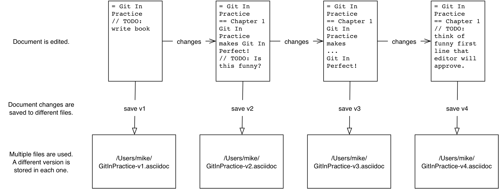
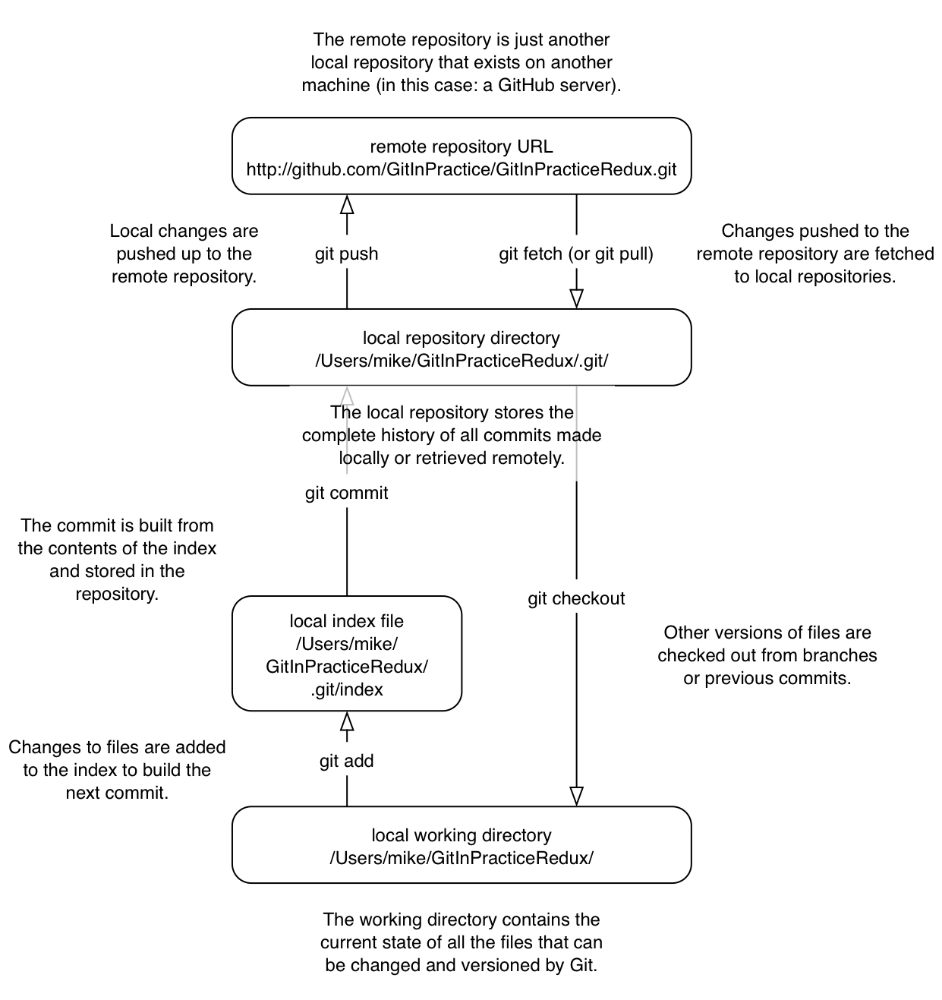
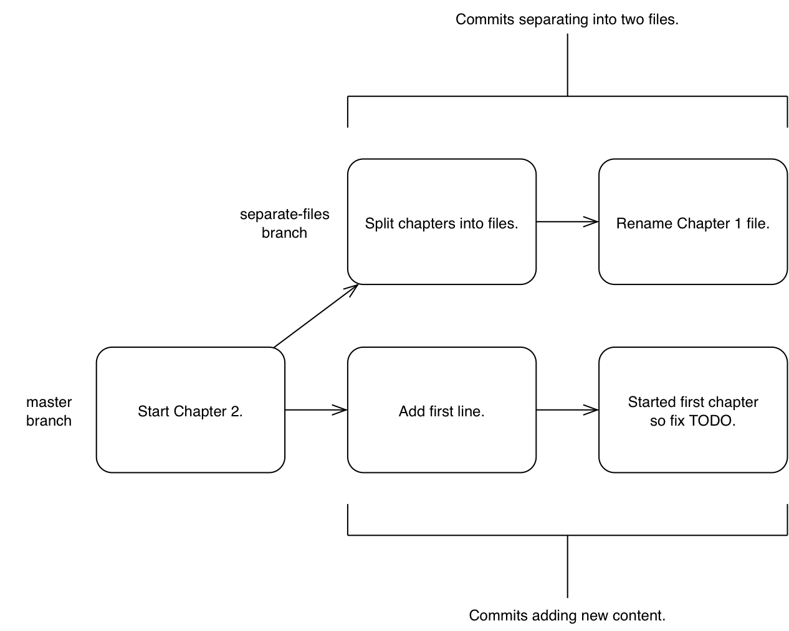

:numbered!:

[preface]
## Front Matter
ifdef::env-github[:outfilesuffix: .adoc]

### Foreword
// TODO

### Preface
// TODO

#### Why use version control?
You may not be familiar with version control concepts or why version control systems are useful for managing changes to text. Let's start off by asking why you should use version control.

A common problem when dealing with information stored on a computer is handling _changes_. For example, after adding, modifying or deleting text you may want to undo that action (and perhaps redo it later). At the simplest level this might be done by clicking _undo_ in a text editor (which reverts a previous action); after new words are added it may be necessary to undo these changes by pressing undo repeatedly until you return to the desired previous state.

.Versioning with multiple files
[[multiple-files]]

A naïve method for handling multiple file versions is often simply creating duplicate files with differing filenames and contents (`Important Document V4 FINAL FINAL.doc` may sound sadly familiar). An example of this approach can be seen in <<multiple-files>>.

At a more advanced level you may be sharing a document with other people and, rather than just undoing and redoing changes, wish to know who made a change, why they made it, when they made it, what the change was and perhaps even store multiple versions of the document in parallel. A _version control system_ (such as Git) allows all these operations and more.

.Versioning with a version control system
[[versioned-file]]
image::diagrams/00-VersionedFile.png[]

In a version control system instead of just saving a document after your changes have been made you would _commit_ it. This involves a save-like operation commanding the version control system to store this particular version and specifying a message stating the reason for their change or what it accomplishes. When another commit is made then the previous version would remain in _history_ where its changes can be examined at a later time. Version control systems can therefore solve the problem of reviewing and retrieving previous changes and allow single files to be used rather than duplicated. This workflow can be seen in <<versioned-file>>.

When editing a file in a version control system you will always edit/save/commit the same file on disk. It will not move location either manually or automatically (unless you wish to rename it, of course). When you wish to access previous versions of the file you can either view them through the version control system or restore the file on disk to a previous version. This allows you to see exactly what may have changed between versions. When using multiple files you would have to manually compare each of the files to see differences and keep track of multiple files on your disk.

### Version control workflow
Version control systems work by maintaining a list of changes to files over time. Each time a file is modified and committed the new version of the file is stored in the _repository_; a centralized location where the version control system stores files for a particular project. Each commit corresponds to a particular version and stores references to the previously made commit, a _commit message_ describing the changes made in this commit, the time it was made, who made it and the contents of the files at this point. The files' state from a commit can be compared to a previous version and the difference between the versions' files (known as _diffs_) can be queried.

.Git add/commit/checkout workflow
[[appendix-commit-workflow]]

<<appendix-commit-workflow>> shows the workflow you will use when using a version control system. After adding new changes to versioned files you will create new commits containing these changes and commit the changes to the repository. At a later point you can checkout different versions of files. This allows you to have confidence that, no matter what you may add, modify or delete, all committed versions of your files will remain in the version control system if you need to check their contents later.

### Version control for programmer collaboration
Programmers spend most of their jobs editing text. This text is typically source code which will be interpreted by a computer to perform some task but could also be software configuration files, documentation or emails. As they typically work on independent units of work while in larger teams and can be distributed by time or geography it's important that they communicate explicitly to other programmers why a particular change was made. Additionally programmers inevitably write software which contains bugs. When trying to work out why a bug occurred it's useful to see what changes were made, by whom and for what reason. Often programmers will need to fix bugs in sections of code they did not create so being able to record and recall the intent of the code's author at a later point can help understand what may have caused a bug. These reasons are multiplied by the fact that programmers typically work with huge numbers of source files. Given these reasons it should be clear why most programming projects use version control systems to manage their source code.

When creating computer software it's also common to release new versions of the software. New versions are generally released when bugs are fixed and/or when new features have been implemented. Sometimes a team may be developing a new feature but need to provide a new version with a bug fixed before the new feature is ready. Two _branches_ could be used to work on the bug fix independently of the new feature. This would allow work on the bug fix and the new feature to occur in parallel. These branches could be later _merged_ which would include all the changes made in one to be included into the other.

.Committing on multiple branches
[[simple-branches]]

In <<simple-branches>> you can see a simple example of using multiple branches when writing a book.

_Changes_, _commits_, _history_, a _repository_, _diffs_ and _branches_ are all typically provided by version control systems (such as Git). These features enable workflows where changes are logged for future reference, work can be be done in parallel and previous versions of files are kept. Hopefully this provides you with a basic understanding of why version control systems are useful.

### Acknowledgements
// TODO

### About this Book
The goal of this book is similar to that of "JavaScript: The Good Parts"; rather than provide a complete technical manual of everything Git can do instead provide a detailed understanding to software developers in how to use the best parts of Git to provide and inform the best software engineering workflow.

Reader Prerequisites:

* Command Line (medium): familiarity with the command-line as Git will only be used as a command-line tool in this book. For example, needs to be able to create, edit and remove directories and files from the command-line. This includes Windows users who will be need to install MSYSGit (which provides Git in a Unix shell on Windows).
* Software Development (medium): this book will assume a basic understanding (and desire to learn more) about how version control is used in a team of software developers to build software projects.
* Git (basic) or Version Control (medium): understanding of versions, branching and merging in Git (e.g. `git commit`) or another version control system (e.g. Subversion `commit`, `log`, `copy`, `switch`, `merge`).
* GitHub (none): able to access to a free GitHub account.
* Programming Languages (none): no particular programming language knowledge.

Target Readers:

* "Software Developer" who uses Git and knows enough interact with a Git repository but lacks understanding of any features beyond those provided by other version control systems.
* "Software Developer" with advanced Subversion knowledge (i.e. happy with branching, merging, setting/getting Subversion metadata variables) who wishes to learn how to use Git.
* "Software Developer" who wishes to learn Git best practices to contribute to open-source projects on GitHub.
* "Trainer" with Git experience who wants to learn some more conceptual information, commands they may have missed, workflows and find a resource to help coach others on using Git.
* "System Administrator" with has good version control understanding but wants to create Git repositories for scripts and/or host repositories for teams.

#### Roadmap
// TODO

#### Code
// TODO

#### References
// TODO

#### Author Online
// TODO

#### About the authors
// TODO

#### About the title
// TODO

#### About the cover
// TODO

:numbered:
