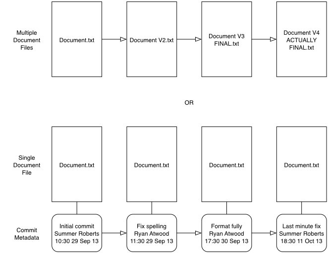
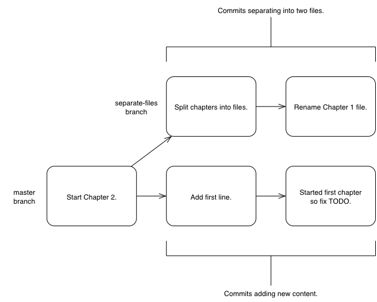
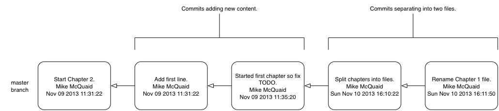
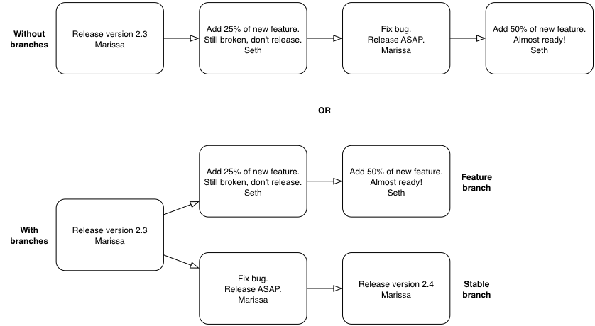
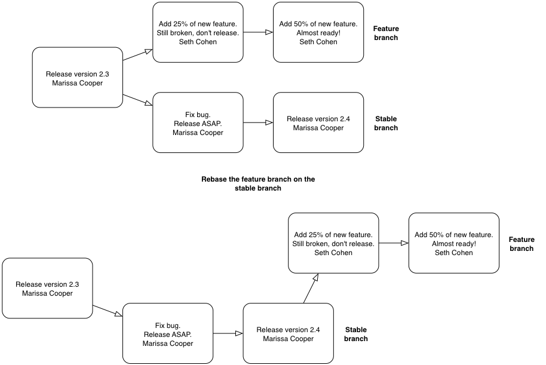
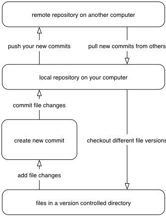

== Introduction to Distributed Version Control
In this chapter you will about distributed control systems such as Git by
covering the following topics:

* Why programmers use _version control systems_ to keep track of changes to
  files over time.
* Adding files to a version control system (_committing_), seeing the
  differences between versions of files (_diffing_), creating independent
  tracks of changes (_branching_) and bringing the changes from one track back
  into another (_merging_).
* Differences between version control systems that store and share changes on a
  central server (_centralized version control systems_) and those that keep
  all changes on a local machine and can send and receive them from other
  machines (_distributed version control systems_).

You may not be familiar with version control concepts or why version control
systems are useful for managing changes to text. Let's start off by asking why
you should use version control.

// experience flavouring
// make sure code listings are titled

=== Why use version control?
A common problem when dealing with information stored on a computer is handling
_changes_. For example, after adding, modifying or deleting text you may want
to undo that action (and perhaps redo it later). At the simplest level this
might be done by clicking _undo_ in a text editor (which reverts a previous
action); after new words are added it may be necessary to undo these changes by
pressing undo repeatedly until you return to the desired previous state.

.Versioning with multiple files

A naive method for handling multiple file versions is often simply creating
duplicate files with differing filenames and contents (`Important Document V4
FINAL FINAL.doc` may sound sadly familiar). An example of this approach can be
seen in Figure 1.1.

At a more advanced level you may be sharing a document with other people and,
rather than just undoing and redoing changes, wish to know who made a change,
why they made it, when they made it, what the change was and perhaps even store
multiple versions of the document in parallel. A _version control system_ (such
as Git) allows all these operations and more.

.Versioning with a version control system
image::diagrams/01-VersionedFile.png[]

In a version control system instead of just saving a document after your
changes have been made you would _commit_ it. This involves a save-like
operation commanding the version control system to store this particular
version and specifying a message stating the reason for their change or what it
accomplishes. When another commit is made then the previous version would
remain in _history_ where its changes can be examined at a later time. Version
control systems can therefore solve the problem of reviewing and retrieving
previous changes and allow single files to be used rather than duplicated. This workflow can be seen in Figure 1.2.

When editing a file in a version control system you will always
edit/save/commit the same file on disk. It will not move location either
manually or automatically (unless you wish to rename it, of course). When you
wish to access previous versions of the file you can either view them through
the version control system or restore the file on disk to a previous version.
This allows you to see exactly what may have changed between versions. When
using multiple files you would have to manually compare each of the files to
see differences and keep track of multiple files on your disk.

==== Version control workflow
Version control systems work by maintaining a list of changes to files over
time. Each time a file is modified and committed both the newly committed
version of the file and the previous version of the file are stored in the
_repository_; a centralized location where the version control system stores
files for a particular project. Each commit corresponds to a particular version
and stores references to the previously made commit, a description of the
changes, time it was made, who made it and the contents of the files at this
point. The files' state from a commit can be compared to a previous version and
the difference between the versions' files (known as _diffs_) can be queried.

.Git add/commit/checkout workflow
image::diagrams/01-Workflow.png[]

Figure 1.3 shows the workflow you will use when using a version control system.
After adding new changes to versioned files you will create new commits
containing these changes and commit the changes to the repository. At a later
point you can checkout different versions of files. This allows you to have
confidence that, no matter what you may add, modify or delete, all committed
versions of your files will remain in the version control system if you need to
check their contents later.

==== Version control for programmer collaboration
Programmers spend most of their jobs (and sometimes their lives) editing text.
This text is typically source code which will be interpreted by a computer to
perform some task (hopefully better than a human) but could also be software
configuration files, documentation, emails or even a dreaded TPS report. As
they typically work on independent units of work while in larger teams and can
be distributed by time or geography it's important that they communicate
explicitly to other programmers why a particular change was made. Additionally
programmers inevitably write software which contains _errors_ (or _bugs_, if
you're feeling kind, or _errata_ if you're an electronic engineer). When trying
to work out why a bug occurred (and hopefully fix it) it's useful to see what
changes were made, by whom and for what reason. Often programmers will need to
fix bugs in sections of code they did not create so being able to record and
recall the intent of the original author at a later point can help understand
what faulty assumptions may have caused a bug. Combine these reasons with the
sheer numbers of files programmers typically work with and it should become
clear why most programming projects use version control systems to manage their
source code.

When creating computer software it's also common to release new _versions_ of a
product. New versions are generally released when bugs are fixed and/or when
new features have been created. However, a team may be half way through
developing a new feature but have fixed a bug that they need to provide to
users immediately (before the new feature has been completed). In this case two
_branches_ could be used to split the history and allow a version containing
the bug fix to be immediately released and ensure that none of the changes made
while creating a new feature end up in that release. Instead these changes
would be made on an independent branch of the history to allow continuous work
on the new feature rather than waiting for the bug fix's release to be made.
This branch could be later _merged_ into the main branch which would include
all the changes into the main branch.

.Committing on multiple branches

In Figure 1.4 you can see a simple example of using multiple branches when
writing a book. We'll cover this in more detail in Section 1.4.1 but you should
already be able to see how they allow multiple tracks of development in a
project.

Now you've learnt why programmers use version control let's see why they use
Git specifically.

=== Why do programmers use Git?
Git was created by a programmer to be used by programmers. Linus Torvalds, the
creator of Git and the Linux kernel, started in 2008 with the goal of having a
distributed, open-source, high-performance and hard to corrupt version control
system for the Linux kernel project to use. Within a week Git was self-hosting
(meaning Git's source code was hosted inside a Git repository) and within two
and a half months the version 2.6.12 of the Linux kernel was made using Git.

From its initial creation for the Linux kernel Git is now used by all sizes of
companies, many open source projects and large "social coding" Git hosting
sites such as GitHub or Bitbucket.

.Why do people prefer Git?
NOTE: Git is my preferred method of software source code control. I also use it
for versioning plain text files such as the text for this book. Git has many
strengths over other methods of source control. Git stores all of the history
of a repository, branches and commits locally. This means adding new versions
or querying the history of a repository doesn't require a network connection.
Git's history log viewing and branch creation is near-instant compared to e.g.
Subversion's which is sluggish even on a fast network connection. As Git stores
changes locally you are not constrained by the work of others when working in a
team. For example, merge conflicts are solved at the time by the person doing
the merge so you can continue your edit/commit workflow without interruptions.
In Git you can modify the history of branches and even entire repositories.
It's often useful to be able to make lots of small commits which are later
turned into a single commit or make commit messages contain more information
after the fact. Despite this flexibility with Git anything that is committed
has a unique reference that survives rewriting or changes for at least 30 days.
This means it's very hard to accidentally lose work.

Git's main downsides are that the command-line application's interface is often
counterintuitive; it makes frequent use of jargon that can only be adequately
explained by understanding Git's internals. Additionally Git's official
documentation can be hard to follow; it also uses jargon and has to detail the
large number of options for Git's commands. To the credit of the Git community
both the UI and documentation around Git have improved hugely over the years.
This book will help you understand Git's jargon and the Git's internal
operations; this should help you to understand why Git does what it does when
you run the various Git commands.

Despite these downsides the strengths of Git have proved too strong for many
software projects to resist. Google, Microsoft, Twitter, LinkedIn and Netflix
all use Git as well as open-source projects such as the Linux kernel (the first
Git user), Perl, PostgreSQL, Android, Ruby on Rails, Qt, GNOME, KDE, Eclipse
and X.org.

Many of the above projects and many users of Git have also been introduced to
Git and use it regularly through a Git hosting provider. My favorite is GitHub
but there are alternatives such as Gitorious, Bitbucket, SourceForge, Google
Code and others.

Let's learn more how Git actually manages changes. Git's changes are known as
_commits_.

=== Committing: recording changes to code
A _commit_ is a collection of changes to one or more files in a version control
system. Each commit contains a message entered by the author, details of the
author of the commit, a unique commit reference (the format of which varies
between version control systems but in Git looks like
`86bb0d659a39c98808439fadb8dbd594bec0004d`), a pointer to the preceding commit
(known as the _parent commit_), the date the commit was created and a pointer
to the contents of files when the commit was made. The file contents are
typically displayed as the _diff_ (the differences between the files before and
the files after the commit).

.A typical commit broken down into its parts
image::diagrams/01-Commit.png[]

As you may have noticed Figure 1.5 uses arrows pointing from commits to their
previous commit. The reason for this is that commits contain a pointer to the
_parent commit_ and not the other way round; when a commit is made it has no
idea what the next commit will be yet.

A _commit_ is made up of the changes to one or more files on disk. The typical
workflow is that you will change the contents of files inside a folder on disk
which is managed by Git and, after making all necessary changes, review the
_diffs_ and add them to a new commit. Often all the _diffs_ made will turn into
one commit and then the cycle will repeat. Sometimes, however, it is desirable
to pick only some changed files (or even some changed lines within files) to
include in a commit and leave the other changes for adding in a future commit.
This is often desirable because commits should be the smallest possible units
of work to make them easier to understand.

.Why are small commits better?
NOTE: Commits should be kept as small as possible. This allows their message to
describe a single change rather than multiple changes that are unrelated but
were worked on at the same time. Small commits keep the history readable; it's
easier when looking at a small commit in future to understand exactly why the
change was made. If a small commit was later found to be undesirable it can be
easily reverted. This is much more difficult if many unrelated changes are
clumped together into a single commit and you wish to revert a single change.

==== Commit storage in Git
Git is a version control system built on top of an _object store_. Git creates
and stores a collection of objects when you commit. The object store is stored
inside the Git _repository_. The repository is the local collection of all the
files related to a particular Git version control system and is stored in a
`.git` folder in the root of the project. If you were to explore under here (as
we will do in Chapter 2) you would find objects, pointers/references to objects
and configuration files.

.commit, blob and tree objects
image::diagrams/01-Objects.png[]

In Figure 1.6 you can see the main Git objects we're concerned with: _commits_,
_blobs_ and _trees_. There is also a _tag_ object but we'll leave tags until
Section 1.4. We've already seen that commits store metadata and referenced file
contents. The file contents reference is actually a reference to a _tree
object_. A tree object stores a reference to all the _blob objects_ at a
particular point in time and other tree objects if there are any subfolders. A
blob object stores the contents of a particular version of a particular single
file in the Git repository.

.Should objects being interacted with directly?
NOTE: When using Git you should never need to interact with objects or object
files directly. The terminology of _blobs_ and _trees_ are not used regularly
in Git or in this book but it's useful to remember what these are so you can
build a conceptual understanding of what Git is doing internally. When things
go well this should be unnecessary but when we start to delve into more
advanced Git functionality or Git spits out a baffling error message then
remembering _blobs_ and _trees_ may help you work out what has happened.

Now we've peeked behind Git's abstraction to see how it stores things
internally let's return to something very practical: how versions of code
change over time.

=== History: how code changes over time
The _history_ of a version control system is the complete list of all changes
made since the repository was created and the initial commit was made. The
history also contains the references to any _branches_, _tags_ (a way of
annotating a particular commit with, for example, a version) and _merges_ made
within the repository.

Without history version control would be a simple mechanism for file storage.
History allows us to analyze the state of a repository at any specific date and
time and recall the contents of every file, the person who changed the files,
when they changed the files and (if a good commit message has been written) why
they changed them.

When you are using version control you will find yourself regularly checking
the history; sometimes to remind yourself of your own work, sometimes to see
why other changes were made in the past and sometimes reading new changes than
have been made by others. In different situations different pieces of data will
be interesting but all pieces of data will always be available for every commit.

As you may have got a sense of already: how useful the history is relies very
much on the quality of the data entered into it. If I made a commit once per
year with huge numbers of changes and a commit message of "fixes" then it would
be fairly hard to use the history effectively. Ideally commits are small and
well-described; follow these two rules and having a complete history becomes a
very useful tool.

==== Commits point to their parent commits
Every commit points to its _parent commit_. The parent commit in a linear,
branch-less history will be the one that immediately preceded it. The only
commit that lacks a parent commit is the _initial commit_; the first commit in
the repository. By following the parent commit, its parent, its parent and so
on you will always be able to get back from the current commit to the initial
commit. You can see an example of parent commit pointers in Figure 1.7.

.Parent commit pointers
image::diagrams/01-ParentCommit.png[]

==== Rewriting history
Git is unusual compared to many other version control systems in that it allows
history to be rewritten. This may seen surprising or worrying; after all did I
not just tell you that the history contains the entire list of changes to the
project over time? Surely it is dangerous to modify this? The answer to this
question is: sometimes. In a history book you may hear about the beginning and
end of various historical transitions but not every detail of what occurred in
between. Similarly sometimes you may want to highlight only broader changes to
files in a version control system over a period of time rather than sharing
ever single change that was made in reaching the final state.

.Squashing multiple commits into a single commit
image::diagrams/01-Squashing.png[]

In Figure 1.8 you see a fairly common use-case for rewriting history with Git.
If you were working on some window code all morning and wanted your coworkers
to see it later (or just include it in the project) then there's no need for
everyone to see the mistakes you made along the way; why damage your good
reputation unnecessarily? In Figure 1.8 the commits are being _squashed_
together so instead of three commits and the latter two fixing mistakes in the
first commit we have squashed these together to create a single commit for the
window feature. We'd only rewrite history like this if working on a separate
branch that hadn't had other work from other people relying on it yet as it has
changed some parent commits (so, without intervention, other people's commits
may point to commits that no longer exist). Don't worry too much about rebasing
or squashing work for now; just this as a situation where you may want to
rewrite history. In Chapter 7 we'll cover cases where history rewriting is
useful such as rewriting an entire repository to change an email address or
removing confidential information before making the history public.

What we're generally interested in when reading the history (and why we clean
it up) is ensuring the changes between commits are relevant (for example don't
make changes only to revert then immediately in the next commit five minutes
later), minimal and readable. These changes are known as _diffs_.

=== Diffs: the differences between commits
A _diff_ (also known as a _change_ or _delta_) is the difference between two
commits. In a version control system you can typically request a diff between
any two commits, branches or tags. It's often useful to be able to request the
difference between two parts of the history for analysis. For example, if an
unexpected part of the software has recently started misbehaving you may go
back into the history to verify that it previously worked. If it did work
previously then you may want to examine the diff between the the code in the
different parts of the history to see what has changed. The various ways of
displaying diffs in version control typically allow you to narrow them down
per-file, folder and even committer.

==== Default diff format
Diffs are typically shown by version control systems in a format that is known
as a _unified diff_.

.Unified diff from Git
----
diff --git a/GitInPractice.asciidoc b/GitInPractice.asciidoc <1>
index 7bd3fb8..7230cbf 100644 <2>
--- a/GitInPractice.asciidoc <3>
+++ b/GitInPractice.asciidoc <4>
@@ -1,5 +1,3 @@ <5>
 = Git In Practice <6>
 == Chapter 1
-Git In Practice makes <7>
-...
-Git In Perfect!
+// TODO: think of funny first line that editor will approve. <8>
----
<1> diff command
<2> staging area SHA-1
<3> old file version
<4> new file version
<5> file changes range
<6> unchanged line
<7> deleted line
<8> inserted line

Listing 1.1 shows a change to a `GitInPractice.asciidoc` deleting multiple
lines of text and replacing them with a comment.

The "diff command (1)" shows an example `diff` command that may have been used
to output these changes (although in reality this is done by Git internally).
The "staging area SHA-1 (2)" shows the changes that were made to the `index
staging area` by this commit; in short the changes to the actual contents of
files in this commit. The staging area will be explained more in Chapter 2. The
"old file version (3)" and "new file version (4)" show virtual file names
relating to the diff command; as if instead of comparing multiple versions in
the version control repository multiple versions of the files in different
folders (`a` and `b` were compared). The "file changes range (5)" is used by
the `diff` tool to find the locations in the file this diff refers to. In this
example you can see the entire file and all the changes made to it. If this
were a file with thousands of lines but only five lines were changed then the
diff would only show the five lines that were changed with some surrounding
context. These range markers would allow a `diff` tool to find what lines
should be changed. Lines that are " unchanged (6)" are displayed as-is,
"deleted (7)" lines are prefixed with a `-` and "inserted (8)" lines are
prefixed with a `+`.

.How do diffs show changed lines?
NOTE: changed lines are displayed in a unified diff as a deletion of the
previous line and insertion of the new one (even if the change is only a single
character).

Diffs are used throughout version control systems to indicate changes to files;
for example when navigating through history or viewing what you are about to
commit. It's important to grasp the format as it will be used throughout this
book and when using Git.

==== Different diff formats
Sometimes it is desirable to display diffs in slightly differing formats. Two
common alternatives to a typical unified diff are a _diffstat_ and _word diff_.

.Diffstat from Git
----
 GitInPractice.asciidoc | 4 +--- <1>
 1 file changed, 1 insertion(+), 3 deletions(-) <2>
----
<1> one file's changes
<2> all files' changes

Listing 1.2 is a diffstat for the same changes as the unified diff in Listing
1.1. Rather than showing the breakdown of exactly what has changed it indicates
what files have changed and a brief overview of how many lines were involved in
the changes. This can be useful when getting a quick overview of what has
changed without needing all the detail of a normal unified diff.

The "one file's changes (1)" shows the filename that has been changed, the number
of lines changed in that file and `+`/`-` characters summarizing the overall
changes to the file. If multiple files were changed this would show there would
be multiple filenames listed and each would have the lines changed in that file
and `+`/`-` characters.

The "all files' changes (2)" shows a summary of totals of the number of files
changes and lines inserted/deleted across all files.

.Word diff from Git
----
diff --git a/GitInPractice.asciidoc b/GitInPractice.asciidoc
index 7bd3fb8..7230cbf 100644
--- a/GitInPractice.asciidoc
+++ b/GitInPractice.asciidoc
@@ -1,5 +1,3 @@
= Git In Practice
== Chapter 1
[-Git In Practice makes-] <1>
[-...-]
[-Git In Perfect!-]{+// TODO: think of funny first line that editor
will approve.+} <2>
----
<1> deleted line
<2> modified line

A word diff is similar to a unified diff but shows modifications per-word
rather than per-line. Listing 1.3 shows that most of the sentence remained the
same except for a few changed words. This is particularly useful when viewing
changes that are not to code but plain text; in README files we probably care
more about individual word choices than knowing that an entire line has changed
and the special characters (`[-]{+}`) are not used as often in prose than in
code.

The "deleted line" is surrounded by `[-]` shows a line that was completed
removed. The "modified line" has some characters that were removed surrounded
by `[-]` and some lines that were added surrounded by `{+}`.

=== Branches: working on multiple versions of code in parallel
When committing to a version control system the history continues linearly;
what was the most recent commit becomes the parent commit for the new commit.
This parenting continues back to the initial commit in the repository. You can
see an example of this in Figure 1.9.

.Committing without using branches

As discussed previously, sometimes this linear approach is not enough for
software projects. Sometimes you may need to make new commits which are not yet
ready for public consumption. Enter _branches_.

Branching allows two independent tracks through history to be created and
committed to without either modifying the other. Programmers can happily commit
to their independent branch without the fear of disrupting the work of another
branch. This means that they can, for example, commit broken or incomplete
features rather than having to wait for others to be ready for their commits.
It also means they can be isolated from changes made by others until they are
ready to integrate them into their branch. Figure 1.10 shows the same commits
as Figure 1.9 if they were split between two branches instead for isolation.

.Committing to multiple branches

When a branch is created and new commits are made that branch advances forward
to include the new commits. In Git a branch is actually no more than a pointer
to a particular commit. The branch is pointed to a new commit when a new commit
is made on that branch. A _tag_ is quite similar to a branch but points to a
single commit and remains pointing to the same commit even when new commits are
made. Typically tags are used for annotating commits; for example, when you
release version 1.0 of your software you may tag the commit used to built
the 1.0 release with a "1.0" tag. This means you can come back to it in future,
rebuild that release or check how certain things worked without fear that it
will be somehow changed automatically.

==== Using branching
Branching allows two independent tracks of development to occur at once. In
Figure 1.10, the `separate-files branch` was used to separate the content from
a single file and split it into two new files. This allowed refactoring of the
book structure to be done in the `separate-files` branch while the default
branch (known as `master` in Git) could be used to create more content. In
version control systems like Git where creating a branch is a quick, local
operation branches may be used for every independent change.

Some programmers will create new branches whenever they work on a new bug fix
or feature and then integrate these branches at a later point; perhaps after
requesting review of their changes from others. This means even for programmers
working without a team it can be useful to have multiple branches in use at any
one point. For example, you may be working on a new feature but realize that a
critical error in your application needs fixed immediately. You could quickly
create a new branch based off the version used by customers, fix the error and
switch branch back to the branch you had been committing the new feature to.

=== Merging: bringing the changes from one branch into another
At some point we have a branch that we're done with and we want to bring all
the commits made on it into another branch. This process is known as a `merge`.

.Merging a branch into master
image::diagrams/01-Merging.png[]

When a merge is requested all the commits from another branch are pulled into
the current branch. Those commits then become part of the history of the
branch. Please note from Figure 1.11 the commit in which the merge is made has
two parents commits rather than one; it is joining together two separate paths
through the history back into a single one. After a merge you may decide to
keep the existing branch around to add more commits to it and perhaps merge
again at a later point (only the new commits will need to be merged next time).
Alternatively, you may delete the branch and make future commits on the Git's
default `master` branch and create another branch when needed in the future.

==== Merge conflicts
So far merges may have sounded too good to be true; you can work on multiple
things in progress and combine them at any later point in any order. Not so
fast my merge-happy friend; I haven't told you about merge conflicts yet.

A _merge conflict_ occurs when both branches involved in the merge have changed
the same file (or the same part of the same file, depending on how smart your
version control system is). The version control system will try and
automatically resolve these conflicts but sometimes is unable to do so without
human intervention. Git can typically merge without conflicts as long as the
changes were not too near each other in the same file. If the version control
system fails to perform the merge without human intervention it produces a
merge conflict.

.Merge conflict resolution with Git
----
= Git In Practice <1>
<<<<<<< HEAD <2>
== Chapter 1 <3>
It is a truth universally acknowledged, that a single person in
possession of good source code, must be in want of a version control
system.

== Chapter 2
// TODO: write second chapter.
======= <4>
>>>>>>> separate-files <5>
----
<1> unchanged line
<2> previous changes marker
<3> previous line version
<4> changes separator
<5> new changes marker

When a merge conflict occurs the version control system will go through any
files that have conflicts and insert something similar to the above markers.
These markers indicate the versions of the file on each branch.

The "unchanged line (1)" is one that, like in the Listing 1.1 unified diff, is
one that is provided only for context in this example. The "previous changes
marker (2)" shows the beginning of where new the lines from the previous commit
(referenced by `HEAD` here; `HEAD` will be explained more in Chapter 2). The
"previous line version (3)" shows a line that was from the previous commit. The
"changes separator (4)" separates the previous and new changes. The "new
changes (5)" marker shows the end of the new changes and the name of the branch
that has been merged in; `separate-files` in this case.

.How can conflict markers be found quickly?
NOTE: When searching a large file for the merge conflict markers you should
enter `<<<<` into your text editor's find tool to quickly locate them.

The person performing the merge will need to manually edit the file to produce
the correctly merged output, save it and mark the commit as resolved. Sometimes
the correct output will picking a single side of the markers and sometimes it
will be a combination of the two. In cases where other files have been edited
(like this example) it may also involve putting some of these lines into other
files.

When conflicts have been resolved a _merge commit_ can be made. This will store
the two parent commits and the conflicts that were resolved so they can be
inspected in the future. Unfortunately sometimes people will pick the wrong
option or merge incorrectly so it's good to be able to later see what conflicts
they had to resolve.

==== Rebasing
A _rebase_ is a method of history rewriting in Git that is similar to a merge.
A rebase involves changing the parent of a commit to point to another.

.Rebasing a branch on top of master

Figure 1.12 shows a rebase of the `seperate-files` branch onto the `master`
branch. The rebase operation has changed the parent of the first commit in the
`separate-files` branch to be the last commit in the `master` branch. This
means all the content changes from the `master` branch are now included in the
`separate-files branch` and any conflicts were manually resolved but were not
stored (as they would be in a merge conflict).

We'll cover rebasing in more detail later in the book. All that's necessary to
remember for now is that it's a different approach to a merge that can be used
for a similar outcome (pulling changes from one branch into another).

=== Remote Repositories: exchanging commits with another computer
Typically when using version control you will want to share your commits (or
branches) with other people using other computers. With a traditional,
_centralized version control system_ (such as Subversion or CVS) the repository
is usually stored on another machine. As you make a commit it is sent over the
network, checked that it can apply (there may be other changes since you last
checked) and then committed to the version control system where others can see
it.

With a _distributed version control system_ like Git every user has a complete
repository on their own computer. While there may be a centralized repository
that people send their commits to it will not be accessed unless specifically
requested. All commits, branches and history are stored offline unless users
choose to send or receive commits from another repository.

.Git add/commit/push/pull/checkout workflow

A repository you send or receive commits to is known as a _remote repository_.
You control when these changes are sent or received. Figure 1.13 shows
the workflow for making commits in your local repository and then pushing them
to a remote repository and pulling those made by others back to your local
repository.

==== Communicating with a remote repository
Changes are sent to a remote repository in a _push_ operation and received in a
_pull_ (or _fetch_) operation. When either of these occur your repository talks
to the other repository, finds out what you know in common and sends only the
differences between the two repositories (obviously with large repositories to
do otherwise would be very slow).

==== Authoritative version storage
With centralized version control systems the central server always stores the
authoritative version of the code. Clients to this repository will typically
only store a small proportion of the history and require access to the server
to perform most tasks. With distributed version control system like Git every
local repository has a complete copy of the data. Which repository stores the
authoritative version in this case? It turns out that this is merely a matter
of convention; Git itself does not deem any particular repository to have any
higher priority than another. Typically in organizations there will be a
central location (like with a centralized version control) which is treated as
the authoritative version and people are encouraging to push their commits and
branches to.

The lack of authority for a particular repository with distributed version
control systems is sometimes seen as a liability but can actually be a
strength. The Linux kernel project (for which Git was original created) makes
use of this to provide a network of trust and a more manageable way of merging
changes. When Linus Torvalds, the self-named "benevolent dictator" of the
project, tags a new release this is generally considered a new release of
Linux. What is in his repository (well, his publicly accessible one; he will
have multiple repositories between various personal machines that he does not
make publicly accessible) is generally considered to be what is in Linux. Linus
has trusted lieutenants from who he can pull and merge commits and branches.
Rather than every single merge to Linux needing to be done by Linus he can
leave some of it to his lieutenants (who leave some to their sub-lieutenants
and so on) so everyone can needs only worry about verifying and including the
work of a small number of others. This particular workflow may not make sense
in many organizations but it demonstrates how distributed version control
systems can allow different ways of managing merges to centralized version
control.

=== Summary
In this chapter you hopefully learned:

* _Version control systems_ exist to manage a series of changes over time to
  files in a project. They commonly used by programmers and provide a more
  robust alternative than manually renaming files to a form like `Document
  FINAL V4.txt`.
* A _commit_ is a particular change to one or more files. As well as the
  changed file contents they also store the author, date and time, a unique
  reference, a explanatory _commit message_ and a reference to their _parent
  commit_.
* _History_ is the series of _commits_ to a version control system over time.
  It tracks from the current commit through the _parent commit_ pointers all
  the way back to the _initial commit_. In Git past actions in the history can
  be _rewritten_.
* A _diff_ is the difference between any two commits or parts of the history.
  There are various formats and they display how the text was changed and allow
  analysis of past changes to the history.
* _Branches_ are independent paths of history. They allow commits to be made
  that are separate from changes made in another branch so incomplete work can
  be left and returned to later.
* A _merge_ is when a branch's commits are brought into another branch. The
  _merge commit_ joining the two branches has two _parent commits_. Sometimes
  merges cannot be done automatically and the version control system creates a
  _merge conflict_. When resolved this conflict is stored in the _merge commit_.
* A _remote repository_ is a repository that is not stored on the current
  machine. Commits may be sent to or received from a remote repository to share
  work with others. _Centralized version control_ sends new commits to a remote
  repository immediately. _Distributed version control_ only sends new commits
  to a remote repository on request.

Now let's learn how to use these concepts to create and interact with a Git
repository on your local machine.
