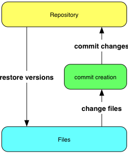
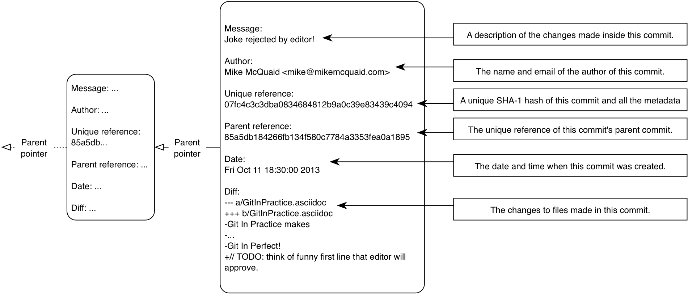
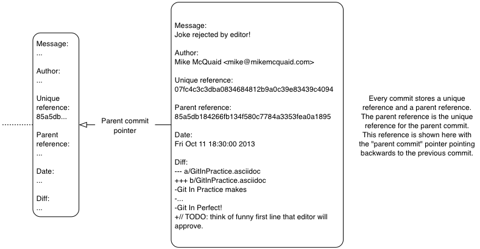
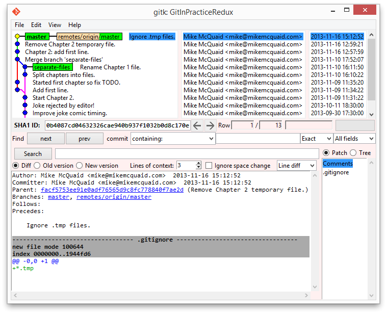
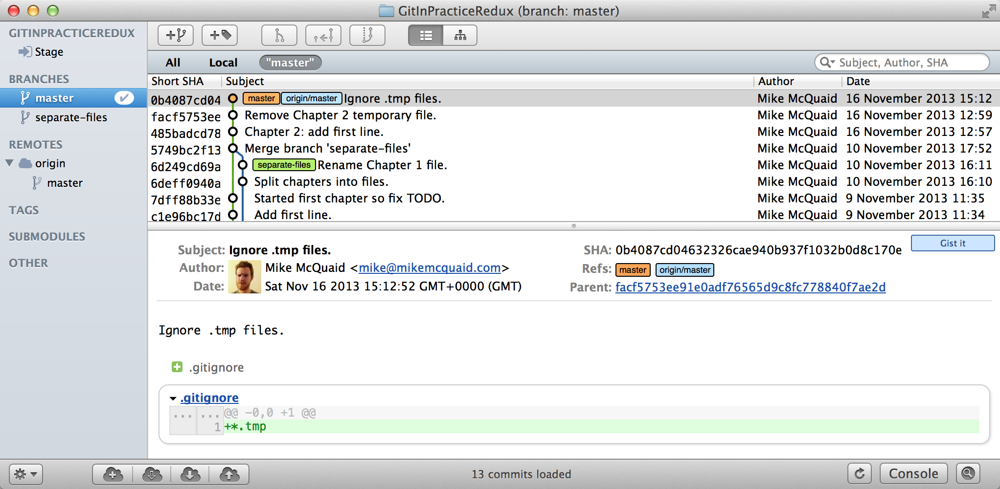
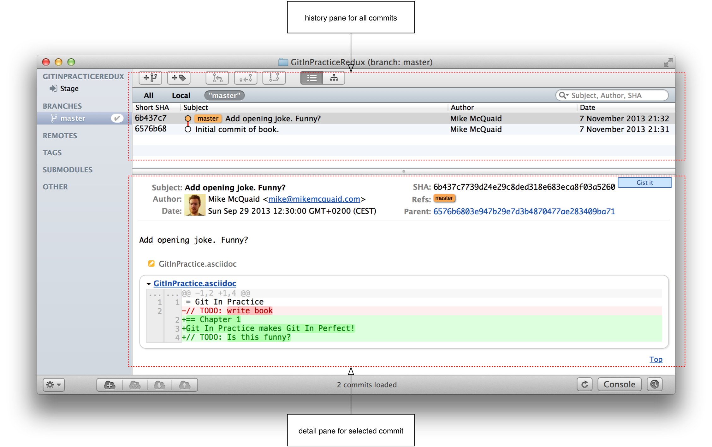
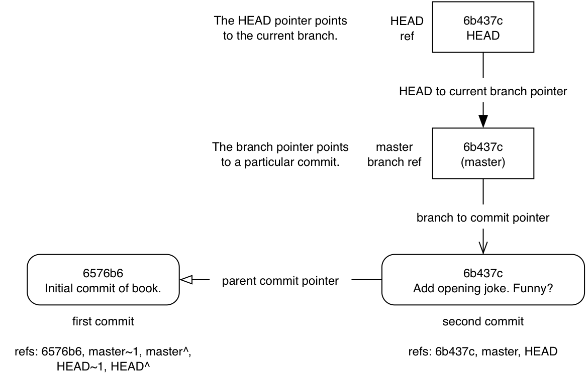

## Local Git
ifdef::env-github[:outfilesuffix: .adoc]

In this chapter you will learn how and why to use Git as a local version control system by covering the following topics:

* Why Git was created
* How to create a new local Git repository
* How to commit files into a Git repository
* How to view the history of a Git repository
* How to use gitk/GitX to visualize the history of a Git repository
* How to view the differences between Git commits

Let's start by learning why Git is so widely used by programmers.

### Why do programmers use Git?
Git was created by a programmer to be used by programmers. Linus Torvalds, the creator of the Linux kernel, started writing Git in 2005 with the goal of having a distributed, open-source, high-performance and hard to corrupt version control system for the Linux kernel project to use. Within a week Git's source code was hosted inside the Git version control system and within two and a half months version 2.6.12 of the Linux kernel was released using Git.
//(TP)-I don't know if it is relevant, but Linus has changed his view on Git and is quite sceptical about Git - and especially GitHub -  these days 
Since its initial creation for the Linux kernel Git is now used by many other open source projects, all sizes of companies and large "social coding" Git hosting sites such as GitHub.

Git is my preferred method of software source code control. I also use it for versioning plain text files such as the text for this book. Git has many strengths over other methods of source control. Git stores all of the history, branches and commits locally. This means adding new versions or querying history doesn't require a network connection. Git's history-log viewing and branch creation is near-instant compared with e.g. Subversion's which is sluggish even on a fast network connection. As Git stores changes locally you are not constrained by the work of others when working in a team. For example, remote branch updates and merges can be done independently so you can continue your edit/commit workflow without interruptions while still downloading and examining any changes made by others. In Git you can modify the history of branches and even rewrite commit data across the entire repository. It's often useful to be able to make lots of small commits which are later turned into a single commit or make commit messages contain more information after the fact and Git's history rewriting enables this. Even with this flexibility in Git every commit has a unique reference that survives rewriting or changes and won't be purged until it's missing from all branches for at least 30 days. This means it's very hard to accidentally lose work if it has been committed.

Git's main downsides are that the command-line application's interface is often counterintuitive: it makes frequent use of jargon that can only be adequately explained by understanding Git's internals. Additionally Git's official documentation can be hard to follow; it also uses jargon and has to detail the large number of options for Git's commands. To the credit of the Git community both the UI and documentation around Git have improved hugely over the years. This book will help you understand Git's jargon and the Git's internal operations; these should help you to understand why Git does what it does when you run the various Git commands.

Despite these downsides the strengths of Git have proved too strong for many software projects to resist. Google, Microsoft, Twitter, LinkedIn and Netflix all use Git as well as open-source projects such as the Linux kernel (the first Git user), Perl, PostgreSQL, Android, Ruby on Rails, Qt, GNOME, KDE, Eclipse and X.org.

Many of the above projects and many users of Git have also been introduced to and use Git through a Git hosting provider. My favorite is GitHub but there are various other paid and free alternatives available.

### Initial setup
Once you've installed Git (as detailed in <<B-GitInstallation#git-installation>>) the first thing you need to do is to tell Git your name and email (particularly before creating any commits). Rather than usernames Git uses a name and email address to identify the author of a commit.

My name is Mike McQuaid and email address is `mike@mikemcquaid.com` so I would run:
//(TP)-This may be covered later, but the difference between '--' and '-' in front of commands.
.Set name and email address
```
# git config --global user.name "Mike McQuaid" <1>
<2>
# git config --global user.email mike@mikemcquaid.com

# git config --global user.email

mike@mikemcquaid.com <3>
```
<1> a run command
<2> no output
<3> command output

All command output listings in this book show:

* "run command (1)" prefixed with a `#`.
* "no output (2)" following the run command. In this case there was no output so this line has been left intentionally blank.
* "command output (3)" following the run command. In this case the output was the previously set value of `user.email` (my email address).

.How can I follow the listings?
NOTE: You can follow listings as you work through the book by running the listed commands (in a Terminal on Unix or Git Bash on Windows) and comparing the output to the listing. A POSIX incompatible shell (which includes the Windows Command Prompt without Git Bash) may work for some listings but will fail for others that rely on POSIX syntax (e.g. the use of single quotes).

.Is there an example repository?
NOTE: The steps followed in the examples in this book were used to create the demo repository `GitInPracticeRedux` on GitHub at https://github.com/GitInPractice/GitInPracticeRedux. Note that the current state of this repository is the state after following all the examples in the book so you should browse to the beginning of the history if you wish to follow along with the listings in this book.

Now Git is set up, to use Git you need to initialize a Git _repository_ on your local machine.

### Creating a repository: git init
A Git _repository_ is the local collection of all the files related to a particular Git version control system and contains a `.git` subdirectory in its root. Git keeps track of the state of the files within the repository's directory on disk.

Git repositories store all their data on your local machine. Making commits, viewing history and requesting differences between commits are all local operations that do not require a network connection. This makes all these operations much faster in Git than with centralized version control systems such as Subversion.

Typically you create a new repository by downloading another repository that already exists (known as _cloning_ by Git and introduced in <<02-RemoteGit#cloning-a-remote-github-repository-onto-your-local-machine-git-clone>>) but let's start by initializing an empty, new local repository.

#### Problem
You wish to create a new local Git repository in a new subdirectory named `GitInPracticeRedux.
//(TP)-The foreslash in the below cd-command suggest you are working on a non-Windows box. I expect users will now this, but is it worth mentioning? I don't know what level of knowledge the reader is supposed to have, but "kids these days seems lost without a wizard ...". Just a thought.
#### Solution
1.  Change to the directory you wish to contain your new repository directory e.g. `cd /Users/mike/`.
2.  Run `git init GitInPracticeRedux`.

.Initializing a Git repository
```
# cd /Users/mike/
# git init GitInPracticeRedux <1>

Initialized empty Git repository in
/Users/mike/GitInPracticeRedux/.git/ <2>
```
<1> requested name
<2> repository path

You have initialized a new local Git repository named `GitInPracticeRedux` accessible at e.g. `/Users/mike/GitInPracticeRedux`.

#### Discussion
We're calling the repository `GitInPracticeRedux` rather than `GitInPractice` to differentiate it from the book itself.

.Where can I see the full syntax references for Git commands?
//(TP)-As above, there is a difference between 'git init --help' and 'git init -help'. Might be worth mentioning at some point.
NOTE: All `git` commands referenced in this book have complete references to all their possible syntax and arguments in Git's help. This can be accessed for a given command by running the command suffixed with `--help` e.g. `git init --help`. This book will cover only the most common and useful commands and arguments.

`git init` can be run without any arguments to create the local Git repository in the current directory.

##### .git subdirectory
Under the new Git repository directory a `.git` subdirectory at e.g `/Users/mike/GitInPracticeRedux/.git/` is created with various files and directories under it.

.Why is the `.git` directory not visible?
NOTE: On some operating systems directories starting with a `.` such as `.git` will be hidden by default. They can still be accessed in the console using their full path (e.g. `/Users/mike/GitInPracticeRedux/.git/`) but will not show up in file listings in file browsers or by running e.g. `ls /Users/mike/GitInPracticeRedux/`.

Let's view the contents of the new Git repository by changing to the directory containing the Git repository and running the `find` command.

.Listing files created in a new repository
```
# cd /Users/mike/ && find GitInPracticeRedux

GitInPracticeRedux/.git/config <1>
GitInPracticeRedux/.git/description <2>
GitInPracticeRedux/.git/HEAD <3>
GitInPracticeRedux/.git/hooks/applypatch-msg.sample <4>
GitInPracticeRedux/.git/hooks/commit-msg.sample
GitInPracticeRedux/.git/hooks/post-update.sample
GitInPracticeRedux/.git/hooks/pre-applypatch.sample
GitInPracticeRedux/.git/hooks/pre-commit.sample
GitInPracticeRedux/.git/hooks/pre-push.sample
GitInPracticeRedux/.git/hooks/pre-rebase.sample
GitInPracticeRedux/.git/hooks/prepare-commit-msg.sample
GitInPracticeRedux/.git/hooks/update.sample
GitInPracticeRedux/.git/info/exclude <5>
GitInPracticeRedux/.git/objects/info <6>
GitInPracticeRedux/.git/objects/pack <7>
GitInPracticeRedux/.git/refs/heads <8>
GitInPracticeRedux/.git/refs/tags <9>
```
<1> local configuration
<2> description file
<3> HEAD pointer
<4> event hooks
<5> excluded files
<6> object information
<7> pack files
<8> branch pointers
<9> tag pointers

Git has created files for:

* "local configuration (1)" of the local repository.
* "description file (2)" to describe the repository for those created for use on a server.
* "HEAD pointer (3)", "branch pointers (8)" and "tag pointers (9)" which point to commits.
* "_event hooks_ (4)" samples; scripts that run on defined events e.g. pre-commit is run before every new commit is made.
* "excluded files (5)" which manages files which should be excluded from the repository.
* "object information (6)" and "pack files (7)" which are used for object storage and reference.

You shouldn't edit any of these files directly until you have a more advanced understanding of Git (or never at all). You will instead modify these files and directories by interacting with the Git repository through Git's filesystem commands first introduced in <<03-FilesystemInteractions#rename-or-move-a-file-git-mv>>.

### Creating a new commit: git add, git commit
To do anything useful in Git we first need one or more commits in our repository.

A _commit_ is created from the changes to one or more files on disk. The typical workflow is that you will change the contents of files inside a repository, review the _diffs_, add them to the _index_, create a new commit from the contents of the index and repeat this cycle.

Git's index is a staging area used to build up new commits. Rather than requiring all changes in the working tree make up the next commit Git allows files to be added incrementally to the index. The add/commit/checkout workflow can be seen in <<commit-workflow>>:

.Git add/commit/checkout workflow
[[commit-workflow]]


#### Building a new commit in the index staging area: git add
Git does not add anything to the index without your instruction. As a result, the first thing you have to do with a file you want to include in a Git repository is request Git add it to the index.

##### Problem
You wish to add an existing file `GitInPractice.asciidoc` to the index staging area for inclusion in the next commit.

##### Solution
1.  Change directory to the Git repository e.g. `cd /Users/mike/GitInPracticeRedux/`.
2.  Ensure the file `GitInPractice.asciidoc` is in the current directory.
3.  Run `git add GitInPractice.asciidoc`. There will be no output.

You have added the `GitInPractice.asciidoc` to the index. If this has been successful then the output of running `git status` should resemble:

.Adding a file to the index
```
# git add GitInPractice.asciidoc
# git status

# On branch master <1>
#
# Initial commit <2>
#
# Changes to be committed:
#   (use "git rm --cached <file>..." to unstage)
#
#	new file:   GitInPractice.asciidoc <3>
#
```
<1> default branch output
<2> first commit
<3> new file in index

In the status output:

* "default branch output (1)" is the first line of `git status` output (which unfortunately, like the run commands, is also always prefixed with a `#`). It shows the current _branch_ which, by default, is always `master`. Do not worry about creating branches for now, this will be covered in <<02-RemoteGit#creating-a-new-local-branch-from-the-current-branch-git-branch>>.
* "first commit (2)". The "Initial commit" is shown to indicate that no commits have yet been made and the `git add` is being used to build the first commit.
* "new file in index (3)" shows the new file that you've just added to the index (the staging area for the next commit).

##### Discussion
`git add` can also be passed directories as arguments instead of files. You can add everything in the current directory and its subdirectories by running `git add .`.

When a file is added to the index a file named `.git/index` is created (if it does not already exist). The added file contents and metadata are then added to the index file. You have requested two things of Git here:

1.  for Git to track the contents of the file as it changes (this is not done without an explicit `git add`).
2.  the contents of the file when `git add` was run should be added to the index, ready to create the next commit.

.Does `git add` need to be run more than once?
NOTE: After you have added changes for `GitInPractice.asciidoc` to the index staging area with `git add` they will be used in the next commit. After these changes to `GitInPractice.asciidoc` have been committed with `git commit` (introduced in <<committing-changes-to-files-git-commit>>) if you wish to add more changes to `GitInPractice.asciidoc` you will need to run `git add GitInPractice.asciidoc` again. This is because, unlike some version control systems, `git add` is used both to initially add a file to the Git repository but also to request the changes to the file be used in the next commit.

Now that the contents of the file have been added to the index you're ready to commit it.

#### Committing changes to files: git commit
Making _commit_ stores the changes to one or more files. Each commit contains a message entered by the author, details of the author of the commit, a unique commit reference (in Git these are _SHA-1 hashes_ e.g. `86bb0d659a39c98808439fadb8dbd594bec0004d`), a pointer to the preceding commit (known as the _parent commit_), the date the commit was created and a pointer to the contents of files when the commit was made. The file contents are typically displayed as the _diff_ (the differences between the files before and the files after the commit).

.A typical commit broken down into its parts
[[typical-commit]]


.Why do the arrows point backwards?
NOTE: As you may have noticed <<typical-commit>> uses arrows pointing from commits to their previous commit. The reason for this is that commits contain a pointer to the _parent commit_ and not the other way round; when a commit is made it has no idea what the next commit will be yet.

##### Problem
You wish to commit the contents of an existing file `GitInPractice.asciidoc` which has already been added to the index staging area. After this, you wish to make modifications to the file and commit them.

##### Solution
1.  Change directory to the Git repository e.g. `cd /Users/mike/GitInPracticeRedux/`.
2.  Ensure the file `GitInPractice.asciidoc` is in the current directory and that its changes were staged in the index with `git add`.
3.  Run `git commit --message 'Initial commit of book.'`. The output should resemble:

.Committing changes staged in the index
[.long-annotations]
```
# git commit --message 'Initial commit of book.'

[master (root-commit) 6576b68] Initial commit of book. <1>
 1 file changed, 2 insertions(+) <2>
 create mode 100644 GitInPractice.asciidoc <3>
```
<1> branch, SHA-1, message
<2> changed files, lines
<3> new file created

From the commit output:

* "branch, SHA-1, message (1)" shows the name of the branch that the commit was made (the default, `master`), the shortened SHA-1 (`6576b68`) and the commit message. The `(root-commit)` means the same as the `Initial commit` you saw earlier. It is only shown for the first commit in a repository and means it has no parent commit.
* "changed files, lines (2)" shows the number of files changed and the number of lines inserted or deleted across all the files in this commit.
* "new file created (3)" shows that a new file was created and the Unix file mode (`100644`). The file mode is related to Unix file permissions and the `chmod` command but are not important in understanding how Git works so can be safely ignored.

You have made a new commit containing `GitInPractice.asciidoc`.

.What is a SHA-1 hash?
NOTE: A "SHA-1 hash" is a secure hash digest function that is used extensively inside of Git. It outputs a 160-bit (20-byte) hash value which is usually displayed as a 40 character hexadecimal string. The hash is used to uniquely identify commits by Git by their contents and metadata. They is used instead of incremental revision numbers (like in Subversion) due to the distributed nature of Git. When you commit locally Git cannot know whether your commit occurred before or after another commit on another machine so it cannot use ordered revision numbers. As the full 40 characters are rather unwieldy Git will often show shortened SHA-1s (as long as they are unique in the repository). Anywhere that Git accepts a SHA-1 unique commit reference it will also accept the shortened version (as long as the shortened version is still unique within the repository).

Let's create another commit.

1.  Modify `GitInPractice.asciidoc` and stage the changes in the index with `git add`.
2.  Run `git commit --message 'Add opening joke. Funny?'`. The output should resemble:

.Making a second commit
[.long-annotations]
```
# git add GitInPractice.asciidoc
# git commit --message 'Add opening joke. Funny?'

[master 6b437c7] Add opening joke. Funny? <1>
 1 file changed, 3 insertions(+), 1 deletion(-) <2>
```
<1> branch, SHA-1, message
<2> changed files, lines

From the second commit output:

* "branch, SHA-1, message (1)" has a different shortened SHA-1 as this is a new commit with different contents and metadata. No `(root-commit)` is shown as this second commit has the first as its parent.
* "changed files, lines (2)" shows three insertions and one deletion because Git treats the modification of a line as the deletion of an old line and insertion of a new one.

You have made modifications to `GitInPractice.asciidoc` and committed them.

##### Discussion
//(TP)-Does all abbreviations use single '-'?
The `--message` flag for `git commit` can be abbreviated to `-m`. If this flag is omitted then Git will open a text editor (specified by the `EDITOR` or `GIT_EDITOR` environment variables) to prompt you for the commit message. These variables will also be used by other commands later in the book (such as interactive rebase in <<06-RewritingHistoryAndDisasterRecovery#rebase-commits-interactively-git-rebase-interactive>>) when requesting text input.

`git commit` can be called with `--author` and `--date` flags to override the auto-set metadata in the new commit.

`git commit` can be called with a path (like `git add`) to do the equivalent of an add followed immediately by a commit. It can also take the `--all` (or `-a`) flags to add all changes to files tracked in the repository into a new commit. Although these methods all save time they tend to result in larger (and therefore worse) commits so I recommend avoiding their use until you've got used to using them separately. Several reasons small commits are better than large ones are covered in <<viewing-history-git-log-gitk-gitx>>.

###### Object store
Git is a version control system built on top of an _object store_. Git creates and stores a collection of objects when you commit. The object store is stored inside the Git _repository_.

.Commit, blob and tree objects
[[git-objects]]
image::diagrams/01-Objects.png[]

In <<git-objects>> you can see the main Git objects we're concerned with: _commits_, _blobs_ and _trees_. There is also a _tag_ object but don't worry about tags until they are introduced in <<05-AdvancedBranching#create-a-tag-git-tag>>. <<typical-commit>> showed an example of a commit object and that they store metadata and referenced file contents. The file contents reference is actually a reference to a _tree object_. A tree object stores a reference to all the _blob objects_ at a particular point in time and other tree objects if there are any subdirectories. A blob object stores the contents of a particular version of a particular single file in the Git repository.

.Should objects being interacted with directly?
NOTE: When using Git you should never need to interact with objects or object files directly. The terminology of _blobs_ and _trees_ are not used regularly in Git or in this book but it's useful to remember what these are so you can build a conceptual understanding of what Git is doing internally. When things go well this should be unnecessary but when we start to delve into more advanced Git functionality or Git spits out a baffling error message then remembering _blobs_ and _trees_ may help you work out what has happened.

###### Parent commits
Every commit object points to its _parent commit_. The parent commit in a linear, branch-less history will be the one that immediately preceded it. The only commit that lacks a parent commit is the _initial commit_; the first commit in the repository. By following the parent commit, its parent, its parent and so on you will always be able to get back from the current commit to the initial commit. You can see an example of parent commit pointers in <<parent-commit>>:

.Parent commit pointers
[[parent-commit]]


Now that we have two commits and have learned how they are stored we can start looking at Git's history.

### Viewing history: git log, gitk, gitx
The _history_ in Git is the complete list of all commits made since the repository was created. The history also contains the references to any _branches_, _merges_ and _tags_ made within the repository. These three will be covered in <<02-RemoteGit#creating-a-new-local-branch-from-the-current-branch-git-branch>>, <<02-RemoteGit#merging-an-existing-branch-into-the-current-branch-git-merge>> and <<05-AdvancedBranching#create-a-tag-git-tag>>.

When you are using Git you will find yourself regularly checking the history; sometimes to remind yourself of your own work, sometimes to see why other changes were made in the past and sometimes reading new changes than have been made by others. In different situations different pieces of data will be interesting but all pieces of data will always be available for every commit.

As you may have got a sense of already: how useful the history is relies very much on the quality of the data entered into it. If I made a commit once per year with huge numbers of changes and a commit message of "fixes" then it would be fairly hard to use the history effectively. Ideally commits are small and well-described; follow these two rules and having a complete history becomes a very useful tool.

.Why are small commits better?
NOTE: Sometimes, however, it is desirable to pick only some changed files (or even some changed lines within files) to include in a commit and leave the other changes for adding in a future commit. Commits should be kept as small as possible. This allows their message to describe a single change rather than multiple changes that are unrelated but were worked on at the same time. Small commits keep the history readable; it's easier when looking at a small commit in future to understand exactly why the change was made. If a small commit was later found to be undesirable it can be easily reverted. This is much more difficult if many unrelated changes are clumped together into a single commit and you wish to revert a single change.

.How should commit messages be formatted?
NOTE: The commit message you entered is structured like an email. The first line of it is treated as the subject and the rest as the body. The commit subject will be used as a summary for that commit when only a single line of the commit message is shown and it should be 50 characters or less. The remaining lines should be wrapped at 72 characters or less and separated from the subject by a single, blank line. The commit message should describe what the commit does in as much detail as is useful in the present tense.

Let's learn how to view the history of a repository.

#### Problem
You wish to view the commit history (also known as log) of a repository.

#### Solution
1.  Change directory to the Git repository e.g. `cd /Users/mike/GitInPracticeRedux/`.
2.  Run `git log`. The output should resemble:

.History output
```
# git log

commit 6b437c7739d24e29c8ded318e683eca8f03a5260 <1>
Author: Mike McQuaid <mike@mikemcquaid.com> <2>
Date:   Sun Sep 29 11:30:00 2013 +0100 <3>

    Add opening joke. Funny? <4>

commit 6576b6803e947b29e7d3b4870477ae283409ba71
Author: Mike McQuaid <mike@mikemcquaid.com>
Date:   Sun Sep 29 10:30:00 2013 +0100

    Initial commit of book.
```
<1> unique SHA-1
<2> commit author
<3> committed date
<4> full commit message

The `git log` output lists all the commits that have been made on the current branch in reverse chronological order i.e. the most recent commit comes first.

* "unique SHA-1 (1)" shows the full 40 character commit reference.
* "commit author (2)" shows the name and email address set by the person who made the commit.
* "committed date (3)" shows the date and time when the commit was made.
* "full commit message (4)" first line is the commit message subject and remaining lines are the commit message body.

It's also useful to graphically visualize history.

.`gitk` on Windows 8.1
[[gitk]]


`gitk` is a tool for viewing the history of Git repositories. It is usually installed with Git but may need installed by your package manager or separately. It's ability to graphically visualize Git's history is particularly helpful when history becomes more complex (e.g. with merges and remote branches). It can be seen running on Windows 8.1 in <<gitk>>.

There are more attractive, up-to-date and platform-native alternatives to `gitk`. On Linux/Unix I'd instead recommend using tools such as `gitg` for gtk+/GNOME integration and `QGit` for Qt/KDE integration. These can be installed using your package manager.

.GitX-dev on OS X Mavericks
[[gitx]]


On OS X there are tools such as `GitX` (and various forks of the project). As OS X is my platform of choice I'll be using screenshots of the `GitX-dev` fork of `GitX` to discuss history in this book and would recommend you use it too if you use OS X. `GitX-dev` is available at https://github.com/rowanj/gitx and can be seen in <<gitx>>.

To view the commit history with gitk or GitX:

1.  Change directory to the Git repository e.g. `cd /Users/mike/GitInPracticeRedux/`.
2.  Run `gitk` or `gitx`.

.GitX history output
[[gitx-history-full]]


The GitX history (seen in <<gitx-history-full>>) shows similar output to `git log` but in a different format. You can also see the current branch and the contents of the current commit including the diff and parent SHA-1. There's a lot of information that doesn't differ between commits, however.

.GitX history graph output
[[gitx-history]]
image::diagrams/01-GitX-history.png[]

In <<gitx-history>> you can see the GitX history graph output. This format will be used throughout the book to show the current state of the repository and/or the previous few commits. It concisely shows the unique SHA-1, all branches (only `master` in this case), the current local branch (shown in the GUI with an orange label), the commit message subject (the first line of the commit message) and the commit's author, date and time.

#### Discussion
`git log` can take revision or path arguments to specify the output history be shown starting at the given revision or only include changes to the requested paths.

`git log` can take a `--patch` (or `-p`) flag to show the _diff_ for each commit output. It can also take `--stat` or `--word-diff` flag to show a _diffstat_ or _word diff_. These terms will be explained in <<diff-formats>>.

##### Rewriting history
Git is unusual compared to many other version control systems in that it allows history to be rewritten. This may seen surprising or worrying; after all did I not just tell you that the history contains the entire list of changes to the project over time? Sometimes you may want to highlight only broader changes to files in a version control system over a period of time instead of sharing ever single change that was made in reaching the final state.

.Squashing multiple commits into a single commit
[[squashing]]
image::diagrams/01-Squashing.png[]

In <<squashing>> you see a fairly common use-case for rewriting history with Git. If you were working on some window code all morning and wanted your coworkers to see it later (or just include it in the project) then there's no need for everyone to see the mistakes you made along the way. In <<squashing>> the commits are _squashed_ together so instead of three commits and the latter two fixing mistakes in the first commit we have squashed these together to create a single commit for the window feature. We'd only rewrite history like this if working on a separate branch that hadn't had other work from other people relying on it yet as it has changed some parent commits (so, without intervention, other people's commits may point to commits that no longer exist). Don't worry too much about squashing work for now; just remember this as a situation where you may want to rewrite history. In <<06-RewritingHistoryAndDisasterRecovery#resetting-a-branch-to-a-previous-commit-git-reset>> we'll first learn how to rewrite history and the cases where it is useful and safe to do so.

What we're generally interested in when reading the history (and why we clean it up) is ensuring the changes between commits are relevant (for example don't make changes only to revert then immediately in the next commit five minutes later), minimal and readable. These changes are known as _diffs_.

The history can give us a quick overview of all the previous commits. However, querying the differences between any two arbitrary commits can also sometimes be useful so let's learn how to do that.

### Viewing the differences between commits: git diff
A _diff_ (also known as a _change_ or _delta_) is the difference between two commits. In a Git you can request a diff between any two commits, branches or tags. It's often useful to be able to request the difference between two parts of the history for analysis. For example, if an unexpected part of the software has recently started misbehaving you may go back into the history to verify that it previously worked. If it did work previously then you may want to examine the diff between the the code in the different parts of the history to see what has changed. The various ways of displaying diffs in version control typically allow you to narrow them down per-file, directory and even committer.

#### Problem
You wish to view the differences between the previous commit and the latest.

#### Solution
//(TP)-In the diff and --word-diff examples you have to press 'q' to "exit" to the command prompt again. That is at least the case with the version of Git I'm using.
1.  Change directory to the Git repository e.g. `cd /Users/mike/GitInPracticeRedux/`.
2.  Run `git diff master~1 master`. The output should resemble:

.The differences between the previous commit and latest
[.long-annotations]
```
# git diff master~1 master <1>

diff --git a/GitInPractice.asciidoc b/GitInPractice.asciidoc <2>
index 48f7a8a..b14909f 100644 <3>
--- a/GitInPractice.asciidoc <4>
+++ b/GitInPractice.asciidoc <5>
@@ -1,2 +1,4 @@ <6>
 = Git In Practice
-// TODO: write book <7>
+== Chapter 1 <8>
+Git In Practice makes Git In Perfect! <9>
+// TODO: Is this funny?
```
<1> git diff command
<2> virtual diff command
<3> index SHA-1 changes
<4> old virtual path
<5> new virtual path
<6> diff offsets
<7> modified/deleted line
<8> modified/inserted line
<9> inserted line

The diff output contains:

* "git diff command (1)" requests Git to show the diff between the commit before the top of `master` (`master~1`) and the commit on top of `master`. Both `master~1` and `master` are _refs_ and will be explained later in <<refs>>.
* "virtual diff command (2)" is the invocation of the Unix `diff` command that Git is simulating. Git pretends that it is actually diffing the contents two directories the "old virtual path (4)" and the "new virtual path (5)" and the "virtual diff command (2)" represents that. The `--git` flag can be ignored as it just shows this is the Git simulation and the Unix `diff` command is never run.
* "index SHA-1 changes (3)" show the difference in the contents of the working tree between these commits. This can be safely ignored other than noticing that these SHA-1s do not refer to the commits themselves.
* "old virtual path (4)" shows the simulated directory for the `master~1` commit.
* "new virtual path (5)" shows the simulated directory for the `master` commit.
* "diff offsets (6)" can be ignored; they are used by the Unix `diff` command to identify what lines the diff relates to for files that are too large to be shown in their entirety.
* "modified/deleted (7) line" shows the previous version of a line that differs between the commits. Recall that a modified line is shown as a deletion and insertion.
* "modified/inserted (8) line" shows the new version of a line that differs between the commits.
* "inserted line (9)" is a new line that was added in the latter commit.

#### Discussion
`git diff` can take path arguments after a `--` to request only the differences between particular paths. For example, `git diff master~1 master -- GitInPractice.asciidoc` will the differences to only the `GitInPractice.asciidoc` file between the previous and latest commits.

`git diff` without an argument views the differences between the current working directory and the index staging area. `git diff master` views the differences between the current working directory and the last commit on the default `master` branch.

If `git diff` is run with no arguments it shows the differences between the index staging area and the current state of the files tracked by Git i.e. any changes you've made but not yet added with `git add`.

##### Diff formats
Diffs are shown by default in Git (and in the above example) in a format that is known as a _unified format diff_. Diffs are used often by Git to indicate changes to files; for example when navigating through history or viewing what you are about to commit.

Sometimes it is desirable to display diffs in different formats. Two common alternatives to a typical unified format diff are a _diffstat_ and _word diff_.

.Diffstat format
```
# git diff --stat master~1 master

 GitInPractice.asciidoc | 4 +++- <1>
 1 file changed, 3 insertion(+), 1 deletions(-) <2>
```
<1> one file's changes
<2> all files' changes

The diffstat output contains:

* "one file's changes (1)" shows the filename that has been changed, the number of lines changed in that file and `+`/`-` characters summarizing the overall changes to the file. If multiple files were changed this would show multiple filenames and each would have the lines changed for that file and `+`/`-` characters.
* "all files' changes (2)" shows a summary of totals of the number of files changes and lines inserted/deleted across all files.

This diffstat shows the same changes as the unified format diff in the previous solution. Rather than showing the breakdown of exactly what has changed it indicates what files have changed and a brief overview of how many lines were involved in the changes. This can be useful when getting a quick overview of what has changed without needing all the detail of a normal unified format diff.

.Word diff format
```
# git diff --word-diff master~1 master

diff --git a/GitInPractice.asciidoc b/GitInPractice.asciidoc
index 48f7a8a..b14909f 100644
--- a/GitInPractice.asciidoc
+++ b/GitInPractice.asciidoc
@@ -1,2 +1,4 @@
= Git In Practice
{+== Chapter 1+}
{+Git In Practice makes Git In Perfect!+} <1>
// TODO: [-write book-]{+Is this funny?+} <2>
```
<1> added line
<2> modified line

The word diff output contains:

* "added line (1)" is surrounded by `{+}` and shows a completely new line that was inserted.
* The "modified line (2)" has some characters that were deleted surrounded by `[-]` and some lines that were inserted surrounded by `{+}`.

This word diff shows the same changes as the unified format diff in the previous solution. A word diff is similar to a unified format diff but shows modifications per-word rather than per-line. This is particularly useful when viewing changes that are not to code but plain text; in README files we probably care more about individual word choices than knowing that an entire line has changed and the special characters (`[-]{+}`) are not used as often in prose than in code.

##### Refs
In Git _refs_ are the possible ways of addressing individual commits. They are an easier way to refer to a specific commit or branch when specifying an argument to a Git command.

The first ref you have already seen is a branch (which is `master` by default if you haven't created any other branches). Branches are actually pointers to a specific commit. Referencing the branch name `master` is the same as referencing the SHA-1 of commit at the top of the master branch e.g. the short SHA-1 `6b437c7` in the last example. Whenever you might type `6b437c7` to a command you could instead type `master` and vice-versa. Using branch names is quicker and easier to remember for referencing commits than always using SHA-1s.

Refs can also have modifiers appended. Suffixing a ref with `~1` is the same as saying 'one commit before that ref'. For example `master~1` is the penultimate commit on the master branch e.g. the short SHA-1 `6576b68` in the last example. Another equivalent syntax is `master^` which is the same as `master~1` (and `master^^` equivalent to `master~2`).

.HEAD, master and modified refs
[[HEAD]]


The second ref is the string `HEAD`. The `HEAD` always points to the top of whatever you have currently checked out so almost always be the top commit of the current branch you are on. Therefore if you have the `master` branch checked out then `master` and `HEAD` (and `6b437c7` in the last example) are equivalent. See the `master`/`HEAD` pointers demonstrated in <<HEAD>>.

These `git diff` invocations are all equivalent:

* `git diff master~1 master`
* `git diff master~1..master`
* `git diff master~1..`
* `git diff master^ master`
* `git diff master~1 HEAD`
* `git diff 6576b68 6b437c7`

You can also use the tool `git rev-parse` if you want to see what SHA-1 a given ref expands to:

.Parsing refs
```
# git rev-parse master

6b437c7739d24e29c8ded318e683eca8f03a5260

# git rev-parse 6b437c7

6b437c7739d24e29c8ded318e683eca8f03a5260
```

There are more types of refs such as remote branches and tags but you don't need to worry about them just now; they will be introduced in <<02-RemoteGit#adding-a-remote-repository-git-remote-add>> and <<05-AdvancedBranching#create-a-tag-git-tag>>.

### Summary
In this chapter you hopefully learned:

* Why Git is a good and high-performance version control system
* How to create a new local repository using `git init`
* How to add files to Git's index staging area using `git add`
* How to commit files to the Git repository using `git commit`
* How to view history using `git log` and `gitk`/`gitx`
* How to see the differences between commits using `git diff`
* How to use refs to reference commits

Now let's learn how to use these concepts to interact with repositories that are not stored on your local machine.
