== Introduction to local Git
In this chapter you will learn how and why to use Git as a version
control system on your local system by covering the following topics:

// Bullets should either all be "How to..." or starting a "...ing" word (gerund)
* Why Git is popular with programmers
* How to install and use Git and gitk/GitX
* How to create a new local Git repository
* Committing to a Git repository
* Viewing the history of a Git repository
* Viewing the differences between Git commits/branches/tags

Git repositories store all their data on your local machine. This means
when you create a new Git repository it does not need to send or receive
any data from other computers in order to be useful. When you make
commits, view history or request diffs these are all local operations
that do not require a network connection. For these reasons Git is fast
and can be used (and useful) for storing versions of files on your local
machine.

// add new GitX screenshots for every change.
// Why isn't section 2.1 in Chapter 1? This chapter is about
// "How?" rather than "Why?"
=== Why do programmers use Git?
Git was originally created by programmers for programmers. Linus
Torvalds, the creator of Git and the Linux kernel, started in 2008 with
the goal of having a distributed, open-source, high-performance and hard
to corrupt version control system for the Linux kernel project to use.
Within a week Git was self-hosting (meaning Git's source code was hosted
inside a Git repository) and within two and a half months the version
2.6.12 of the Linux kernel was made using Git.

From it's initial creation for the Linux kernel Git is now used by all
sizes of companies, many open source projects and large "social coding"
Git hosting sites such as GitHub or Bitbucket.

==== Why is Git my preferred method of source control?
Git is my preferred method of software source code control (and even
managing versions of text such as when I wrote this book). Git has many
strengths over other methods of source control. Some of the reasons I
personally prefer Git over the alternatives are:

// First paragraph and bullets should be a callout
* Local. Git stores all of the history of a repository, branches and
commits locally. Adding new versions or querying the history of a
repository occurs locally rather than requiring a network connection.
Compared to Subversion, for example, the history log or creating a
branch is near-instant rather than sluggish (even over a fast
connection)
* Speed. Git was written with a strong emphasis on performance. Combined
with the local storage model means that many actions feel instant.
* Distributed. Related to "Local" above. As Git stores changes locally
you are not constrained by the work of others when working in a team.
Merge conflicts are solved at the time by the person doing the merge so
you can continue your edit/commit workflow without interruptions.
* Rewriting history. In Git you can modify the history of branches (and
even entire repositories). It's often useful to be able to make lots of
small commits which are later turned into a single commit or make commit
messages contain more information after the fact.
* Hard to lose data. With Git anything that is committed has a unique
reference that survives rewriting or changes for at least 30 days. This
means it's very hard to accidentally lose work.

Git's main downsides are the both the command-line application's
interface and the documentation can be hard to follow; they sometimes
rely on confusing jargon to explain concepts. To the credit of the Git
community these have both improved vastly over the years. This book will
sometimes seek to explain some of the concepts behind the jargon; this
helps avoid understanding Git's interface but not what it is doing
internally.

Despite these difficulties the strengths of Git have proved too strong
for many software projects to resist. Google, Microsoft, Twitter,
LinkedIn and Netflix all use Git as well as open-source projects such as
the Linux kernel (the first Git user), Perl, PostgreSQL, Android, Ruby
on Rails, Qt, GNOME, KDE, Eclipse and X.org.

Many of the above projects and many users of Git have also been
introduced to Git and use it regularly through a Git hosting provider.
My favourite is GitHub but there are alternatives such as Gitorious,
Bitbucket, SourceForge, Google Code and others.

For now we'll focus on using Git locally which means we don't need
access to a hosting service. Let's start by getting it installed.

=== Installation
Git does not come pre-installed on most operating systems as it is a
tool typically used by programmers rather than non-technical computer
users. Let's install Git on your local machine. The method to do so
varies depending on your operating system of choice.
// note where/what automatically has Git installed and why diagrams below
// have different versions

==== How to install and run Git on Apple OSX
// Add OSX 10.9 instructions after release (22nd October?)
.Xcode Command Line Tools
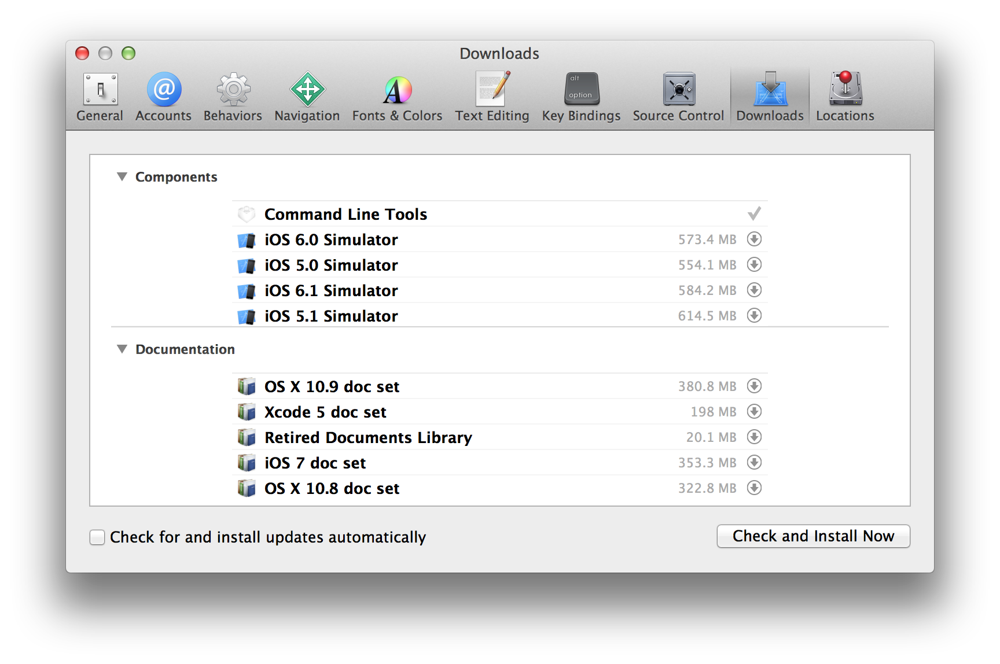

// annotate diagram with sequence of actions
// brew install git on 10.7+?
On OSX Lion (10.7) and above Git is provided with the Apple's Xcode
Command Line Tools. You should install Xcode from the Mac App Store.
After installing Xcode the Xcode Command Line Tools can be installed
from inside Xcode by clicking through the menu bar options Xcode >
Preferences > Downloads and selecting to install the Command Line Tools.
After installation it should resemble Figure 2.1.

On OSX Snow Leopard (10.6) and below you can install Git from the
official Git site at http://git-scm.com/download/mac or a package
manager such as Homebrew/Tigerbrew (by running `brew install git`).

To run Git commands open a Terminal (either the default OSX
`/Applications/Utilities/Terminal.app` or an alternative such as
iTerm.app).

.Git in Terminal.app
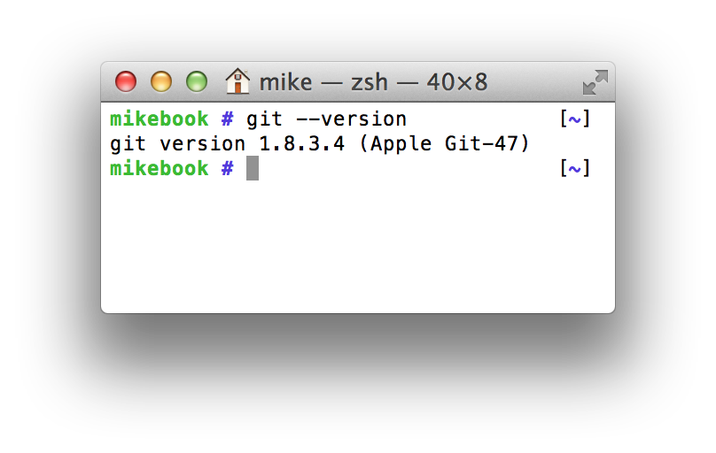
// remove white space from figure

With the Terminal open you can type in Git commands. To see what Git
version you have installed type `git --version`. The output should
resemble Figure 2.2.

==== How to install and run Git on Linux or Unix
On Linux or Unix you can install Git directly from your package manager.
How to do this varies from system to system but some of the popular
options are below:

* Debian/Ubuntu: `apt-get install git`
* Fedora: `yum install git`
* Gentoo: `emerge --ask --verbose dev-vcs/git`
* Arch Linux: `pacman -S git`
* FreeBSD: `cd /usr/ports/devel/git && make install`
* Solaris 11 Express: `pkg install developer/versioning/git`
* OpenBSD: `pkg_add git`

To run Git commands open a Terminal application or console.

.Git in terminal application
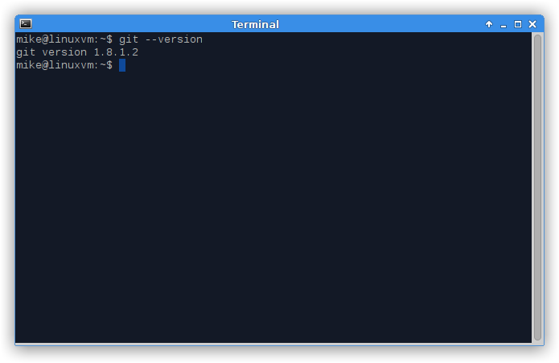
// remove white space from figure, black on white

With the Terminal open you can type in Git commands. To see what Git
version you have installed type `git --version`. The output should
resemble Figure 2.3.

==== How to install and run Git on Microsoft Windows
Git for Windows can be downloaded from the official Git site at
http://git-scm.com/download/win. Download and click through the
installer (seen in Figure 2.4). When it has completed it will provide
Start Menu links to run Git.

As Git is primarily a Unix program running Git on Windows will run a
Unix shell which allows access to Git commands. This may be slightly
scary but don't worry; this book will explain how to use any commands
you'll need to use.

To run Git commands open the 'Git Bash' shortcut from the Start Menu.
This will open a Unix shell in a Windows Command Prompt.

.Git Bash
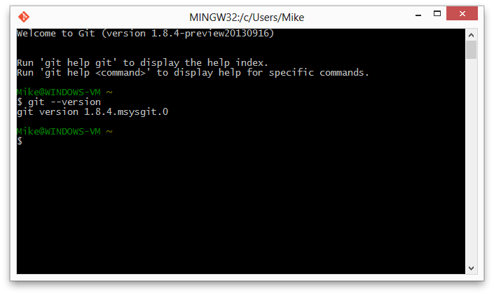
// remove white space from figure, black on white

With the Git shell open you can type in Git commands. To see what Git
version you have installed type `git --version`. The output should
resemble Figure 2.5.

==== Gitk/GitX tools
.gitk
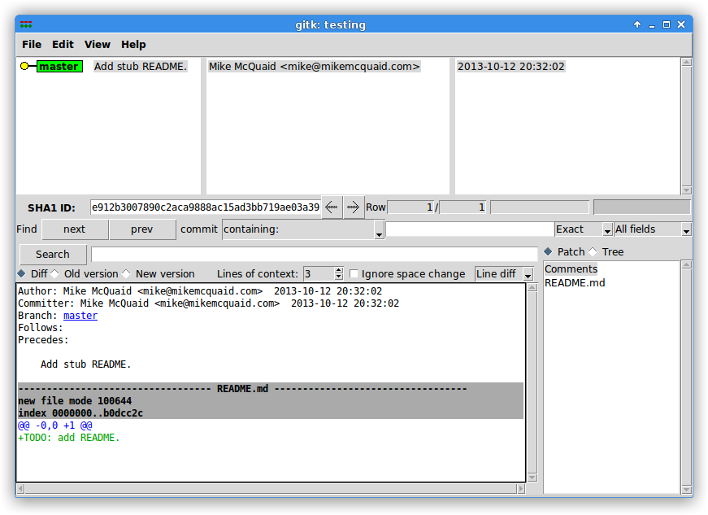
// annotate diagram and use same repo for gitk/gitx

gitk is a tool installed with Git for viewing the history of Git
repositories. It is installed by default with Git on Windows and Mac but
may need installed by your package manager on Linux. It's ability to
graphically visualize Git's history is particularly helpful when history
becomes more complex (e.g. with merges and remote branches). It can be
seen running on Linux in Figure 2.6.

Alternatively there are various more attractive, up-to-date and
platform-native alternatives to gitk. On Linux there are tools such as
gitg for gtk+/GNOME (seen in Figure 2.7) integration and QGit for Qt/KDE
integration. On OSX there are tools such as GitX (and various forks of
the project).

.GitX-dev
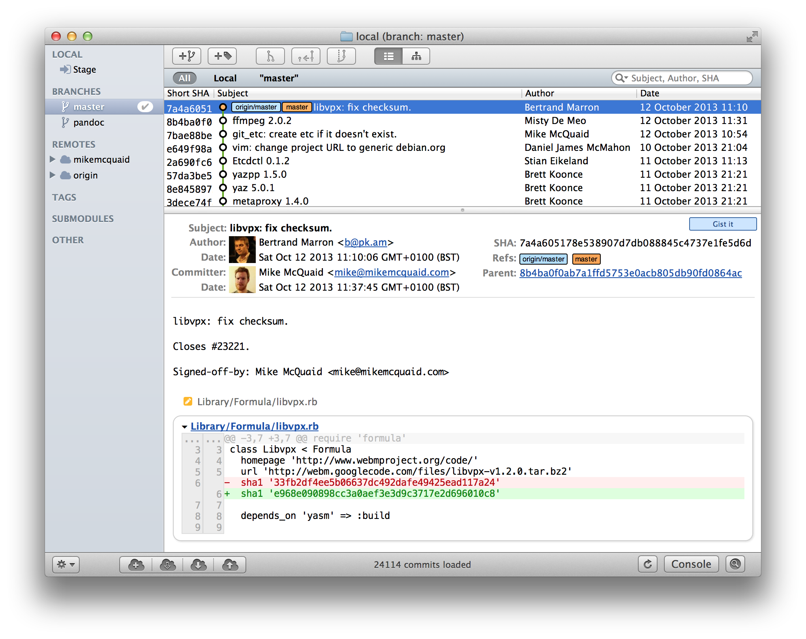
// annotate diagram and use same repo for gitk/gitx

As OSX is my platform of choice I'll be using screenshots of the
GitX-dev fork (seen in Figure 2.8) of GitX to discuss history in this
book. Don't worry about the contents of the screenshot for now; I'll
discuss it further when you need.

=== Creating a repository
Once you've installed Git the first thing you need to do to use it on
your local machine is to create a Git repository.
// explain what a repo is e.g. a folder on disk that Git watches for you
Typically you'd do this by downloading (known as _cloning_ by Git) another
repository that already exists but let's create an empty, new local repository.
// and to do that we open a new terminal window...

==== The git init command
A Git repository must be initialized before any files can be added,
commits made or pushed elsewhere. When `git init` is run it creates a
named directory (if passed; otherwise uses the current directory).
// use full OS paths to avoid confusion. Perhaps create repo in current
// directory instead

To create a new local Git repository in a new subdirectory named
"git-testing":

1.  Run `git init git-testing`
2.  A new local Git repository has been created in a new subdirectory
named "git-testing".

Under this directory a subdirectory named `.git` is created with various
files and subdirectories under it.

// annotate file listing
------------------------------------------------
git-testing/.git/config
git-testing/.git/description
git-testing/.git/HEAD
git-testing/.git/hooks/applypatch-msg.sample
git-testing/.git/hooks/commit-msg.sample
git-testing/.git/hooks/post-update.sample
git-testing/.git/hooks/pre-applypatch.sample
git-testing/.git/hooks/pre-commit.sample
git-testing/.git/hooks/pre-push.sample
git-testing/.git/hooks/pre-rebase.sample
git-testing/.git/hooks/prepare-commit-msg.sample
git-testing/.git/hooks/update.sample
git-testing/.git/info/exclude
git-testing/.git/objects/info
git-testing/.git/objects/pack
git-testing/.git/refs/heads
git-testing/.git/refs/tags
------------------------------------------------

The purpose of some of these files (seen in Listing 2.1) may be obvious
to you if you have prior experience of version control. Git has created
files for configuration, description (typically only used on
repositories created for use on a server), various sample _hooks_
(scripts that run on defined events e.g. pre-commit is run before a new
commit is made) and directories used for object storage and reference.
If you remember in the previous chapter we discussed what branches and
tags are. These are stored under the refs folder.

You shouldn't edit any of these files directly until you have a more
advanced understanding of Git (or perhaps never at all). You will
instead modify these files and folders by interacting with the Git
repository through Git's commands.
// reference later chapter where you'll do this

=== Committing changes to files
Like other version control systems to do anything useful in Git we first
need one or more commits in our repository. To do this first requires
adding files to Git's _index_.

==== Git's index: a staging area for new commits
.Git workflow
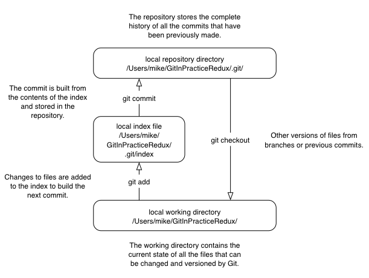
// add more annotations to diagram e.g. "Add changes and new files to index",
// "Commit files from index to repo", "Retrieve current set of files from repo
// to local"?????

Git's index is a staging area used to build up new commits. Rather than
requiring all changes in the working tree make up the next commit Git
allows files (and even lines within files) to be added incrementally to
the index. The add/commit workflow can be seen in Figure 2.9.
// use proper reference
// another diagram showing building from the index into multiple new commits

Git does not add anything to the index without your instruction. As a
result, the first thing you have to do with a file we want to include in
a Git repository is request Git to add it to the index.

==== The git add command: adding files to the index
To add an existing file 'README.md' to the index:

1.  Change directory to the Git repository (e.g. `cd ~/git-testing/`)
2.  Ensure the file 'README.md' is in the current directory.
3.  Run `git add README.md`
4.  The file 'README.md' has been added to the index.

When a file is added to the index a file named `.git/index` is created
(if it does not already exist). The added file contents and metadata are
then added to the index file. You have requested two things of Git here:

1.  for Git to track the contents of the file as it changes (this is not
done without an explicit `git add`)
2.  the contents of the file when `git add` was run should be added to
the index, ready to create the next commit.

Note that as the file is changed the contents of the commit will not be
updated to reflect these changes without another `git add`. This may
appear strange; why would you not want to add new changes to the next
commit?
// where in the book?
Later in the book this approach of incrementally and explicitly constructing
new commits will be used to create a more readable version control history.

Now that the contents of the file have been added to the index we're
ready to make a new commit.

==== The git commit command: adding a new commit to the repository
To commit the contents of an existing file 'README.md':

1.  Change directory to the Git repository (e.g. `cd ~/git-testing/`)
2.  Ensure the file 'README.md' is in the current directory.
3.  Run `git add README.md`
4.  Run `git commit`
5.  A text editor will open requesting a commit message. Enter a
description of what you have changed, save the file and close the text
editor.
6.  The new commit containing 'README.md' has been added to the
repository.
// Technically, step 6 isn't a step. It's the text that should be after the
// list. Also, you might want to split it into Steps 1 to 3 and then a separate
// list of steps 4 to 5 which does the actual commit.

.First commit
image::diagrams/02-RootCommitOutput.png[]
// what's create mode? Any other modes?

The output of `git commit` can be seen in Figure 2.10. To expand on the
annotations in this diagram:

* 'branch'. The branch on which the commit was made. The default branch
in Git is master so that is what is shown here (as you never explicitly
created a branch).
* 'root'. As this was the first commit in the repository it is known as
the 'root commit' or 'initial commit'. This means it has no parent
commit.
// what is a SHA-1 hash? Add footnote
* 'shortened SHA-1'. Every commit in Git is given a unique 40
hexadecimal character SHA-1 hash based on the contents and metadata of
that commit. As these are rather unwieldy Git will often show shortened
versions (as long as they are unique in the repository). Anywhere that
Git accepts a SHA-1 unique commit reference it will also accept the
shortened version.
* 'commit subject'. The commit message you entered is structured like an
email. The first line of it is treated as the subject and the rest as
the body. The commit subject will be used as a summary for that commit
when only a single line of the commit message is shown.
* 'changed files count'. On a new commit Git will always show how many
files were added, modified or deleted in the commit. In this case I
added one file (README.md).
* 'changed lines count'. On a new commit Git will also show how many
lines were added, modified or deleted across all the files in the
commit. In this case I added one new file with three new lines.
* 'new file permissions'. This is the file mode for the newly created
file. These are related to Unix file permissions and the `chmod` command
but are not important in understanding how Git works so can be safely
ignored.
* 'new filename'. This shows what filenames that have been added or
deleted in this commit.

Let's see the output when modifying the contents of the `README.md` file
and and adding an empty `LICENSE.md`.

.Second commit
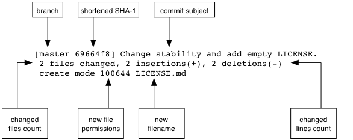

There are a few changes in Figure 2.11 from Figure 2.10:

* No 'root commit' is shown as this is the second, non-root commit which
has the root commit as its parent.
* 'shortened SHA-1'. As this is a new commit the SHA-1 differs from the
root commit.
* 'changed files count'. One file was modified and another was added so
this shows two files.
* 'changed lines count'. Two lines were modified in README.md but
LICENCE.md was unchanged. This shows two insertions and two deletions
because Git treats the modification of a new line as the deletion of an
old line and insertion of a new one.
* 'new filename'. LICENSE.md has been added so is shown but README.md
was added in the root commit so is not.

Now that we have two commits we can start looking at Git's history.

=== History
Git's history stores the graph of all commits in the repository. Viewing
it is useful for working out where you are in terms of branches and
previous commits.

The first command you will use to navigate history is `git log`.

==== The git log command: viewing the history
To view the commit history (also known as log):

1.  Change directory to the Git repository (e.g. `cd ~/git-testing/`)
2.  Run `git log`

-----------------------------------------------------------------
commit 69664f87db4f5b51e1ae64a38e6696fb2a7ed9e1
Author: Mike McQuaid <mike@mikemcquaid.com>
Date:   Sat Oct 12 14:36:01 2013 +0100

    Change stability and add empty LICENSE.

commit a10d9af146e67ecabb078e91f17913c24363ee63
Author: Mike McQuaid <mike@mikemcquaid.com>
Date:   Sat Oct 12 14:00:34 2013 +0100

    Add new markdown README file.

    This will help people understand what this repository is for.
-----------------------------------------------------------------
// perhaps add in the original command for context? Also: annotate more.

The commit log (seen in Listing 2.2) lists all the commits that have
been made on the current branch in reverse chronological order. You can
see the two commits that were made in the previous section and how they
are represented by Git. The 'commit' lists the full 40 character SHA-1
(that is sometimes shown abbreviated). The author is the person who
created the commit's name and email address. The date is the time the
commit was created. The additional text is the commit message; the first
line is the commit message subject and the rest the commit message body.

It's also helpful to visualize the history graphically.

==== Viewing history with gitk/GitX tools
To view the commit history with gitk or GitX:

1.  Change directory to the Git repository (e.g. `cd ~/git-testing/`)
2.  Run `gitk` or `gitx`

.GitX history
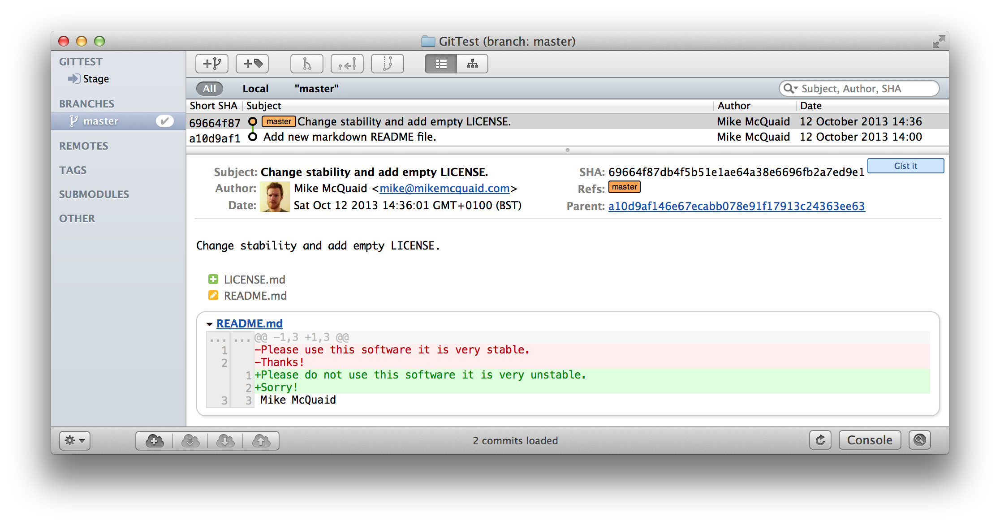
// annotate GitX

The GitX history (seen in Figure 2.12) shows similar output to `git log`
but in a different format. You can also see the current branch and the
contents of the current commit including the diff, parent SHA-1 and a
Gravatar image (obtained from the commit author's email address).

Querying the differences between any two commits can be useful so let's
learn how to do that.

=== Diffs: differences between commits
You learnt in the previous chapter that diffs are the differences
between two commits. In Git we are able to reference commits using
various references (known by Git as _refs_).
// git diff command example

==== Git refs: different references for individual commits
In Git _refs_ are the various possible ways of addressing individual
commits.
// when/why would they be used?
 A SHA-1 (shortened or the full 40 characters) is a unique reference to a
commit. What about other ways of referencing a commit?

The first you have already seen is by the branch (which is 'master' by
default if you haven't created any other branches). If you remember from
the previous chapter, branches are actually pointers to a specific
commit. Therefore referencing the SHA-1 of commit at the top of the
master branch (the short version from the last example being `69664f87`)
is the same as referencing the branch name 'master'.

.HEAD
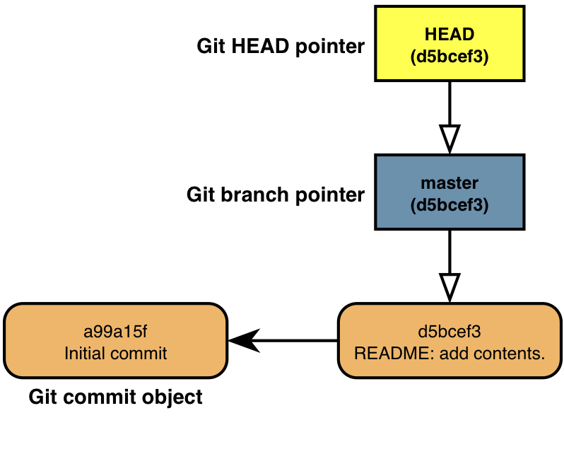
// needs better annotations to tie into the text
// use same format for this diagram and workflow as others e.g. remote colors,
// fix font sizes etc.

The second is 'HEAD'. The 'HEAD' always points to the top of whatever
you have currently checked out so will typically be the top commit of
the current branch you are on. Therefore if you have the master branch
checked out then 'master' and 'HEAD' are equivalent. See the master/HEAD
pointers demonstrated in Figure 2.13.

The third is a tag. Tags are very similar to branches in Git but don't
update as branches do when you make more commits on top of them. We'll
discuss tags more in the next chapter.

There are more types (such as remote references) but you don't need to
worry about them just now.

Refs can also have modifiers appended. Suffixing a ref with `^` is the
same as saying 'the commit before that ref'. For example `HEAD^` is the
commit before the currently checked out commit and `master^` is the
penultimate commit on the master branch. Another modification allows you
to specify the number of commits to look before. `HEAD~2` is two commits
before the currently checked out branch. Note that `HEAD^` and `HEAD~1`
are equivalent.

Now that you know various ways to reference commits lets see how to
query the differences between two commits.

==== The git diff command
The `git diff` command allows you to query the differences between two
commits (or refs).

To see the diff between the current state of the working directory and
the penultimate commit:

1.  Change directory to the Git repository (e.g. `cd ~/git-testing/`)
2.  Run `git diff HEAD^`

.git diff
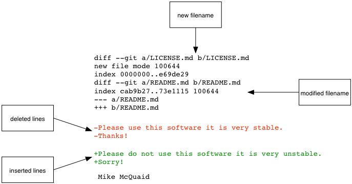
// more annotations, better title/caption

The `git diff` output (seen in Figure 2.14) contains some similar
elements to the `git commit` or `gitx` output we looked at earlier. You
can see the new and modified filenames, the file mode and deleted and
inserted lines. Don't worry about the 'index' lines; they are not
important in understanding diff output.

The most interesting part of the diff are the changes that are made to
the files. You can see that `LICENSE.md` had no changes made to it (just
the creation of the empty file). `README.md` had two lines modified
(shown as deleted and then inserted) and one line ('Mike McQuaid') left
unchanged.

These changes indicate the differences between the two states we
requested: the commit before HEAD and the (implicitly requested) current
state of the working tree.

We could request the difference between the last committed revision and
the previous revision by providing two arguments to `git diff`:

1.  Change directory to the Git repository (e.g. `cd ~/git-testing/`)
2.  Run `git diff HEAD HEAD^`

-----------------------------------------------------
diff --git a/LICENSE.md b/LICENSE.md
new file mode 100644
index 0000000..e69de29
diff --git a/README.md b/README.md
index cab9b27..73e1115 100644
--- a/README.md
+++ b/README.md
@@ -1,3 +1,3 @@
-Please use this software it is very stable.
-Thanks!
+Please do not use this software it is very unstable.
+Sorry!
 Mike McQuaid
-----------------------------------------------------

This time because we specified `HEAD` followed by `HEAD^` we see the
changes in Listing 2.3 from HEAD to the commit before HEAD; as if the
changes in that commit were applied in reverse.

=== Summary
In this chapter you hopefully learned:

* Git is a good version control system for programmers as it is local,
fast, distributed, allows rewriting history and it is hard to lose data
while using it.
* Install and run Git on Apple OSX, Linux and Microsoft Windows.
* Create a new local repository using `git init`.
* Add files to Git's index staging area using `git add`.
* Commit files to the Git repository using `git commit`.
* View history using `git log` and `gitk`/`gitx`.
* How to use refs to reference commits and their ancestors.
* See the differences between commits using `git diff`.

Now let's learn how to use these concepts to interact with repositories
that are not stored on your local machine.
