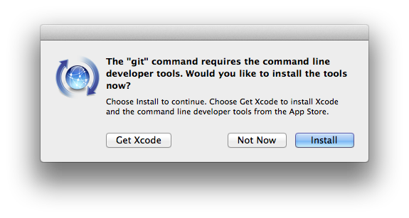
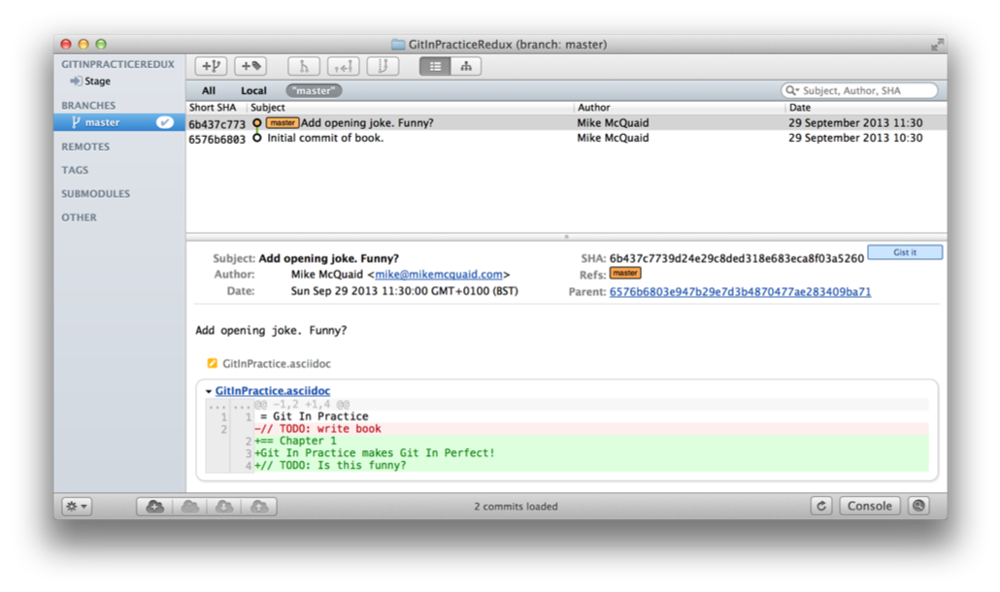
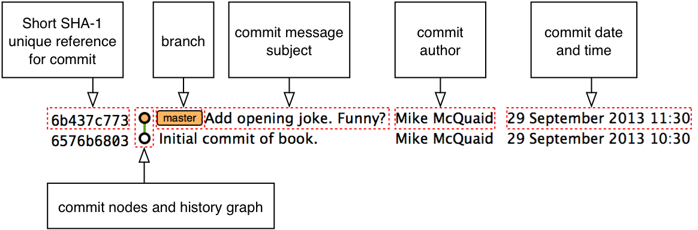

== Introduction to local Git
In this chapter you will learn how and why to use Git as a local version
control system by covering the following topics:

* How to install Git
* How to install and use gitk/GitX
* How to create a new local Git repository
* How to commit to a Git repository
* How to view the history of a Git repository
* How to view the differences between Git commits/branches/tags

Git repositories store all their data on your local machine. This means when
you create a new Git repository it does not need to send or receive any data
from other computers in order to be useful. When you make commits, view history
or request diffs these are all local operations that do not require a network
connection. For these reasons Git is fast and is useful for storing versions of
files on your local machine. Let's start using Git by getting it installed.

// manpage level syntax? Explain mandatory syntax or step 1 or 2 up from that.
// more experience flavoring

=== Installation
Let's see if Git is already installed on your local machine and install it if
needed. The method to do so varies depending on your operating system of choice.

.Why do I need to install Git?
NOTE: Git does not come pre-installed on many operating systems as it is a tool
typically used by programmers rather than non-technical computer users.

.Why are there different versions of Git in this section?
NOTE: The different installation methods and operating systems install
different versions of Git. Do not worry about this; the main differences
between newer Git versions and older ones are the helpfulness of the output
messages. Version 1.7 or above should be fine for the needs of this book.

==== How to install and run Git on Apple OS X
To verify if Git is already installed open a Terminal (either the default OS X
`/Applications/Utilities/Terminal.app` or an alternative such as `iTerm.app`)
and run `git --version`. If Git is already installed the output should resemble
Figure 2.1:

.`git --version` in Terminal.app on OS X Mavericks
image::screenshots/02-OSX-GitVersion.png[]

===== Installing Git on Apple OS X Mavericks or newer
If you are running OS X Mavericks (10.9) or newer and Git was not already
installed when you ran `git --version` it will prompt to download and install
Git similarly to to Figure 2.2:

.OS X Mavericks Git installation

===== Installing Git on Apple OS X Mountain Lion or older
If you are running OS X Mountain Lion (10.8) or older and you have a package
manager installed you can install Git using one of the options below:

* Homebrew/Tigerbrew (recommended): `brew install git`
* MacPorts: `sudo port install git-core +svn`
* Fink: `fink install git`

If you do not wish to install or use a package manager you can install Git
using a graphical installer from the official Git site at
http://git-scm.com/download/mac.

==== How to install and run Git on Linux or Unix
To verify if Git is already installed open a Terminal application or console
and run `git --version`. If Git is already installed the output should resemble
Figure 2.3:

.`git --version` in XFCE Terminal on Debian 7.2 (Wheezy)
image::screenshots/02-Linux-GitVersion.png[]

On Linux or Unix you can install Git directly from your package manager. How to
do this varies from system to system but some of the popular options are below:

* Debian/Ubuntu: `apt-get install git`
* Fedora: `yum install git`
* Gentoo: `emerge --ask --verbose dev-vcs/git`
* Arch Linux: `pacman -S git`
* FreeBSD: `cd /usr/ports/devel/git && make install`
* Solaris 11 Express: `pkg install developer/versioning/git`
* OpenBSD: `pkg_add git`

==== How to install and run Git on Microsoft Windows
To verify if Git is already installed look for "Git Bash" links in your Start
Menu or on your Desktop.

Git for Windows can be downloaded from the official Git site at
http://git-scm.com/download/win. Download and click through the installer. When
it has completed it will provide Start Menu links to run Git Bash.

As Git is a Unix program running Git on Windows will run a Unix shell which
allows access to Git commands. This may be slightly scary but don't worry; this
book will show any commands you'll need to use.

To run Git commands open the 'Git Bash' shortcut from the Start Menu. This will
open a Unix shell in a Windows Command Prompt.

.`git --version` in Git Bash on Windows 8.1
image::screenshots/02-Windows-GitVersion.png[]

With the Git shell open you can type in Git commands. To see what Git
version you have installed type `git --version`. The output should
resemble Figure 2.4.

// Is Powershell a sensible option to recommend/mention?
// Speak to Phil Haack at GitHub

==== Verifying Git has installed correctly.
To run Git commands you will need to open a Terminal application, console or
command-prompt (depending on your platform). To verify that Git has installed
correctly run `git --version` which should output `git version 1.8.4.3` (or
another version).

==== Gitk/GitX tools
.`gitk` on Windows 8.1
image::screenshots/02-gitk.png[]

`gitk` is Git tool for viewing the history of Git repositories. It is usually
installed with Git but may need installed by your package manager or
separately. It's ability to graphically visualize Git's history is particularly
helpful when history becomes more complex (e.g. with merges and remote
branches). It can be seen running on Windows 8.1 in Figure 2.5.

There are attractive, up-to-date and platform-native alternatives to `gitk`. On
Linux/Unix there are tools such as `gitg` for gtk+/GNOME integration and `QGit`
for Qt/KDE integration. These can be installed using your package manager.

.GitX-dev on OS X Mavericks
image::screenshots/02-GitX.png[]

On OS X there are tools such as `GitX` (and various forks of the project). As
OS X is my platform of choice I'll be using screenshots of the `GitX-dev` fork
of `GitX` to discuss history in this book and would recommend you use it too if
you use OS X. `GitX-dev` is available at https://github.com/rowanj/gitx and can
be seen in Figure 2.6.

=== Creating a repository
Once you've installed Git the first thing you need to do to use it on your
local machine is to create a Git repository. The Git repository is a folder on
disk where Git keeps track of the state of the files within it.

Typically you create a new repository to do this by downloading (known as
_cloning_ by Git and introduced in Chapter 3) another repository that already
exists but let's start by creating an empty, new local repository. Remember to
run any Git commands requires an open Terminal/console/Git Bash so open one and
let's create a repository.

==== The git init command
A Git repository must be initialized before any files can be added, commits
made or pushed elsewhere. When `git init` is run it creates a named directory
(if passed; otherwise uses the current directory).

To create a new local Git repository in a new subdirectory named
`GitInPracticeRedux:

1.  Change to the directory you wish to contain your new repository directory
    e.g. `cd /Users/mike/`.
2.  Run `git init GitInPracticeRedux`.

You have created a new local Git repository named `GitInPracticeRedux`
accessible at e.g. `/Users/mike/GitInPracticeRedux`.

Under this directory a subdirectory at e.g
`/Users/mike/GitInPracticeRedux/.git/` which is created with various files and
directories.

.Why is the `.git` directory not visible?
NOTE: On some operating systems by default directories starting with a `.` such
as `.git` will be hidden by default. They can still be accessed in the console
using their full path (e.g. `/Users/mike/GitInPracticeRedux/.git/`) but will not
show up in file listings in file browsers or by running e.g. `ls
/Users/mike/GitInPracticeRedux/`.

Let's view the contents of the new Git repository by changing to directory
containing the Git repository directory and running the `find` command e.g. `cd
/Users/mike/ && find GitInPracticeRedux`

.Files created in a new Git repository
----
GitInPracticeRedux/.git/config <1>
GitInPracticeRedux/.git/description <2>
GitInPracticeRedux/.git/HEAD <3>
GitInPracticeRedux/.git/hooks/applypatch-msg.sample <4>
GitInPracticeRedux/.git/hooks/commit-msg.sample
GitInPracticeRedux/.git/hooks/post-update.sample
GitInPracticeRedux/.git/hooks/pre-applypatch.sample
GitInPracticeRedux/.git/hooks/pre-commit.sample
GitInPracticeRedux/.git/hooks/pre-push.sample
GitInPracticeRedux/.git/hooks/pre-rebase.sample
GitInPracticeRedux/.git/hooks/prepare-commit-msg.sample
GitInPracticeRedux/.git/hooks/update.sample
GitInPracticeRedux/.git/info/exclude <5>
GitInPracticeRedux/.git/objects/info <6>
GitInPracticeRedux/.git/objects/pack <7>
GitInPracticeRedux/.git/refs/heads <8>
GitInPracticeRedux/.git/refs/tags <9>
----
<1> local configuration
<2> description file
<3> HEAD pointer
<4> event hooks
<5> excluded files
<6> object information
<7> pack files
<8> branch pointers
<9> tag pointers

The purpose of some of these files (seen in Listing 2.1) may be obvious to you
if you have prior experience of version control. Git has created files for:

* "local configuration (1)" of the local Git repository
* "description file (2)" to describe the repository for those created for use
  on a server
* "HEAD pointer (3)", "branch pointers (8)" and "tag pointers (9)" which point to commits
* "_event hooks_ (4)" samples; scripts that run on defined events e.g.
  pre-commit is run before every new commit is made
* "excluded files (5)" which manages files which should be excluded from the
  repository
* "object information (6)" and "pack files (7)" which are used for object
  storage and reference

You shouldn't edit any of these files directly until you have a more advanced
understanding of Git (or perhaps never at all). You will instead modify these
files and folders by interacting with the Git repository through Git's
filesystem commands introduced in Chapter 4.

=== Committing changes to files
Like other version control systems to do anything useful in Git we first need
one or more commits in our repository. To do this first requires adding files
to Git's _index_.

// description, steps, listing, discussion (like Chapter 4 and in Chap 3 too).

==== Git's index: a staging area for new commits
Git's index is a staging area used to build up new commits. Rather than
requiring all changes in the working tree make up the next commit Git allows
files (and even lines within files) to be added incrementally to the index. The
add/commit/checkout workflow can be seen in Figure 2.7.
// Where will you learn about adding lines?

.Git add/commit/checkout workflow
image::diagrams/02-Workflow.png[]

Git does not add anything to the index without your instruction. As a result,
the first thing you have to do with a file we want to include in a Git
repository is request Git to add it to the index.

==== The `git add` command: adding files to the index
// Perhaps turn this into a recipe format
// git add . perhaps?
// git status to show what files need added
To add an existing file `GitInPractice.asciidoc` to the index:

1.  Change directory to the Git repository e.g. `cd
    /Users/mike/GitInPracticeRedux/`.
2.  Ensure the file `GitInPractice.asciidoc` is in the current directory.
3.  Run `git add GitInPractice.asciidoc`. There will be no output.

You have added the `GitInPractice.asciidoc` to the index. If this has been
successful then the output of running `git status` should resemble:

.Adding a file to the index
----
# git add GitInPractice.asciidoc

# On branch master <1>
#
# Initial commit <2>
#
# Changes to be committed:
#   (use "git rm --cached <file>..." to unstage)
#
#	new file:   GitInPractice.asciidoc <3>
#
----
<1> master is default branch
<2> this is the first commit
<3> new file added to index

When a file is added to the index a file named `.git/index` is created (if it
does not already exist). The added file contents and metadata are then added to
the index file. You have requested two things of Git here:

1.  for Git to track the contents of the file as it changes (this is not done
    without an explicit `git add`)
2.  the contents of the file when `git add` was run should be added to the
    index, ready to create the next commit.

.Why do you need to keep running `git add`?
NOTE: As the file is changed the contents of the commit will not be updated to
reflect these changes without another `git add`. This may appear strange; why
would you not want to add new changes to the next commit? In Chapter 7 this
approach of incrementally and explicitly constructing new commits will be used
to create a more readable version control history.

Now that the contents of the file have been added to the index you're ready to
make a new commit.

==== The `git commit` command: adding a new commit to the repository
To commit the contents of an existing file `GitInPractice.asciidoc`:

1.  Change directory to the Git repository e.g. `cd
    /Users/mike/GitInPracticeRedux/`.
2.  Ensure the file `GitInPractice.asciidoc` is in the current directory.
3.  Run `git add GitInPractice.asciidoc`. There will be no output.
4.  Run `git commit --message 'Initial commit of book.'`.
    The output should resemble:

// use a listing instead
.`git commit` output
image::diagrams/02-RootCommitOutput.png[]

You have made a new commit containing `GitInPractice.asciidoc`.

The output of `git commit` can be seen in Figure 2.8. To expand on the
annotations in this diagram:

* 'current, default branch'. The branch on which the commit was made. The
  default branch in Git is master so that is what is shown here (as you never
  explicitly created a branch).
* 'i.e. initial commit'. As this was the first commit in the repository it is
  known as the 'root-commit' or 'initial commit'. This means it has no parent
  commit. This part of the `git commit` output is only shown for the first
  commit.
* 'shortened SHA-1 unique reference'. Every commit in Git is given a unique 40
  hexadecimal character SHA-1 hash of the contents and metadata of that commit.
  As these are rather unwieldy Git will often show shortened versions (as long
  as they are unique in the repository). Anywhere that Git accepts a SHA-1
  unique commit reference it will also accept the shortened version.
* 'commit subject'. The commit message you entered is structured like an email.
  The first line of it is treated as the subject and the rest as the body. The
  commit subject will be used as a summary for that commit when only a single
  line of the commit message is shown.
* 'changed files count'. On a new commit Git will always show how many files
  were added, modified or deleted in the commit. In this case we added one
  file (`GitInPractice.asciidoc`).
* 'new file permissions'. This is the file mode for the newly created file.
  These are related to Unix file permissions and the `chmod` command but are
  not important in understanding how Git works so can be safely ignored.
* 'new filename'. This shows what filenames have been added or deleted in this
  commit.
* 'changed lines count'. On a new commit Git will also show how many lines were
  added, modified or deleted across all the files in the commit. In this case I
  added one new file with two new lines.

.What is a SHA-1 hash?
NOTE: A "SHA-1 hash" is a secure hash digest function that is used extensively
inside of Git. It outputs a 160-bit (20-byte) hash value which is usually
displayed as a 40 character hexadecimal string. The hash is used to uniquely
identify commits by Git instead of e.g. incremental revision numbers like
Subversion. Git will also accept shortened versions of SHA-1 hashes as long as
the shortened version is also unique inside the repository.

Let's see the output after modifying the contents of the
`GitInPractice.asciidoc` file, running `git add` and `git commit`:

.second `git commit` output
image::diagrams/02-CommitOutput.png[]

There are a few changes in Figure 2.9 from Figure 2.8:

* No 'root commit' is shown as this is the second, non-initial commit which has
  the first commit as its parent.
* 'shortened SHA-1'. As this is a new commit with different contents and
  metadata the SHA-1 differs from the initial commit.
* 'added, removed lines count'. Two new lines were inserted and one was
  modified. This shows three insertions and one deletion because Git treats the
  modification of a line as the deletion of an old line and insertion of a new
  one.

Now that we have two commits we can start looking at Git's history.

=== History
Git's history stores the graph of all commits in the repository. Viewing it is
useful for working out where you are in terms of branches and previous commits.

The first command you will use to navigate history is `git log`.

==== The git log command: viewing the history
To view the commit history (also known as log):

1.  Change directory to the Git repository e.g. `cd
    /Users/mike/GitInPracticeRedux/`.
2.  Run `git log`.
    The output should resemble:

.History output
----
# git log

commit 6b437c7739d24e29c8ded318e683eca8f03a5260 <1>
Author: Mike McQuaid <mike@mikemcquaid.com> <2>
Date:   Sun Sep 29 11:30:00 2013 +0100 <3>

    Add opening joke. Funny? <4>

commit 6576b6803e947b29e7d3b4870477ae283409ba71
Author: Mike McQuaid <mike@mikemcquaid.com>
Date:   Sun Sep 29 10:30:00 2013 +0100

    Initial commit of book.
----
<1> unique SHA-1
<2> commit author
<3> committed date
<4> full commit message

The `git log` output lists all the commits that have been made on the current
branch in reverse chronological order i.e. the most recent commit comes first.
You can see the two commits that were made in the previous section and how they
are represented by Git. The 'commit' lists the full 40 character "unique SHA-1
(1)" (that is sometimes shown abbreviated). The "commit author (2)" name and
email address set by the person who created the commit. The "committed date" is
the date and time the commit was created. The additional text is the "full
commit message"; the first line is the commit message subject and the rest the
commit message body.

It's also helpful to visualize the history graphically.

==== Viewing history with gitk/GitX tools
To view the commit history with gitk or GitX:

1.  Change directory to the Git repository e.g. `cd
    /Users/mike/GitInPracticeRedux/`.
2.  Run `gitk` or `gitx`.

.GitX history output

// annotate the history pane, detail pane for single commit

The GitX history (seen in Figure 2.10) shows similar output to `git log` but in
a different format. You can also see the current branch and the contents of the
current commit including the diff and parent SHA-1. There's a lot of
information that doesn't differ between commits, however.

.GitX history graph output

In Figure 2.11 you can see the GitX history graph output. This format will be
used throughout the book to show the current state of the repository and/or the
previous few commits. It concisely shows the unique SHA-1, all branches (only
`master` in this case), the current local branch (shown with an orange "node"
and label), the commit message subject (the first line of the commit message)
and the commit's author, date and time.

The history can give us a quick overview of all the previous commits. However,
querying the differences between any two arbitrary commits can also sometimes
be useful so let's learn how to do that.

=== Diffs: differences between commits
You learnt in the previous chapter that diffs are the differences between two
commits. In Git we are able to reference commits using various references
(known by Git as _refs_).

// Explain diff command and then refs, not other way round.

==== Git refs: different references for individual commits
In Git _refs_ are the possible ways of addressing individual commits. They are
an easier method to type a reference to a specific commit or branch when
querying the difference between commits (or other techniques we'll learn later)

Remember that a SHA-1 (shortened or the full 40 characters) is a unique
reference to a commit. What about other ways of referencing a commit?

The first ref you have already seen is by the branch (which is `master` by
default if you haven't created any other branches). If you remember from the
previous chapter, branches are actually pointers to a specific commit.
Therefore referencing the SHA-1 of commit at the top of the master branch (the
short version from the last example being `6b437c`) is the same as referencing
the branch name `master`. In this case whenever you might type `6b437c` to a
command (such as `git diff` as we will see later this section) you could
instead type `master`. Using branch names is quicker and easier to remember for
referencing commits than always using SHA-1s.

.HEAD
image::diagrams/02-HEAD.png[]

// If HEAD a ref or is the string HEAD? Refs needs to talk about what to type into diff command itself.
// Try and cover all the refs you’ve mentioned in the diagrams.
// Maybe put HEAD in Chapter 3?
// Use more annotations

The second ref is `HEAD`. The `HEAD` always points to the top of whatever you
have currently checked out so almost always be the top commit of the current
branch you are on. Therefore if you have the `master` branch checked out then
`master` and `HEAD` (and `6b437c7` in the last example) are equivalent. See the
`master`/`HEAD` pointers demonstrated in Figure 2.11.
// Needs more clarifications

The third ref is a tag. Tags are very similar to branches in Git but don't
update as branches do when you make more commits on top of them. We'll discuss
tags more in the next chapter.

There are more types (such as remote references) but you don't need to worry
about them just now; they will be introduced in Chapter 3.

Refs can also have modifiers appended. Suffixing a ref with `^` is the same as
saying 'the commit before that ref'. For example `HEAD^` is the commit before
the currently checked out commit and `master^` is the penultimate commit on the
master branch. Another modification allows you to specify the number of commits
to look before. `HEAD~2` is two commits before the currently checked out
branch. Note that `HEAD^` and `HEAD~1` are equivalent.

Now that you know various ways to reference commits lets see how to query the
differences between two commits.

==== The git diff command
The `git diff` command allows you to query the differences between two commits
(or refs).
// Needs more general syntax e.g. what happens with no args

To see the diff between the current state of the working directory and the
penultimate commit:

1.  Change directory to the Git repository e.g. `cd
    /Users/mike/GitInPracticeRedux/`.
2.  Run `git diff HEAD^`.
    The output should resemble:

.The differences to the commit before `HEAD` output
----
# git diff HEAD^

diff --git a/GitInPractice.asciidoc b/GitInPractice.asciidoc <1>
index 48f7a8a..b14909f 100644 <2>
--- a/GitInPractice.asciidoc <3>
+++ b/GitInPractice.asciidoc <4>
@@ -1,2 +1,4 @@ <5>
 = Git In Practice
-// TODO: write book <6>
+== Chapter 1 <7>
+Git In Practice makes Git In Perfect! <8>
+// TODO: Is this funny?
----
<1> virtual diff command
<2> index SHA-1 changes
<3> old virtual path
<4> new virtual path
<5> diff offsets
<6> modified/deleted line
<7> modified/inserted line
<8> inserted line

// explain --git

The `git diff` output (seen in Listing 2.2) contains some similar elements to
the `git commit` or `gitx` output we looked at earlier. The "virtual diff
command (1)" is the invocation of the Unix `diff` command that Git is
simulating. Git pretends that it is actually diffing the contents two folders,
the "old virtual path (3)" and the "new virtual path (4)" and the "virtual diff
command (1)" represents that. The "index SHA-1 changes" show the difference in
the contents of the working tree between these commits. This can be safely
ignored other than noticing that these SHA-1s do not refer to the commits
themselves. The "diff offsets (5)" can also be ignored; they are used by the
Unix `diff` command to identify what lines the diff relates to for files that
are too large for `diff` to show the entire file. The "modified/deleted (6)"
line and "modified/inserted (7)" line relate to the single line that was
modified and the "inserted line (8)" is one of the two lines that was inserted
in this commit.

These changes indicate the differences between the two states we requested: the
commit before HEAD and the (implicitly requested) current state of the working
tree.

We could request the difference between the last committed revision and the
previous revision by providing two arguments to `git diff`:

1.  Change directory to the Git repository e.g. `cd
    /Users/mike/GitInPracticeRedux/`.
2.  Run `git diff HEAD HEAD^`.
    The output should resemble:

.The difference from `HEAD` to the commit before `HEAD` output
----
# git diff HEAD HEAD^

diff --git a/GitInPractice.asciidoc b/GitInPractice.asciidoc
index b14909f..48f7a8a 100644
--- a/GitInPractice.asciidoc
+++ b/GitInPractice.asciidoc
@@ -1,4 +1,2 @@
 = Git In Practice
-== Chapter 1
-Git In Practice makes Git In Perfect!
-// TODO: Is this funny?
+// TODO: write book
----

This time because we specified `HEAD` followed by `HEAD^` we see the changes in
the `git diff HEAD^` but applied in reverse. If you remember from the refs
earlier this would also be equivalent to `git diff master HEAD~1` or `git diff
6b437c7 6576b68` and will produce identical output.

=== Summary
In this chapter you hopefully learned:

* How to install and run Git on Apple OS X, Linux/Unix and Microsoft Windows.
* How to create a new local repository using `git init`.
* How to add files to Git's index staging area using `git add`.
* How to commit files to the Git repository using `git commit`.
* How to view history using `git log` and `gitk`/`gitx`.
* How to use refs to reference commits and their ancestors.
* How to see the differences between commits using `git diff`.

Now let's learn how to use these concepts to interact with repositories that
are not stored on your local machine.
