== Introduction to remote Git
In this chapter you will learn how to retrieve and share changes with other
users' Git repositories by learning the following topics:

* How to download a remote repository
* How to send/receive changes from a remote repository
* How to create and receive branches
* How to merge commits from one branch to another

As you learned in Chapter 1 it's possible to work entirely with Git as a local
version control system and never share changes with others. Usually, however,
if you are using a version control system you will want to share changes with
others; from simply sending files to a remote server for backup to
collaborating as part of a large development team. Team collaboration will also
require knowledge of how to create and interact with branches for working on
different features in parallel. Let's start by adding a remote repository.

=== Adding a remote repository: git remote add
==== Background
Typically when using version control you will want to share your commits with
other people using other computers. With a traditional, _centralized version
control system_ (such as Subversion or CVS) the repository is usually stored on
another machine. As you make a commit it is sent over the network, checked that
it can apply (there may be other changes since you last checked) and then
committed to the version control system where others can see it.

With a _distributed version control system_ like Git every user has a complete
repository on their own computer. While there may be a centralized repository
that people send their commits to it will not be accessed unless specifically
requested. All commits, branches and history are stored offline unless users
choose to send or receive commits from another repository.

.Git add/commit/checkout cycle
image::diagrams/01-Workflow.png[]

Figure 2.1 shows the local Git cycle we used in Chapter 1. Files in the
local working directory are modified and added with `git add` to the index
staging area. The contents of the index staging area is committed with `git
commit` to form a new commit which is stored in the local repository directory.
Later, this repository can be queried to view the differences between versions
of files using `git diff`. In Section 2.7 you will also see how to use `git
checkout` to change to different local branches' versions of files.

.Git add/commit/push/pull/checkout cycle
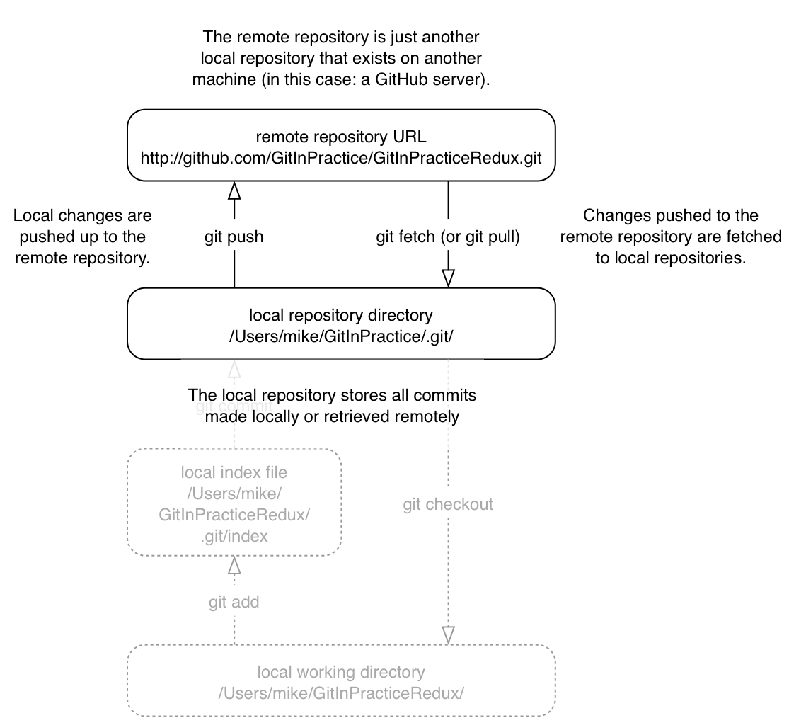

Figure 2.2 shows the remote Git cycle we will look at in this chapter. As in
the local workflow files are modified, added, committed and can be checked out.
However there are now two repositories: a local repository and _remote
repository_.

If your local repository needs to send or receive data to a repository on
another machine it will need to add a _remote repository_. A remote repository
is one that is typically stored on another computer. `git push` sends your
new commits to it and `git fetch` retrieves any new commits made by others from
it.

In Chapter 1 you created a local repository on your machine. Please sign up for
a GitHub account (detailed in Appendix C) and create a _remote repository_ on
GitHub (detailed in Appendix D). You can use another Git hosting provider but
this book will assume the use of GitHub (as it is the most widely used).

The first action you're concerned with is adding a reference for your
newly-created remote repository (also known as a _remote_) on GitHub to your
previous local repository so you can push and fetch commits.

==== Problem
You wish to add the new GitInPractice remote repository to your current repository.

==== Solution
1.  Change directory to the Git repository e.g. `cd
    /Users/mike/GitInPracticeRedux/`.
2.  Run `git remote add origin` with your repository URL appended. e.g. if your
    username is `GitInPractice` and repository is named `GitInPracticeRedux`
    run `git remote add origin
    https://github.com/GitInPractice/GitInPracticeRedux.git`. There will be no
    output.

You can verify this remote has been created successfully by running `git
remote --verbose`. The output should resemble:

.Remote repositories
----
# git remote --verbose

origin  https://github.com/GitInPractice/GitInPracticeRedux.git (fetch) <1>
origin  https://github.com/GitInPractice/GitInPracticeRedux.git (push) <2>
----
<1> fetch URL
<2> push URL

In the remote listing:

* "fetch URL (1)" specifies the URL that `git fetch` uses to fetch new remote
  commits.
* "push URL (2)" specifies the URL that `git push` uses to send new local
  commits.

.When the fetch and push URLs differ?
NOTE: These will not differ unless they have been set to do so by the `git
remote` command or by Git configuration. It's almost never necessary to do this
so I will not cover it in this book.

You have added a remote named `origin` that points to the remote
`GitInPracticeRedux` repository belonging to the `GitInPractice` user on
GitHub. You can now send and receive changes from this remote. Nothing has been
sent or received yet; the new remote is effectively just a named URL pointing
to the remote repository location.

==== Discussion
`git remote` can also be called with the `rename` and `remove` (or `rm`)
subcommands to alter remotes accordingly.

`git remote show` will query and show verbose information about the given
remote.

`git remote prune` will delete any remote references to branches that have been
deleted from the remote repository by other users. Don't worry about this for
now; remote branches will be covered in Section 2.8.

.What is the default name for a remote?
NOTE: You can have multiple remote repositories connected to your local
repository so the remote repositories are named. Typically if you have a single
remote repository it will be named `origin`.

===== Authoritative version storage
With centralized version control systems the central server always stores the
authoritative version of the code. Clients to this repository will typically
only store a small proportion of the history and require access to the server
to perform most tasks. With a distributed version control system like Git every
local repository has a complete copy of the data. Which repository stores the
authoritative version in this case? It turns out that this is merely a matter
of convention; Git itself does not deem any particular repository to have any
higher priority than another. Typically in organizations there will be a
central location (like with a centralized version control) which is treated as
the authoritative version and people are encouraging to push their commits and
branches to.

The lack of authority for a particular repository with distributed version
control systems is sometimes seen as a liability but can actually be a
strength. The Linux kernel project (for which Git was original created) makes
use of this to provide a network of trust and a more manageable way of merging
changes. When Linus Torvalds, the self-named "benevolent dictator" of the
project, tags a new release this is generally considered a new release of
Linux. What is in his repository (well, his publicly accessible one; he will
have multiple repositories between various personal machines that he does not
make publicly accessible) is generally considered to be what is in Linux. Linus
has trusted lieutenants from who he can pull and merge commits and branches.
Rather than every single merge to Linux needing to be done by Linus he can
leave some of it to his lieutenants (who leave some to their sub-lieutenants
and so on) so everyone can needs only worry about verifying and including the
work of a small number of others. This particular workflow may not make sense
in many organizations but it demonstrates how distributed version control
systems can allow different ways of managing merges to centralized version
control.

=== Pushing changes to a remote repository: git push
==== Background
You will eventually wish to send commits made in the local repository to a
remote. To do this always requires an explicit action. Only changes
specifically requested will be sent and the Git (which can operate over HTTP,
SSH or it's own protocol (`git://`)) will ensure that only the differences
between the repositories are sent. As a result you can push small changes from
a large local repository to a large remote repository very quickly as long as
they have most commits in common.

Let's push the changes you made in our repository in Chapter 1 to the newly
created remote you made in Section 2.1.3.

==== Problem
You wish to push the changes from the local `GitInPracticeRedux` repository to
the `origin` remote on GitHub.

==== Solution
1.  Change directory to the Git repository e.g. `cd
    /Users/mike/GitInPracticeRedux/`.
2.  Run `git push --set-upstream origin master` and enter your GitHub username
    and password when requested. The output should resemble:

.Push and set upstream branch
----
# git push --set-upstream origin master

Username for 'https://github.com': GitInPractice <1>
Password for 'https://GitInPractice@github.com': <2>
Counting objects: 6, done. <3>
Delta compression using up to 8 threads.
Compressing objects: 100% (5/5), done.
Writing objects: 100% (6/6), 602 bytes | 0 bytes/s, done.
Total 6 (delta 0), reused 0 (delta 0)
To https://github.com/GitInPractice/GitInPracticeRedux.git <4>
 * [new branch]      master -> master <5>
Branch master set up to track remote branch master from origin. <6>
----
<1> username entry
<2> password entry
<3> object preparation/transmission
<4> remote URL
<5> local/remote branch
<6> set tracking branch

From the push output you can see:

* "username entry (1)" and "password entry (2)" are those for your GitHub
  account. They may only be asked for the first time you push to a repository
  depending on your operating system of choice (which may decide to save the
  password for you). They are always required to `push` to repositories but are
  only required for `fetch` when fetching from private repositories.
* "object preparation/transmission (3)" can be safely ignored in this or future
  figures; it is simply Git communicating details on how the files are being
  sent to the remote repository and isn't worth understanding beyond basic
  progress feedback.
* "remote URL (4)" matches the push URL from the `git remote --verbose`
  output earlier. It is where Git has sent the local commits to.
* "local/remote branch (5)" indicates that this was a new branch on the remote.
  This is because the remote repository on GitHub was empty until we pushed
  this; it had no commits and thus no `master` branch yet. This was created by
  the `git push`. The `master -> master` indicates the local master branch (the
  first of the two) has been pushed to the remote `master` branch (the second
  of the two). This may seem redundant but it is shown as it is possible (but
  ill-advised due to the obvious confusion it causes) to have local and remote
  branches with different names. Don't worry about local or remote branches for
  now as these will be covered in Section 2.6.
* "set tracking branch (6)" is shown because the `--set-upstream` option was
  passed to `git push`. By passing this option you have is told Git that you
  want the local `master` branch you have just pushed to _track_ the `origin`
  remote's branch `master`. The `master` branch on the `origin` remote (which
  is often abbreviated as `origin/master`) is now known as the _tracking
  branch_ (or _upstream_) for your local `master` branch.

You have pushed your `master` branch's changes to the `origin` remote's
`master` branch.

==== Discussion
The `git push` `--set-upstream` (or `-u`) flag and explicit specification of
`origin` and `master` are only required the first time you push a branch. After
that a `git push` with no arguments will default to running the equivalent of
`git push origin master`.

`git push` can take an `--all` flag which will push all branches and tags at
once. Be careful when doing this; you may push some branches with work
in-progress.

`git push` can take a `--force` flag which will disable some checks on the
remote repository to allow rewriting of history. *This is very dangerous. Do
not use this flag until after reading (and rereading) Chapter 6.*

A _tracking branch_ is the default push or fetch location for a branch. This
means in future you could run `git push` with no arguments on this branch and
it will do the same thing as running `git push origin master` i.e. push the
current branch to the `origin` remote's `master` branch.

.Local repository after `git push`
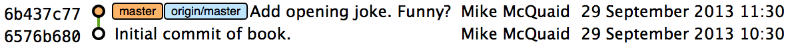

Figure 2.3 shows the state of the repository after the `git push`. There is one
addition since we last looked at it in Figure 2.10: the `origin/master` label.
This is attached to the commit which matches the currently known state of the
`origin` remote's `master` branch.

.GitHub repository after `git push`
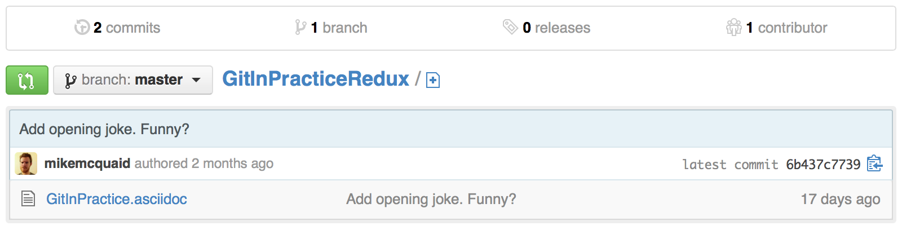

Figure 2.4 shows the remote repository on GitHub after the `git push`. The
latest commit SHA-1 there matches your current latest commit on the `master`
branch seen in Figure 2.3 (although they are different lengths; remember SHA-1s
can always be shortened as long as they remain unique). To update this in
future you would run `git push` again to push any local changes to GitHub.

=== Cloning a remote/GitHub repository onto your local machine: git clone
==== Background
It is useful to learn how to create a new Git repository locally and push it to
GitHub. However, you will usually be downloading an existing repository to use
as your local repository. This process of creating a new local repository from
an existing remote repository is known as _cloning_ a repository.

Some other version control systems (such as Subversion) will use the
terminology of _checking out_ a repository. The reasoning for this is that
Subversion is a centralized version control system so when you download a
repository locally you are only actually downloading the latest revision from
the repository. With Git it is known as _cloning_ because you are making a
complete copy of that repository by downloading all commits, branches, tags;
the complete history of the repository onto your local machine.

As you just pushed the entire contents of the local repository to GitHub let's
remove the local repository and recreate it by cloning the repository on GitHub.

==== Problem
You wish to remove the existing `GitInPracticeRedux` local repository and
recreate it by cloning from GitHub:

1.  Change to the directory where you want the new `GitInPracticeRedux`
    repository to be created e.g. `cd /Users/mike/` to create the new local
    repository in `/Users/mike/GitInPracticeRedux`.
2.  Run `rm -rf GitInPracticeRedux` to remove the existing
    `GitInPracticeRedux` repository.
3.  Run `git clone https://github.com/GitInPractice/GitInPracticeRedux.git`.
    The output should resemble:

.Cloning a remote repository
----
# git clone https://github.com/GitInPractice/GitInPracticeRedux.git

Cloning into 'GitInPracticeRedux'... <1>
remote: Counting objects: 6, done. <2>
remote: Compressing objects: 100% (5/5), done.
remote: Total 6 (delta 0), reused 6 (delta 0)
Unpacking objects: 100% (6/6), done.
Checking connectivity... done
----
<1> destination directory
<2> object preparation/transmission

From the clone output you can see:

* "destination directory (1)" is the directory in which the new
  `GitInPracticeRedux` local repository was created.
* "object preparation/transmission (2)" can be safely ignored again (although
  if you're wondering why there were 6 objects remember the different objects
  in the object store in Chapter 1).

You have cloned the `GitInPracticeRedux` remote repository and created a new
local repository containing all its commits in `/Users/mike/GitInPracticeRedux`.

You can verify this remote has been created successfully by running `git
remote --verbose`. The output should resemble:

.Remote repositories
----
# git remote --verbose

origin  https://github.com/GitInPractice/GitInPracticeRedux.git (fetch) <1>
origin  https://github.com/GitInPractice/GitInPracticeRedux.git (push) <2>
----
<1> fetch URL
<2> push URL

==== Discussion
`git clone` can take `--bare` or `--mirror` flags which will create a
repository suitable for hosting on a server. This will be covered more in
Chapter 13.

`git clone` can take a `--depth` flag followed by an integer which will create
a _shallow clone_. A shallow clone is one where only the specified number of
revisions are downloaded from the remote repository but it is limited as it
cannot be cloned/fetched/pushed from or pushed to.

`git clone` can take a `--recurse-submodules` (or `--recursive`) flag which
will initialize all the Git submodules in the repository. Submodules will be
covered in Chapter 12.

.Local repository after `git clone`

Figure 2.5 shows the state of the repository after the `git clone`. It is
identical to the state after the `git push` in Figure 2.3. This shows that the
clone was successful and the newly created local repository has the same
contents as the deleted old local repository.

Cloning a repository has also created a new remote called `origin`. `origin` is
the default remote and references the repository that the clone originated from
(which is https://github.com/GitInPractice/GitInPracticeRedux.git in this case).

Now let's learn how to pull new commits from the remote repository.

=== Pulling changes from another repository: git pull
==== Background
`git pull` downloads the new commits from another repository and merges the
remote branch into the current branch.

If you run `git pull` on the local repository you just see a message stating
`Already up-to-date.`. `git pull` in this case contacted the remote repository,
saw that there were no changes to be downloaded and let us know that it was up
to date. This is expected as this repository has been pushed to but not updated
since.

To test `git pull` let's create another clone of the same repository, make a
new commit and `git push` it. This will allow downloading new changes with `git
pull` on the original remote repository.

To create another cloned, local repository and push a commit from it:

1.  Change to the directory where you want the new `GitInPracticeRedux`
    repository to be created e.g. `cd /Users/mike/` to create the new local
    repository in `/Users/mike/GitInPracticeReduxPushTest`.
2.  Run `git clone https://github.com/GitInPractice/GitInPracticeRedux.git
    GitInPracticeReduxPushTest` to clone into the `GitInPracticeReduxPushTest`
    directory.
3.  Change directory to the new Git repository e.g. `cd
    /Users/mike/GitInPracticeReduxPushTest/`.
4.  Modify the `GitInPractice.asciidoc` file.
5.  Run `git add GitInPractice.asciidoc`.
6.  Run `git commit --message 'Improve joke comic timing.'`.
7.  Run `git push`.

Now that you've pushed a commit to the `GitInPracticeRedux` remote on GitHub
you can change back to your original repository and `git pull` from it. Keep
the `GitInPracticeReduxPushTest` directory around as we'll use it later.

==== Problem
You wish to pull new commits into the current branch on the local
`GitInPracticeRedux` repository from the remote repository on GitHub.

==== Solution
1.  Change directory to the original Git repository e.g. `cd
    /Users/mike/GitInPracticeRedux/`.
2.  Run `git pull`.
    The output should resemble:

.Pulling new changes
----
# git pull

remote: Counting objects: 5, done. <1>
remote: Compressing objects: 100% (3/3), done.
remote: Total 3 (delta 0), reused 3 (delta 0)
Unpacking objects: 100% (3/3), done.
From https://github.com/GitInPractice/GitInPracticeRedux <2>
   6b437c7..85a5db1  master     -> origin/master <3>
Updating 6b437c7..85a5db1 <4>
Fast-forward <5>
 GitInPractice.asciidoc | 5 +++-- <6>
 1 file changed, 3 insertions(+), 2 deletions(-) <7>
----
<1> object preparation/transmission
<2> remote URL
<3> remote branch update
<4> local branch update
<5> merge type
<6> lines changed in file
<7> diff summary

You can see from the pull output:

* "object preparation/transmission (1)" can be safely ignored again.
* "remote URL (2)" matches the remote repository URL we saw used for `git push`.
* "remote branch update (3)" shows how the state of the `origin` remote's
  `master` branch was updated and that this can be seen in `origin/master`.
  `origin/master` is a valid ref that can be used with tools such as `git diff`
  so `git diff origin/master` will show the differences between the current
  working tree state and the `origin` remote's `master` branch.
* "local branch update (4)" shows that after `git pull` downloaded the changes
  from the other repository it merged the changes from the tracking branch into
  the current branch. In this case your `master` branch had the changes from
  the `master` branch on the remote `origin` merged in. You can see in this
  case the SHA-1s match those in the "remote branch update (3)". It has been
  updated to include the new commit (`85a5db1`).
* "merge type (5)" was a _fast-forward merge_ which means that no merge commit
  was made. Fast-forward merges will be explained in Section 2.9.3.
* "lines changed in file <6>" is the same as the lines changed from `git
  commit` or `git diff` in Chapter 1. It is showing a summary of the changes
  that have been pulled into your `master` branch.
* "diff summary <7>" is the same as the diff summary from `git commit` or `git
  diff` in Chapter 1.

==== Discussion
`git pull` can take a `--rebase` flag which will perform a rebase rather than a
merge. This will be covered in Chapter 6.

.Why did a merge happen?
NOTE: It may be confusing that a merge has happened here. Didn't you just ask
for the updates from that branch? You haven't created any other branches so why
did a merge happen? In Git all remote branches (which includes the default
`master` branch) are only linked to your local branches if the local branch is
tracking the remote branch. As a result when you are pulling in changes from a
remote branch into your current branch you may sometimes result in a situation
where you have made local changes and the remote branch has also received
changes. In this case a merge must be made to reconcile the differing local and
remote branch.

.Local repository after `git pull`
image::screenshots/02-GitXPull.png[]

You can see from Figure 2.6 that a new commit has been added to the repository
and that both `master` and `origin/master` have been updated.

You have pulled the new commits from the `GitInPracticeRedux` remote repository
into your local repository and Git has merged them into your `master` branch.
Now let's learn how to download changes without applying them onto your master
branch.

=== Fetching changes from a remote without modifying local branches: git fetch
==== Background
Remember that `git pull` performs two actions: fetching the changes from a
remote repository and merging them into the current branch. Sometimes you may
wish to download the new commits from the remote repository without merging
them into your current branch (or without merging them yet). To do this you can
use the `git fetch` command. `git fetch` performs the fetching action of
downloading the new commits but skips the merge step (which you can manually
perform later).

To test `git fetch` let's use the `GitInPracticeReduxPushTest` local repository
again to make another new commit and `git push` it. This will allow downloading
new changes with `git fetch` on the original remote repository.

To push another commit from the `GitInPracticeReduxPushTest` repository:

1.  Change directory to the `GitInPracticeReduxPushTest repository e.g. `cd
    /Users/mike/GitInPracticeReduxPushTest/`.
2.  Modify the `GitInPractice.asciidoc` file.
3.  Run `git add GitInPractice.asciidoc`.
4.  Run `git commit --message 'Joke rejected by editor!'`.
5.  Run `git push`.

Now that you've pushed another commit to the `GitInPracticeRedux` remote on
GitHub you can change back to your original repository and `git fetch` from it.
If you wish you can now delete the `GitInPracticeReduxPushTest` repository by
running e.g. `rm -rf /Users/mike/GitInPracticeReduxPushTest/`

==== Problem
You wish to fetch new commits to the local `GitInPracticeRedux` repository from
the `GitInPracticeRedux` remote repository on GitHub without merging into your
`master` branch.

==== Solution
1.  Change directory to the Git repository e.g. `cd
    /Users/mike/GitInPracticeRedux/`.
2.  Run `git fetch`.
    The output should resemble:

.Fetching new changes
----
# git fetch

remote: Counting objects: 5, done. <1>
remote: Compressing objects: 100% (3/3), done.
remote: Total 3 (delta 0), reused 3 (delta 0)
Unpacking objects: 100% (3/3), done.
From https://github.com/GitInPractice/GitInPracticeRedux <2>
   85a5db1..07fc4c3  master     -> origin/master <3>
----
<1> object preparation/transmission
<2> remote URL
<3> remote branch update

The `git fetch` output is the same as the first part of the `git pull` output.
However the SHA-1s are different again as a new commit was downloaded. This is
because `git fetch` is effectively half of what `git pull` is doing. If your
`master` branch is tracking the `master` branch on the remote `origin` then
`git pull` is directly equivalent to running `git fetch && git merge
origin/master`.

You've fetched the new commits from the remote repository into your local
repository without not merging them into your `master` branch.

==== Discussion
.Remote repository after `git fetch`
image::screenshots/02-GitXFetch.png[]

You can see from Figure 2.7 that another new commit has been added to the
repository but this time only `origin/master` has been updated but `master` has
not. To see this you may need to select the `origin` remote and `master` remote
branch in the GitX sidebar. Selecting commits by remote branches is a feature
sadly not available in `gitk`

To clean up our local repository let's do another quick `git pull` to update
the state of the `master` branch based on the (already fetched) `origin/master`.

To pull new commits into the current branch on the local `GitInPracticeRedux`
repository from the remote repository on GitHub:

1.  Change directory to the Git repository e.g. `cd
    /Users/mike/GitInPracticeRedux/`.
2.  Run `git pull`.
    The output should resemble:

.Pull after fetch
----
# git pull

Updating 85a5db1..07fc4c3 <1>
Fast-forward <2>
 GitInPractice.asciidoc | 4 +--- <3>
 1 file changed, 1 insertion(+), 3 deletions(-) <4>
----
<1> local branch update
<2> merge type
<3> lines changed in file
<4> diff summary

This shows the latter part of the first `git pull` output we saw. There were no
more changes fetched from the `origin` remote and the local `master` branch had
not been updated. As a result this `git pull` behaved the same as running `git
merge origin/master`.

.Local repository after `git fetch` then `git pull`
image::screenshots/02-GitXFetchPull.png[]

Figure 2.8 shows that the `master` branch has now been updated to match the
`origin/master` latest commit once more.

.Should I use pull or fetch?
NOTE: I prefer to use `git fetch` over `git pull`. It means I can continue to
fetch regularly in the background and only include these changes in my local
branches when it is convenient and in the method I find most appropriate which
may be merging or rebasing (or resetting which you will see in Chapter 3).
Additionally, I sometimes work in situations where I have no internet
connection (such as on planes) and using `git fetch` is superior in these
situations; it can fetch changes without requiring any human interaction in the
case of e.g. a merge conflict.

We've talked about local branches and remote branches but haven't actually
created any ourselves yet. Let's learn about how branches work and how to
create them.

=== Creating a new local branch from the current branch: git branch
==== Background
When committing in Git the history continues linearly; what was the most recent
commit becomes the parent commit for the new commit. This parenting continues
back to the initial commit in the repository. You saw an example of this in
Figure 2.9.

.Committing without using branches
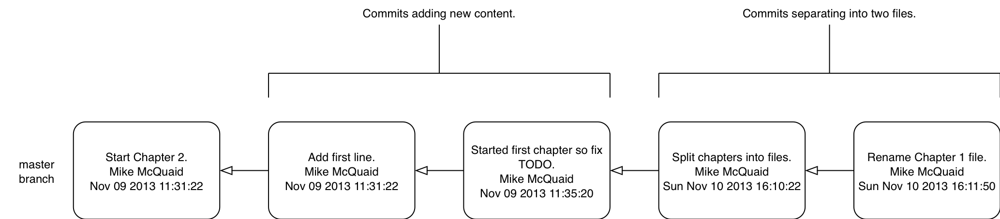

Sometimes this linear approach is not enough for software projects. Sometimes
you may need to make new commits which are not yet ready for public
consumption. This requires _branches_.

Branching allows two independent tracks through history to be created and
committed to without either modifying the other. Programmers can happily commit
to their independent branch without the fear of disrupting the work of another
branch. This means that they can, for example, commit broken or incomplete
features rather than having to wait for others to be ready for their commits.
It also means they can be isolated from changes made by others until they are
ready to integrate them into their branch. Figure 2.10 shows the same commits
as Figure 2.9 if they were split between two branches instead for isolation.

.Committing to multiple branches
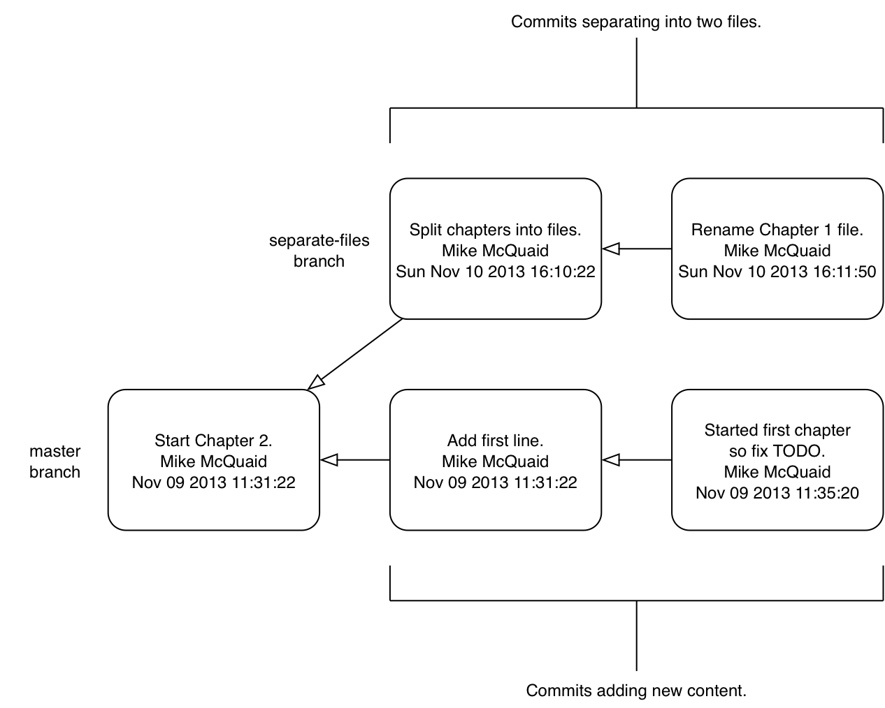

When a branch is created and new commits are made that branch advances forward
to include the new commits. In Git a branch is actually no more than a pointer
to a particular commit. This is unlike other version control systems such
as Subversion in which branches are just a subdirectory of the repository.

The branch is pointed to a new commit when a new commit is made on that branch.
A _tag_ is quite similar to a branch but points to a single commit and remains
pointing to the same commit even when new commits are made. Typically tags are
used for annotating commits; for example, when you release version 1.0 of your
software you may tag the commit used to built the 1.0 release with a "1.0" tag.
This means you can come back to it in future, rebuild that release or check how
certain things worked without fear that it will be somehow changed
automatically.

Branching allows two independent tracks of development to occur at once. In
Figure 2.10, the `separate-files branch` was used to separate the content from
a single file and split it into two new files. This allowed refactoring of the
book structure to be done in the `separate-files` branch while the default
branch (known as `master` in Git) could be used to create more content. In
version control systems like Git where creating a branch is a quick, local
operation branches may be used for every independent change.

Some programmers will create new branches whenever they work on a new bug fix
or feature and then integrate these branches at a later point; perhaps after
requesting review of their changes from others. This means even for programmers
working without a team it can be useful to have multiple branches in use at any
one point. For example, you may be working on a new feature but realize that a
critical error in your application needs fixed immediately. You could quickly
create a new branch based off the version used by customers, fix the error and
switch branch back to the branch you had been committing the new feature to.

==== Problem
You wish to create a new local branch named `chapter-two` from the current
(`master`) branch.

==== Solution
1.  Change directory to the Git repository e.g. `cd
    /Users/mike/GitInPracticeRedux/`.
2.  Run `git branch chapter-two`. There will be no output.

You can verify the branch was created by running `git branch` which should have
the following output:

.List branches
----
# git branch

  chapter-two <1>
* master <2>
----
<1> new branch
<2> current branch

From the branch output:

* "new branch (1)" was created with the expected name.
* "current branch <2>" is indicated by the `*` prefix which shows you are still
  on the master branch as before. `git branch` creates a new branch but does
  not change to it.

You have created a new local branch named `chapter-two` which currently points
to the same commit as `master`.

==== Discussion
`git branch` can take a second argument with the _start point_ for the branch.
This defaults to the current branch you are on e.g. `git branch chapter-two` is
the equivalent of `git branch chapter-two master` if you're already on the
master branch. This can be used to create branches from previous commits which
is sometimes useful if e.g. the current `master` branch state has broken unit
tests that you need to be working.

`git branch` can take a `--set-upstream` flag which, combined with a start
point, will set the upstream for the branch (similarly to `git push
--set-upstream` but without pushing anything remotely yet).

.Local repository after `git branch chapter-two`
image::screenshots/02-GitBranch.png[]

You can see from Figure 2.11 that there is a new branch label for the
`chapter-two` branch. In the GitX GUI the label colors indicate:

* orange: the currently checked-out local branch
* green: a non-checked-out local branch
* blue: a remote branch

.Branch pointers
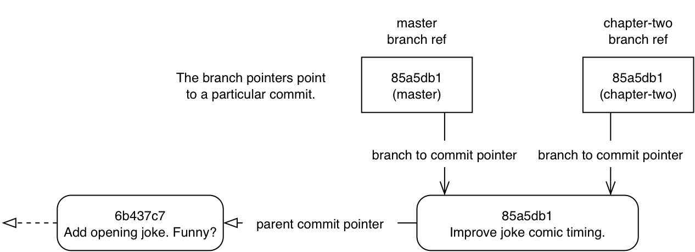

Figure 2.12 shows how these two branch pointers point to the same commit.

You've seen `git branch` creates a local branch it does not change to it. To do
that requires using `git checkout`.

.Can branches be named anything?
NOTE: Branches cannot have two consecutive dots (`..`) anywhere in their name
so `chapter..two` would be an invalid branch name and `git branch` will refuse
to create it. This particular case is due to the special meaning of `..` for a
commit range for the `git diff` command (which we saw used in Chapter 1).

.What names should I use for branches?
NOTE: Name branches according to their contents. For example, the `chapter-two`
branch we've created here describes that the commits in this branch will be
referencing the second chapter. I recommend a format of describing the branch's
purpose in multiple words separated by hyphens. For example, a branch that is
performing cleanup on the test suite should be named `test-suite-cleanup`.

=== Checking out a local branch: git checkout
==== Background
Once you've created a local branch you will want to check out the contents of
another branch into Git's working directory. The state of all the current files
in the working directory will be replaced with the new state based on the
revision that the new branch is currently pointing to.

==== Problem
You wish to change to a local branch named `chapter-two` from the current (`master`) branch.

==== Solution
1.  Change directory to the Git repository e.g. `cd
    /Users/mike/GitInPracticeRedux/`.
2.  Run `git checkout chapter-two`.
    The output should be `Switched to branch 'chapter-two'`.

You've checked out the local branch named `chapter-two` and moved from the
`master` branch.

==== Discussion
.Git add/commit/checkout workflow
image::diagrams/01-Workflow.png[]

.Why do Subversion and Git use `checkout` to mean different things?
NOTE: As mentioned earlier some other version control systems (e.g. Subversion)
use `checkout` to refer to the initial download from a remote repository but
`git checkout` is used here to change branches. This may be slightly confusing
until we look at Git's full remote workflow. Figure 2.13 shows Git's local
workflow again. Under closer examination `git checkout` and `svn checkout`
behave similarly; both check out the contents of a version control repository
into the working directory but Subversion's repository is remote and Git's
repository is local. In this case `git checkout` is requesting the checkout of
a particular branch so the current state of that branch is checked out into the
working directory.

.HEAD pointer with multiple branches
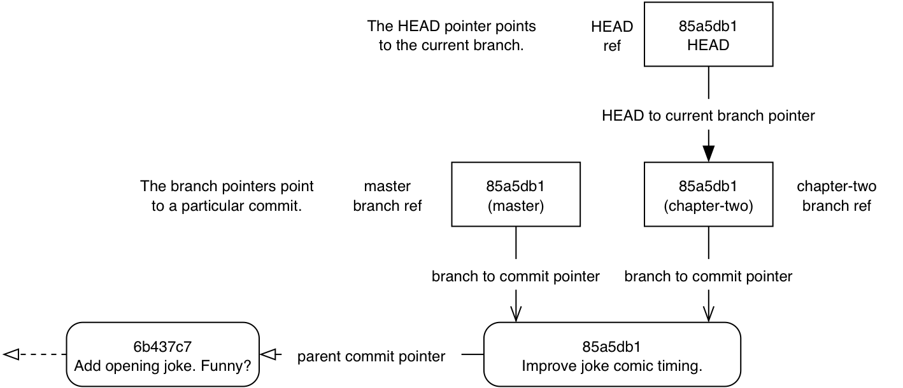

Afterwards the HEAD pointer (seen in Figure 2.14) is updated to point to the
current, `chapter-two` branch pointer which in turn points to the top commit of
that branch. The HEAD pointer moved from the `master` to the `chapter-two`
branch when you ran `git checkout chapter-two`; setting `chapter-two` to be the
current branch.

.Will `git checkout` overwrite any uncommitted changes?
NOTE: Make sure you've committed any changes on the current branch before
checking out a new branch. If you do not do this `git checkout` will refuse to
check out the new branch if there are changes in that branch to a file with
uncommitted changes. If you wish to overwrite these uncommitted changes anyway
you can force this with `git checkout --force`.

=== Pushing a local branch remotely
==== Background
Now that you've created a new branch and checked it out it would be useful to
push any new commits made to the remote repository. To do this requires using
`git push` again.

==== Problem
You wish to push the changes from the local `chapter-two` branch to create the
remote branch `chapter-two` on GitHub.

==== Solution
1.  Change directory to the Git repository e.g. `cd
    /Users/mike/GitInPracticeRedux/`.
2.  Run `git checkout chapter-two` to ensure you are on the `chapter-two`
    branch.
3.  Run `git push --set-upstream origin chapter-two`.
    The output should resemble:

.Push and set upstream branch
----
git push --set-upstream origin chapter-two

Total 0 (delta 0), reused 0 (delta 0) <1>
To https://github.com/GitInPractice/GitInPracticeRedux.git
 * [new branch]      chapter-two -> chapter-two <2>
Branch chapter-two set up to track remote branch
chapter-two from origin. <3>
----
<1> object preparation/transmission
<2> local/remote branch
<3> set tracking branch

The push output is much the same as the previous `git push` run:

* "object preparation/transmission (1)" (although still ignorable) shows that
  no new objects were sent. The reason for this is that the `chapter-two`
  branch still points to the same commit as the `master` branch; it's
  effectively a different name (or, more accurately, ref) pointing to the same
  commit. As a result there have been no more commit objects created and
  therefore no more were sent.
* "local/remote branch (2)" has `chapter-two` as the branch name.
* "set tracking branch (3)" has `chapter-two` as the branch name.

You have pushed your local `chapter-two` branch and created a new remote branch
named `chapter-two` on the remote repository.

==== Discussion
Remember that now the local `chapter-two` branch is tracking the remote
`chapter-two` branch so any future `git pull` or `git push` on the
`chapter-two` branch will use the `origin` remote's `chapter-two` branch.

.Local repository after `git push --set-upstream origin chapter-two`
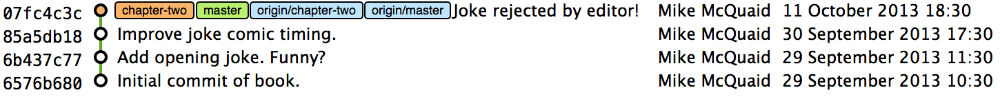

As you'll hopefully have anticipated Figure 2.15 shows the addition of another
remote branch named `origin/chapter-two`.

=== Merging an existing branch into the current branch: git merge
==== Background
At some point we have a branch that we're done with and we want to bring all
the commits made on it into another branch. This process is known as a `merge`.

.Merging a branch into master
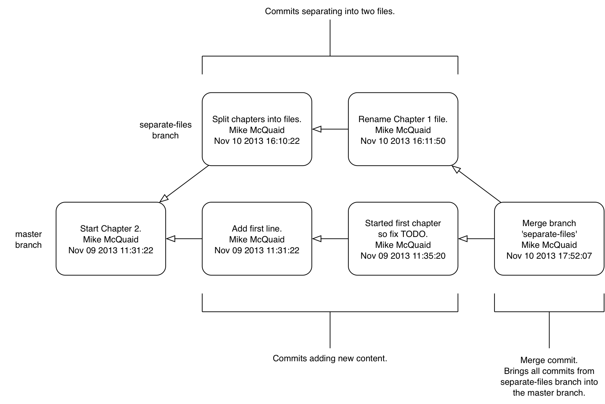

When a merge is requested all the commits from another branch are pulled into
the current branch. Those commits then become part of the history of the
branch. Please note from Figure 2.16 the commit in which the merge is made has
two parents commits rather than one; it is joining together two separate paths
through the history back into a single one. After a merge you may decide to
keep the existing branch around to add more commits to it and perhaps merge
again at a later point (only the new commits will need to be merged next time).
Alternatively, you may delete the branch and make future commits on the Git's
default `master` branch and create another branch when needed in the future.

==== Problem
You wish to make a commit on the local branch named `chapter-two` and merge this into into the `master` branch.

==== Solution
1.  Change directory to the Git repository e.g. `cd
    /Users/mike/GitInPracticeRedux/`.
2.  Run `git checkout chapter-two` to ensure you are on the `chapter-two`
    branch.
3.  Modify the contents of `GitInPractice.asciidoc` and run `git add GitInPractice.asciidoc`.
4.  Run `git commit --message 'Start Chapter 2.'`.
5.  Run `git checkout master`.
6.  Run `git merge chapter-two`.
    The output should resemble:

.Merge branch
----
# git merge chapter-two

Updating 07fc4c3..ac14a50 <1>
Fast-forward <2>
 GitInPractice.asciidoc | 2 ++
 1 file changed, 2 insertions(+) <3>
----
<1> local branch update
<2> merge type
<3> diff summary

The output may seem familiar from the `git pull` output. Remember this is
because `git pull` actually does a `git fetch && git merge`.

* "local branch update (1)" shows the changes that have been merged into the
  local `master` branch. Note that the SHA-1 has been updated from the previous
  `master` SHA-1 (`07fc4c3`) to the current `chapter-two` SHA-1 (`ac14a50`).
* "merge type (2)" was a _fast-forward merge_. This means that no merge commit
  (a commit with multiple parents) was needed so none was made. The
  `chapter-two` commits were made on top of the `master` branch but no more
  commits had been added to the `master` branch before the merge was made. In
  Git's typical language: the merged commit (tip of the `chapter-two` branch)
  is a descendent of the current commit (tip of the `master` branch). If there
  had been another commit on the `master` branch before merging then this merge
  would have created a merge commit. If there had been conflicts between the
  changes made in both branches that could not automatically be resolved then a
  merge conflict would be created and need to be resolved.
* "diff summary <3>" shows a summary of the changes that have been merged into
  your `master` branch from the `chapter-two` branch.

You have merged the `chapter-two` branch into the `master` branch.

==== Discussion
This brings the commit that was made in the `chapter-two` branch into the `master` branch.

.Local repository after `git merge chapter-two`
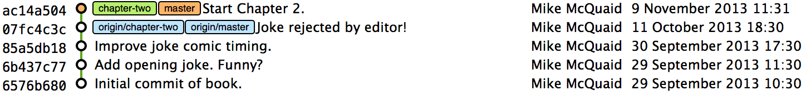

You can see from Figure 2.17 that now the `chapter-two` and `master` branches
point to the same commit once more.

===== Merge conflicts
So far merges may have sounded too good to be true; you can work on multiple
things in parallel and combine them at any later point in any order. Not so
fast my merge-happy friend; I haven't told you about merge conflicts yet.

A _merge conflict_ occurs when both branches involved in the merge have changed
the same part of the same file. Git will try and automatically resolve these
conflicts but sometimes is unable to do so without human intervention. This
case produces a merge conflict.

.Merge conflict resolution with Git
----
= Git In Practice <1>
<<<<<<< HEAD <2>
== Chapter 1 <3>
It is a truth universally acknowledged, that a single person in
possession of good source code, must be in want of a version control
system.

== Chapter 2
// TODO: write second chapter.
======= <4>
>>>>>>> separate-files <5>
----
<1> unchanged line
<2> previous changes marker
<3> previous line version
<4> changes separator
<5> new changes marker

When a merge conflict occurs the version control system will go through any
files that have conflicts and insert something similar to the above markers.
These markers indicate the versions of the file on each branch.

* "unchanged line (1)" is provided only for context in this example
* "previous changes marker (2)" starts the section containing the lines from
  the previous commit (referenced by `HEAD` here).
* "previous line version (3)" shows a line from the previous commit.
* "changes separator (4)" starts the section containing the lines from the new
  branch.
* "new changes (5)" marker ends the section containing the lines from the new
  branch (referenced by `separate-files`; the name of the branch being merged
  in).

.How can conflict markers be found quickly?
NOTE: When searching a large file for the merge conflict markers you should
enter `<<<<` into your text editor's find tool to quickly locate them.

The person performing the merge will need to manually edit the file to produce
the correctly merged output, save it and mark the commit as resolved. Sometimes
resolving the conflict will involve picking all the lines of a single version;
either the previous version's lines or the new branch's lines. Other times
resolving the conflict will involve combining some lines from the previous
version and some lines from the new branch.In cases where other files have been
edited (like this example) it may also involve putting some of these lines into
other files.

When conflicts have been resolved a _merge commit_ can be made. This will store
the two parent commits and the conflicts that were resolved so they can be
inspected in the future. Unfortunately sometimes people will pick the wrong
option or merge incorrectly so it's good to be able to later see what conflicts
they had to resolve.

===== Rebasing
A _rebase_ is a method of history rewriting in Git that is similar to a merge.
A rebase involves changing the parent of a commit to point to another.

.Rebasing a branch on top of master
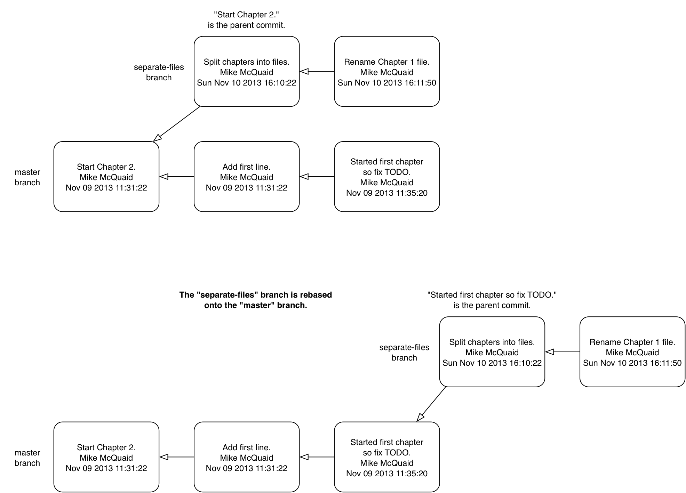

Figure 2.20 shows a rebase of the `seperate-files` branch onto the `master`
branch. The rebase operation has changed the parent of the first commit in the
`separate-files` branch to be the last commit in the `master` branch. This
means all the content changes from the `master` branch are now included in the
`separate-files branch` and any conflicts were manually resolved but were not
stored (as they would be in a merge conflict).

We'll cover rebasing in more detail later in Chapter 6. All that's necessary to
remember for now is that it's a different approach to a merge that can be used
for a similar outcome (pulling changes from one branch into another).

=== Deleting a remote branch
==== Background
Now that the `chapter-two` branch has been merged into the `master` branch the
new commit that made in the `chapter-two` branch is now in the `master` branch.
This means that we can push the `master` branch to push all the `chapter-two`
changes to `origin/master`. Once this is done (and assuming we don't want to
make any more commits to the `chapter-two` branch) then `origin/chapter-two`
can be safely deleted.

.Why delete the branches?
NOTE: Sometimes branches in version control systems are kept around for a long
time and sometimes they are very temporary. A long-running branch may be one
that represents the version deployed to a particular server. A short-running
branch may be a single bug fix or feature which has been completed. In Git once
a branch has been merged the history of the branch is still visible in the
history and the branch can be safely deleted as a merged branch is, at that
point, just a ref to an existing commit in the history of the branch it was
merged into.

==== Problem
You wish to push the current `master` branch and delete the branch named
`chapter-two` on the remote `origin`.

==== Solution
1.  Change directory to the Git repository e.g. `cd
    /Users/mike/GitInPracticeRedux/`.
2.  Run `git checkout master` to ensure you are on the `master`
    branch.
3.  Run `git push`.
4.  Run `git push --delete origin chapter-two`.
    The output should resemble:

.Delete remote branch
----
# git push origin :chapter-two

To https://github.com/GitInPractice/GitInPracticeRedux.git <1>
 - [deleted]         chapter-two <2>
----
<1> remote URL
<2> deleted branch

From the deletion output:

* "remote URL (1)" shows the remote repository that the branch was deleted from.
* "deleted branch (2)" shows the name of the branch (`chapter-two`) that has
  been deleted from the remote repository.

You have deleted the `chapter-two` branch from the remote repository.

==== Discussion
.Local repository after `git push origin :chapter-two`
image::screenshots/02-GitXPushDelete.png[]

In Figure 2.19 you can see that the `origin/master` has been updated to the
same commit as `master` and that `origin/chapter-two` has now been removed.

=== Deleting the current local branch after merging
==== Background
The `chapter-two` branch has all its commits merged into the `master` branch
and the remote branch deleted so the local branch can now be deleted too.

==== Problem
You wish to delete the local branch named `chapter-two`.

==== Solution
1.  Change directory to the Git repository e.g. `cd
    /Users/mike/GitInPracticeRedux/`.
2.  Run `git checkout master` to ensure you are on the `master`
    branch.
3.  Run `git branch --delete chapter-two`.
    The output should be `Deleted branch chapter-two (was ac14a50).`

You've deleted the `chapter-two` branch from the local repository.

==== Discussion
.Local repository after `git branch --delete chapter-two`
image::screenshots/02-GitXBranchDelete.png[]

Figure 2.18 shows the final state with all evidence of the `chapter-two` branch
now removed (other than the commit message).

.Why delete the remote branch before the local branch?
NOTE: We had merged all the `chapter-two` changes into the `master` branch and
pushed this to `origin/master`. As a result the `chapter-two` and
`origin/chapter-two` branches are no longer needed. However, Git will refuse to
delete a local branch with `git branch --delete` if it has not been merged into
the current branch or its changes have not been pushed to its tracking branch
(`origin/chapter-two` in this case). Deleting `origin/chapter-two` first means
that the local `chapter-two` branch can be deleted by `git branch --delete`
without Git complaining that `chapter-two` has changes that need pushed to
`origin/chapter-two`.

=== Summary
In this chapter you hopefully learned:

* How to push your local repository to a remote repository
* How to clone an existing remote repository
* How to push and pull changes to/from a remote repository
* That fetching allows obtaining changes without modifying local branches
* That pulling is the equivalent to fetching then merging
* How to checkout local and remote branches
* How to merge branches and then delete from the local and remote repository

Now let's learn how to perform some more advanced interactions with files
inside the Git working directory.
