== Introduction to remote Git
In this chapter you will learn how to retrieve and share changes with other users' Git repositories by learning the following topics:

* How to create a GitHub repository and download it
* How to send/receive changes from a remote repository
* How to create and receive branches
* How to merging commits from one branch to another

As you learned in Chapter 2 it's possible to work entirely with Git as a local version control system and never share changes with others. Usually, however, if you are using a version control system you will want to share changes with others; from simply sending files to a remote server for backup to collaborating as part of a large development team. Team collaboration will also require knowledge of how to create and interact with branches for working on different features in parallel. Let's start by creating a GitHub account to share your work.

// Chapter needs more talking rather than problem/techniques. Teach rather than state. Walk through the workflow diagram through the chapter. State what we are going to do, why and look back at what we have done. Intro, explain and summarise more for each section. Annotate workflow diagram more and more as you go through the chapter. Try and start with workflow diagram from the end of chapter 2. Perhaps use more callout diagrams rather than hedgehogs. Needs more cuddly analogies. When reusing diagrams grey-out irrelevant bits to show they've been covered already (and do that for Chapter 1/2?).

.TODO
NOTE: Add new GitX screenshots for every change. Discuss with Dan best approach for consistent repository that's publicly accessible and backport to Chapter 1 and 2.

=== Creating a GitHub repository
GitHub is a website that provides Git hosting. You can create free accounts for public repositories where everyone can see your code and commits. Typically these are used by open-source projects but it will also prove useful for your learning and experimentation. For private projects GitHub offers paid accounts.

As mentioned in Chapter 2 there are various free and paid alternatives to GitHub. I've picked GitHub to walkthrough because, at the time of writing, it is the most popular hosted version control system for open-source projects and is probably the most popular Git hosting provider. Learning to use GitHub will bring immediate benefits in terms of facilitating open-source access and contributions.

==== Signing up for a GitHub account
Let's sign up for a new GitHub account. Please browse to https://github.com/join where you should see something like Figure 3.1:

.Join GitHub form
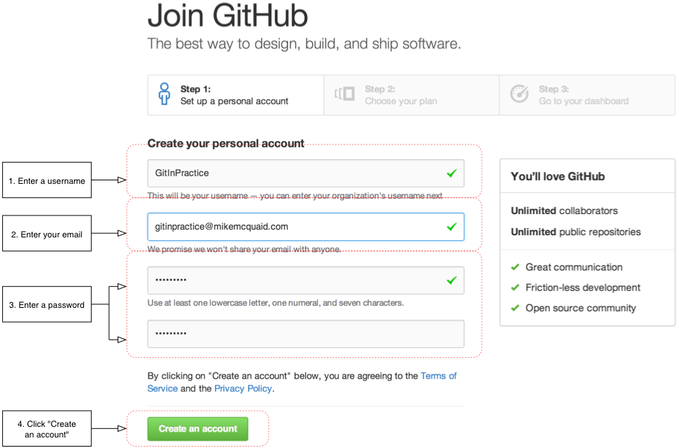

This form allows you to create a new GitHub account which will allow you to access the service and create new repositories. Enter your username, email and password and click the create button to advance to the next screen.

.Choose GitHub plan
image::diagrams/03-GitHubPlan.png[]

This form allows you to select your GitHub payment plan. The only differences between plans are the number of private repositories you can create. Private repositories mean that none of your commits or files committed to the repository can accessed by others without your explicit approval. In this book you will never have to commit anything private to a repository so you do not need to choose a paid plan. After you have selected a plan click the finish button to advance to the next screen.

You've created a GitHub account and should see the GitHub dashboard. The next step is to create a new repository.

==== Creating a new repository on GitHub
.Dashboard buttons to create a new GitHub repository
image::diagrams/03-CreateNewGitHubRepositoryButton.png[]

After signing up for your new GitHub account you should see your dashboard. From the dashboard there are two buttons you can click to create a new GitHub repository. Click either of them to advance to the next screen.

.Create a new GitHub repository
image::diagrams/03-CreateNewGitHubRepository.png[]

Creating a new repository requires you to pick a name and optionally a description. You may also choose for the repository to be private which requires purchasing a paid GitHub plan. After entering the repository details click the create button to advance to the next screen.

.A new GitHub repository
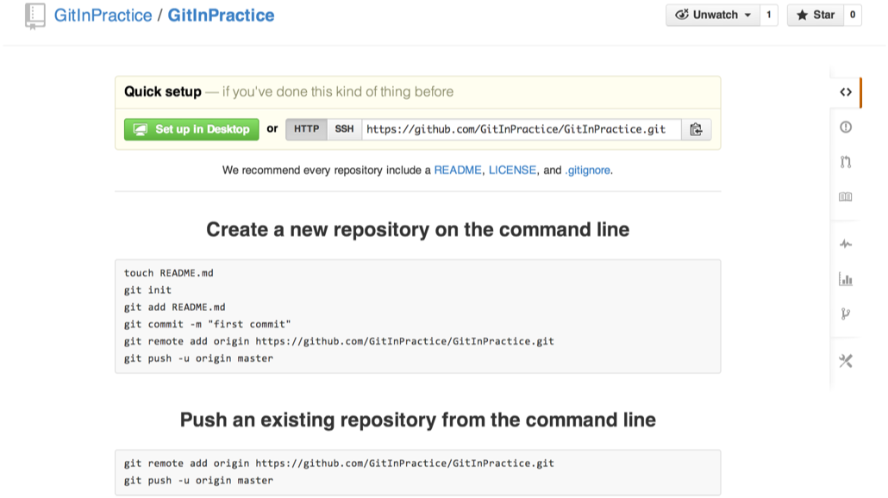

You've created a GitHub repository. Let's get this repository onto your local machine.

=== Remote Repositories
As discussed in Chapter 1 and 2 Git is a distributed version control system so any repository you have on your machine is a local repository. It can be committed to and the history queried without requiring a network connection to other repositories on other machines. If your local repository needs to send or receive data to a repository on another machine it will need to add a _remote repository_.

Now that you've created a local repository on your machine and a remote repository on GitHub let's connect the two together.

==== git remote add to add a new remote repository
The `git remote` command is used to perform various actions around remote repositories (also known as just _remotes_). The first action you're concerned with is adding our remote repository to our previous local repository so you'll need to use the `git remote add` subcommand.

You can have multiple remote repositories connected to your local repository so the remote repositories are named. Typically if you have a single remote repository it will be named `origin`. This will be explained more in section 4.2.3.

To add the new GitInPractice remote repository to your current repository:

1.  Change to the directory containing your repository i.e. `cd /Users/mike/Documents/GitInPractice/`
2.  Run `git remote add origin http://github.com/GitInPractice/GitInPractice.git`

You've added a remote named `origin` that points to the remote GitInPractice repository on GitHub. You can now send and receive changes from this repository but nothing has been sent yet; the new remote is effectively just a named URL for the remote repository location. If you recall when we created the GitInPractice GitHub repository it was empty and told us to push changes to it.

==== git push to push changes to another repository
The `git push` command is used to send changes made in the local repository to the remote repository.

To push the changes from the local GitInPractice repository to the origin GitInPractice remote repository on GitHub:

1.  Change to the directory containing your repository i.e. `cd /Users/mike/Documents/GitInPractice/`
2.  Run `git push --set-upstream origin master`
3.  Enter your GitHub username and password if requested (this will only happen if GitInPractice.git is a private repository)

You've pushed your changes to the remote repository.

.Output of `git push --set-upstream origin master`
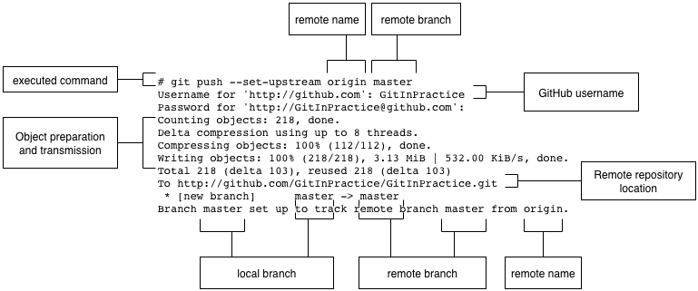
// tell people not to worry about object preparation

The `--set-upstream` option is telling Git that we want future runs of `git push` without any arguments to push our local `master` branch to the remote `master` branch on the `origin` remote. In this case we would say that the `master` branch on `origin` (often abbreviated as `origin/master`) would be the _tracking branch_ for our local `master branch`.

Don't worry about the "Object preparation and transmission" section in this or future figures; it is simply Git communicating details on how the files are being sent to the remote repository and isn't worth understanding beyond basic progress feedback.

This was the first push to a repository so the `master` branch was created on the remote repository. Future pushes will only need to send the objects that have changed between the previous and new pushes.

.GitHub repository after `git push`
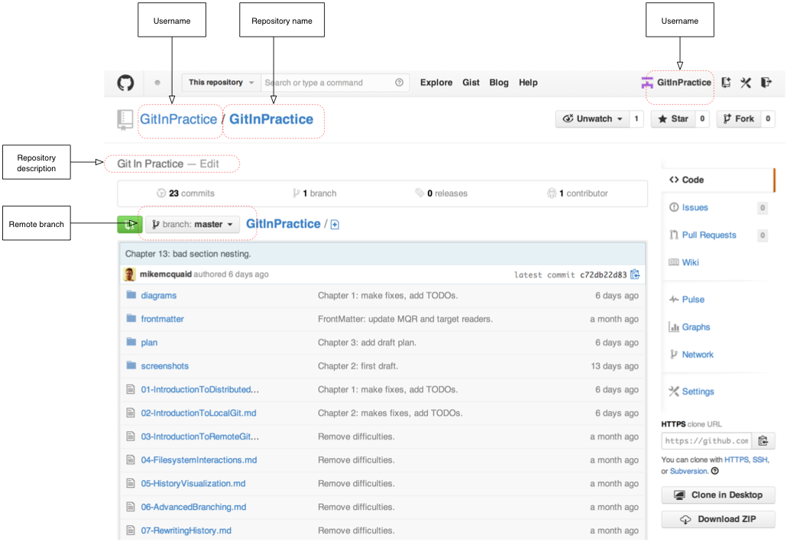

If you return to the remote repository on GitHub you will now see that it has been updated to the `master` branch of our local repository. The latest commit there matches our current latest commit. To update this in future you would run `git push` again to push any local changes to GitHub.

==== Cloning a remote/GitHub repository onto your local machine
It is useful to learn how to create a new Git repository locally and push it to GitHub. You will usually be downloading an existing repository to use as your local repository. This process of creating a new local repository from an existing remote repository is known as _cloning_ a repository.

Some other version control systems (such as Subversion) will use the terminology of _checking out_ a repository. The reasoning for this is that Subversion is a centralized version control system so when you download a repository locally you are only actually downloading the latest revision from the repository. With Git it is known as _cloning_ because you are making a complete copy of that repository by downloading all commits, branches, tags; the complete history of the repository onto your local machine.

To clone a new local GitInPractice repository from the GitInPractice remote repository on GitHub:

1.  Change to the directory where you want the new GitInPractice repository to be created i.e. `cd /Users/mike/Documents` to create the new local repository in `/Users/mike/Documents/GitInPractice`
2.  Run `git clone http://github.com/GitInPractice/GitInPractice.git`
3.  Enter your GitHub username and password if requested (this will only happen if GitInPractice.git is a private repository)

You've cloned the GitInPractice remote repository and created a new local repository containing all its commits in `/Users/mike/Documents/GitInPractice`.

.Output of `git clone http://github.com/GitInPractice/GitInPractice.git`
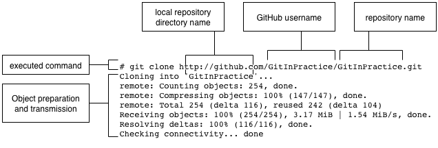

Cloning a repository has also created a new remote called `origin`. `origin` is the default remote and references the repository that the clone originated from which is http://github.com/GitInPractice/GitInPractice.git in this case.

==== git pull to obtain changes from another repository
Now that you know how to clone the repository contents to create a repository on another computer, make new commits and push them back to the repository let's learn how to _pull_ changes others may have pushed to the remote repository.

To pull new commits into the current branch on the local GitInPractice repository from the GitInPractice remote repository on GitHub:

1.  Change to the directory containing your repository i.e. `cd /Users/mike/Documents/GitInPractice/`
2.  Run `git pull`
3.  Enter your GitHub username and password if requested (this will only happen if GitInPractice.git is a private repository)

You've pulled the new commits from the GitInPractice remote repository into your local repository and Git has merged them into your `master` branch.

.Output of `git pull`
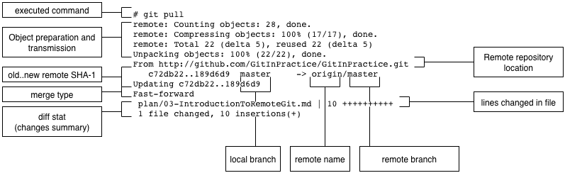
// This should be a callout instead

`git pull` displays some useful information; the current and previous known SHA-1 state of the `master` branch on the remote `origin`, the current and previous known state of your local `master` branch (in this case they are the same but may not be depending on the merge type performed) and the diff stat changes summary displaying how many lines have changed across various files.

After `git pull` has downloaded the changes from the other repository it merges the changes from the tracking branch into the current branch. In this case your `master` branch had the changes from the `master` branch on the remote `origin` merged in. Fast-forward merges will be explained in section 4.4.1.

It may be confusing that a merge has happened here. Didn't you just ask for the updates from that branch? You haven't created any other branches so why has a merge happened? In Git all remote branches (which includes the default `master` branch) are linked to your local branches only so much as that if they are being tracked that is where changes are pushed to and pulled from. The actual contents of the remote branches will always match the last seen state from the remote repository. If you want to just update the remote branches without merging to your local branches then you will use `git fetch`.

==== git fetch to get changes from another repository without modifying local branches
Remember that `git pull` does two actions: fetches the changes from a remote repository and merges them into the current branch. Sometimes you may wish to download the new commits from the remote repository without merging them into your current branch (or without merging them yet). To do this you can use the `git fetch` command. `git fetch` performs the fetching action of downloading the new commits but skips the merge step (which you can manually perform later).

To fetch new commits to the local GitInPractice repository from the GitInPractice remote repository on GitHub:

1.  Change to the directory containing your repository i.e. `cd /Users/mike/Documents/GitInPractice/`
2.  Run `git fetch`
3.  Enter your GitHub username and password if requested (this will only happen if GitInPractice.git is a private repository)

You've fetched the new commits from the GitInPractice remote repository into your local repository but Git has not merged them into your `master` branch.

.Output of `git fetch`
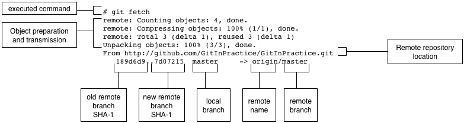
// Make this less threatening by using callouts and referencing git pull instead.

`git fetch` is effectively half of what `git pull` is doing. If your `master` branch is tracking the `master` branch on the remote `origin` then `git pull` is directly equivalent to running `git fetch && git merge origin/master`.

=== Branches
In Chapter 1 you learnt about _branches_ and their usefulness in version control systems. They allow working on two different tracks through history in parallel so you can make changes whilst currently ignoring changes that are made in another branch. Let's learn how to use branches with Git.

==== Create a new local branch from the current branch
.Branch pointers
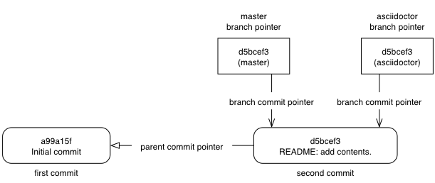

The `git branch` command is used to create new branches in Git. A branch in Git (unlike other version control systems like Subversion) is simply a pointer to a single commit. This pointer is updated as you make more commits on that branch.

.Branch naming restrictions
NOTE: Branches cannot have two consecutive dots (`..`) anywhere in their name so
`asciidoc..tor` would be an invalid branch name and `git branch` will refuse
to create it. This particular case is due to the special meaning of `..` for the `git diff` command which we saw in Chapter 2.

.Before `git branch asciidoctor`
image::screenshots/03-GitBranchBefore.png[]

To create a new local branch named `asciidoctor` from the current (`master`) branch:

1.  Change to the directory containing your repository i.e. `cd /Users/mike/Documents/GitInPractice/`
2.  Run `git branch asciidoctor`

You've created a new local branch named `asciidoctor` which currently points to the same commit as `master`.

.After `git branch asciidoctor`
image::screenshots/03-GitBranchAfter.png[]

When `git branch` creates a local branch it does not change to it. To do
that requires using `git checkout`.

==== Checkout a local branch
The `git checkout` command is used to change branches by checking out the contents of branches from the local repository into Git's working directory.

To change to a local branch named `asciidoctor` from the current (`master`) branch:

1.  Change to the directory containing your repository i.e. `cd /Users/mike/Documents/GitInPractice/`
2.  Run `git checkout asciidoctor`

You've checked out the local branch named `asciidoctor` from the `master` branch.

.`git checkout` with uncommitted changes
NOTE: Make sure you've committed any changes on the current branch before checking out a new branch. If you do not do this `git checkout` will refuse to check out the new branch.

.After `git checkout asciidoctor`
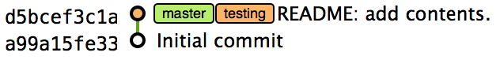

As mentioned earlier some other version control systems (e.g. Subversion) use
`checkout` to refer to the initial download from a remote repository but `git
checkout` is used here to change branches. This may be slightly confusing until we look at Git's full remote workflow.

.Git remote workflow
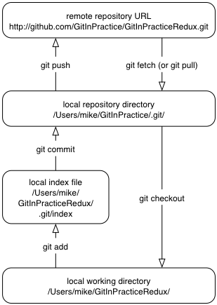

Remember `git clone` downloads the entire history of a repository). Under
closer examination `git checkout` and `svn checkout` behave similarly; both
check out the contents of a version control repository into the working
directory but Subversion's repository is remote and Git's repository is local.
In this case `git checkout` is requesting the checkout of a particular branch
so the current state of that branch is checked out into the working directory.
Afterwards the HEAD pointer is updated to point to the top commit of the branch
(which will be the same commit pointed to by the branch pointer).

.HEAD pointer
image::diagrams/HEAD.png[]

==== Pushing a local branch remotely
Now that you've created a new branch and checked it out it would be useful to push any new commits made to the remote repository. To do this requires using `git push` again.

To push the changes from the local `asciidoctor` branch to create the remote branch `asciidoctor` on GitHub:

1.  Change to the directory containing your repository i.e. `cd /Users/mike/Documents/GitInPractice/`
2.  Run `git checkout asciidoctor`
3.  Run `git push --set-upstream origin ascii`
4.  Enter your GitHub username and password if requested (this will only happen if GitInPractice.git is a private repository)

You've pushed your local `asciidoctor` branch and created a new remote branch named `asciidoctor` on the remote repository. The local `asciidoctor` branch is now also tracking the remote `asciidoctor` branch so any future `git pull` or `git push` on the `asciidoctor` branch will receive or send changes to the `asciidoctor` remote branch on the remote `origin`.

==== Checkout a remote branch
If you want to checkout a new remote branch that has been created in a remote repository you will use the `git fetch` command to download all changes to all branches from the remote repository, the `git branch` command to create a new local branch from the remote branch and the `git checkout` command to checkout the new local branch.

To create a new local branch named `asciidoctor2` from the remote `asciidoctor` branch:

1.  Change to the directory containing your repository i.e. `cd /Users/mike/Documents/GitInPractice/`
2.  Run `git fetch`
3.  Run `git branch asciidoctor2 origin/asciidoctor`
4.  Run `git checkout asciidoctor2`

You've created a new local branch named `asciidoctor2` from the remote branch `asciidoctor` on the remote `origin`. You ran `git fetch` to ensure that the remote branch was up-to-date. The local `asciidoctor2` branch is now also tracking the remote `asciidoctor` branch so any future `git pull` or `git push` on the `asciidoctor2` branch will receive or send changes to the `asciidoctor` remote branch on the remote `origin`.

.After `git checkout asciidoctor2`
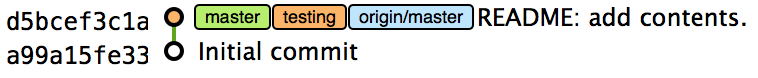

=== Merging
You've learnt how to create branches, push and pull them from remote repositories. This is useful for working on parallel tasks but at some point you'll want to merge work from one branch into another branch. In this section we will assume that we have finished the work on the `asciidoctor` branch so we want to merge it into the `master` branch, delete the local `asciidoctor` branch and delete the remote `asciidoctor` branch.

==== Merging an existing branch into the current branch
Once you've reached a state on a branch where work is ready to be merged into another branch you will use the `git merge` to do so.

To merge the local branch named `asciidoctor` into the `master` branch:

1.  Change to the directory containing your repository i.e. `cd /Users/mike/Documents/GitInPractice/`
2.  Run `git checkout master`
3.  Run `git merge asciidoctor`

You've merged the `asciidoctor` branch into the `master` branch. This brings all the commits that were made into the `master` branch.

.Output of `git merge asciidoctor`
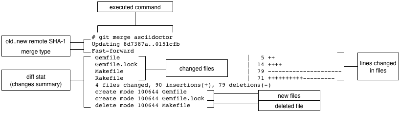

The merge type in this example was a _fast-forward merge_. This means that no merge commit (a commit with multiple parents) was needed so none was made. The `asciidoctor` commits were made on top of the `master` branch but no more commits had been added to the `master` branch before the merge was made. In Git's typical language: the merged commit (tip of the `asciidoctor` branch) is a descendent of the current commit (tip of the `master` branch). If there had been another commit on the `master` branch before merging then this merge would have created a merge commit. If there had been conflicts between the changes made in both branches that could not automatically be resolved then a merge conflict would be created and need to be resolved.

==== Deleting the current branch after merging
The `asciidoctor` branch has all its commits merged into the master branch and we do not want to make any more changes to it so it can be deleted.

To delete the local branch named `asciidoctor`:

1.  Change to the directory containing your repository i.e. `cd /Users/mike/Documents/GitInPractice/`
2.  Run `git checkout master`
3.  Run `git branch -d asciidoctor`

You've deleted the `asciidoctor` branch from the local repository. It still exists on the remote repository, however.

.Output of `git branch -d asciidoctor`
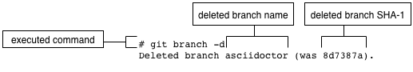

==== Deleting a remote branch
Remember that changes that occur on the local repository (including branch deletion) affect the remote repository without an explicit `push`, `pull` or `fetch`. In this case we want to delete the `asciidoctor` branch from the remote repository now it is merged and you have deleted it locally.

To delete the branch named `asciidoctor` on the remote `origin`:

1.  Change to the directory containing your repository i.e. `cd /Users/mike/Documents/GitInPractice/`
2.  Run `git push origin :asciidoctor`

You've deleted the `asciidoctor` branch from the remote repository.

.Output of `git push origin :asciidoctor`
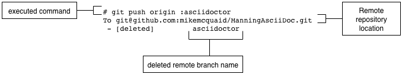

The syntax here is somewhat unintuitive and hard to remember. What the `:asciidoctor` is doing is better understood by examining a more verbose equivalent of a previous push command. Instead of `git push origin asciidoctor` to create the branch initially you could have used `git push origin asciidoctor:asciidoctor`. What this differing syntax is saying is to push the local branch `asciidoctor` (the first of the two) two the remote branch `asciidoctor` (the second of the two). The first, local `asciidoctor` branch reference can be omitted as it defaults to the current branch which you were already on. In the case of `git push origin :asciidoctor` you are telling Git to push no branch or SHA-1 to the remote branch `asciidoctor` which, as a branch is a pointer to a commit, is saying to remove the pointer and thus the branch.

=== Summary
In this chapter you hopefully learned:

* How to signup for an account on GitHub and when to use free/private plans
* How to create a new GitHub repository and push your local repository to it
* How to clone an existing remote repository
* How to push and pull changes to/from a remote repository
* That fetching allows obtaining changes without modifying local branches
* That pulling is the equivalent to fetching then merging
* How to checkout local and remote branches
* How to merge branches and then delete from the local and remote repository

Now let's learn how to perform some more advanced interactions with files inside the GitHub working directory.
