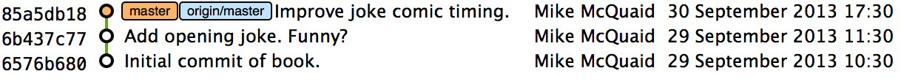
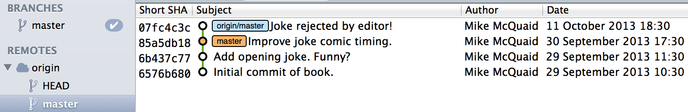
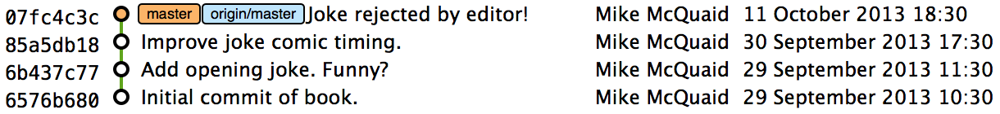
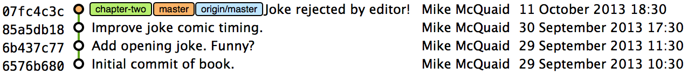
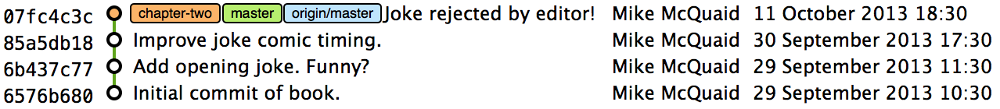
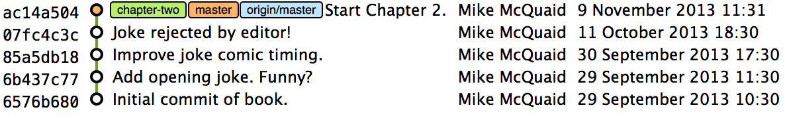
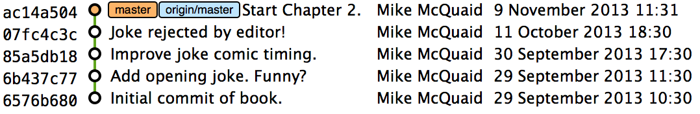

== Introduction to remote Git
In this chapter you will learn how to retrieve and share changes with other
users' Git repositories by learning the following topics:

* How to create a GitHub repository and download it
* How to send/receive changes from a remote repository
* How to create and receive branches
* How to merging commits from one branch to another

As you learned in Chapter 2 it's possible to work entirely with Git as a local
version control system and never share changes with others. Usually, however,
if you are using a version control system you will want to share changes with
others; from simply sending files to a remote server for backup to
collaborating as part of a large development team. Team collaboration will also
require knowledge of how to create and interact with branches for working on
different features in parallel. Let's create a remote repository on GitHub and
a GitHub account to be able to store changes on another computer.

// more experience flavoring

=== Creating a GitHub repository
GitHub is a website that provides Git repository hosting as well as issue
trackers, Git-backed wikis and a workflow to request a merge of the commits in
a branch (which is known as a _pull request_ and will be shown in Chapter 12).
You can create free accounts for public remote repositories which are where
everyone can see your code and commits. Typically these are used by open-source
projects but it will also prove useful for your learning and experimentation.
For private projects GitHub offers paid accounts.

As mentioned in Chapter 2 there are free and paid alternatives to GitHub. I've
picked GitHub to walkthrough because, at the time of writing, it is the most
popular hosted version control system for open-source projects and is probably
the most popular Git hosting provider. Learning to use GitHub will bring
immediate benefits in terms of facilitating open-source access and
contributions. While the GitHub UI may differ from the examples here or from
other Git repository hosts the Git commands used will remain the same.

==== Signing up for a GitHub account
Let's sign up for a new GitHub account. Please browse to
https://github.com/join where you should see something like Figure 3.1:

.Join GitHub form
image::diagrams/03-JoinGitHub.png[]

This form allows you to create a new GitHub account which will allow you to
access the service and create new repositories. The username you pick will
determine the URL of your GitHub account page and will be part of the URL for
every repository you create so choose it carefully. It can be renamed in future
but this may cause problems when updating existing local repositories without
manually changing the URL.

Enter your username, email and password and click the create button to advance
to the next screen.

.Choose GitHub plan
image::diagrams/03-GitHubPlan.png[]

The form in Figure 3.2 allows you to select your GitHub payment plan. The only
differences between plans are the number of private repositories you can
create. Private repositories mean that none of your commits or files committed
to the repository can accessed by others without your explicit approval. In
this book you will never have to commit anything private to a repository so you
do not need to choose a paid plan. After you have selected a plan click the
finish button to advance to the next screen.

You have created a GitHub account and the next step is to create a new
repository.

==== Creating a new repository on GitHub
.Dashboard buttons to create a new GitHub repository
image::diagrams/03-CreateNewGitHubRepositoryButton.png[]

After signing up for your new GitHub account you should see your dashboard
which should resemble Figure 3.3. From the dashboard there are two buttons you
can click to create a new GitHub repository. Click either of them to advance to
the next screen.

.Create a new GitHub repository
image::diagrams/03-CreateNewGitHubRepository.png[]

// Add annotation to not add README or gitignore
// Reference numbers in text (and for previous diagrams?)

Creating a new repository requires you to pick a name and optionally a
description as in Figure 3.4. This name will be combined with the username you
chose earlier to make the URL for your repository so choose it carefully. It
can be renamed in future but this may cause problems when updating existing
local repositories without manually changing the URL. You may also choose for
the repository to be private which requires purchasing a paid GitHub plan.
After entering the repository details click the create button to advance to the
next screen.

.A new GitHub repository
image::diagrams/03-NewGitHubRepository.png[]

You have created a GitHub repository and should see something similar to Figure
3.5. Now let's push the repository you created in Chapter 2 onto your local
machine.

=== Remote Repositories
As discussed in Chapter 1 and 2 Git is a distributed version control system so
any repository you have on your machine is a local repository. It can be
committed to and the history queried without requiring a network connection to
other repositories on other machines.

.Git add/commit/checkout workflow
image::diagrams/02-Workflow.png[]

Figure 3.6 shows the local Git workflow we used in Chapter 2. Files in the
local working directory are modified and added with `git add` to the index
staging area. The contents of the index staging area is committed with `git
commit` to form a new commit which is stored in the local repository directory.
Later, this repository can be queried to view the differences between versions
of files using `git diff`. In Section 3.3 you will also see how to use `git
checkout` to change to different local branches' versions of files.

.Git add/commit/push/pull/checkout workflow
image::diagrams/03-RemoteWorkflow.png[]

// grey out irrelevant bits, add more captions

Figure 3.7 shows the remote Git workflow we will look at in this Chapter. As in
the local workflow files are modified, added, committed and can be checked out.
However there are now two repositories: a local repository and _remote
repository_.

If your local repository needs to send or receive data to a repository on
another machine it will need to add a _remote repository_. A remote repository
is one that is typically stored on another computer and `git push` sends your
new commits to it and `git fetch` retrieves any new commits made by others from
it.

In Chapter 2 you created a local repository on your machine and in Section 3.1
you've created a remote repository on GitHub so now let's connect the two
together.

==== `git remote add` to add a new remote repository
The `git remote` command is used to perform actions around remote repositories
(which are also known as _remotes_). The first action you're concerned with is
adding a reference for your newly-created remote repository on GitHub in your
previous local repository so you can push and fetch commits. To do this you'll
use the `git remote add` subcommand.

.What is the default name for a remote?
NOTE: You can have multiple remote repositories connected to your local
repository so the remote repositories are named. Typically if you have a single
remote repository it will be named `origin`. This will be explained more in
section 4.2.3.

To add the new GitInPractice remote repository to your current repository:

1.  Change directory to the Git repository e.g. `cd
    /Users/mike/GitInPracticeRedux/`.
2.  Run `git remote add origin` with your repository URL appended. e.g. if your
    username is `GitInPractice` and repository is named `GitInPracticeRedux`
    run `git remote add origin
    https://github.com/GitInPractice/GitInPracticeRedux.git`. There will be no
    output.

You can verify this remote has been created successfully by running `git
remote --verbose`. The output should resemble:

.Remote repositories output
----
# git remote --verbose

origin  https://github.com/GitInPractice/GitInPracticeRedux.git (fetch) <1>
origin  https://github.com/GitInPractice/GitInPracticeRedux.git (push) <2>
----
<1> fetch URL
<2> push URL

The "fetch URL (1)" specifies the URL that `git fetch` uses to fetch new remote
commits. The "push URL (2)" specifies the URL that `git push` uses to send new
local commits.
// when will these differ?

You have added a remote named `origin` that points to the remote
`GitInPracticeRedux` repository belonging to the `GitInPractice` user on GitHub.

You can now send and receive changes from this remote. Nothing has been sent or
received yet; the new remote is effectively just a named URL pointing to the
remote repository location. If you recall when we created the GitHub remote
repository it was empty and told us to push changes to it so let's do that now.

==== `git push` to push changes to a remote repository
The `git push` command is used to send commits made in the local repository to
a remote. Only changes specifically requested will be sent and the Git (which
can operate over HTTP, SSH or it's own protocol (`git://`)) will ensure that
only the differences between the repositories are sent. As a result you can
push small changes from a large local repository to a large remote repository
very quickly as long as they have most commits in common.

Let's push the changes you made in our repository in Chapter 2 to the newly
created remote you made in the previous section.

To push the changes from the local `GitInPracticeRedux` repository to the
`origin` remote on GitHub:

1.  Change directory to the Git repository e.g. `cd
    /Users/mike/GitInPracticeRedux/`.
2.  Run `git push --set-upstream origin master` and enter your GitHub username
    and password when requested. The output should resemble:

.Push and set upstream branch output
----
# git push --set-upstream origin master

Username for 'https://github.com': GitInPractice <1>
Password for 'https://GitInPractice@github.com': <2>
Counting objects: 6, done. <3>
Delta compression using up to 8 threads.
Compressing objects: 100% (5/5), done.
Writing objects: 100% (6/6), 602 bytes | 0 bytes/s, done.
Total 6 (delta 0), reused 0 (delta 0)
To https://github.com/GitInPractice/GitInPracticeRedux.git <4>
 * [new branch]      master -> master <5>
Branch master set up to track remote branch master from origin. <6>
----
<1> username entry
<2> password entry
<3> object preparation/transmission
<4> remote URL
<5> local/remote branch
<6> set tracking branch

You have pushed your `master` branch's changes to the `origin` remote's
`master` branch.

The "username entry (1)" and "password entry (2)" are those for your GitHub
account. They may only be asked for the first time you push to a repository
depending on your operating system of choice (which may decide to save the
password for you). They are always required to `push` to repositories but are
only required for `fetch` when fetching from private repositories.

You can safely ignore the "object preparation/transmission (3)" section in this
or future figures; it is simply Git communicating details on how the files are
being sent to the remote repository and isn't worth understanding beyond basic
progress feedback.

The "remote URL (4)" matches the push URL from the `git remote --verbose`
output earlier. It is where Git has sent the local commits to.

The "local/remote branch (5)" line indicates that this was a new branch on the
remote. This is because the remote repository on GitHub was empty until we
pushed this; it had no commits and thus no `master` branch yet. This was
created by the `git push`. The `master -> master` refers to the local master
branch (the first of the two) has been pushed to the remote `master` branch (the
second of the two). This may seem redundant but it is shown as it is possible
(but ill-advised due to the obvious confusion it causes) to have local and
remote branches with different names. Don't worry about local or remote
branches for now as these will be covered in Section 3.3.

The "set tracking branch (6)" is shown because the `--set-upstream` option was
passed to `git push`. By passing this option you have is told Git that you want
the local `master` branch you have just pushed to _track_ the `origin` remote's
branch `master`. The `master` branch on the `origin` remote (which is often
abbreviated as `origin/master`) is now known as the _tracking branch_ (or
_upstream_) for your local `master` branch.

A _tracking branch_ is the default push or fetch location for a branch. This
means in future you could run `git push` with no arguments on this branch and
it will do the same thing as running `git push origin master` i.e. push the
current branch to the `origin` remote's `master` branch.

.Local repository after `git push`
image::screenshots/03-GitXPush.png[]

Figure 3.8 shows the state of the repository after the `git push`. There is one
addition since we last looked at it in Figure 2.10: the blue, `origin/master`
label. This is attached to the commit which matches the currently known state
of the `origin` remote's `master` branch.

.GitHub repository after `git push`
image::screenshots/03-GitHubPush.png[]

Figure 3.9 shows the remote repository on GitHub after the `git push`. The
latest commit SHA-1 there matches your current latest commit on the `master`
branch seen in Figure 3.8 (although they are different lengths; remember SHA-1s
can always be shortened as long as they remain unique). To update this in
future you would run `git push` again to push any local changes to GitHub.

==== Cloning a remote/GitHub repository onto your local machine
It is useful to learn how to create a new Git repository locally and push it to
GitHub. However, you will usually be downloading an existing repository to use
as your local repository. This process of creating a new local repository from
an existing remote repository is known as _cloning_ a repository.

Some other version control systems (such as Subversion) will use the
terminology of _checking out_ a repository. The reasoning for this is that
Subversion is a centralized version control system so when you download a
repository locally you are only actually downloading the latest revision from
the repository. With Git it is known as _cloning_ because you are making a
complete copy of that repository by downloading all commits, branches, tags;
the complete history of the repository onto your local machine.

As you just pushed the entire contents of the local repository to GitHub let's
remove the local repository and recreate it by cloning the repository on GitHub.

To remove the existing `GitInPracticeRedux` local repository and recreate it by
cloning from GitHub:

// Would you delete it first?
1.  Change to the directory where you want the new `GitInPracticeRedux`
    repository to be created e.g. `cd /Users/mike/` to create the new local
    repository in `/Users/mike/GitInPracticeRedux`.
2.  Run `rm -rf GitInPracticeRedux` to remove the existing
    `GitInPracticeRedux` repository.
3.  Run `git clone https://github.com/GitInPractice/GitInPracticeRedux.git`.
    The output should resemble:

.Cloning a remote repository output
----
# git clone https://github.com/GitInPractice/GitInPracticeRedux.git

Cloning into 'GitInPracticeRedux'... <1>
remote: Counting objects: 6, done. <2>
remote: Compressing objects: 100% (5/5), done.
remote: Total 6 (delta 0), reused 6 (delta 0)
Unpacking objects: 100% (6/6), done.
Checking connectivity... done
----
<1> destination directory
<2> object preparation/transmission

The "destination directory (1)" is the folder in which the new
`GitInPracticeRedux` local repository was created. The "object
preparation/transmission (2)" can be safely ignored again.
// but why 6 objects for one file?

You have cloned the `GitInPracticeRedux` remote repository and created a new
local repository containing all its commits in `/Users/mike/GitInPracticeRedux`.

// Reword so not a direct copy of what was said earlier
Cloning a repository has also created a new remote called `origin`. `origin` is
the default remote and references the repository that the clone originated from
(which is https://github.com/GitInPractice/GitInPracticeRedux.git in this case).

You can verify this remote has been created successfully by running `git
remote --verbose`. The output should resemble:

.Remote repositories output
----
# git remote --verbose

origin  https://github.com/GitInPractice/GitInPracticeRedux.git (fetch) <1>
origin  https://github.com/GitInPractice/GitInPracticeRedux.git (push) <2>
----
<1> fetch URL
<2> push URL

.Local repository after `git clone`
image::screenshots/03-GitXPush.png[]

Figure 3.10 shows the state of the repository after the `git push`. It is
identical to the state after the `git push` in Figure 3.8. This shows that the
clone was successful and the newly created local repository has the same
contents as the deleted old local repository.

Now let's learn how to pull new commits from the remote repository.

==== `git pull` to obtain changes from another repository
`git pull` downloads the new commits from another repository and merges the
remote branch into the current branch.

If you run `git pull` on the local repository you just see a message stating
`Already up-to-date.`. `git pull` in this case contacted the remote repository,
saw that there were no changes to be downloaded and let us know that it was up
to date. This is expected as this repository has been pushed to but not updated
since.

To test `git pull` let's create another clone of the same repository, make a
new commit and `git push` it. This will allow downloading new changes with `git
pull` on the original remote repository.
// a diagram here showing what we're going to do, perhaps.

To create another cloned, local repository and push a commit from it:

1.  Change to the directory where you want the new `GitInPracticeRedux`
    repository to be created e.g. `cd /Users/mike/` to create the new local
    repository in `/Users/mike/GitInPracticeReduxPushTest`.
2.  Run `git clone https://github.com/GitInPractice/GitInPracticeRedux.git
    GitInPracticeReduxPushTest` to clone into the `GitInPracticeReduxPushTest`
    directory.
3.  Change directory to the new Git repository e.g. `cd
    /Users/mike/GitInPracticeReduxPushTest/`.
4.  Modify the `GitInPractice.asciidoc` file.
5.  Run `git add GitInPractice.asciidoc`.
6.  Run `git commit --message 'Improve joke comic timing.'`.
7.  Run `git push`.

Now that you've pushed a commit to the `GitInPracticeRedux` remote on GitHub
you can change back to your original repository and `git pull` from it. Keep
the `GitInPracticeReduxPushTest` directory around as we'll use it later.

To pull new commits into the current branch on the local `GitInPracticeRedux`
repository from the remote repository on GitHub:

1.  Change directory to the original Git repository e.g. `cd
    /Users/mike/GitInPracticeRedux/`.
2.  Run `git pull`.
    The output should resemble:

.Pulling new changes output
----
# git pull

remote: Counting objects: 5, done. <1>
remote: Compressing objects: 100% (3/3), done.
remote: Total 3 (delta 0), reused 3 (delta 0)
Unpacking objects: 100% (3/3), done.
From https://github.com/GitInPractice/GitInPracticeRedux <2>
   6b437c7..85a5db1  master     -> origin/master <3>
Updating 6b437c7..85a5db1 <4>
Fast-forward <5>
 GitInPractice.asciidoc | 5 +++-- <6>
 1 file changed, 3 insertions(+), 2 deletions(-) <7>
----
<1> object preparation/transmission
<2> remote URL
<3> remote branch update
<4> local branch update
<5> merge type
<6> lines changed in file
<7> diff summary

The "object preparation/transmission (1)" can be safely ignored again. The
"remote URL (2)" matches the remote repository URL we saw used for `git push`.

The "remote branch update (3)" shows how the state of the `origin` remote's
`master` branch was updated and that this can be seen in `origin/master`.
`origin/master` is a valid ref that can be used with tools such as `git diff`
so `git diff origin/master` will show the differences between the current
working tree state and the `origin` remote's `master` branch.

After `git pull` downloaded the changes from the other repository it merges the
changes from the tracking branch into the current branch. In this case your
`master` branch had the changes from the `master` branch on the remote `origin`
merged in. The "local branch update (4)" shows the changes that have been
merged into the local `master` branch. You can see in this case the SHA-1s
match those in the "remote branch update (3)". It has been updated to include
the new commit (`85a5db1`). The "merge type (5)" was a _fast-forward merge_
which means that no merge commit was made. Fast-forward merges will be fully
explained in section 3.4.1.

// doesn't seem to answer the actual question, bit confusing.
.Why did a merge happen?
NOTE: It may be confusing that a merge has happened here. Didn't you just ask
for the updates from that branch? You haven't created any other branches so why
has a merge happened? In Git all remote branches (which includes the default
`master` branch) are only linked to your local branches if the local branch is
tracking the remote branch. The actual contents of the remote branches will
always match the last seen state from the remote repository. If you want to
just update the remote branches without merging to your local branches then you
will use `git fetch`.

The "lines changed in file <6>" and "diff summary <7>" are similar to the
output of `git commit` or `git diff` seen in Chapter 2. They are showing a
summary of the changes that have been pulled into your `master` branch.

.Local repository after `git pull`

You can see from Figure 3.11 that a new commit has been added to the repository
and that both `master` and `origin/master` have been updated.

You have pulled the new commits from the `GitInPracticeRedux` remote repository
into your local repository and Git has merged them into your `master` branch.
Now let's learn how to download changes without apply them onto your master
branch.

==== `git fetch` to get changes from a remote without modifying local branches
Remember that `git pull` does two actions: fetches the changes from a remote
repository and merges them into the current branch. Sometimes you may wish to
download the new commits from the remote repository without merging them into
your current branch (or without merging them yet). To do this you can use the
`git fetch` command. `git fetch` performs the fetching action of downloading
the new commits but skips the merge step (which you can manually perform later).

To test `git fetch` let's use the `GitInPracticeReduxPushTest` local repository
again to make another new commit and `git push` it. This will allow downloading
new changes with `git fetch` on the original remote repository.

To push another commit from the `GitInPracticeReduxPushTest` repository:

1.  Change directory to the `GitInPracticeReduxPushTest repository e.g. `cd
    /Users/mike/GitInPracticeReduxPushTest/`.
2.  Modify the `GitInPractice.asciidoc` file.
3.  Run `git add GitInPractice.asciidoc`.
4.  Run `git commit --message 'Joke rejected by editor!'`.
5.  Run `git push`.

Now that you've pushed another commit to the `GitInPracticeRedux` remote on
GitHub you can change back to your original repository and `git fetch` from it.
If you wish you can now delete the `GitInPracticeReduxPushTest` repository by
running e.g. `rm -rf /Users/mike/GitInPracticeReduxPushTest/`

To fetch new commits to the local `GitInPracticeRedux` repository from the
`GitInPracticeRedux` remote repository on GitHub:

1.  Change directory to the Git repository e.g. `cd
    /Users/mike/GitInPracticeRedux/`.
2.  Run `git fetch`.
    The output should resemble:

.Fetching new changes output
----
# git fetch

remote: Counting objects: 5, done. <1>
remote: Compressing objects: 100% (3/3), done.
remote: Total 3 (delta 0), reused 3 (delta 0)
Unpacking objects: 100% (3/3), done.
From https://github.com/GitInPractice/GitInPracticeRedux <2>
   85a5db1..07fc4c3  master     -> origin/master <3>
----
<1> object preparation/transmission
<2> remote URL
<3> remote branch update

The `git fetch` output is the same as the first part of the `git pull` output.
The only difference here is the SHA-1s are different again as a new commit was
downloaded. This is because `git fetch` is effectively half of what `git pull`
is doing. If your `master` branch is tracking the `master` branch on the remote
`origin` then `git pull` is directly equivalent to running `git fetch && git
merge origin/master`.

.Remote repository after `git fetch`

You can see from Figure 3.12 that another new commit has been added to the
repository but this time only `origin/master` has been updated but `master` has
not. To see this you may need to select the `origin` remote and `master` remote
branch in the GitX sidebar. This functionality is sadly not available in `gitk`.

You've fetched the new commits from the remote repository into your local
repository but Git has not merged them into your `master` branch.

To clean up our local repository let's do another quick `git pull` to update
the state of the `master` branch based on the (already fetched) `origin/master`.

To pull new commits into the current branch on the local `GitInPracticeRedux`
repository from the remote repository on GitHub:

1.  Change directory to the Git repository e.g. `cd
    /Users/mike/GitInPracticeRedux/`.
2.  Run `git pull`.
    The output should resemble:

.Pull after fetch output
----
# git pull

Updating 85a5db1..07fc4c3 <1>
Fast-forward <2>
 GitInPractice.asciidoc | 4 +--- <3>
 1 file changed, 1 insertion(+), 3 deletions(-) <4>
----
<1> local branch update
<2> merge type
<3> lines changed in file
<4> diff summary

This shows the latter part of the first `git pull` output we saw. As there were
no more changes to be fetched from the `origin` remote but the `master` branch
had not been updated this `git pull` effectively the same as running `git merge
origin/master`.

.Local repository after `git fetch` then `git pull`

Figure 3.13 shows that the `master` branch has now been updated to match the
`origin/master` latest commit once more.

We've talked about local branches and remote branches but haven't actually
created any ourselves yet. Let's learn about how branches work and how to
create them.

=== Branches
In Chapter 1 you learnt about _branches_ and their usefulness in version
control systems. They allow committing on multiple different tracks through
history in parallel so you can make changes in one branch while currently
ignoring all changes made in another branch. Let's learn how to use branches
with Git.

Remember from Chapter 1 that branches are widely used in multiple-programmer
projects but can still be useful for single-programmer projects. In this
section we'll use the example of a branch for a new chapter for our book in our
`GitInPracticeRedux` repository.
// Perhaps bring forward branch example from Chapter 1 again to refresh

==== Create a new local branch from the current branch
The `git branch` command is used to create new branches in Git. A branch in Git
(unlike other version control systems like Subversion) is simply a pointer to a
single commit. This pointer is updated as you make more commits on that branch.

// The .. isn't in chapter 2
.Can branches be named anything?
NOTE: Branches cannot have two consecutive dots (`..`) anywhere in their name
so `chapter..two` would be an invalid branch name and `git branch` will refuse
to create it. This particular case is due to the special meaning of `..` for
the `git diff` command which we saw in Chapter 2.

To create a new local branch named `chapter-two` from the current (`master`)
branch:

1.  Change directory to the Git repository e.g. `cd
    /Users/mike/GitInPracticeRedux/`.
2.  Run `git branch chapter-two`. There will be no output.

You can verify the branch was created by running `git branch` which should have
the following output:

.List branches output
----
# git branch

  chapter-two <1>
* master <2>
----
<1> new branch
<2> current branch

You can verify that the "new branch (1)" was created with the name you expect.
The "current branch <2>" is indicated by the `*` prefix which indicates you are
still on the master branch as before. `git branch` creates a new branch but
does not change to it.

You have created a new local branch named `chapter-two` which currently points
to the same commit as `master`.

.Local repository after `git branch chapter-two`

You can see from Figure 3.14 that there is a new, green branch label for the
`chapter-two` branch. The current colors indicate:

* orange: the currently checked-out local branch
* green: a non-checked-out local branch
* blue: a remote branch

// Add HEAD pointer
.Branch pointers
image::diagrams/03-BranchPointers.png[]

Figure 3.15 shows how these two branch pointers point to the same commit.

// Point out this lack of changing branch
You've seen `git branch` creates a local branch it does not change to it. To do
that requires using `git checkout`.

==== Checkout a local branch
The `git checkout` command is used to change branches by checking out the
contents of branches from the local repository into Git's working directory.
The state of all the current files in the working directory will be replaced
with the new state based on the revision that the new branch is currently
pointing to.

To change to a local branch named `chapter-two` from the current (`master`)
branch:

1.  Change directory to the Git repository e.g. `cd
    /Users/mike/GitInPracticeRedux/`.
2.  Run `git checkout chapter-two`.
    The output should be `Switched to branch 'chapter-two'`.

You've checked out the local branch named `chapter-two` and moved from the
`master` branch.

.Will `git checkout` overwrite any uncommitted changes?
NOTE: Make sure you've committed any changes on the current branch before
checking out a new branch. If you do not do this `git checkout` will refuse to
check out the new branch if there are changes in that branch to a file with
uncommitted changes. If you wish to overwrite these uncommitted changes anyway
you can force this with `git checkout --force`.

.Local repository after `git checkout chapter-two`

The only difference between Figure 3.16 and Figure 3.14 is that the
`chapter-two` branch is now orange and the `master` is green. Remember this
means the `chapter-two` branch is currently checked out and `master` is not.
// annotate this due to B&W printing

.Git add/commit/checkout workflow
image::diagrams/02-Workflow.png[]

.Why do Subversion and Git use `checkout` to mean different things?
NOTE: As mentioned earlier some other version control systems (e.g. Subversion)
use `checkout` to refer to the initial download from a remote repository but
`git checkout` is used here to change branches. This may be slightly confusing
until we look at Git's full remote workflow. Figure 3.17 shows Git's local
workflow again. Under closer examination `git checkout` and `svn checkout`
behave similarly; both check out the contents of a version control repository
into the working directory but Subversion's repository is remote and Git's
repository is local. In this case `git checkout` is requesting the checkout of
a particular branch so the current state of that branch is checked out into the
working directory.

.HEAD pointer with multiple branches
image::diagrams/03-HEAD-Branches.png[]

Afterwards the HEAD pointer (seen in Figure 3.18) is updated to point to the
current, `chapter-two` branch pointer which in turn points to the top commit of
that branch. The HEAD pointer moved from the `master` to the `chapter-two`
branch when you ran `git checkout chapter-two`; setting `chapter-two` to be the
current branch.

==== Pushing a local branch remotely
Now that you've created a new branch and checked it out it would be useful to
push any new commits made to the remote repository. To do this requires using
`git push` again.

To push the changes from the local `chapter-two` branch to create the remote
branch `chapter-two` on GitHub:

1.  Change directory to the Git repository e.g. `cd
    /Users/mike/GitInPracticeRedux/`.
2.  Run `git checkout chapter-two` to ensure you are on the `chapter-two`
    branch.
3.  Run `git push --set-upstream origin chapter-two`.
    The output should resemble:

.Push and set upstream branch output
----
git push --set-upstream origin chapter-two

Total 0 (delta 0), reused 0 (delta 0) <1>
To https://github.com/GitInPractice/GitInPracticeRedux.git <2>
 * [new branch]      chapter-two -> chapter-two <3>
Branch chapter-two set up to track remote branch
chapter-two from origin. <4>
----
<1> object preparation/transmission
<2> remote URL
<3> local/remote branch
<4> set tracking branch

The output is much the same as the previous `git push` run except with the
"local/remote branch (3)" and "set tracking branch (4)" have `chapter-two` as
their branch name everywhere.

It may be interesting to note that the "object preparation/transmission (1)"
(although still ignorable) shows that no new objects were sent. The reason for
this is that the `chapter-two` branch still points to the same commit as the
`master` branch; it's effectively a different name (or, more accurately, ref)
pointing to the same commit. As a result there have been no more commit objects
created and therefore no more were send up.

You have pushed your local `chapter-two` branch and created a new remote branch
named `chapter-two` on the remote repository. Remember that now the local
`chapter-two` branch is tracking the remote `chapter-two` branch so any future
`git pull` or `git push` on the `chapter-two` branch will use the `origin`
remote's `chapter-two` branch.

.Local repository after `git push --set-upstream origin chapter-two`
image::screenshots/03-GitXPushBranch.png[]

As you'll hopefully have anticipated Figure 3.19 shows the addition of another
remote branch named `origin/chapter-two`.

=== Merging
You've learnt how to create branches, push and pull them from remote
repositories. This is useful for working on parallel tasks but at some point
you'll want to merge work from one branch into another branch.

In this section we will actually commit to the `chapter-two` branch and then
merge this work into the `master` branch and delete it afterwards.

.Why delete the branches?
NOTE: Sometimes branches in version control systems are kept around for a long
time and sometimes they are very temporary. A long-running branch may be one
that represents the version deployed to a particular server. A short-running
branch may be a single bug fix or feature which has been completed. In Git once
a branch has been merged the history of the branch is still visible in the
history and the branch can be safely deleted as a merged branch is, at that
point, just a ref to an existing commit in the history of the branch it was
merged into.

==== Merging an existing branch into the current branch
Once you've reached a state on a branch where work is ready to be merged into
another branch you will use the `git merge` to do so.

To make a commit on the local branch named `chapter-two` and merge this into
into the `master` branch:

1.  Change directory to the Git repository e.g. `cd
    /Users/mike/GitInPracticeRedux/`.
2.  Run `git checkout chapter-two` to ensure you are on the `chapter-two`
    branch.
3.  Run `git commit --message 'Start Chapter 2.'`.
4.  Run `git checkout master`.
5.  Run `git merge chapter-two`.
    The output should resemble:

.Merge branch output
----
# git merge chapter-two

Updating 07fc4c3..ac14a50 <1>
Fast-forward <2>
 GitInPractice.asciidoc | 2 ++ <3>
 1 file changed, 2 insertions(+) <4>
----
<1> local branch update
<2> merge type
<3> lines changed in file
<4> diff summary

The output may seem familiar from the `git pull` output. Remember this is
because `git pull` actually does a `git fetch && git merge`.

The "local branch update (1)" shows the changes that have been merged into the
local `master` branch. Note that the SHA-1 has been updated from the previous
`master` SHA-1 (`07fc4c3`) to the current `chapter-two` SHA-1 (`ac14a50`).

The "merge type (2)" was a _fast-forward merge_. This means that no merge
commit (a commit with multiple parents) was needed so none was made. The
`chapter-two` commits were made on top of the `master` branch but no more
commits had been added to the `master` branch before the merge was made. In
Git's typical language: the merged commit (tip of the `chapter-two` branch) is
a descendent of the current commit (tip of the `master` branch). If there had
been another commit on the `master` branch before merging then this merge would
have created a merge commit. If there had been conflicts between the changes
made in both branches that could not automatically be resolved then a merge
conflict would be created and need to be resolved.

The "lines changed in file <3>" and "diff summary <4>" are showing a summary of
the changes that have been merged into your `master` branch from the
`chapter-two` branch.

// We never saw this commit only in chapter-two branch; add screenshot for this.
You have merged the `chapter-two` branch into the `master` branch. This brings
the commit that was made in the `chapter-two` branch into the `master` branch.

.Local repository after `git merge chapter-two`
image::screenshots/03-GitXMerge.png[]

You can see from Figure 3.20 that now the `chapter-two` and `master` branches
point to the same commit once more.

==== Deleting a remote branch
We now want to delete the `chapter-two` branch from the remote repository now
it is merged into the `master` branch and we do not want to make any more
changes to it.

// This is all very confusing, apparently.
// Don't rely on colors in diagrams (everywhere).

To push the current `master` branch and delete the branch named `chapter-two`
on the remote `origin`:

1.  Change directory to the Git repository e.g. `cd
    /Users/mike/GitInPracticeRedux/`.
2.  Run `git checkout master` to ensure you are on the `master`
    branch.
3.  Run `git push`.
4.  Run `git push origin :chapter-two`.
    The output should resemble:

.Delete remote branch output
----
# git push origin :chapter-two

To https://github.com/GitInPractice/GitInPracticeRedux.git <1>
 - [deleted]         chapter-two <2>
----
<1> remote URL
<2> deleted branch

The "deleted branch (2)" named `chapter-two` has been deleted from the remote
repository at "remote URL (1)".

.What does the `:chapter-two` mean?
NOTE: The syntax here is somewhat unintuitive and hard to remember. What the
`:chapter-two` is doing is better understood by examining a more verbose
equivalent of a previous push command. Instead of `git push origin chapter-two`
to create the branch initially you could have used `git push origin
chapter-two:chapter-two`. What this differing syntax is saying is to push the
local branch `chapter-two` (the first of the two) to the remote branch
`chapter-two` (the second of the two). The first, local `chapter-two` branch
reference can be omitted as it defaults to the current branch which you were
already on. In the case of `git push origin :chapter-two` you are telling Git
to push no branch or SHA-1 to the remote branch `chapter-two` which, as a
branch is a pointer to a commit, is saying to remove the pointer and thus the
branch.

You have deleted the `chapter-two` branch from the remote repository.

.Local repository after `git push origin :chapter-two`

In Figure 3.21 you can see that the `origin/master` has been updated to the
same commit as `master` and that `origin/chapter-two` has now been removed.

==== Deleting the current local branch after merging
The `chapter-two` branch has all its commits merged into the `master` branch
and the remote branch deleted so the local branch can now be deleted too as we
don't wish to make any more commits to it but instead will continue any work on
Chapter 2 in the master branch.

To delete the local branch named `chapter-two`:

1.  Change directory to the Git repository e.g. `cd
    /Users/mike/GitInPracticeRedux/`.
2.  Run `git checkout master` to ensure you are on the `master`
    branch.
3.  Run `git branch --delete chapter-two`.
    The output should be `Deleted branch chapter-two (was ac14a50).`

.Why delete the remote branch before the local branch?
NOTE: We deleted the remote branch first because we had pushed all the
`chapter-two` changes in the `git push` on the `master` branch so it was no
longer needed. Deleting it first means that the local branch can be safely
deleted without Git being worried that the `chapter-two` local branch has
changes that need to be pushed to the `origin/chapter-two` remote branch.

You've deleted the `chapter-two` branch from the local repository.

.Local repository after `git branch --delete chapter-two`

Figure 3.22 shows the final state with all evidence of the `chapter-two` branch
now removed (other than the commit message).

=== Summary
In this chapter you hopefully learned:

* How to signup for an account on GitHub and when to use free/private plans
* How to create a new GitHub repository and push your local repository to it
* How to clone an existing remote repository
* How to push and pull changes to/from a remote repository
* That fetching allows obtaining changes without modifying local branches
* That pulling is the equivalent to fetching then merging
* How to checkout local and remote branches
* How to merge branches and then delete from the local and remote repository

Now let's learn how to perform some more advanced interactions with files
inside the GitHub working directory.
