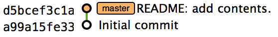
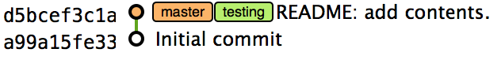
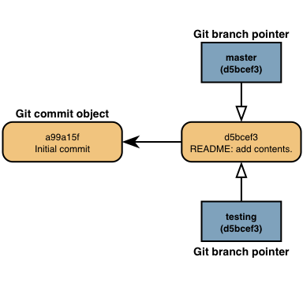
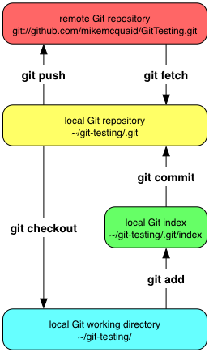

== Introduction to remote Git
Interacting with repositories hosted on other machines. How to download
other people's work for interaction in a team or backup, dealing with
large repositories and sharing work done locally with others.

Dealing with local and remote branches and tags. Describe how branching
is useful, how to create and checkout local and remote branches and
tags.

=== Creating a GitHub repository

=== Branches
==== Create a new local branch from the current branch
===== Commands
`git branch $BRANCH`

===== Walkthrough
.Before `git branch testing`

To create a new local branch "testing" from the current branch:

1.  Run `git branch testing`
2.  The local branch "testing" has been created.

.After `git branch testing`

Branches have some naming restrictions. For example, branches cannot
have two consecutive dots (..) anywhere in their name so
"testing..branch" would be an invalid branch name and `git branch` will
refuse to create it.

When `git branch` creates a local branch it does not change to it. To do
that requires using `git checkout`.

===== Explanation
.Branch pointers

Creating a branch in Git is a quick and efficient process (particularly
compared to some other version control systems which require copying
files). When Git creates a branch it does not duplicate data but creates
a pointer that points to the top commit of the branch. This means when
more commits are made on a branch the branch pointer will be updated
each time to point to the top commit.

==== Checkout a local branch
===== Commands
`git checkout $BRANCH`

===== Walkthrough
To change from the current "master" branch to a local branch "testing":

1.  Run `git status` to ensure there are no modified and/or uncommitted
files (as otherwise Git requires the `--force` parameter to overwrite
these changes).
2.  Run `git checkout testing`.
3.  The local branch "testing" has been checked out.

.After `git checkout testing`
image::screenshots/git-checkout-after.png[]

===== Explanation
`git checkout` may be a slightly confusing name. In the Subversion
version control system `svn checkout` is used for the initial download
from a remote repository (similar to `git clone` but for a single
commit). However `git checkout` is used here to change branches.

.Git remote workflow

`git clone` downloads the entire history of a repository and creates a
"clone" (i.e. a deep copy). With closer examination `git checkout` and
`svn checkout` behave similarly; both check out the contents of a
version control repository into the working tree (i.e. everything that
isn't under a `.git` directory) but Subversion's repository is remote
and Git's repository is local. In this case `git checkout` is requesting
the checkout of a particular branch so the current state of that branch
is checked out into the working tree. Afterwards the HEAD pointer is
updated to point to the top commit of the branch (which will be the same
commit pointed to by the branch pointer).

.HEAD pointer
image::diagrams/HEAD.png[]

The HEAD pointer is used to track which Git revision is currently
checked out. After a successful checkout it is moved from pointing to
the previous commit (in this case the previous branch's top commit) to
the new branch's top commit. When checking out the previous branch HEAD
will return to pointing at the previous branch's top commit.

==== Checkout a remote branch
===== Commands
`git checkout $REMOTE/$BRANCH`

===== Walkthrough
To change from the current "master" branch to a branch "testing" on the
remote "origin":

1.  Run `git branch testing origin/testing` to create the local
"testing" branch tracking the branch "testing" on the remote "origin".
2.  The local branch "testing" has been created tracking the branch
"testing" on the remote "origin".
3.  Run `git status` to ensure there are no modified and/or uncommitted
files (as otherwise Git requires the `--force` parameter to overwrite
these changes).
4.  Run `git checkout testing`.
5.  The local branch "testing" has been checked out.

.After `git checkout testing`
image::screenshots/git-checkout-remote-after.png[]

===== Explanation
Remote branches are branches which exist on a "remote". A remote is
another Git repository that Git knows about; typically on a remote
machine. The branches and all their commits are downloaded with
`git fetch` but do not have any connection to local branches unless
manually specified (this connection is known as "tracking"). The
differences between a local branch and a remote branch (or history of a
remote branch) can be viewed without creating a local branch. However,
committing and pushing to a remote branch requires creating a local
branch.

In the above example "testing" is tracking "origin/testing". When a
local branch has been setup to be "tracking" a remote branch then it
will default to pushing to and pulling from the tracked remote branch.

=== Merging

=== Remote Repositories
