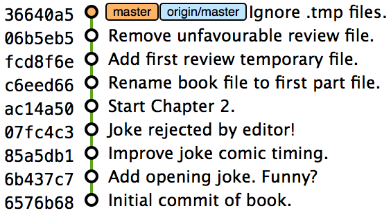

== History Visualization
In this chapter you will learn about visualizing the history in various forms
by learning the following topics:

* How to filter `git log` output to narrow down the number of commits that are
  shown by various critera
* How to format `git log` output to display the information more effectively
* How to find who, why and when a particular file in a particular file was
  changed
* How to find which commit caused a particular bug

When working with Git repository on large, long-running software projects
you'll sometimes want to dig through the history to identify old versions of
code, work out why changes were made, analyze what changes were made by whom
and try and identify why certain bugs occur. You can do this to a limited
extent already using the tools you've already learnt: `git log` and `git diff`.

Let's learn how to optimize our use of history to be able to quickly jump to
the parts that are relevant to the problem at hand. The first step is learning
how to only list only certain commits.

=== List only certain commits
==== Background
Sometimes when examining history you will want to only display commits based on
particular parts of metadata. Perhaps you are tracking down a commit that was
made on a particular date, by a particular person or had something in the
commit message but have too many commits to manually scan through the history
with `git log` or `gitx` to find what you are looking for.

For these cases the `git log` command has various flags and arguments that can
be used to filter the commits that are shown in its output.

Let's start by trying to find a commit by author, date and commit message
simultaneously.

==== Problem
You wish to list the commits authored by Mike McQuaid, after 10th November 2013
with the string "file." in their message.

==== Solution
1.  Change to the directory containing your repository
    e.g. `cd /Users/mike/GitInPracticeRedux/`.
2.  Run `git log --author "Mike McQuaid" --after "Nov 10 2013" --grep 'file\.'`.
    The output should resemble:

.Filtered log output
----
# git log --author "Mike McQuaid" --after "Nov 10 2013" --grep 'file\.'

commit 06b5eb58b62ba8bbbeee258705c636ca7ac20b49
Author: Mike McQuaid <mike@mikemcquaid.com>
Date:   Thu Nov 28 15:49:30 2013 +0000

    Remove unfavourable review file.

commit fcd8f6e957a03061cdf411851fe38034a44c97ab
Author: Mike McQuaid <mike@mikemcquaid.com>
Date:   Thu Nov 28 15:48:24 2013 +0000

    Add first review temporary file.

commit c6eed6681efc8d0bff908e6dbb7d887c4b3fab3e
Author: Mike McQuaid <mike@mikemcquaid.com>
Date:   Thu Nov 28 15:39:38 2013 +0000

    Rename book file to first part file.
----

The filtered log output is the same as the `git log` output you saw in Chapter
2; it just omits the commits that aren't matched by the specified arguments.

From the arguments provided to the log command:

* The `--author` argument specifies a regular expression that matches the
  contents of the author. In this case it's searching the string `Mike McQuaid
  <mike@mikemcquaid.com>` and finding a match based on the 'Mike McQuaid' at
  the beginning of the author string.
* The `--after` (or `--since`) argument specifies that the only commits show
  should be that after the specified date. These dates can be in any format
  that Git recognises such as `Nov 10 2013`, `2014-01-30`, `midnight` or
  `yesterday`.
* The `--grep` argument specifies a regular expression that matches the
  contents of the commit message. `file\.` was used rather than `file.` to
  escape the `.` character.

.What are regular expressions?
NOTE: Regular expressions are a search pattern that is typically used to match
patterns inside of strings. Git uses them for various filtering operations such
as what we have seen above. Characters either have literal meanings e.g. `a`
which will always match a lowercase 'a' character or special meanings e.g. `.`
which will match any character. For example, `file.` will match the strings
`files` or `filed`. To turn a character with a special meaning into one with a
literal meaning you can escape them with a backslash e.g. `file\.` will match
the string `file.` but not the string `files`

You have shown a subset of commits filtered by author, date and commit message.

==== Discussion
`git log` can take a `--max-count` (or `-n`) argument to limit the number of
commits that is shown in the log output.

Similarly to the `--after` argument `git log` can take a `--before` (or
`--until`) argument which will only show commits before the given date.

`git log` can take a `--merges` flag (or `--min-parents=2`) which will only
show merge commits i.e. commits that have at least 2 parents.

`git show` is a command similar to `git log` but it defaults to showing what
was changed. Remember from Chapter 2 this is similar to the `--patch` (or -p)
argument to `git log`.

.Show commit output
----
# git show HEAD^

commit 06b5eb58b62ba8bbbeee258705c636ca7ac20b49 <1>
Author: Mike McQuaid <mike@mikemcquaid.com>
Date:   Thu Nov 28 15:49:30 2013 +0000

    Remove unfavourable review file.

diff --git a/GitInPracticeReviews.tmp b/GitInPracticeReviews.tmp <2>
deleted file mode 100644
index ebb69c3..0000000
--- a/GitInPracticeReviews.tmp
+++ /dev/null
@@ -1 +0,0 @@
-Git Sandwich
----
<1> commit information
<2> commit diff

From the show commit output:

* "commit information (1)" shows all the same information expected in `git log
  output` but only ever shows a single commit.
* "commit diff (2)" shows the changes that were made in that commit. It's the
  equivalent of typing `git diff HEAD^^..HEAD^`.

=== List commits with different formatting
==== Background
The default `git log` output format is helpful but takes a minimum of 6 lines
of output to display each commit. It displays the commit SHA-1, author name and
email, commit date and the full commit message. Sometimes you will want to
display more information and sometimes you will want to display less. You may
even just have a personal preference on how the output is presented that does
not match how it currently is.

Thankfully `git log` has some powerful formatting features with varied,
sensible default options and the ability to completely customise the output to
meet your needs.

Remember from Chapter 2 I mentioned that commits are structured like emails?
This is because Git was initially created for use by the Linux kernel project
which has a high-traffic mailing list in which people frequently send commits
(know as "patches") to the mailing list. Previously there was an implicit
format that people used to turn a requested change into a mailing list but now
Git will convert commits to and from an email format to facilitate them being
sent to mailing lists.

Let's display some commits in an email-style format.

==== Problem
You wish to list the last two commits with the oldest first in an email format.

==== Solution
1.  Change to the directory containing your repository
    e.g. `cd /Users/mike/GitInPracticeRedux/`.
2.  Run `git log --format=email --reverse --max-count 2'`.
    The output should resemble:

.Email formatted log output
----
# git log --format=email --reverse --max-count 2

From 06b5eb58b62ba8bbbeee258705c636ca7ac20b49 Mon Sep 17 00:00:00 2001 <1>
From: Mike McQuaid <mike@mikemcquaid.com> <2>
Date: Thu, 28 Nov 2013 15:49:30 +0000 <3>
Subject: [PATCH] Remove unfavourable review file. <4>

From 36640a59af951a26e0793f8eb0f4cc8e4c030167 Mon Sep 17 00:00:00 2001
From: Mike McQuaid <mike@mikemcquaid.com>
Date: Thu, 28 Nov 2013 15:57:43 +0000
Subject: [PATCH] Ignore .tmp files.
----
<1> unix mailbox date
<2> commit author
<3> commit date
<4> commit subject

From the email formatted log output:

* "unix mailbox date (1)" can be safely ignored. The first part is the SHA-1
  hash for the commit. The log output is generated in the Unix "mbox" (short
  for "mailbox") format. The second, date part is not affected by the commit
  date or contents but is a special value used to indicate that this was
  outputted from Git rather than taken from real Unix mbox file.
* "commit author (2)" is the author of the commit. This is one of the reasons
  why Git stores a name and email address for authors and in commits; it eases
  the transition to email format and the commit is seen as an email send by the
  author of the commit requesting a change be made.
* "commit date (3)" is the date which the commit was made. This also sets the
  date for the email in its headers.
* "commit subject (4)" is the first line of the commit message prefixed with
  "[PATCH]". This is another reason to structure your commit messages like
  emails (as mentioned in Chapter 1).

If there is more than one line in a commit message then the other lines will be
shown as the message body. Remember if you use the `--patch` (or `-p`) argument
the `git log` output will also include the changes made in the commit. With
this provided each outputted `git log` entry will contain the commit and all
the metadata necessary to convert it to or from an email.

You have listed a subset of the commits with reversed ordering and different
formatting.

==== Discussion
If you specify the `--patch` (or `-p`) flag to `git log` then you can also
format the diff output by specifying flags for `git diff` too. For example,
`git log --patch --word-diff` will show the word diff (rather than unified
diff) for each log entry.

`git log` can take a `--date` flag which takes various parameters to display
the output dates in different formats. For example, `--date=relative` displays
all dates relative to the current date e.g. `6 weeks ago` and `--date-short`
displays only the date e.g. `2013-11-28`. There is also `iso` (or iso8601),
`rfc` (or `rfc2822`), `raw`, `local` and `default` formats available but I
won't detail them all in this book.

===== Output formats
The `--format` (or `--pretty`) flag can take various parameters such as `email`
that we've seen in this example, `medium` which is the default if no format was
specified or `oneline`, `short`, `full`, `fuller` or `raw`. I won't show every
format in this book but compare and contrast them on your local computer.
Different formats are better used in different situations depending on how much
of the display information you care about at that time.

You may have noticed the "full" output contains details about an author and a
committer and the "fuller" output additionally contains details of the author
date and commit date.

.Fuller log snippet
----
# git log --format=fuller

commit 334181a038e812050051776b69f0a80187abbeed
Author:     BrewTestBot <brew-test-bot@googlegroups.com>
AuthorDate: Thu Jan 9 23:48:16 2014 +0000
Commit:     Mike McQuaid <mike@mikemcquaid.com>
CommitDate: Fri Jan 10 08:19:50 2014 +0000

    rust: add 0.9 bottle.

...
----

This snippet shows a single commit from Homebrew, an open-source project
accessible at https://github.com/Homebrew/homebrew. This was used as in the
`GitInPracticeRedux` repository all the previous commits have the same author
and committer, author date and commit date.

.Why do commits have an author and committer?
This commit output shows that for a commit there are two recorded actions: the
authorship of the commit and the committing of that commit. These two
attributes are both set at `git commit` time. If they are both set at once then
why are they separate values? Remember that we've seen repeatedly that commits
are like emails, can be formatted as emails and sent to others. If I have a
public repository on GitHub then other users can clone my repository but cannot
commit to it. In these cases they may send me commits through a pull request
(don't worry if you're unfamiliar with these, they will be discussed in Chapter
11) or by email and I want to include these in my repository. The separation
between committing and authoring means I can then include these commits and Git
stores the person who e.g. made the code changes and the person who added these
changes to the repository (hopefully after reviewing them).

===== Custom output format
If none of the `git log` output formats meets your need you can create your own custom formats using a "format string" with placeholders to fill in various attributes per commit.

Let's try and create a more prose-like format for `git log`:
.Custom prose log format
----
# git log --format="%ar %an did: %s"

6 weeks ago Mike McQuaid did: Ignore .tmp files.
6 weeks ago Mike McQuaid did: Remove unfavourable review file.
6 weeks ago Mike McQuaid did: Add first review temporary file.
6 weeks ago Mike McQuaid did: Rename book file to first part file.
9 weeks ago Mike McQuaid did: Start Chapter 2.
3 months ago Mike McQuaid did: Joke rejected by editor!
3 months ago Mike McQuaid did: Improve joke comic timing.
3 months ago Mike McQuaid did: Add opening joke. Funny?
3 months ago Mike McQuaid did: Initial commit of book.
----

Here we've specified the format string with `%ar %an did: %s`. In this:

* `%ar` is the date the commit was authored in the relative date format.
* `%an` is the name of the author of the commit.
* `did :` is just text that's displayed the same in every commit.
* `%s` is the commit subject.

You can see the complete list of these placeholders in `git log --help`; there are too many for me to detail them exhaustively but the large number means it should be possible to customize `git log` into almost any output format.

===== Release logs: git shortlog
`git shortlog` shows the output of `git log` in a format that's typically used
for open-source software release announcements. It displays commits grouped by
author with one commit subject per-line.

.Short log output
----
# git shortlog

Mike McQuaid (9):  <1>
      Initial commit of book. <2>
      Add opening joke. Funny?
      Improve joke comic timing.
      Joke rejected by editor!
      Start Chapter 2.
      Rename book file to first part file.
      Add first review temporary file.
      Remove unfavourable review file.
      Ignore .tmp files.
----
<1> commit author
<2> commit message

From the short log output:

* "commit author (1)" shows the name of the author of the following commits and
  how many commits they have made.
* "commit subject (2)" shows the first line of the commit message.

===== The ultimate log output
As mentioned in the background often the `git log` output is too verbose or
does not display all the information you wish to query in a compact format.
It's also not obvious from the output how local or remote branches relate to
the output.

My command for running `git log` is `git log --oneline --graph --decorate`.

.Graph log output
----
# git log --oneline --graph --decorate

* 36640a5 (HEAD, origin/master, origin/HEAD, master) Ignore .tmp files.
* 06b5eb5 Remove unfavourable review file.
* fcd8f6e Add first review temporary file.
* c6eed66 Rename book file to first part file.
* ac14a50 Start Chapter 2.
* 07fc4c3 Joke rejected by editor!
* 85a5db1 Improve joke comic timing.
* 6b437c7 Add opening joke. Funny?
* 6576b68 Initial commit of book.
----

This output format displays each commit on a single line. The line begins with
a branch graph indicator (which I will explain shortly), follows with the short
SHA-1 (which is useful for quickly copying-and-pasting), the branches, tags,
HEAD that points to this commit in parentheses and ends with the commit subject.

As you may have noticed this format is quite similar to that of the first two
columns of GitX:

.GitX graph output

The `GitInPracticeRedux` repository does not currently have any merge commits.
Let's see what the graph log output looks like with some of them.

.Graph log merge commit snippet
----
# git log --oneline --graph --decorate

*   129cce6 (origin/master, origin/HEAD, master) Merge branch 'testing'
|\
| * a86067a (origin/testing, testing) testing branch commit
* | 1a36bd6 master branch commit

...
----

Here you can see the branch graph indicator becoming useful. Like the graphical
tools we've seen in Chapter 1 this displays branch merges and different commits
on different branches but uses ASCII symbols to do this. The `*` means a commit
that was made. Each "line" follows a single branch. We can see from the above
listing that there was a commit made on the `master` branch, a commit made on
the `testing` branch and then the `testing` branch was merged into `master`.
Both `testing` and `master` branches remain (i.e. haven't been deleted) and
both have been pushed to their respective remote branches. All this from just
three lines of ASCII output! Hopefully you can now see why I love this
presentation.

//git show-branch?

=== Show who last changed each line of a file: git blame
==== Background
I'm sure all developers have been in a situation where they've seen some line
of code in a file and wonder why it is the way it is. As long as the file is
stored in a Git it's easy to query who, when and why (given a good commit
message was used) a certain change is made.

I'm sure you're realized you could do this by using `git diff` or `git log
--patch` but neither of these tools are optimized for this particular use-case;
they both usually require reading through a lot of information you aren't
interested in to find the information you are.

Instead let's use a command designed specifically for this use-case `git blame`.

==== Problem
You wish to show the commit, person and date in which each line of
`GitInPractice.asciidoc` was changed.

==== Solution
1.  Change to the directory containing your repository
    e.g. `cd /Users/mike/GitInPracticeRedux/`.
2.  Run `git blame --date=short 01-IntroducingGitInPractice.asciidoc`.
    The output should resemble:

.Blame output
----
# git blame --date=short 01-IntroducingGitInPractice.asciidoc

^6576b68 GitInPractice.asciidoc (Mike McQuaid 2013-09-29 1)
 = Git In Practice
6b437c77 GitInPractice.asciidoc (Mike McQuaid 2013-09-29 2)
 == Chapter 1
07fc4c3c GitInPractice.asciidoc (Mike McQuaid 2013-10-11 3)
 // TODO: think of funny first line that editor will approve.
ac14a504 GitInPractice.asciidoc (Mike McQuaid 2013-11-09 4)
 == Chapter 2
ac14a504 GitInPractice.asciidoc (Mike McQuaid 2013-11-09 5)
 // TODO: write two chapters
----

From the blame output:

* `--date=short` is used to display just the date. This accepts the same
  formats as the `--date` flag for `git log`. This was used in the above
  listing to make it more readable as `git blame` lines tend to be very long.
* The `^` (caret) prefix on the first line indicates that this line was
  inserted in the initial commit.
* Each line contains the short SHA-1, filename (if the line came from a file
  with a different name), parenthesized name, date and number number and then
  the line contents itself. For example, in commit `6b437c77` on 29th September
  2013 Mike McQuaid added the `== Chapter 1` line to `GitInPractice.asciidoc`
  (although the file is now named `01-IntroducingGitInPractice.asciidoc`).

You have shown who changed each line of a file, in which commit and when the
commit was made.

==== Discussion
`git blame` has a `--show-email` (or `-e`) flag which can show the email
address of the author instead of the name.

You can use the `-w` flag to ignore whitespace changes when finding where the
line changes came from.

The `-s` flag will not show the author name or date in the output. This can be
useful for displaying a more concise output format and just looking up the
information from the SHA1 later.

If the `-L` is specified and followed with a line range e.g. `-L 40,60` then
only the lines in that range will be shown. This can be useful if you know
already what subset of the file you care about and don't want to have to search
through it again in the `git blame` output.

=== Find which commit caused a particular bug: git bisect
==== Background
The only thing worse than finding a bug in software and having to fix it is
having to fix the same bug multiple times. A bug that was found, fixed and
appeared again is typically known as a _regression_.

The usual workflow for finding regressions is fairly painful. You typically
will keep going back in the version control history until you find a commit in
which the bug isn't present, go forward until you find where it happens again
and repeat the process to narrow it down. It's typically a rather tedious
exercise which is usually associated with grumbling that you have to fix the
same problem again.

Thankfully Git has a useful tool that makes this process much easier for you:
`git bisect`. This uses a binary search algorithm to identify the problematic
commit as quickly as possible.

For a simple example let's try and find a commit which renamed a particular
file (without manually looking through the history).

==== Problem
You wish to locate the commit that renamed `GitInPractice.asciidoc` to
`01-IntroducingGitInPractice.asciidoc`.

==== Solution
1.  Change to the directory containing your repository
    e.g. `cd /Users/mike/GitInPracticeRedux/`.
2.  Run `git bisect start`.
    There will be no output.
3.  Run `git bisect bad`.
    There will be no output.
4.  Run `git bisect good 6576b6`. The output should resemble Listing 4.X.
5.  Run `git bisect good` when the filename is `GitInPractice.asciidoc` and `git
    bisect bad` when the filename is `01-IntroducingGitInPractice.asciidoc`. The
    output should be similar each time.
6.  Eventually the first bad commit will be found.
    The output should resemble Listing 4.X.
7.  Run `git bisect reset`.
    The output should resemble Listing 4.X.

.First good bisect output
----
# git bisect good

Bisecting: 3 revisions left to test after this (roughly 2 steps) <1>
[ac14a50465f37cfb038bdecd1293eb4c1d98a2ee] Start Chapter 2. <2>
----
<1> steps remaining
<2> new commit

From the good bisect output:

* "steps remaining (1)" shows how many revisions remain untested and, using the
  binary search algorithm, roughly how many more `git bisect` invocations
  remain until you find the problematic commit.
* "new commit (2)" shows the new commit SHA-1 that `git bisect` has checked out
  for examining whether this commit is "good" (the bug isn't present) or "bad"
  (the bug is present).

.Final bad bisect output
----
# git bisect bad

c6eed6681efc8d0bff908e6dbb7d887c4b3fab3e is the first bad commit <1>
commit c6eed6681efc8d0bff908e6dbb7d887c4b3fab3e <2>
Author: Mike McQuaid <mike@mikemcquaid.com>
Date:   Thu Nov 28 15:39:38 2013 +0000

    Rename book file to first part file.

:000000 100644 0000000000000000000000000000000000000000
 5e02125ebbc8384e8217d4370251268e867f8f03 A
 01-IntroducingGitInPractice.asciidoc <3>
:100644 000000 5e02125ebbc8384e8217d4370251268e867f8f03
 0000000000000000000000000000000000000000 D <4>
 GitInPractice.asciidoc
----
<1> bisect result
<2> commit information
<3> new object metadata
<4> old object metadata

From the final bisect output:

* "bisect result (1)" shows the commit that has been idenfitied to cause the
  bug or, in this case, the rename. This matches the commit message here so
  this is a slightly silly example but typically this will allow you to then
  examine these changes and identify what in this commit caused the regression.
* "commit information (2)" shows the `git show` information for this commit.
* "new object metadata (3)" shows the old and new file mode and SHA-1 for the
  new object (i.e. after renaming).
* "old object metadata (4)" shows the old and new file mode and SHA-1 for the
  old object (i.e. before renaming).

You have located the commit that renamed `GitInPractice.asciidoc`.

==== Discussion
If you wish to examine the steps that you followed in a `git bisect` operation
then you can run `git bisect log`:

.Bisect log output
----
# git bisect log

git bisect start <1>
# bad: [36640a59af951a26e0793f8eb0f4cc8e4c030167] <2>
 Ignore .tmp files. <3>
git bisect bad 36640a59af951a26e0793f8eb0f4cc8e4c030167
# good: [6576b6803e947b29e7d3b4870477ae283409ba71]
 Initial commit of book.
git bisect good 6576b6803e947b29e7d3b4870477ae283409ba71
# good: [ac14a50465f37cfb038bdecd1293eb4c1d98a2ee]
 Start Chapter 2.
git bisect good ac14a50465f37cfb038bdecd1293eb4c1d98a2ee
# bad: [fcd8f6e957a03061cdf411851fe38034a44c97ab]
 Add first review temporary file.
git bisect bad fcd8f6e957a03061cdf411851fe38034a44c97ab
# bad: [c6eed6681efc8d0bff908e6dbb7d887c4b3fab3e]
 Rename book file to first part file.
git bisect bad c6eed6681efc8d0bff908e6dbb7d887c4b3fab3e
# first bad commit: [c6eed6681efc8d0bff908e6dbb7d887c4b3fab3e] <4>
 Rename book file to first part file.
----
<1> bisect command
<2> commit SHA-1
<3> commit subject
<4> bisect result

From the bisect log output:

* "bisect command (1)" shows the `git bisect` command that you invoked at this
  step.
* "commit SHA-1 (2)" shows the status and SHA-1 of a commit.
* "commit subject (3)" shows the commit subject of a commit.
* "bisect result (4)" shows the final result of the whole bisect operation.

If you already know that bug has come from particular files or paths in the
working tree then you can specify these to `git bisect start`. For example, if
you knew that the changes were in the `src/gui` directory that caused the
regression then you could run `git bisect start src/gui`. This means that only
the commits that changed the contents of this directory will be checked and
this makes things even faster.

If it's difficult or impossible to tell if a particular commit is good or bad
you can run `git bisect skip` which will ignore it. Given there are enough
other commits then `git bisect` will use another to narrow the search instead.

===== Automating git bisect
Although `git bisect` is already useful wouldn't it be even better if, rather
than having to keep typing `git bisect good` or `git bisect bad`, it could run
automatically and tell you which commit caused the regression? Given a few
caveats, this is possible with `git bisect run`.

`git bisect` run is run instead of `git bisect good` or `git bisect bad` (i.e.
after a `git bisect start` and before a `git bisect reset`) but automates the
invocation of `git bisect good` and `git bisect bad`. It uses the exit code of
a process to identify whether the command was successful or not. For example,
if you run the command `ls GitInPractice.asciidoc` it returns an exit code of
`0` on success and `1` on failure. This means that a command that runs `ls
GitInPractice.asciidoc` can tell if that file is present or not. Let's take
advantage of this to use it with `git bisect run`:

.Bisect run output
----
# git bisect run ls GitInPractice.asciidoc

Bisecting: 3 revisions left to test after this (roughly 2 steps) <1>
[ac14a50465f37cfb038bdecd1293eb4c1d98a2ee]
 Start Chapter 2.
running ls GitInPractice.asciidoc
GitInPractice.asciidoc
Bisecting: 1 revision left to test after this (roughly 1 step)
[fcd8f6e957a03061cdf411851fe38034a44c97ab]
 Add first review temporary file.
running ls GitInPractice.asciidoc
ls: GitInPractice.asciidoc: No such file or directory
Bisecting: 0 revisions left to test after this (roughly 0 steps)
[c6eed6681efc8d0bff908e6dbb7d887c4b3fab3e]
 Rename book file to first part file.
running ls GitInPractice.asciidoc
ls: GitInPractice.asciidoc: No such file or directory
c6eed6681efc8d0bff908e6dbb7d887c4b3fab3e is the first bad commit <3>
commit c6eed6681efc8d0bff908e6dbb7d887c4b3fab3e
Author: Mike McQuaid <mike@mikemcquaid.com>
Date:   Thu Nov 28 15:39:38 2013 +0000

    Rename book file to first part file.

:000000 100644 0000000000000000000000000000000000000000
 5e02125ebbc8384e8217d4370251268e867f8f03 A
 01-IntroducingGitInPractice.asciidoc
:100644 000000 5e02125ebbc8384e8217d4370251268e867f8f03
 0000000000000000000000000000000000000000 D
 GitInPractice.asciidoc
bisect run success
----

The output is identical to the `git bisect log` output or the combined output
of all the other `git bisect` operations. No human intervention is required in
the above output; it just ran until it reached a result.

A typical case would be writing a unit test that reproduces a regression and
using that with `git bisect run` to quickly test a large number of commits.
Note that because `git bisect good` and `git bisect bad` perform a `git
checkout` each time you need to make sure that the regression test is not
overwritten by other files or committed after the earliest "bad" commit.
Typically I'll just commit it and then make a copy in another directory outside
the Git working directory so `git bisect run` can work unimpeded.

=== Summary
In this chapter you hopefully learned:

* How to filter `git log` output by author, date, commit message, merge commits
* How to display only a single commit or requested number of commits
* How to display `git log` output in various formats
* How to display commits in an open-source release announcement format
* How to display branching effectively with `git log`
* How to show who changed each line of a file, when, why and what the original
  filename was
* How to use `git bisect` to search manually or automatically through history
  to identify regressions

Now that you've learned how to better understand history let's learn how to make it more complex but learning advanced branching techniques.
