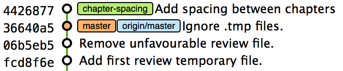
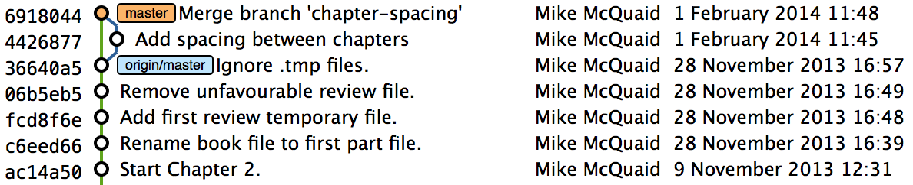
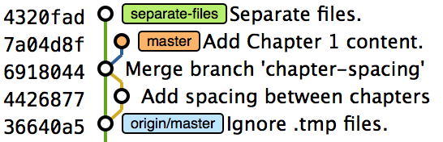
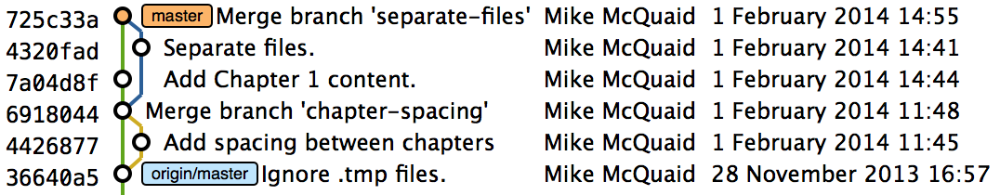
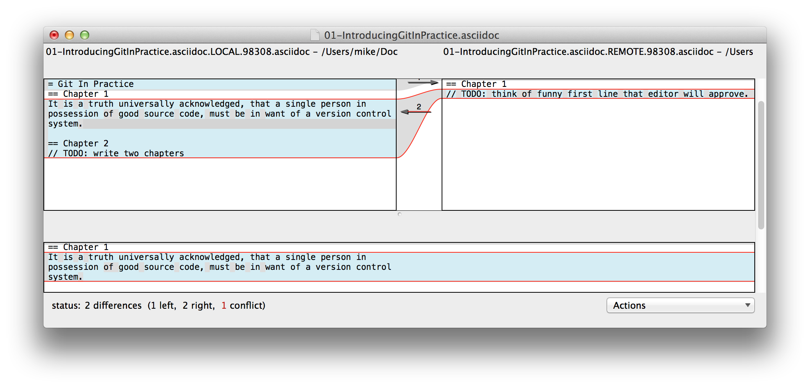
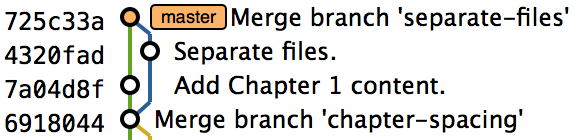
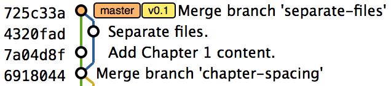

## Advanced Branching
ifdef::env-github[:outfilesuffix: .adoc]

You've already learned the basics of branching in <<02-RemoteGit#creating-a-new-local-branch-from-the-current-branch-git-branch>>. In this chapter you will learn about more advanced branching techniques by learning the following topics:

* How to configure `git merge` to behave differently
* How to resolve merge conflicts
* How to avoid solving the same merge conflicts multiple times
* How to create a tag
* How to generate a version number from previous tags
* How to bring individual commits from one branch to another
* How to revert a previous commit
* How to list what branches contain a given commit

When working as part of a team on a software project, you'll typically use branches to separate work between individuals, features, bug fixes, and software releases. You should already be able to perform some basic branching actions, such as create, delete, and merge a branch. This chapter will expand on that so you can improve your branching workflow to be more effective.

Let's start by learning how to use some of the parameters provided by `git merge`.

### Merge branches and always create a merge commit
You learned in <<02-RemoteGit#merging-an-existing-branch-into-the-current-branch-git-merge>> how to perform a basic merge of two branches by using `git merge branchname` where `branchname` is the name of the branch you wish to merge into the current branch.

Recall that a merge commit is one that has multiple parents and is displayed in GitX by the convergence of two or more branch "tracks". `git merge` provides various options for merging branches without creating merge commits, using various strategies or resolving conflicts with a graphical merge tool.

.Why would you want to force creation of a merge commit?

NOTE: Though fast-forward merges can sometimes be useful in some Git workflows, you'll want to explicitly signify the merging of a branch, even if it wasn't necessary to do so. This explicit indication of a merge through the creation of a merge commit can show all the metadata present in any other commit, such as who performed the merge, when, and why. In software projects, merging a new feature will usually be done by merging a branch, and it's useful for regression testing and history visualization for this feature merge to be more explicit.

Let's start by setting up how to perform a merge that could be made without creating a merge commit: a fast-forward merge. Recall that a _fast-forward merge_ means that the incoming branch has the current branch as an ancestor. This means commits have been made on the incoming branch, but none have been made on the current branch since the incoming branch was branched from it.

We're creating a branch that can have a fast-forward merge. This is so when we create a merge commit, we know that it was because it was specifically requested, and not because it was required.

Let's create a branch that can be merged without a merge commit:

1.  Change to the directory containing your repository; for example, `cd /Users/mike/GitInPracticeRedux/`.
2.  Run `git checkout -b chapter-spacing`.
3.  Edit `01-IntroducingGitInPractice.asciidoc` to add a line-break between chapters.
4.  Run `git commit --message 'Add spacing between chapters' 01-IntroducingGitInPractice.asciidoc`. The output should resemble the following:

.Fast-forward branch commit output
```
# git commit --message 'Add spacing between chapters'
  01-IntroducingGitInPractice.asciidoc

[chapter-spacing 4426877] Add spacing between chapters
 1 file changed, 1 insertion(+)
```

.Local repository before merge without merge commit
[[GitXBeforeMergeNoFF]]


You can see from <<GitXBeforeMergeNoFF>> that you've created a new branch named `chapter-spacing` which can be merged without a merge commit into the `master` branch.

#### Problem
You wish to merge the `chapter-spacing` branch into the `master` branch and create a merge commit--not perform a fast-forward merge.

#### Solution
1.  Change to the directory containing your repository; for example, `cd /Users/mike/GitInPracticeRedux/`.
2.  Run `git checkout master`.
3.  Run `git merge --no-ff chapter-spacing`. You'll be prompted for a commit message but can just accept the default. The output should resemble the following:

.Forced merge commit output
```
# git merge --no-ff chapter-spacing

Merge made by the 'recursive' strategy. <1>
 01-IntroducingGitInPractice.asciidoc | 1 +
 1 file changed, 1 insertion(+) <2>
```
<1> Merge type
<2> Diff summary

You can now delete the merged `chapter-spacing` branch by running `git branch --delete chapter-spacing` from the `master` branch.

From the forced merge commit output:

* "Merge type (1)" shows that this was a merge (rather than a fast-forward) and therefore produced a merge commit. It used the _recursive_ Git merge strategy (we'll discuss strategies more in the discussion section).
* "Diff summary (2)" shows a short summary of the changes that were made in this merge commit--all the differences between the `master` branch and the `chapter-spacing` branch.

You've now merged the `chapter-spacing` branch into the `master` branch and forced a merge commit to be created.

#### Discussion
A merge commit has two parents: the previous commit on the current branch (`master` in this case) and the previous commit on the incoming branch (`chapter-spacing` in this case).

.Local repository after `git merge --no-ff chapter-spacing`
[[GitXMergeNoFF]]


You can see from <<GitXMergeNoFF>> that GitX shows a merge commit differently from a fast-forward. Even when the `chapter-spacing` branch was deleted, the existence of a branch will remain implied by the visual branching and merging in GitX.

In this case, where the branch contained a single commit, this may not be terribly useful, but on larger features, this explicit indication of branches can aid history visualization.

`git merge` can also take a `--ff-only` flag, which does the opposite of `no-ff`: it ensures that a merge commit is never created. If the merge can only be made with a merge commit (there are conflicts that need to be resolved and marked in a merge commit) then it won't perform the merge.

##### Merge strategies
A _merge strategy_ is an algorithm that Git uses to decide how to perform a merge. The previous merge output stated that it was using the _recursive_ merge strategy.

Strategies can be selected by passing the `--strategy` (or `-s`) flag to `git merge`, followed by the name of the strategy. For example, to select the default, recursive strategy, you could also call `git merge --strategy=recursive`.

Certain strategies (such as recursive) can also take options by passing the `--strategy-option` (or `-X`) flag. For example, to set the patience diff option for the recursive strategy, you'd call `git merge --strategy-option=patience`.

Some useful merge strategies are:

* `recursive`--This strategy can merge one branch into another and automatically detect renames. This strategy is the default if you try to merge a single branch into another.
* `octopus`--This strategy can merge multiple branches at once but fails on a merge conflict. This strategy is the default if you try to merge two or more branches into another by running a command like `git merge branch1 branch2 branch3`. You'll never set it explicitly, but it's worth remembering that you can't manually resolve merge conflicts if you merge multiple branches at once. In my experience, this means that it's worth always merging branches one at a time.
* `ours`--This strategy performs a normal merge but ignores all the changes from the incoming branch. This means the resulting tree is the same as it was before the merge. This can be useful when you wish to merge a branch and indicate this in the history without wanting to actually including any of its changes. For example, you could use this to merge the results of a failed experiment and then delete the experimental branch afterward. In this case, the experiment would remain in the history without being in the current code.
* `subtree`--This strategy is a modified version of the recursive strategy that will detect whether the tree structures are at different levels and adjust them if needed. For example, if one branch had all the files in the directory `A/B/C` and the other had all the same files in the directory `A/B` then the subtree strategy would handle this case; `A/B/C/README.md` and `A/B/README.md` could be merged despite their different tree locations.

Some useful merge strategy options for a recursive merge (currently the only strategy with options) are:

* `ours`--This option automatically solves any merge conflicts by always selecting the previous version from the current branch (instead of the version from the incoming branch).
* `theirs`--This option is the reverse of `ours`; it automatically solves any merge conflicts by always selecting the version from the incoming branch (instead of the previous version from the current branch).
* `patience`--This option uses a slightly more expensive `git diff` algorithm to try to decrease the chance of a merge conflict.
* `ignore-all-space`--This option ignores whitespace when selecting which version should be chosen in case of a merge conflict. If the incoming branch has made only whitespace changes to a line, the change will be ignored. If the current branch has introduced whitespace changes but the incoming branch has made non-whitespace changes, then their version will be used.

Neither of these lists are exhaustive, but these are the strategies and options I've found are most commonly used. All the merge strategies and options can be examined by running `git help merge`.

### Resolve a merge conflict
As mentioned previously, sometimes when you merge one branch into another, there will have been changes to the same part of the same file in both branches and Git can't detect automatically which of these changes is the desired one to include. In this situation you have what's known as a _merge conflict_, which you'll need to resolve manually.

These situations tend to occur more often in software projects where you have multiple users working on the same project at the same time. One user might make a bug fix to a file while another refactors it, and when the branches are merged, a merge conflict will result.

Let's create a new branch and change the same files in both branches to produce a merge conflict.

1.  Change to the directory containing your repository; in my case, `cd /Users/mike/GitInPracticeRedux/`.
2.  Run `git checkout -b separate-files`.
3.  Run `git mv 01-IntroducingGitInPractice.asciidoc 00-Preface.asciidoc`
4.  Cut the "Chapter 2" section from `00-Preface.asciidoc` and paste it into a new file named `02-AdvancedGitInPractice.asciidoc`.
5.  Cut the "Chapter 1" section from `00-Preface.asciidoc` and paste it into a new file named `01-IntroducingGitInPractice.asciidoc`.
6.  Run `git add .`.
7.  Run `git commit --message 'Separate files.'`. The output should resemble:

.Separate file commit output
```
# git commit --message 'Separate files.'

[separate-files 4320fad] Separate files.
 3 files changed, 3 insertions(+), 4 deletions(-)
 create mode 100644 00-Preface.asciidoc
 create mode 100644 02-AdvancedGitInPractice.asciido
```

Now let's change the same file in the `master` branch.

1.  Change to the directory containing your repository; on my machine, `cd /Users/mike/GitInPracticeRedux/`.
2.  Run `git checkout master`.
3.  Edit `01-IntroducingGitInPractice.asciidoc` to add contents for Chapter 1.
4.  Run `git commit --message 'Add Chapter 1 content.'
    01-IntroducingGitInPractice.asciidoc`. The output should resemble the following:

.Chapter 1 content commit output
```
# git commit --message 'Add Chapter 1 content.'
  01-IntroducingGitInPractice.asciidoc

[master 7a04d8f] Add Chapter 1 content.
 1 file changed, 3 insertions(+), 1 deletion(-)
```

After these edits, we can use the `git show` command with a `branchname:filename` argument to show the current state of the `01-IntroducingGitInPractice.asciidoc` file on each branch:

.Current state on branches
```
# git show master:01-IntroducingGitInPractice.asciidoc

= Git In Practice
## Chapter 1
It is a truth universally acknowledged, that a single person in
possession of good source code, must be in want of a version control
system.

## Chapter 2
// TODO: write two chapters

# git show separate-files:01-IntroducingGitInPractice.asciidoc

## Chapter 1
// TODO: think of funny first line that editor will approve.
```

.Local repository before merge conflict resolution
[[GitXBeforeMergeConflict]]


You see from <<GitXBeforeMergeConflict>> the current state of the `master` and `separate-files` branches in GitX.

#### Problem
You wish to merge the `separate-files` branch into the `master` branch and resolve the resulting merge conflict.

#### Solution
1.  Change to the directory containing your repository; for example, `cd /Users/mike/GitInPracticeRedux/`.
2.  Run `git checkout master`.
3.  Run `git merge separate-files`. The output should resemble:

.Merge with conflict output
```
# git merge separate-files

Auto-merging 01-IntroducingGitInPractice.asciidoc <1>
CONFLICT (content): Merge conflict in
  01-IntroducingGitInPractice.asciidoc <2>
Automatic merge failed; fix conflicts and then commit the result.
```
<1> Merge attempt
<2> Merge conflict

From the merge with conflict output:

* "Merge attempt (1)" shows Git attempting to find a way of solving the merge
  automatically using the default, recursive merge strategy.
* "Merge conflict (2)" shows that the merge strategy was unable to
  automatically solve the merge conflict so it requires human intervention.

Now we need to edit `01-IntroducingGitInPractice.asciidoc` and solve the merge conflict. When you open the file, you'll see something resembling the following:

.Before merge conflict resolution
```
## Chapter 1  <1>
<<<<<<< HEAD <2>
It is a truth universally acknowledged, that a single person in <3>
possession of good source code, must be in want of a version control
system.

## Chapter 2
// TODO: write two chapters
======= <4>
// TODO: think of funny first line that editor will approve. <5>
>>>>>>> separate-files <6>
```
<1> Unchanged line
<2> Current marker
<3> Current line
<4> Branch separator
<5> Incoming line
<6> Incoming marker

Recall this output and annotations from <<02-RemoteGit#merge-conflicts>>:

* "Unchanged line (1)" is provided for context.
* "Current marker (2)" starts the current branch section containing the lines from the current branch (referenced by `HEAD` here).
* "Current line (3)" shows a line from the current branch.
* "Branch separator (4)" starts the section containing the lines from the incoming branch.
* "Incoming line (5)" shows a line from the incoming branch.
* "Incoming marker (6)" marker ends the section containing the lines from the incoming branch (referenced by `separate-files`; the name of the branch being merged in).

We now need to edit the file so it has the correct version. In this case this involves removing the Chapter 2 section, as it was moved to another file in the `separate-files` branch, and use the new Chapter 1 content that was entered in the `master` branch (here indicated by the `HEAD` section).

After editing the file should resemble the following:

.After merge conflict resolution
```
## Chapter 1
It is a truth universally acknowledged, that a single person in
possession of good source code, must be in want of a version control
system.
```
Now that the merge conflict has been resolved, the merge conflict can be marked as resolved with `git add` and then the merge commit committed. You don't need to run `git merge` again; you're still in the middle of a merge operation which concludes when you `git commit`.

1.  Change to the directory containing your repository; on my machine, `cd /Users/mike/GitInPracticeRedux/`.
2.  Run `git add 01-IntroducingGitInPractice.asciidoc`.
3.  Run `git commit`. Accept the default commit message. The output should resemble the following:

.Merge conflict commit output
```
[master 725c33a] Merge branch 'separate-files'
```

You can run `git branch --delete separate-files` to delete the branch now that it's merged.

You have merged two branches and resolved a merge conflict.

#### Discussion
Merge commits have default commit message formats and slightly different diff output. Let's take a look at the merge commit by running `git show master`:

.Merge commit output
[.long-annotations]
```
# git show master

commit 725c33ace6cd7b281c2d3b342ca05562d3dc7335
Merge: 7a04d8f 4320fad
Author: Mike McQuaid <mike@mikemcquaid.com>
Date:   Sat Feb 1 14:55:38 2014 +0100

    Merge branch 'separate-files' <1>

    Conflicts:
        01-IntroducingGitInPractice.asciidoc <2>

diff --cc 01-IntroducingGitInPractice.asciidoc
index 6a10e85,848ed39..c9cda9c
--- a/01-IntroducingGitInPractice.asciidoc
+++ b/01-IntroducingGitInPractice.asciidoc
@@@ -1,8 -1,2 +1,4 @@@
- = Git In Practice 1 <3>
  == Chapter 1
 -// TODO: think of funny first line that editor will approve. <4>
 +It is a truth universally acknowledged, that a single person in <5>
 +possession of good source code, must be in want of a version control
 +system.
-
- == Chapter 2
- // TODO: write two chapters
```
<1> Merge subject
<2> Conflicted file
<3> Incoming delete
<4> Current delete
<5> Current insert

From the merge commit output:

* "Merge subject (1)" shows the default commit message subject for merge
  commits. It specifies the incoming branch name. It can be changed but I
  prefer to leave it as-is and add any additional information in the commit
  message body instead, so it's easily recognizable from subject alone as a
  merge commit.
* "conflicted file (2)" shows a file that had conflicts to be resolved
  manually. Sometimes these conflicts may be resolved incorrectly so this list
  is useful in spotting which files required resolution so they can be reviewed
  by other people later.
* "incoming delete (3)" shows a line that was deleted in the incoming
  (`separate-files`) branch's commit(s). The `-` is in the first column as a
  result.
* "current delete (4)" shows a line that was deleted in the current
  (`master`) branch's commit(s). The `-` is in the second column as a result.
* "current insert (5)" shows a line that was inserted in the current
  (`master`) branch's commit(s). The `+` is in the second column as a result.

In this diff there are two columns (rather than the usual one) allocated for `-` and `+` markers. This is because where a normal diff is just indicating insertions and deletions to a file, this _merge diff_ is showing insertions and deletions to a file and the branch they were inserted or removed in. For example, in the preceding listing, the first column indicates a line inserted or deleted from the incoming branch (`separate-files`) and the second column indicates a line inserted or deleted from the current branch (`master`). Don't worry about identifying which column is which; it's not very important but just provides more context for changes.

.Local repository after merge conflict resolution
[[gitx-merge-conflict]]


You can see from <<gitx-merge-conflict>> that the changes from both branches are visible in the GitX output and that they're not always shown in chronological order; the `Add Chapter 1 content` commit occurs before the `Separate files.` commit even although it was made 3 minutes later.

##### Using a graphical merge tool
Instead of manually editing the contents of the file, you can instead run `git mergetool`, which will run a graphical merge tool such as `emerge`, `gvimdiff`, `kdiff3`, `meld`, `vimdiff`, `opendiff` or `tortoisemerge`. Details for how to configure `git mergetool` to use your tool of choice are available by running `git help mergetool`.

Sometimes it can be more helpful to use a graphical merge tool to be able to visualize conflicts graphically and understand how they relate to the changes that have been made by viewing them, say, side-by-side. Although I personally tend not to use these tools anymore, I found them useful when learning how to use version control.

.Opendiff merge conflict resolution
[[opendiff]]


You can also customize the tool that is used to specify your own merge tools. In <<opendiff>> you can see the `opendiff` tool provided with macOS used to resolve the previous merge conflict.

.Who should resolve merge conflicts?
NOTE: In Git, the person who makes a merge (runs the `git merge` command) should always be the person who resolves a merge conflict. This may differ from other version control systems. Additionally, this may sometimes mean that if a conflict resolution requires a particular member of a team to be able to pick the correct resolution, that the `git merge` should be done by this person.

### Only resolve each merge conflict once: git rerere
You may find yourself in a situation where you have a long-running branch where you have to keep merging in another branch and get the same merge conflicts every time. It can be frustrating to have to manually resolve the same merge conflict multiple times; after all isn't repeatedly performing boring tasks what computers are good for?

Git has a command named `git rerere` (which stands for "Reuse Recorded Resolution"), which integrates with the normal `git merge` workflow to record the resolution of merge conflicts for later replay. In short, you only need to solve a particular merge conflict once. I always tend to enable this when I use Git, as it runs automatically to ensure that I don't need to solve the same merge conflicts multiple times if I'm doing something like repeatedly merging the same branch which produces the same conflict.

When `git rerere` is enabled, it will store the changes before a merge conflict and compare them to after it was resolved. This is used to fingerprint a particular merge conflict based on the entire contents of the conflict (the changes from both branches). This fingerprint is then used whenever there's another merge conflict to compare against all the previously resolved merge conflicts. If a merge conflict is detected to be the same then `git rerere` will reuse the previously recorded merge conflict resolution and edit the files as if you had resolved it manually. You still need to use `git add` to mark the merge conflict as resolved however; this is in case you've actually decided to resolve this merge conflict in a slightly different way, so Git gives you a chance to edit it.

Let's learn how to set up `git rerere`.

#### Problem
You want to set up `git rerere` to integrate with the merge workflow so you don't need to repeatedly resolve the same merges.

#### Solution
1.  Run `git config --global --add rerere.enabled 1`. There will be no output.

You have enabled `git rerere` to automatically save and retrieve merge conflict resolutions in all repositories.

#### Discussion
You don't need to run `git rerere` manually for it to store and retrieve merge conflicts. After enabling `git rerere`, you'll see some slightly different output the next time you run `git commit` after resolving a merge conflict:

.rerere merge conflict storage
```
# git commit

Recorded resolution for '01-IntroducingGitInPractice.asciidoc'. <1>
[master 725c33a] Merge branch 'separate-files'
```
<1> rerere storage

`git rerere` has been run by `git commit` to store the conflict and resolution so it can recall the same resolution when it sees the same conflict.

If the same conflict is seen again:

.rerere merge conflict retrieval
```
# git merge separate-files

Auto-merging 01-IntroducingGitInPractice.asciidoc
CONFLICT (content): Merge conflict in
  01-IntroducingGitInPractice.asciidoc
Resolved '01-IntroducingGitInPractice.asciidoc' using
  previous resolution. <1>
Automatic merge failed; fix conflicts and then commit the result.
```
<1> rerere retrieval

`git rerere` has again been run by `git merge` to retrieve the resolution for the identical conflict. You still need to run `git add` to accept the conflict, and can use `git diff` or edit the file to ensure the resolution was as expected and desired.

.How can you make `git rerere` forget an incorrect resolution?
NOTE: Sometimes you may want to make `git rerere` forget a resolution for a particular file because you resolved it incorrectly. In this case you can use `git rerere` with a path to forget any resolutions for that file or directory. For example, to forget the resolution on `01-IntroducingGitInPractice.asciidoc`, you'd run `git rerere forget 01-IntroducingGitInPractice.asciidoc`. There will be no output.

### Create a tag: git tag
Remember refs from <<01-LocalGit#refs>>. A tag is another _ref_ (or pointer) for a single commit. Tags differ from branches in that they're (usually) permanent. Rather than pointing to the work-in-progress on a feature, they're generally used to describe a version of a software project.

For example, if you were releasing version `1.3` of your software project, you'd tag the commit that you release to customers as `v1.3` to store that version for later use. This means that if a customer later complained about something being broken in `v1.3`, you could check out that tagged commit and test against it, confident that you're using the same version of the software that the customer is. You can hopefully see that this is one of the reasons why you wouldn't modify tags; once you've released a version to customers, if you want to update it, you'd likely release a new version such as `1.4` rather than changing the definition of `1.3`.

.Local repository before `git tag`
[[GitXBeforeTag]]


You can see from <<GitXBeforeTag>> the current state of the `master` branch in GitX before the tag has been created.

#### Problem
You wish to tag the current state of the `GitInPracticeRedux` `master` branch as version `v0.1`.

#### Solution
1.  Change to the directory containing your repository; on my machine, `cd /Users/mike/GitInPracticeRedux/`.
2.  Run `git checkout master`.
3.  Run `git tag v0.1`. There will be no output.
4.  Run `git tag`. The output should resemble:

.tag listing output
```
# git tag

v0.1 <1>
```
<1> Version tag

From the tag listing output:

* "Version tag (1)" shows that there is a tag named `v0.1` in the local
  repository.

All the tags that are in the current repository (not just the current branch) will be listed by `git tag`.

You have created a `v0.1` tag in the `GitInPracticeRedux` repository.

#### Discussion
.Local repository after `git tag`
[[gitx-tag]]


You can see from <<gitx-tag>> after the `git tag` there's a new `v0.1` ref on the latest commit on the master branch (in the GitX interface, this will be yellow). This indicates that this commit has been tagged `v0.1`.

Note that, unlike branches, when new commits are made on the `master` branch the `v0.1` tag won't change. This is why tags are useful for versioning; they can record the significance of a particular commit without changing it.

git tag can take various flags:

* the `--list` (or `-l`) flag lists all the tags that match a given pattern. For example the tag `v0.1` would be matched and listed by `git tag list --v0.*`.
* the `--force` (or `-f`) flag updates a tag to point to the new commit. This is useful occasions where you realize you've tagged the wrong commit.
* the `--delete` (or `-d`) flag can delete a tag. This is useful if you've created a tag with the wrong name rather than just pointing to the wrong commit.

Run `git push` to push the `master` branch to `origin/master`. You may have noticed that it did not push any of the tags. After you've tagged a version and verified it is pointing to the correct commit and has the correct name, you can push it using `git push --tags`. This will push all the tags you've created in the local repository to the remote repository. These tags will then be fetched by anyone using `git fetch` on the same repository in future.

.How can you update remote tags?
NOTE: You've seen that by using `git tag --delete` or `git tag --force`, it's possible to delete or modify tags locally. It's also possible to push these changes to the remote repository with `git push --tags --force`, but this is not advised. For other users of the repository to have their tags updated, they will need to delete them locally and refetch. This is intentionally cumbersome, as Git intends tags to be static, so doesn't change them locally without users' explicit intervention.

If you realize you've tagged the wrong commit and wish to update it after pushing, it's generally a better idea to just tag a new version and push that instead. This complexity is why `git push` requires the `--tags` argument to push tags.

### Generate a version number based on previous tags: git describe
You've seen that `git tag` can be used to identify certain commits as released versions of a project.

I'm a passionate advocate of continuous integration systems, and I've worked on desktop software projects with semantic versioning (such as `1.0.0`). On these projects, I've set up continuous integration systems to create installers of the software on every commit to the `master` branch.

But in some software there is an "About" screen that displays the software's version. In this case I'd like to have a version number generated that makes sense but doesn't rely on auto-generating a tag for each version of the software and is sortable with some information about the current version of the software. Something like `v0.1-1-g0a5e328` would be preferential to just a short revision like `g0a5e328`.

As the expected version number would be `v0.1` given that has just been tagged, let's make another modification to the `GitInPracticeRedux` repository and generate a version number for the new, untagged commit.

1.  Change to the directory containing your repository; for example `cd /Users/mike/GitInPracticeRedux/`.
2.  Add some content to the `00-Preface.asciidoc` file.
3.  Run `git commit --message 'Add preface text.' 00-Preface.asciidoc`. The output should resemble the following:

.Preface commit output
```
# git commit --message 'Add preface text.

[master 0a5e328] Add preface text.
 1 file changed, 1 insertion(+)
```

#### Problem
You want to generate a version number for a software project based on existing tags in the repository.

#### Solution
1.  Change to the directory containing your repository; for example, `cd /Users/mike/GitInPracticeRedux/`.
2.  Run `git describe --tags`. The output should resemble the following:

.Tag describe output
```
# git describe --tags

v0.1-1-g0a5e328 <1>
```
<1> Generated version

"Generated version (1)" shows the version generated from the state based on existing tags. It's hyphenated into three parts:

* `v0.1` is the most recent tag on the current branch.
* `1` indicates that there has been one commit made since the most recent tag (`v0.1`) on the current branch.
* `g0a5e328` is the current commit SHA-1 prepended with a `g` (which stands for `git`).

If you'd run `git describe --tags` when on the previous commit (which was the `v0.1` tag), it would've outputted just `v0.1`.

You have generated a version number based on the existing tags in the repository.

#### Discussion
If `git describe` is passed a ref, it will generate the version number for that particular commit. For example, `git describe --tags v0.1` will output `v0.1` and `git describe --tags 0a5e328` will output `v0.1-1-g0a5e328.`

If you wish to generate the long-form versions for tagged commits, you can pass the `--long` flag. For example, `git describe --tags --long v0.1` will output `v0.1-0-g725c33a`.

If you wish to use a longer or shorter SHA-1 ref, you can configure this using the `--abbrev` flag. For example, `git describe --tags --abbrev=5` will output `v0.1-1-g0a5e3`. Note that if you use very low values (such as `--abbrev=1`) then `git describe` may use more than you've requested if it requires more to uniquely identify a commit.

### Add a single commit to the current branch: git cherry-pick
Sometimes you may wish to include only a single commit from a branch onto the current branch rather than merging the entire branch. For example you may want to back-port a single bug fix commit from a development branch into a stable release branch. You could do this by manually creating the same change on that branch, but a better way would be using the tool that Git provides: `git cherry-pick`.

Let's create a new branch based off the `v0.1` tag that we'll call `v0.1-release` so we have something we can cherry-pick.

1.  Change to the directory containing your repository; on my machine, `cd /Users/mike/GitInPracticeRedux/`.
2.  Run `git checkout -b v0.1-release v0.1`
3.  Add some content to the `02-AdvancedGitInPractice.asciidoc` file.
4.  Run `git commit --message 'Advanced practice technique.' 02-AdvancedGitInPractice.asciidoc`. The output should resemble the following:

.Release branch commit output
```
# git commit --message 'Advanced practice technique.'
    02-AdvancedGitInPractice.asciidoc

[v0.1-release dfe2377] Advanced practice technique.
 1 file changed, 1 insertion(+), 1 deletion(-)
```

#### Problem
You wish to cherry-pick a commit from the `v0.1-release` branch to the `master` branch.

#### Solution
1.  Change to the directory containing your repository; for example, `cd /Users/mike/GitInPracticeRedux/`.
2.  Run `git checkout master`.
3.  Run `git cherry-pick v0.1-release`. The output should resemble:

.Commit cherry-pick output
```
# git cherry-pick v0.1-release

[master c18c9ef] Advanced practice technique. <1>
 1 file changed, 1 insertion(+), 1 deletion(-)
```
<1> Commit summary

The "Commit summary (1)" shows the result of the cherry-pick operation. Note that this is the same as the output for the previous `git commit` command with one difference: the SHA-1 has changed.

.Why does the SHA-1 change on a cherry-pick?
NOTE: Recall that the SHA-1 of a commit is based on its tree and metadata (which includes the parent commit SHA-1). As the resulting `master` branch cherry-picked commit has a different parent than the commit that was cherry-picked from the `v0.1-release` branch, the commit SHA-1 differs also.

You have cherry-picked a commit from the `v0.1-release` branch to the `master` branch.

#### Discussion
`git cherry-pick` (like many other Git commands) can take a ref as the parameter rather than only a specific commit. As a result we could have interchangeably used `git cherry-pick dfe2377` (where `dfe2377` is the most recent commit on the `v0.1-release` branch) in the previous example for the same result.

You can pass multiple refs to `cherry-pick` and they will be cherry-picked onto the current branch in the order requested.

.How many commits should I cherry pick?
NOTE: Cherry-picking is best used for individual commits that may be out of sequence. The classic use case highlighted earlier is back-porting bug fixes from a development branch to a stable branch. When this is done, it's effectively duplicating the commits (rather than sharing them as with a merge). If you find yourself wanting to cherry-pick the entire contents of a branch, you'd be better off merging it instead.

`git cherry-pick` can take various flags:

* If the `--edit` flag is passed to `git cherry-pick`, it will prompt you for a commit message before committing.
* If you're cherry-picking from a public branch (one you'll push remotely) to another public branch then you can use the `-x` flag to append a line to the cherry-picked commit's message saying which commit this change was picked from. For example, if this flag were used in the last example, the commit message would have `(cherry picked from commit dfe2377f00bb58b0f4ba5200b8f4299d0bfeeb5d)` appended to it.
* When you want to indicate in the commit message which person cherry-picked a particular change more explicitly than the "Committer" metadata that will be set by default, you can use the `--signoff` (or `-s`) flag. This will append a Signed-off-by line to the end of the commit message. For example, if this flag were used in the last example, the commit message would have `Signed-off-by: Mike McQuaid <mike@mikemcquaid.com>` appended to it.
* If there's a merge conflict on a `cherry-pick`, you'll need to resolve it a similar fashion as a `git merge` (or the same fashion as `git rebase`, which you'll see later in <<06-RewritingHistoryAndDisasterRecovery#rebase-commits-on-top-of-another-branch-git-rebase>>). This involves resolving the conflict, running `git add` but then `git cherry-pick --continue` instead of `git commit` to commit the changes. If you want to abort the current cherry-pick, as perhaps you've realized the merge-conflict is too complex, you can do this using `git cherry-pick --abort`.

.When would you sign off a commit?
NOTE: Signing-off a commit is generally used in projects to indicate that a commit was checked by someone else before being included. I'm a maintainer of the Homebrew open source project and use sign-off to indicate to other maintainers that I was the one who merged this commit. This information is also included as the "Author" metadata in the commit, but the sign-off makes it more readily accessible. The same process could be used in companies when a developer reviews the work of another and wants to signify this in a commit message.

### Revert a previous commit: git revert
You may occasionally make a commit that you regret. You'd then want to undo the commit until you can fix it so it works as intended.

In Git you can rewrite history to hide such mistakes (as we'll learn later in <<06-RewritingHistoryAndDisasterRecovery#resetting-a-branch-to-a-previous-commit-git-reset>>) but this is generally considered bad practice if you've already pushed a commit publicly. In these cases, you're better to instead use `git revert`.

#### Problem
You wish to revert a commit to reverse its changes.

#### Solution
1.  Change to the directory containing your repository; for example, `cd /Users/mike/GitInPracticeRedux/`.
2.  Run `git checkout master`.
3.  Run `git revert c18c9ef`. You'll be prompted for a message. Accept the default. The output should resemble the following:

.Revert output
```
# git revert c18c9ef

[master 3e3c417] Revert "Advanced practice technique." <1>
 1 file changed, 1 insertion(+), 1 deletion(-)
```
<1> Revert subject

To view the revert in more depth, run `git show 3e3c417`:

.Revert show output
```
# git show 3e3c417

commit 3e3c417e90b5eb3c04962618b238668d1a5dc5ab
Author: Mike McQuaid <mike@mikemcquaid.com>
Date:   Sat Feb 1 20:26:06 2014 +0000

    Revert "Advanced practice technique." <1>

    This reverts commit c18c9ef9adc73cc1da7238ad97ffb50758482e91. <2>

diff --git a/02-AdvancedGitInPractice.asciidoc
  b/02-AdvancedGitInPractice.asciidoc
index 0e0765f..7eb5017 100644
--- a/02-AdvancedGitInPractice.asciidoc
+++ b/02-AdvancedGitInPractice.asciidoc
@@ -1,2 +1,2 @@
 == Chapter 2
-Practice doesn't make perfect; perfect practice makes perfect! <3>
+// TODO: write two chapters
```
<1> Revert subject
<2> Revert message
<3> Reversed diff

From the revert show output:

* "Revert subject (1)" shows the reverted commit's subject prefixed with "Revert". This should hopefully describe what has been reverted fairly clearly, and can be edited on commit if it doesn't.
* "Revert message (2)" shows the body of the reverted commit, which shows the full SHA-1 of the commit that was reverted.
* "Reversed diff (3)" shows the diff of the new commit; this will be the exact opposite diff of the commit that was reverted.

You have reverted a commit to reverse its changes.

#### Discussion
`git revert` can take a `--signoff` (or `-s`) flag, which behaves similarly to that of `git cherry-pick`; it will append a Signed-off-by line to the end of the commit message. For example, if this flag were used in the last example, the commit message would have `Signed-off-by: Mike McQuaid <mike@mikemcquaid.com>` appended to it.

### List what branches contain a commit: git cherry
If you have a workflow in which you don't merge your commits to other branches but have another person do it, you may wish to see which of your commits has been merged to another branch. Git has a tool to do this: `git cherry`.

Let's make another commit on the `v0.1-release` branch first:

1.  Change to the directory containing your repository; on my machine, `cd /Users/mike/GitInPracticeRedux/`.
2.  Run `git checkout v0.1-release`
3.  Add some content to the `00-Preface.asciidoc` file.
4.  Run `git commit --message 'Add release preface.' 00-Preface.asciidoc`. The output should resemble the following:

.Release preface commit output
```
[v0.1-release a8200e1] Add release preface.
 1 file changed, 1 insertion(+)
```

#### Problem
You wish to see what commits remain unmerged to the `master` branch from the `v0.1-release` branch.

#### Solution
1.  Change to the directory containing your repository; for example, `cd /Users/mike/GitInPracticeRedux/`.
2.  Run `git checkout v0.1-release`.
3.  Run `git cherry --verbose master`. The output should resemble the following:

.Cherry output
[.long-annotations]
```
# git cherry --verbose master

- dfe2377f00bb58b0f4ba5200b8f4299d0bfeeb5d Advanced practice technique. <1>
+ a8200e1407d49e37baad47da04c0981f43d7c7ff Add release preface. <2>
```
<1> Droppable commit
<2> Kept commit

From the cherry output:

* "Droppable commit (1)" is prefixed with a `-` and shows a commit that has been already included into the `master` branch.
* "Kept commit (2)" is prefixed with a `+` and shows a commit that hasn't yet been included into the `master` branch.

You have seen which commits remain unmerged from the `master` branch.

#### Discussion
If you omit the `--verbose` (or `-v`) flag from `git cherry`, it'll show just the `-`/`+` and the full SHA-1 but not the commit subject; for example, `- dfe2377f00bb58b0f4ba5200b8f4299d0bfeeb5d`.

When you learn about rebasing later in <<06-RewritingHistoryAndDisasterRecovery#rebase-commits-on-top-of-another-branch-git-rebase>>, you'll see how `git cherry` can be useful at showing what commits will be kept or dropped after a rebase operation.

### Summary
In this chapter you hopefully learned:

* How to use `git merge`'s options to perform different types of merges
* How to use resolve merge conflicts
* How to use `git rerere` to repeatedly replay merge conflict resolutions
* How to use `git tag` to tag commits
* How to use `git describe` to generate version numbers for commits
* How to use `git cherry-pick` to bring individual commits from one branch to another
* How to use `git revert` to reverse individual commits
* How to use `git cherry` to list what commits remain unmerged on a branch
