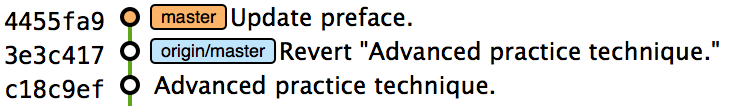
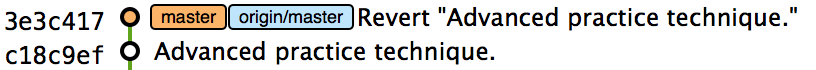
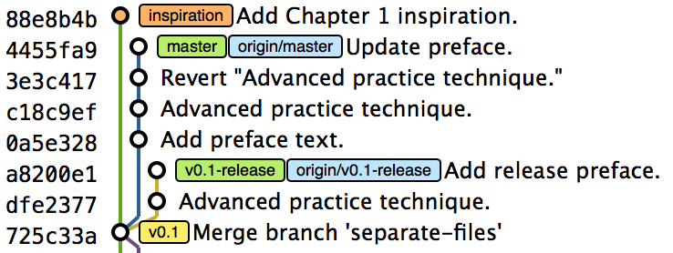
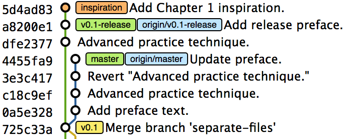
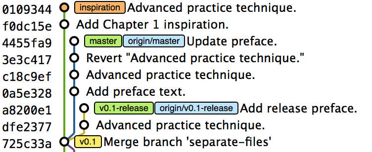
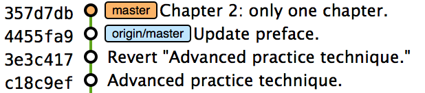
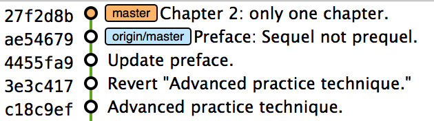
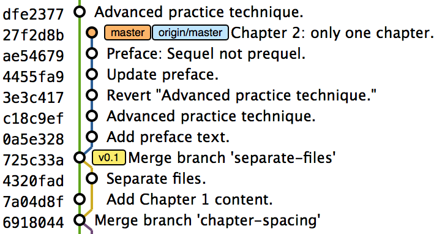

## Rewriting History and Disaster Recovery
ifdef::env-github[:outfilesuffix: .adoc]

In <<01-LocalGit#viewing-history-git-log-gitk-gitx>> we briefly discussed that Git is capable of rewriting the history of a repository. As each repository contains the entire history, this ranges from undoing a single commit to rewriting data on every commit in the repository. I make use of rewriting history regularly to ensure branches that are merged have a clean, readable history made up of small commits before merging. You can read more about this in <<13-MergingVsRebasing#homebrew-s-workflow>> and chapter 14.

In this chapter you will learn about rewriting history by learning the following topics:

* How to use view the history of all changes made to branches over time
* How to make a branch point to a previous commit
* How to change the parent of commits to point to another
* How to force push rewritten history to a remote repository
* How to rewrite the entire history of a branch
* How to avoid losing your work

Before jumping in to rewriting history, let's start by learning about how to avoid losing committed data using `git reflog`.

### List all changes including history rewrites: git reflog
Recall from <<01-LocalGit#parent-commits>> that each commit points to the previous (parent) commit and this is repeated all the way to the branch's initial commit. As a result, the branch pointer can be used to reference not just the current commit it points to, but every previous commit. If a previous commit changes in any way then its SHA-1 hash changes too. This in turn affects the SHA-1 of all its descendent commits.

This provides a good protection in Git from accidentally rewriting history, as all commits effectively provide a checksum of the entire branch up until this point.

Git's _reflog_ (or _reference log_) is updated whenever a commit pointer is updated (like a `HEAD` pointer or branch pointer). This includes previous actions we've seen that don't involve rewriting history such as committing and changing branches.

Let's see the reflog contents for our previous actions on the repository.

#### Problem
You wish to view the state of the reflog for the `HEAD` pointer.

#### Solution
1.  Change to the directory containing your repository; on my system, `cd /Users/mike/GitInPracticeRedux/`.
2.  Run `git checkout master`.
3.  Run `git reflog`. The output should resemble:

.The reflog output
[.long-annotations]
```
# git reflog

3e3c417 HEAD@{0}: checkout: moving from v0.1-release to master <1>
a8200e1 HEAD@{1}: commit: Add release preface. <2>
dfe2377 HEAD@{2}: checkout: moving from master to v0.1-release
3e3c417 HEAD@{3}: revert: Revert "Advanced practice technique." <3>
...
```
<1> Change of branch
<2> New commit
<3> Revert commit

From the reflog output:

* "Change of branch (1)" shows that you called `git checkout` to move from the  `v0.1-release` branch to the `master` branch. This was the most recent action performed and it changed the `HEAD` pointer.
* "New commit (2)" shows that you used `git commit` to create a new commit in the repository with the subject `Add release preface`.
* "Revert commit (3)" shows that you reverted a previous commit, which created a new commit with the message 'Revert "Advanced practice technique."'. Note that this is the same SHA-1 as the "change of branch (1)", as they both point to the latest commit on the `master` branch.

Let's compare this to the current GitX output:

.GitX reflog comparison output
[[gitx-reflog]]
image::diagrams/06-GitXReflog.png[]

You can from <<gitx-reflog>> that the SHA-1s match those in the `git reflog` output:

* The latest commit on the `v0.1-release` branch (`a8200e1`, `HEAD@{1}` )
* The penultimate commit on the `v0.1-release` branch (`dfe2377`, `HEAD@{2}`)
* The latest commit on the `master` branch (`3e3c417`, `HEAD@{0}`, `HEAD@{3}`)

Recall from <<01-LocalGit#refs>> you learned some different types of refs. The `HEAD@{0}` is another type of ref and can be used with commands such as `git log` or `git cherry-pick` to view the state based on that commit. Typically I always prefer to use the SHA-1, as SHA-1s for particular commits never change (even with the history rewriting we'll learn later this chapter), but `HEAD@{0}` for example will change with any action that affects the `HEAD` pointer.

Remember `git stash` from <<03-FilesystemInteractions#temporarily-stash-some-changes-git-stash>>. When you use the `git stash` commands, they don't show in the `git reflog` output. Again, for this reason once you learn about history rewriting in this chapter, I'd recommend making commits and rewriting them later rather than relying too much on `git stash`.

You have viewed the changing state of the `HEAD` pointer by viewing the reflog.

#### Discussion
Running `git reflog` is actually an alias for `git log --walk-reflogs --abbrev-commit --pretty=oneline`. `git reflog` can also take all `git log` flags such as `--max-count` or `--patch`. You can see the `git log` formatting flags in <<04-HistoryVisualization#list-commits-with-different-formatting>>.

Like `git log` if `git reflog` can be passed a ref as the final argument. If this is not specified, it defaults to `HEAD`. For example, you can view how the `master` branch has changed over time by using `git reflog master`.

.Are reflogs shared between repositories?
NOTE: Reflogs are per-repository. They're not shared with other repositories when you `git push` and aren't fetched when you `git fetch`. As a result, they can only be used to see actions that were made within the Git repository on your local machine. Bear this in mind when we're rewriting history: you can easily view previous state on your current machine, but not that from other machines.

### Avoiding and recovering from disasters
Despite the scary phrase "rewriting history," we'll see throughout this chapter that any operation that acts on commits (such as `git rebase`) rather than the working directory (such as `git reset --hard` with uncommitted changes) is easily recoverable using `git reflog` for 90 days after the changes were made.

The main rule to avoid data loss therefore is *commit early and commit often*. Now that you know how to rewrite history, you should think of committing not as a complex operation but similar to a "Save" operation in most other pieces of software. Commit whenever you've written anything useful that you don't want to lose, and then rewrite your history later into a small, readable commits.

The easiest (and most common) way of losing data with Git is when it hasn't been committed, and you accidentally run `git reset --hard` or `git checkout --force` and it's overwritten on disk. This can be somewhat avoided by having regular backups of your repository while you work (such as using Time Machine on OSX) but it's generally better to let Git handle this for you by committing more often.

Another way of securing your data with Git is regularly pushing to remote, work branches that you've agreed nobody else will commit to. If you've agreed that no one else will commit to these work branches, it's reasonable to rewrite and force push to them in the same way that you might rewrite a local branch. This means that these changes will be safe on the remote repository and downloaded by anyone else's `git fetch` from this repository. This is useful in case there is a hardware failure on your machine; you can get back the data from the branch on the remote repository.

If things ever go really badly and you suffer disk corruption with important but unpushed commits in your repository, you can run the `git fsck` tool. This will verify the integrity of the repository and print out any missing or corrupt objects that it finds. You can then remove these corrupt objects, restore them from backups, or check if other users of the same repository have the same objects. Hopefully the corrupted objects aren't those with the most recent work you're wishing to recover.

### Resetting a branch to a previous commit: git reset
In <<03-FilesystemInteractions#revert-a-previous-commit-git-revert>> you learned how to use `git revert` to revert a commit that made changes you want to undo. I stated previously that rewriting history was a bad practice if the commit to be reverted had already been pushed publicly (I'll elaborate more on this in this chapter). But what if the commit hadn't been pushed yet? In this case we can use a command we first saw in <<03-FilesystemInteractions#resetting-files-to-the-last-commit-git-reset>>: `git reset`.

When we used `git reset` previously, we used it either with no arguments (which implies `--mixed`) or with `--hard`. Remember `--hard` resets the index and the working directory and `--mixed` resets the index but not the working directory. In short, `--hard` will discard any uncommitted work, whereas `--mixed` will simply unstage it (effectively reversing a `git add`).

`git reset` can also take an ref as an argument. Rather than just resetting to the last commit, this will allow you to reset a branch to any other commit in the repository.

Let's create a temporary commit (that hasn't been pushed) that we can reset:

1.  Change to the directory containing your repository; on my machine, `cd /Users/mike/GitInPracticeRedux/`.
2.  Run `git checkout master`.
3.  Edit `00-Preface.asciidoc` and make a change to the file.
4.  Run `git commit --message="Update preface." 00-Preface.asciidoc`. The output should resemble the following:

.Commit to be reset output
```
# git commit --message="Update preface." 00-Preface.asciidoc

[master 4455fa9] Update preface.
 1 file changed, 1 insertion(+), 1 deletion(-)
```

.Commit to be reset in GitX
[[gitx-reset-before]]


In <<gitx-reset-before>> you can see the state of GitX after the `git commit`.

In this case let's try resetting to the previous commit on the same branch; an alternative to using `git revert`.

#### Problem
You wish to undo the last commit on the `master` branch.

#### Solution
1.  Change to the directory containing your repository; for example, `cd /Users/mike/GitInPracticeRedux/`.
2.  Run `git checkout master`.
3.  Run `git reset HEAD^`. The output should resemble the following:

.Reset commit output
```
# git reset HEAD^

Unstaged changes after reset: <1>
M	00-Preface.asciidoc <2>
```
<1> Status message
<2> Uncommitted changes

From the reset commit output:

* "Status message (1)" shows that undoing this commit has left some file modified but its modifications haven't yet been added to the index. This could be done later with `git add`.
* "Uncommitted changes (2)" shows that the `00-Preface.asciidoc` file is currently in a modified state after the reset operation.

.GitX after commit reset
[[gitx-reset-after]]


In <<gitx-reset-after>> you can see the state of GitX after the `git reset`. The commit that was created by the `git commit` command has now disappeared from GitX.

You have reset the `master` branch pointer to point to a previous commit.

#### Discussion
Remember when I said in <<list-all-changes-including-history-rewrites-git-reflog>> that `git reflog` was useful in avoiding the loss of commits? Let's imagine that you reset the previous commit but later realized this was a mistake. Let's run `git reflog` and see if we can get anything useful from the output:

.Reflog output after reset commit
```
# git reflog HEAD

3e3c417 HEAD@{0}: reset: moving to HEAD^ <1>
4455fa9 HEAD@{1}: commit: Update preface. <2>
3e3c417 HEAD@{2}: checkout: moving from v0.1-release to master
a8200e1 HEAD@{3}: commit: Add release preface.
...
```
<1> Commit reset
<2> New commit

From the reflog output:

* "Change of branch (1)" shows the commit reset operation used to reset the state of the `master` branch to that before this commit. The SHA-1 (`3e3c417`) matches that of the `checkout` before this commit was made.
* "New commit (2)" shows the new commit that was made and then reset. The SHA-1 matches that output from the previous `git commit` command.

You can see that `reflog` has kept the record that this reset was made and the SHA-1s at each stage in this process. Let's use the SHA-1 output by the "new commit (2)" from the reflog (and the previous `git commit` command) to restore this commit again:

1.  Change to the directory containing your repository; on my system, `cd /Users/mike/GitInPracticeRedux/`.
2.  Run `git checkout master`.
3.  Run `git reset 4455fa9`. There will be no output.

.Restored commit in GitX
[[gitx-reset-restored]]


If we now examine <<gitx-reset-restored>>, we'll see that the commit has been restored and the state is exactly the same as that when it was made. The only record that the reset was ever made is now in the `git reflog`.

Now run `git push` to send the commit to the remote repository.

.When are commits removed from the reflog?
NOTE: Commits in the reflog that are older than 90 days and not ancestors of any other newer commit in the reflog will be removed by the `git gc` command. `git gc` can be run manually, but never needs to be, as it's run periodically by commands such as `git fetch`. In short, when you've removed a commit from all branches, you have 90 days to recover the data before Git will destroy it. In my experience this is more than enough; typically if I haven't remembered that I accidentally removed a commit within a few days then I never will.

.What's the difference between `git reset` and `git checkout`?
NOTE: `git reset` modifies the current branch pointer so it points to another commit. `git checkout` modifies the `HEAD` pointer so it points to another branch (or, rarely, commit). If you're on the `master` branch then `git reset --hard v0.1-release` sets the `master` branch to point to the top of the `v0.1-release` branch, whereas `git checkout v0.1-release` changes the current branch (the `HEAD` pointer) to point to the `v0.1-release` branch.

`git reset` can also take a list of paths as the last arguments to the command. These can be separated using a `--` between the ref and the list of paths. The `--` is optional but makes more explicit the separation between the ref and paths. After all, it's possible (if unlikely) that you could have a file and path with the same name.

For example, to reset the contents of the `00-Preface.asciidoc` file to the previous commit, you'd run `git reset HEAD^ -- 00-Preface.asciidoc`.

In addition to `--hard` and `--mixed`, `git reset` can also take a `--soft` argument. The `--soft` can be compared to `--mixed` and `--hard` as seen earlier. Where `--hard` reset the index staging area and working tree (discards all the changes) and `--mixed` reset the staging area but not the working tree (leaves the changes but removes them from the staging area), `--soft` will reset neither the staging area or working tree but just changes the `HEAD` pointer to point to the previous commit. This means that if you ran `git commit` (with no other arguments) after a `git reset --soft HEAD^`, the contents of the index staging area (and therefore the commit) would be the same as the commit that had just been reset.

You can also perform a combined reset and commit operation to modify the previous commit using `git commit --amend`. `git commit --amend` resets to the previous commit and then creates a new commit with the same commit message as the commit that was just reset. It uses `git reset --soft HEAD^` and then runs `git commit --reedit-message` with the previous (now reset) commit as an argument. This means that it'll add anything you have currently added to the index staging area to the changes from the previous commit and prompt for a new commit message. I most commonly use this to adjust the previous commit message if I realize I've made a typo or omitted useful information.

### Rebase commits on top of another branch: git rebase
Recall from <<02-RemoteGit#pushing-a-local-branch-remotely>> that rebasing is similar to merging but requires rewriting history.

Let's create a branch that we can rebase:

1.  Change to the directory containing your repository; for example, `cd /Users/mike/GitInPracticeRedux/`.
2.  Run `git checkout -b inspiration v0.1`.
3.  Edit `01-IntroducingGitInPractice.asciidoc` and make a change to the file.
4.  Run `git commit --message="Add Chapter 1 inspiration." 01-IntroducingGitInPractice.asciidoc`. The output should resemble the following:

.Commit to be rebased output
```
# git commit --message="Add Chapter 1 inspiration."
  01-IntroducingGitInPractice.asciidoc

[inspiration 88e8b4b] Add Chapter 1 inspiration.
 1 file changed, 1 insertion(+)
```

.Newly created inspiration branch
[[gitx-rebase-before]]


In <<gitx-rebase-before>> can see the new `inspiration` branch. It has a single commit, and the parent of that commit is the commit that has the `v0.1` tag.

Now let's rebase this branch.

#### Problem
You wish to rebase the `inspiration` branch on top of the `v0.1-release` branch

#### Solution
1.  Change to the directory containing your repository; on my machine, `cd /Users/mike/GitInPracticeRedux/`.
2.  Run `git checkout inspiration`
3.  Run `git rebase v0.1-release`. The output should resemble the following:

.Rebase output
```
# git rebase v0.1-release

First, rewinding head to replay your work on top of it... <1>
Applying: Add Chapter 1 inspiration. <2>
```
<1> HEAD rewound
<2> Applying commit

From the rebase output:

* "HEAD rewound (1)" shows that Git is moving the HEAD pointer to the latest commit on the `v0.1-release` branch. It's doing this so it can apply the newly created commit on the `inspiration` branch with the latest commit on the `v0.1-release` branch as its parent.
* "Applying commit (2)" shows a list of each of the commits (in this case only one) that are recreated on the branch. Effectively, each commit on the branch being rebased is cherry-picked (recall from <<05-AdvancedBranching#add-a-single-commit-to-the-current-branch-git-cherry-pick>>) on top of the new "base"; the latest commit on the `v0.1-release` branch. As their parent commits have changed, so do the SHA-1s of all the commits.

.Rebased inspiration branch
[[gitx-rebase-after]]


In <<gitx-rebase-after>> you can see the rebased `inspiration` branch. It still has a single commit but that commit's parent is now the latest commit on the `v0.1-release` branch rather than the commit tagged `v0.1`. Note that GitX reflowed and recolored some of the branches; `master` is now to the right of `v0.1-release` and `v0.1-release` is now green. This doesn't have any significance beyond GitX trying to make the output more readable.

Note that some editions of the book are in printed in grayscale, so these colors may not be visible. Instead please compare them to GitX on your computer.

You have rebased the `inspiration branch` on top of the `v0.1-release` branch.

#### Discussion
The argument to `git rebase` can be any ref. You could rebase on an arbitrary commit, but this is generally a bad idea. You should usually rebase on top of either an updated branch a different branch/tag.

If you made multiple commits to the wrong branch, you can't use `git rebase` as-is to fix this. But this is possible with `git rebase --interactive`, which you'll see in <<rebase-commits-interactively-git-rebase-interactive>>.

Let's look at the reflog again to see what effects the rebase had:

.Reflog output after rebase
[.long-annotations]
```
# git reflog

5d4ad83 HEAD@{0}: rebase finished: returning to refs/heads/inspiration <1>
5d4ad83 HEAD@{1}: rebase: Add Chapter 1 inspiration. <2>
a8200e1 HEAD@{2}: rebase: checkout v0.1-release <3>
88e8b4b HEAD@{3}: commit: Add Chapter 1 inspiration. <4>
725c33a HEAD@{4}: checkout: moving from master to inspiration
4455fa9 HEAD@{5}: reset: moving to 4455fa9
3e3c417 HEAD@{6}: reset: moving to HEAD^
...
```
<1> Rebase completion
<2> Rebased commit
<3> Rebase checkout
<4> Commit pre-rebase

From the reflog output after rebase:

* "HEAD rewound (1)" shows that the rebase operation has completed successfully, so the `inspiration` branch was updated to point to the rebased commit.
* "Rebased commit (2)" shows the new commit that was created with the parent pointing to the latest commit on the `v0.1-release` branch. The `inspiration` branch was updated after this commit was successfully created. This avoids a situation where a failed rebase operation leaves a branch in an inconsistent state.
* "Rebase checkout (3)" shows the beginning of the rebase operation by checking out the `v0.1-release` branch that is being used as a new parent.
* "Commit pre-rebase (4)" shows the new commit that was made before it was rebased.

If we wanted to undo this operation, we could run `git branch --force inspiration 88e8b4b` to reset the `inspiration` branch pointer to point back to the existing commit, essentially undoing the rebase.

Sometimes `git rebase` operations may fail in a similar way to `git merge` or `git cherry-pick` operations. There may be a merge conflict where changes have been made to the same parts of the same files that have been modified in rebased commits.

The main difference when resolving a `git rebase` (or `git cherry-pick`) conflict is that, as there's no merge commit, it has to be done for each commit at a time.

If the preceding `rebase` had failed, the output would look something like this:

.rebase conflict output
[.long-annotations]
```
First, rewinding head to replay your work on top of it...
Applying: Add Chapter 1 inspiration. <1>
Using index info to reconstruct a base tree...
M	01-IntroducingGitInPractice.asciidoc
Falling back to patching base and 3-way merge...
Auto-merging 01-IntroducingGitInPractice.asciidoc
CONFLICT (content): Merge conflict in
  01-IntroducingGitInPractice.asciidoc
Failed to merge in the changes.
Patch failed at 0001 Add Chapter 1 inspiration.
The copy of the patch that failed is found in:
   /Users/mike/Documents/GitInPracticeRedux/.git/rebase-apply/patch <2>

When you have resolved this problem, run "git rebase --continue".
If you prefer to skip this patch, run "git rebase --skip" instead.
To check out the original branch and stop rebasing, run "git rebase
   --abort". <3>
```
<1> Rebase begins
<2> Merge conflict
<3> Rebase instructions

From the rebase conflict output:

* "Rebase begins (1)" shows the same first two lines as a successful rebase; the HEAD was rewound and Git tries to apply the changes in the commit. The only difference is that, in this case, the changes couldn't be merged automatically.
* "Merge conflict (2)" shows the attempt by rebase to merge the multiple changes that were made to the same file. This may be successful, but in this case the merge failed so `rebase` tells the user to solve it manually.
* "Rebase instructions (3)" shows the instructions involved in solving the rebase conflict. There are three suggested flags:
  `git rebase --continue`::
    This should be run after the normal merge conflict resolution process of manually resolving the conflicts and marking them as fixed using `git add`. This will then continue the rebase operation by rebasing any further commits and, if successful, updating the rebased branch.
  `git rebase --skip`::
    This means that, rather than solving the merge conflicts in this particular commit, the commit is skipped and the next one is applied instead. This may make sense in certain situations where the functionality of this commit has already been made by another commit on the branch you're rebasing on top of making this commit redundant.
  `git rebase --abort`::
    This gives up on the `git rebase` process altogether and returns the branch to its state before the rebase was attempted.

### Rebase commits interactively: git rebase --interactive
You may have thought to yourself given the various reset, cherry-pick, and commit skip options that we've seen in this chapter and the last, that it would be nice if you could somehow combine them to alter the history of a branch into the form you'd like before pushing it elsewhere. Git provides a useful tool for this use case: the `--interactive` (or `-i`) flag for rebase.

For this example, we want to see how empty commits are handled. Normally you'd rarely to do this; it's just to demonstrate how rebase handles them. This can happen after resolving conflicts so that a commit no longer has any changes. You might do this manually if you wanted to trigger an event in a system that monitors your Git repository and triggers events on each new commit, but without having to change any files. To create an empty commit on the inspiration branch:

1.  Change to the directory containing your repository; for example, `cd /Users/mike/GitInPracticeRedux/`.
2.  Run `git checkout inspiration`.
3.  Run `git commit --allow-empty --message "Empty commit"` to create an empty commit. The output should resemble the following:

```
# git commit --allow-empty --message "Empty commit"

[inspiration 26596ad] Empty commit
```

#### Problem
You wish to interactively rebase the history of a branch.

#### Solution
1.  Change to the directory containing your repository; for example, `cd /Users/mike/GitInPracticeRedux/`.
2.  Run `git checkout inspiration`.
3.  Run `git rebase --interactive v0.1`. An editor will appear and the contents should resemble the following:

.interactive rebase git-rebase-todo file
[.long-annotations]
```
pick dfe2377 Advanced practice technique.
pick a8200e1 Add release preface. <1>
pick 5d4ad83 Add Chapter 1 inspiration. <2>
# pick 26596ad Empty commit <3>

# Rebase 725c33a..5d4ad83 onto 725c33a <4>
#
# Commands:
#  p, pick = use commit <5>
#  r, reword = use commit, but edit the commit message <6>
#  e, edit = use commit, but stop for amending <7>
#  s, squash = use commit, but meld into previous commit <8>
#  f, fixup = like "squash", but discard this commit's log message <9>
#  x, exec = run command (the rest of the line) using shell <10>
#
# These lines can be re-ordered; they are executed from top to bottom.
#
# If you remove a line here THAT COMMIT WILL BE LOST.
#
# However, if you remove everything, the rebase will be aborted.
#
# Note that empty commits are commented out
```
<1> V0.1-release
<2> Inspiration commit
<3> Empty commit
<4> Rebase range
<5> pick command
<6> reword command
<7> edit command
<8> squash command
<9> fixup command
<10> exec command

From the interactive rebase git-rebase-todo file:

* "V0.1-release commit (1)" shows the last commit on the `v0.1-release` branch. This shows up here because we're rebasing back on top the `v0.1` tagged commit, so the rebase operation will try to rebase any commit ancestors on the `inspiration` branch that aren't ancestors of the `v0.1` tagged commit. It may be undesirable to have these commits on our new branch but, as mentioned in the file, if you remove this line from the file then the commit will be removed from the rebase. This is effectively the same as if there had been a conflict and you used `git rebase --skip` to skip this commit. Even more powerfully, if you cut a line from here and perform another `git rebase --interactive` operation, as long as the commit still exists (it hasn't been purged due to it being detached from any branch for 90 days), you can paste it back in and `rebase` will include it in this operation.
* "Inspiration commit (2)" shows the last commit that was made on the `inspiration` branch. This has the same commit contents (although a different SHA-1) as the original commit that we rebased on top of the `v0.1-release` branch.
* "Empty commit (3)" shows a commit with no changes. These are commented out with a `#` character. You should never keep empty commits, so `rebase` is removing them for you automatically.
* "Rebase range (4)" shows the range of commits that are being rebased (`725c33a..5d4ad83`) and what commit they're being rebased onto. In this case, the `725c33a` commit is the commit tagged `v0.1`.
* "pick command (5)" (or `p`) is one of several _rebase commands_ that can be selected for each commit in an interactive rebase. The rebase will run through the list of commits from top to bottom and follow the command for each listed commit (skipping any that have been removed). The `pick` command means that the commit should be included in the rebase as-is. If this file is saved and closed without modification then every commit will be picked and the `git rebase --interactive` operation will be identical to what the `git rebase` operation would've been.
* "reword command (6)" (or `r`) is a rebase command that, when it reaches that commit and is ready to apply it, opens a file in an editor, allowing you to customize the commit message. This is particularly useful when you later realize that a commit message was poor and you wish to change it before pushing.
* "edit command (7)" (or `e`) behaves as if there were a merge conflict; before the commit is applied, you'll be dropped into a terminal with the `--continue`/`--skip`/`--abort` options, and you can edit the contents of a commit before proceeding. This is useful when you want to slightly modify a commit perhaps so a later one can apply more cleanly or to change the way you solved a problem in a particular commit.
* "squash command (8)" (or `s`) will merge two or more commits into one. If a commit is marked to be squashed then the preceding commit (or commits if the previous commit was also marked to be squashed) won't be applied until the last adjacent squashed commit is reached. This last commit will then prompt for a commit message (like `edit`), and the default commit message will be a combination of all the commit messages for the commits that have been squashed together. This is useful for combining multiple commits; perhaps the first commit was missing a file which was then added in the second commit. The commits could be squashed, which would mean when they're pushed to the remote repository that no one ever need know that a mistake was made when creating the first commit.
* "fixup command (9)" (or `f`) is very similar to the `squash` command, but it doesn't prompt for a message and instead uses the commit message of the first commit. This is used in situations where you want to combine commits but don't need to change commit messages.
* "exec command (10)" (or `x`) is different than the previous commands in that it doesn't operate on a commit. Instead the rest of the line after `exec` is run at that stage in the `rebase` process. This could be used to print debugging output while performing a rebase operation.

Edit and save the file so the only uncommented lines are the following:

.rebase reorder and fixup
```
pick 5d4ad83 Add Chapter 1 inspiration.
p dfe2377 Advanced practice technique.
f a8200e1 Add release preface.
# ...
```

The output should resemble the following:

.interactive rebase output
```
# git rebase --interactive v0.1

[detached HEAD 0109344] Advanced practice technique. <1>
 2 files changed, 2 insertions(+), 1 deletion(-) <2>
Successfully rebased and updated refs/heads/inspiration. <3>
```
<1> Fixup commit
<2> Fixup diff
<3> Rebase success

From the interactive rebase output:

* "Fixup commit (1)" shows the new commit that was created by the `fixup` command. It has the commit message of the first of the two commits, but contains the changes from both commits.
* "Fixup diff (2)" shows the diffstat for the new commit created by the `fixup` command.
* "Rebase success (3)" shows the successful result of the rebase operation.

.Interactively rebased inspiration branch
[[gitx-rebase-interactive-after]]


<<gitx-rebase-interactive-after>> shows the state of the `inspiration` branch after the interactive rebase. Rather than being how it was before your first `git rebase`, it now has two commits, the latter of which was previously the prior, and contains the contents of two commits.

You have successfully interactively rebased the `inspiration` branch on the `v0.1` tagged commit. Now push it using `git push --set-upstream origin inspiration`.

#### Discussion
Although complex, `git rebase --interactive` allows for powerful workflows (some of which will be seen in later chapters in this book). I typically always use an interactive rebase before I push a branch upstream; it allows me to take stock, and consider what I want the history to look like. The factors I consider are if any commits are now redundant or simply cleaning up previous commits, can any commit messages be improved, do any commits need to be reordered to make more sense, and do any commits need to be removed altogether or moved to other branches? `git rebase --interactive` allows me to do this for all my commits in an ordered process, so it works as a particularly effective review-and-modification tool.

Part 3 will cover some workflows, in which `git rebase --interactive` is a key part.

### Pull a branch and rebase commits: git pull --rebase
Rebasing is often useful when you're pulling commits into your current branch. You almost certainly don't want to create a merge commit just because you've made commits on your current branch and want to fetch new commits from upstream. A merge commit will be created, however, if you've committed on this branch and pull in new commits. Instead of creating a merge conflict, you can use `git pull --rebase`.

To test `git pull --rebase`, let's create another clone of the same repository, make a new commit, and `git push` it. This will allow downloading new changes with `git pull --rebase` on the original remote repository.

To create another cloned, local repository and push a commit from it:

1.  Change to the directory where you want the new `GitInPracticeRedux` repository to be created; for example, `cd /Users/mike/` to create the new local repository in `/Users/mike/GitInPracticeReduxPullTest`.
2.  Run `git clone https://github.com/GitInPractice/GitInPracticeRedux.git GitInPracticeReduxPullTest` to clone into the `GitInPracticeReduxPullTest` directory.
3.  Change directory to the new Git repository; in my case, `cd /Users/mike/GitInPracticeReduxPullTest/`.
4.  Modify the `00-Preface.asciidoc` file.
5.  Run `git commit --message 'Preface: Sequel not prequel.' 00-Preface.asciidoc`.
6.  Run `git push`.

Now let's create a commit in our main, local repository:

1.  Change to the directory containing your repository; in my case, `cd /Users/mike/GitInPracticeRedux/`.
2.  Run `git checkout master`.
3.  Edit `02-AdvancedGitInPractice.asciidoc` and make a change to the file.
4.  Run `git commit --message="Chapter 2: only one chapter." 02-AdvancedGitInPractice.asciidoc`. The output should resemble the following:

.Commit to be reset output
```
# git commit --message="Chapter 2: only one chapter."
  02-AdvancedGitInPractice.asciidoc

[master 357d7db] Chapter 2: only one chapter.
 1 file changed, 1 insertion(+), 1 deletion(-)
```

.Commit before pull rebase
[[gitx-pull-rebase-before]]


<<gitx-pull-rebase-before>> shows the state of the `master` branch before the `git pull --rebase` operation. Now let's perform a pull with a rebase.

#### Problem
You want to pull commits from `origin/master` and rebase your current commits in `master` on top of the upstream changes.

#### Solution
1.  Change to the directory containing your repository; for example, `cd /Users/mike/GitInPracticeRedux/`.
2.  Run `git pull --rebase`. The output should resemble the following:

.rebase pull output
```
# git pull --rebase

remote: Counting objects: 3, done.
remote: Compressing objects: 100% (3/3), done.
remote: Total 3 (delta 0), reused 0 (delta 0)
Unpacking objects: 100% (3/3), done.
From https://github.com/GitInPractice/GitInPracticeRedux
   4455fa9..ae54679  master     -> origin/master <1>
First, rewinding head to replay your work on top of it...
Applying: Chapter 2: only one chapter. <2>
```
<1> Fetch output
<2> Rebase output

Recall that `git pull` is equivalent to running `git fetch && git merge`, and `git pull --rebase` is the equivalent to running `git fetch && git rebase`

From the rebase pull output:

* "Fetch output (1)" shows the output of the fetch operation. This is the same as if you'd run `git fetch`.
* "Rebase output (2)" shows the output of the successful rebase operation. The one commit that had already been made on your local `master` branch is rebased on top of the latest commit in the `origin/master` remote branch. This is the same as if you had run `git rebase origin/master` after `git fetch`.

.Commit after pull rebase
[[gitx-pull-rebase-after]]


<<gitx-pull-rebase-after>> shows the state of the `master` branch after the `git pull --rebase` operation. You can see that there's a new commit from `origin/master` (`ae54679`) and that the previous top commit on the local `master` branch has been rebased on top of this and has a new SHA-1 (`27f2d8b`). This works identically if there are multiple commits that need rebased.

You have pulled with a rebase. Now `git push` to send these commits upstream.

#### Discussion
`git pull --rebase` is sometimes recommended as a sensible default to use instead of `git pull`. You rarely will want to create a merge commit on a `git pull` operation, so using `git pull --rebase` guarantees that this won't happen. This means when you do push this branch, it will have a simpler, cleaner history. Once you understand how to rebase and solve conflicts, I'd recommend using `git pull --rebase` by default.

### Rewriting history on a remote branch: git push --force
If you modify history on a branch then trying to perform a `git push` operation on it will fail. This is to stop you accidentally writing remote history that other users are relying on. It's possible to do this but you need to be more explicit in your syntax to indicate that you're aware that you're performing a dangerous operation.

Let's try and rebase the `inspiration` branch again and push it:

1.  Change to the directory containing your repository; on my system, `cd /Users/mike/GitInPracticeRedux/`.
2.  Run `git checkout inspiration`.
3.  Run `git push` to ensure all the changes are up-to-date.
4.  Run `git rebase v0.1-release`.
5.  Run `git push` again. The output should resemble the following:

.Rewritten history push failure output
[.long-annotations]
```
# git push

To https://github.com/GitInPractice/GitInPracticeRedux.git
 ! [rejected]        inspiration -> inspiration (non-fast-forward) <1>
error: failed to push some refs to
  'https://github.com/GitInPractice/GitInPracticeRedux.git'
hint: Updates were rejected because the tip of your current branch
  is behind
hint: its remote counterpart. Integrate the remote changes (e.g.
hint: 'git pull ...') before pushing again.
hint: See the 'Note about fast-forwards' in 'git push --help'
  for details. <2>
```
<1> Local/remote branches
<2> Push failure

From the rewritten history push failure output:

* "Local/remote branches (1)" shows the local `inspiration` branch that we attempted to push to the remote `inspiration` branch. Unfortunately this request was rejected because it was a `non-fast-forward`--it wouldn't be advancing the current history but instead rewriting it.
* "Push failure (2)" shows the error message from `git push`. It fails because the branch you're pushing lacks changes from the branches you're pushing to. This is because it's not easily possible for the remote repository to know whether you have commits on that branch you need to `fetch` before pushing or whether you've modified the existing history of a branch.

Instead let's learn how to force this push operation to rewrite the history on this remote branch.

#### Problem
You wish to rewrite the history on the remote `origin/inspiration` branch based on the contents of the local `inspiration branch`.

#### Solution
1.  Change to the directory containing your repository; for example, `cd /Users/mike/GitInPracticeRedux/`.
2.  Run `git checkout inspiration`.
3.  Run `git pull --rebase`.
4.  Run `git push origin +inspiration` again. The output should resemble the following:

.Rewritten history push output
```
# git push origin +inspiration

Counting objects: 1, done.
Writing objects: 100% (1/1), 204 bytes | 0 bytes/s, done.
Total 1 (delta 0), reused 0 (delta 0)
To https://github.com/GitInPractice/GitInPracticeRedux.git
 + 0109344...ca74d2b inspiration -> inspiration (forced update) <1>
```
<1> Forced update

From the forced push output:

* "Forced update (1)" shows the `git push` output as usual but with a `(forced update)` indicating that it was forced to allow non-fast-forwards on the remote.

You have rewritten the history on a remote branch.

#### Discussion
You can also use `git push --force` instead of specifying the remote branch name prefixed with a `+`, but this is not advised as it's less safe; depending on your Git configuration, you could accidentally force-push multiple branches at once. By default in some Git versions (which I tell you how to change later in <<07-PersonalizingGit#using-the-new-push-defaults>>), a push will push all branches with matching local and remote branch names, so these will all be force-pushed if `git push --force` is run without parameters.

Remember the reflog isn't pushed remotely, so if you unintentionally rewrite history on the remote branch, there's no way to recover commits you didn't have locally without direct access to the Git repository on the server. For this reason, you should be careful when rewriting remote branches. A good rule of thumb is to only ever do it on branches that nobody else is using. Avoid doing it on shared branches, and never do it on the `master` branch. Also, ensure you do a `git pull` immediately before any forced push to try to ensure you aren't rewriting commits that are on the remote branch that you don't have locally. Of course, it's still possible that someone pushes a commit just after you do a `git pull`, which you overwrite (which is why `git push --force` is a dangerous operation).

### Rewriting the entire history of a branch: git filter-branch
There are times when rewriting a few commits isn't enough; you want to rewrite the entire history of a branch. Perhaps you accidentally committed confidential files early in the project that you want to remove, or you want to split a large repository into multiple smaller ones.

Git provides a tool called `git filter-branch` for these cases; it will iterate through the entire history of a branch and allow rewriting every commit as it does so. This can be used to rewrite all the commits in an entire repository.

To avoiding messing up our current local repository lets create another cloned, local repository:

1.  Change to the directory where you want the new `GitInPracticeRedux` repository to be created; for example, `cd /Users/mike/` to create the new local repository in `/Users/mike/GitInPracticeReduxFilterTest`.
2.  Run `git clone https://github.com/GitInPractice/GitInPracticeRedux.git GitInPracticeReduxFilterTest` to clone into the `GitInPracticeReduxFilterTest` directory.
3.  Change directory to the new Git repository; on my machine, `cd /Users/mike/GitInPracticeReduxFilterTest/`.

.GitX before filter-branch
[[gitx-filter-branch-before]]


<<gitx-filter-branch-before>> shows the partial output from GitX after the `git clone` command focusing on the `master` branch. Now let's remove references to the preface file from the `master` branch.

#### Problem
You wish to remove all references to the file `00-Preface.asciidoc` on the `master` branch.

#### Solution
1.  Change to the directory containing your filter test repository; for example, `cd /Users/mike/GitInPracticeReduxFilterTest/`.
2.  Run `git filter-branch --prune-empty --index-filter "git rm --cached --ignore-unmatch 00-Preface.asciidoc" master`. The output should resemble the following:

.filter-branch file removal output
```
# git filter-branch --prune-empty --index-filter <1>
  "git rm --cached --ignore-unmatch 00-Preface.asciidoc" master <2>

Rewrite 4320fad6a58b105b8a1001f4f0da0258aa622feb (13/20)rm <3>
  '00-Preface.asciidoc' <4>
Rewrite 725c33ace6cd7b281c2d3b342ca05562d3dc7335 (14/20)rm
  '00-Preface.asciidoc'
Rewrite 0a5e3285e46900c7aa819d66e87d0c418a1c2f14 (15/20)rm
  '00-Preface.asciidoc'
Rewrite c18c9ef9adc73cc1da7238ad97ffb50758482e91 (16/20)rm
  '00-Preface.asciidoc'
Rewrite 3e3c417e90b5eb3c04962618b238668d1a5dc5ab (17/20)rm
  '00-Preface.asciidoc'
Rewrite 4455fa9c237f43e6b08f6190384579aa6ddad5cb (18/20)rm
  '00-Preface.asciidoc'
Rewrite ae54679129ba8521265a750fc0e109add45414ac (19/20)rm
  '00-Preface.asciidoc'
Rewrite 27f2d8b0a72427caf290e5127ab79533a0bc2867 (20/20)rm
  '00-Preface.asciidoc'

Ref 'refs/heads/master' was rewritten <5>
```
<1> filter command
<2> remove command
<3> Rewritten commit
<4> Removed filename
<5> Branch rewritten

From the filter-branch file removal output:

// BEN: same comment as earlier: Manning doesn't really do definition lists like this; we use bulleted lists like * TERM---This term...
* "filter command (1)" (`git filter-branch`) takes the following flags:
  `--prune-empty` flag::
    This discards any now empty commits (those that only changed the `00-Preface.asciidoc`) as they're no longer needed.
  `--index-filter` flag::
    This rewrites the index of each commit given a command to run on each commit.
  `master` branch argument::
    This specifies which branch should be traversed and rewritten.
* "remove command (2)" is passed as a string (surrounded by `"`) and is the command that's run by `git filter-branch` on each commit. Here the `git rm` takes the following flags:
  `--cached` flag::
    This removes the file from the index. As this is an index filter, that is all that's necessary to remove it from the commit; it doesn't have to be removed from disk (which would be slower).
  `--ignore-unmatch` flag::
    This specifies that the command should be successful even if the specified file (`00-Preface.asciidoc`) doesn't exist on the current commit.
* "Rewritten commit (3)" shows a the first commit in which the index filter found the specified file (`00-Preface.asciidoc`). The newly created commit will have a different SHA-1 to that of the original commit listed here (`4320fad6a58b105b8a1001f4f0da0258aa622feb`).
* "Removed filename (4)" shows the filename that was specified to `git rm` and has been removed from this commit.
* "Branch rewritten (5)" shows that the `master` branch was changed by the `git filter-branch` operation. If it wasn't, instead it would show `WARNING: Ref 'refs/heads/master' is unchanged`.

.GitX after filter-branch
[[gitx-filter-branch-after]]
image::screenshots/06-GitXFilterBranchAfter.png[]

<<gitx-filter-branch-after>> shows the output from GitX after the `git filter-branch` command from the first point, at which they diverge (which is the first commit containing the `00-Preface.asciidoc` file). All commits that referenced the file have been changed, and all those that only changed this file have been pruned, as they were empty. You can see that the `origin/master` remote branch also has a identical ref named `refs/original/refs/heads/master`. This is used as a backup so the original `master` can be restored by `git branch --force master refs/original/refs/heads/master` if desired.

You have removed all references to `00-Preface.asciidoc` on the `master` branch.

#### Discussion
`filter-branch` is a relatively niche command that is used only in fairly dramatic circumstances such as killing a project but extracting parts of it into a library, filtering history before open-sourcing a repository, or removing confidential information that was accidentally committed over a long period of time.

`git filter-branch` can take the following arguments:

* `--all`--Runs on every branch rather than just the named one. This can be used to rewrite entire repositories rather than just single branches.
* `--force` (or `-f`)--Needed to perform a second `filter-branch` on the same branch in a repository (which would overwrite the backup). Otherwise the following message is output:
```
Cannot create a new backup.
A previous backup already exists in refs/original/
Force overwriting the backup with -f
```
* `--env-filter`--Allows changing environment variables to change the metadata for each commit. For example, you could set the `GIT_AUTHOR_EMAIL` for each commit to change the email for every commit or change it conditionally to change it for a particular author.
* `--tree-filter`--Allows rewriting the contents of the working directory tree. It will check out every revision and then allow modification of it. The command in this example could've instead been done with a tree filter (`git filter-branch --tree-filter "rm 00-Preface.asciidoc" master`) but this would check out and delete the files from disk every time, which would be slower than the `--index-filter` we used.
* `--msg-filter`--Allows rewriting commit messages. This can be useful in removing confidential information (or swearwords) from commit messages.
* `--subdirectory-filter`--Can filter the history to those commits that touch a particular subdirectory. It also makes that subdirectory the new project root. This can be useful when splitting a large repository into multiple smaller repositories based on existing subdirectories.
* `--parent-filter`--can change commit parents. `--commit-filter` can vary commit commands and `--tag-name-filter` modifies tag names, but these tend to be less widely used.

This book doesn't seek to cover all these flags in the same detail as this example. The best approach to learn more about this functionality is to read `git filter-branch --help` and experiment on duplicated local repositories.

### Summary
In this chapter you hopefully learned:

* How to use `git reflog` to reference log and see how `HEAD` and branch pointers have changed over time
* How to use `git reset` to reset a branch to point to any other commit
* How to use `git rebase` to reparent commits, the `--interactive` flag to rearrange history on demand, and `git pull --rebase` to avoid merge conflicts when pulling changes
* How to use `git push origin +branchname` to force-push commits and rewrite history on remote branches
* How to use `git filter-branch` to rewrite the entire history of one or more branches
* How to use avoid disaster by committing regularly
