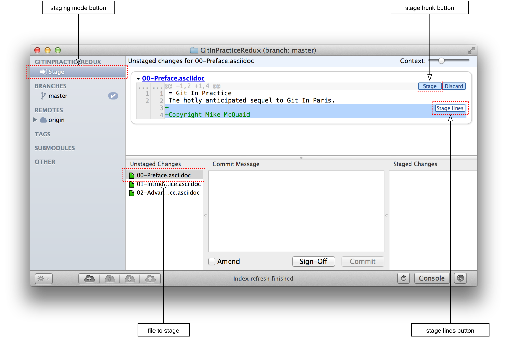
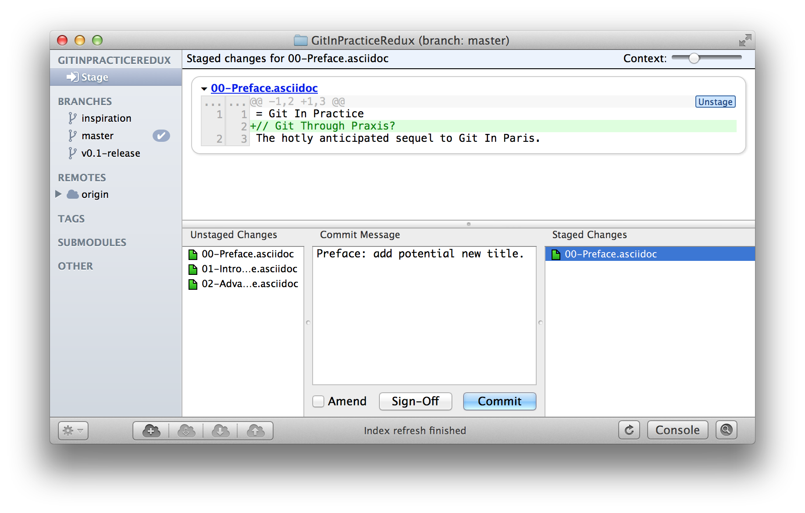
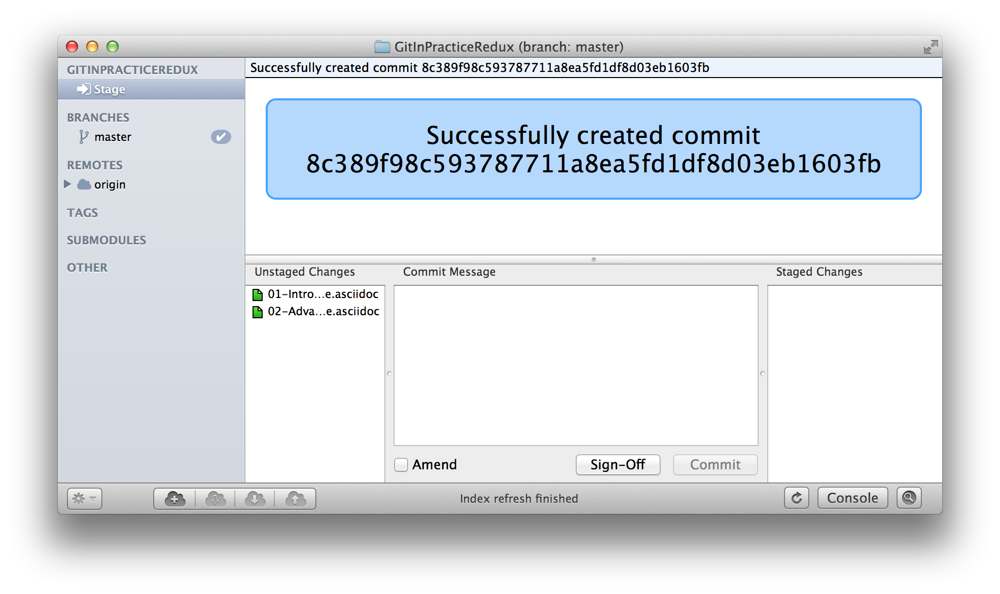
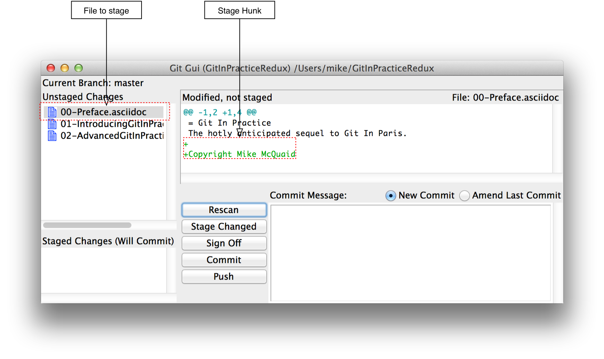
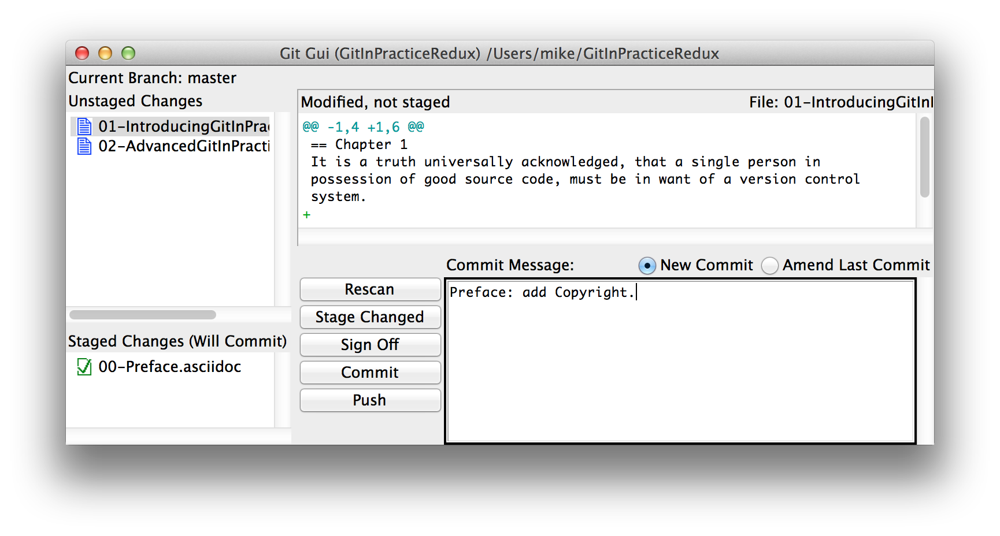

## Creating a clean history
ifdef::env-github[:outfilesuffix: .adoc]

In this chapter you will learn how to create a clean history by learning the following topics:

* How to write a good commit message
* How to build a commit using only certain changes in a file
* How to build a commit using a graphical application
* How to avoid committing bad whitespace

### Writing a good commit message
We saw already in <<01-IntroductionToLocalGit#viewing-history-git-log-gitk-gitx>> why small commits are better and how commit messages should be formatted. Let's go into a bit more detail on what is a good format to use when writing your commit messages and why.

Below is an example of a good commit message format. It's strongly influenced by
a guide written by Time Pope which is now at
http://tbaggery.com/2008/04/19/a-note-about-git-commit-messages.html.

.Good commit message format
```
Commits: first line is a summary (<51 characters).

Commit messages should be structured like emails. The first line (the
commit subject) should be treated like the subject of an email. It
should make a brief summary that is elaborated on in the rest of the
commit message. It should have 50 characters or fewer and always be
separated by a new line from the rest of the commit message body.
Without this new line various output formats that try to display only
the first line of the commit may get confused.

The commit's message body can be split into multiple paragraphs which
should be wrapped at 72 characters or fewer. The wrapping is done to
ensure the output of tools like `git log` remains readable even when it
adds indentation for e.g. diffs. Otherwise the commit message has no
other limits on length; it should be as long as it needs to be to fully
explain the commit. While the subject might describe what the commit
does the body should expand on why the change was made. It should also
use the present tense to match the tense used by commit messages
generated by commands such as git merge.

If you're using GitHub then the contents of commit messages can contain
Markdown. You may use Markdown to add some formatting that looks good
in ASCII or rendered such as using **bold**, _italics_,
~~strikethrough~~, `monospace` or lists bulleted with a `*` or numbered
with e.g. `1.`. You shouldn't go overboard with this but it can add
some useful, basic formatting.
```

### Building a commit from parts of files
We've seen previously in the book how to create commits from all the changes in an individual file. As commits should be as small as possible (recall <<01-IntroductionToLocalGit#viewing-history-git-log-gitk-gitx>>) sometimes there may be multiple changes made to a file that you want to split into multiple commits. Of course you could manually undo and redo these changes to the files but that would be rather tedious. Thankfully Git provides you with various tools to add only certain changes in certain files to the index staging area or directly commit them.

`git add` has a `--patch` (or -`p`) flag that provides an interactive menu in which you can select what parts of files you want to add. Make some changes to every file in the `GitInPracticeRedux` repository and run `git add --patch`:

.Patch add output
```
# git add --patch

diff --git a/00-Preface.asciidoc b/00-Preface.asciidoc
index d7aa4f8..2096879 100644
--- a/00-Preface.asciidoc
+++ b/00-Preface.asciidoc
@@ -1,2 +1,4 @@
 = Git In Practice
 The hotly anticipated sequel to Git In Paris.
+ <1>
+Copyright Mike McQuaid
Stage this hunk [y,n,q,a,d,/,e,?] ? <2>
y - stage this hunk
n - do not stage this hunk
q - quit; do not stage this hunk nor any of the remaining ones
a - stage this hunk and all later hunks in the file
d - do not stage this hunk nor any of the later hunks in the file
g - select a hunk to go to
/ - search for a hunk matching the given regex
j - leave this hunk undecided, see next undecided hunk
J - leave this hunk undecided, see next hunk
k - leave this hunk undecided, see previous undecided hunk
K - leave this hunk undecided, see previous hunk
s - split the current hunk into smaller hunks
e - manually edit the current hunk
? - print help <3>
...
```
<1> hunk line
<2> stage question
<3> help lines

From the patch add output:

* "hunk line (1)" shows the first line of the two-line _hunk_. A hunk is one or more nearby lines that have all been changed and Git groups them together.
* "stage question (2)" shows the available options for this particular hunk. I selected `?` which printed the shown help output.
* "help lines (3)" shows the help output with all the different available options.

You can see from the help lines there are many different options available at each stage. It's particularly worth noting `s`; it allows splitting hunks into smaller ones. If entered repeatedly this can allow staging any selection of individual lines. The other options are less widely used and should be fairly self-explanatory.

After viewing the help I answered `y` to stage the hunk shown in the above example and `q` to not stage any of the remaining hunks. After doing this the `git status` output should resemble:

.Status output after patch add
```
# git status

On branch master
Your branch is up-to-date with 'origin/master'.

Changes to be committed:
  (use "git reset HEAD <file>..." to unstage)

	modified:   00-Preface.asciidoc <1>

Changes not staged for commit:
  (use "git add <file>..." to update what will be committed)
  (use "git checkout -- <file>..." to discard changes in working
  directory)

	modified:   01-IntroducingGitInPractice.asciidoc <2>
	modified:   02-AdvancedGitInPractice.asciidoc
```
<1> staged file
<2> unstaged file

From the status output after patch add:

* "staged file (1)" shows the file that had a hunk staged. If there was more than one hunk in this file and we only staged one then it would be shown in both the "Changes to be committed" and "Changes not staged for commit" sections.
* "unstaged file (2)" shows the two files that have changes but none of them were staged.

Let's undo this add to the staging area now by running `git reset master`.

`git commit` also has a `--patch` (or `-i` but, confusingly, not `-p`) flag. It also provides the same interactive menu. Now run `git commit --patch --message "Preface: add Copyright."`:

.Patch commit output
```
# git commit --patch --message "Preface: add Copyright."

diff --git a/00-Preface.asciidoc b/00-Preface.asciidoc
index d7aa4f8..2096879 100644
--- a/00-Preface.asciidoc
+++ b/00-Preface.asciidoc
@@ -1,2 +1,4 @@
 = Git In Practice
 The hotly anticipated sequel to Git In Paris.
+
+Copyright Mike McQuaid
Stage this hunk [y,n,q,a,d,/,e,?]? y
...
[master da31662] Preface: add Copyright. <1>
 1 file changed, 2 insertions(+)
```
<1> new commit

I performed the same actions with `git commit --patch` as with `git add --patch`; I staged the first hunk with `y` and then did not stage any of the others with `q`. The output is appended with the "new commit (1)" information that we'd expect from `git commit` but otherwise identical to that from `git add --patch`.

Now run `git reset HEAD^` to undo the current commit so we can try and stage hunks graphically.

### Graphically building a commit from parts of files
GitX provides a staging mode that also allows adding entire files or individual hunks to staging provides support for graphically staging hunks. If you click on the "Stage" in the top-right of GitX it should resemble the following:

.GitX stage mode
[[gitx-stage]]


You can see from <<gitx-stage>> the staging mode shows a selection of files to stage, the changes to the selected file and allows staging of hunks or selected lines through their respective buttons. Either select all the lines and click on the `Stage lines` button or click the `Stage` button in the top-right.

.GitX staged hunk
[[gitx-staged-hunk]]


<<gitx-staged-hunk>> shows after the changes to the file were staged and a commit message has been entered. The file has moved from the `Unstaged Changes` to the `Staged Changes` file list. If the file had some hunks that had been staged and some that had not it would be present in both file lists.

The staging area used by GitX is the same staging area used by the rest of Git. If you quit GitX now and ran `git status` you would see the same result as before: `00-Preface.asciidoc` had been staged.

Now that there are some staged changes the `Commit` button has become enabled. After the commit message has been entered you can click it.

.GitX stage mode commit
[[gitx-stage-commit]]


Now that the changes have been committed <<gitx-stage-commit>> shows a large message with the new SHA-1. The `Unstaged Changes` remain the same but the `Staged Changes` were used to create the new commit so have now been removed from this list.

Although GitX combines staging and viewing history into one application by default Git provides two GUI applications for this: `gitk` (first seen in <<01-IntroductionToLocalGit#viewing-history-git-log-gitk-gitx>>) and `git gui`.

Run `git reset HEAD^` to undo the current commit so we can try and stage hunks using Git GUI. Now run `git gui`:

.Git GUI
[[git-gui]]


<<git-gui>> shows the Git GUI user interface. It is similar to GitX 's stage mode but the two `Unstaged Changes` and `Staged Changes (Will Commit)` file lists are shown on the left hand side rather than left and right of the commit message.

You select the file whose changes you want to view by clicking on it in the `Unstaged Changes` list. To stage hunks requires you to right-click on the relevant hunk.

.Git GUI right-click menu
[[git-gui-right-click]]
image::screenshots/08-GitGUIRightClickMenu.png[]

The right-click menu should resemble <<git-gui-right-click>>. You can select individual hunks or lines and various other options. In this case click `Stage Line For Commit`.

.Git GUI staged
[[git-gui-staged]]


<<git-gui-staged>> shows that a line has been staged in `00-Preface.asciidoc` as it is now displayed in the `Staged Changes (Will Commit)` list. You can now enter a commit message and press `Commit`.

After pressing this there is no sign of the commit other than the `00-Preface.asciidoc` being removed from the `Staged Changes (Will Commit)` list. Like GitX though, it has successfully committed a file.

### Avoiding whitespace issues
Git expects certain whitespace usage in files.

To ensure your whitespace matches good Git practice ensure:

* no lines in files end with whitespace i.e. trailing tab or space characters
* no lines in files start the line with one or more space characters and follow it immediately with one or more tab characters
* all files end with one or more new line character(s) i.e. a line-feed character on Unix or a carriage-return and a line-feed character on Windows

You can check you haven't violated any of these rules by running `git diff --check`. For example, if we added some whitespace errors to `00-Preface.asciidoc` the output might resemble:

.diff whitespace check output
```
# git diff --check

00-Preface.asciidoc:1: trailing whitespace. <1>
+= Git In Practice
00-Preface.asciidoc:2: space before tab in indent. <2>
+       The hotly anticipated sequel to Git In Paris.
```
<1> trailing whitespace
<2> space before tab

From the diff whitespace check output:

* "trailing whitespace (1)" shows that on line 1 of `00-Preface.asciidoc` there was whitespace at the end of the line.
* "space before tab (2)" shows the on line 2 of `00-Preface.asciidoc` there was a space character before a tab character at the beginning of the line.

Regular `git diff` (but, bizarrely, not `git diff --check`) will show `\ No newline at end of file` if the file's trailing newline is missing. If you have Git 2.0 or newer or enabled colored output in <<07-GitShortcuts#colored-output-in-git>> `git diff` will display whitespace errors with a red background.

It's also worth checking if you can configure your text editor of choice to fix any of these errors up for you when you save files. It is a fairly commonly available feature.

### Summary
In this chapter you hopefully learned:

* How to use an email format and Markdown to write good commit messages
* How to use `git add --patch` or `git commit --patch` to stage only chosen hunks for a new commit
* How to use GitX or Git GUI to stage only selected lines or hunks for a new commit
* How to use `git diff --check` to make sure you haven't added any bad whitespace changes

Now let's compare the CMake and Homebrew open-source projects branching strategies to learn about merging vs rebasing.
