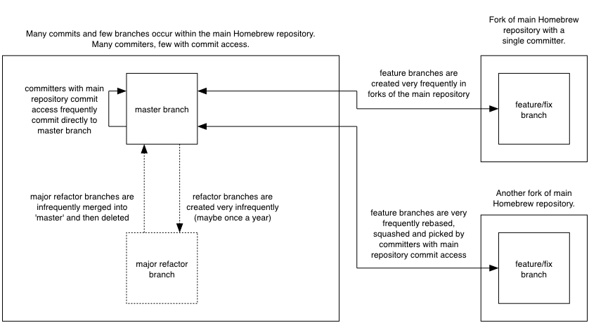

== Merging vs Rebasing
In this chapter you will learn about the pros and cons of merging vs rebasing
by learning the following topics:

* How CMake uses a branching and merging strategy to manage contributions
* How Homebrew uses a rebasing and squashing strategy to manage contributions
* The pros and cons of each approach
* How to decide what strategy to use for your project

As seen in Chapters 3 and 7 merging and rebasing are two strategies for
updating the contents of a branch based on the contents of another. Merging
joins the history of two branches together with a merge commit (a commit with
two parent commits) and rebasing creates new, reparented commits on top of the
existing commits.

Why are there two strategies for accomplishing essentially the same task? Let's
find out by comparing the Git history of two popular open-source projects and
their different branching strategies.

=== CMake's workflow
CMake is a cross-platform build-system created by Kitware. It has many
contributors both inside and outside Kitware but relatively few contributions
from those without direct push access to the Kitware Git repository.

CMake's Git repository is available to access at
https://github.com/Kitware/CMake. Please clone it and examine it while reading
this chapter.

.CMake repository history
image::diagrams/09-CMakeGitX.png[]

CMake makes heavy use of branching and merges. Several of the branches visible
or implied in the Figure 10.1 are:

* `next`: Shown in the figure as `origin/next`. Used for integration of _topic
  branches_ when developing a new version of CMake. `master` is merged in here
  regularly to fix merge conflicts.
* `nightly`: Shown in the figure as `origin/nightly`. Follows the `next` branch
  and is updated to the latest commit on `next` automatically at 01:00 UTC
  every day.
* `master`: Seen in figure indirectly; merged in `Merge 'branch' master into
  next` commit. Used for preparing a new release; development is merged into
  here. New topic branches are branched off of `master`.
* topic branches: Seen in figure merged `Merged topic '...' next` commits. Used
  for development of all bug fixes and new features. All new commits (except
  merge commits) are made on topic branches. Always merged into `next` and
  deleted after merge.

The regular merging of `master` into `next` ensures that any merge conflicts
between `master` and `next` are resolved quickly in the `next` branch. The
regular merging of topic branches into `next` allows integration testing before
a new release is prepared and provides context for individual commits; the
branch name used in the merge commit helps indicate what feature or bug the
commit was in relation to.

.CMake branch/merge workflow
image::diagrams/09-CMakeWorkflow.png[]

Figure 10.2 focuses on the interactions between branches in the CMake workflow
(rather than the interactions between commits and branches in Figure 10.1). For
a new commit to end up in `master` a new topic branch needs to be created,
commits made on it, the topic branch merged to the `next` branch
and the `next branch` merged to `master` for a release.

=== Homebrew's workflow
Homebrew is a package manager for OSX. It has thousands of contributors but a
very small number of people with commit access to the main repository (five at
the time of writing).

Homebrew's main Git repository is available to access at
https://github.com/Homebrew/homebrew. Please clone it and examine it while
reading this chapter.

.Homebrew repository history
image::diagrams/09-HomebrewGitX.png[]

Homebrew has very few merge commits within the repository (remember that _fast
forward merges_ do not produce merge commits). In Figure 10.3 you can see the
history is entirely continuous despite multiple commits in a row from the same
author and non-continuous dates. Branches are still used by individual
contributors (with and without push access to the repository) but branches are
rebased and squashed before being merged. This hides merge commits, evidence of
branches and temporary commits (that e.g. fix up previous commits on the same
branch) from the `master` branch.

.Homebrew's branch/rebase/squash workflow

Figure 10.4 focuses on the branches and repositories in the Homebrew workflow.
New commits can end up on master either by being directly committed by those
with main repository access, a feature branch being squashed and picked from a
forked repository or, very rarely, through a major refactor branch being merged.

On the very infrequent occasions that a major refactor branch is needed on the
core-repository (e.g. for heavy testing of the major refactor) then it will be
kept as a branch in the main repository and then merged. This branch will not
be used by users but may be committed to and tested by multiple core
contributors.

=== CMake's workflow pros and cons
CMake's approach makes it easy to keep track of what topic branches have been
merged, when they were merged and by whom. Individual features and bug-fixes
live in separate branches and are only integrated when and where it makes sense
to do so. Individual commits and evidence of branches (but not the branches
themselves) are always kept in history for future viewing. Topic branches are
tested individually and then integration testing is done in the `next` branch.
When the `next` branch is deemed to be in a sufficiently stable state then it
is merged into the `master` branch. This ensures that the `master` branch is
always stable and ready for a new release.

When developing desktop software like CMake which ships binary releases having
a very stable branch is important; releases are a formal, time-consuming
process and updates cannot be trivially pushed after release. As a result it's
important to ensure that testing is done frequently and sufficiently before
releasing.

CMake's approach produces a history that contains a lot of information but, as
seen from the plethora of lines in Figure 10.1, can be hard to follow. Merge
commits are frequent and commits with actual changes are harder to find as a
result. This can make reverting individual commits tricky; using `git revert`
on a merge commit is hard as Git does not know which side of the merge it
should revert to. In addition, if you revert a merge commit then you cannot
easily re-merge it.

There are also potential trust issues with CMake's approach. Everyone who wants
to create a topic branch needs commit access to the CMake repository. As Git
(and Git hosting services) do not provide fine-grained access control (e.g.
restricting access to particular branches) and as CMake's Git workflow does not
rewrite history anyone with commit access could e.g. make commits directly to
the `master` branch and circumvent the process. Everyone who commits to CMake
needs to be made aware of the process and trusted not to break or circumvent it.

=== Homebrew's workflow pros and cons
A major benefit of Homebrew's approach should be evidence from Figure 10.3; the
history is very simple. The `master` branch contains no direct merges so
ordering is easy to follow. Commits contain concise descriptions of exactly
what they do and there are no commits that are fixing previous ones. Every
commit communicates important information.

As a result of commits being squashed it also makes it very easy to revert
individual commits and, if necessary, reapply them at a later point. As
Homebrew does not have a release process (the top of the master branch is
always assumed to be stable and delivered to users) it is important that
changes and fixes can be pushed quickly rather than having a stabilization or
testing process.

.Why is a readable history important for Homebrew?
NOTE: For Homebrew readable history is a very important feature of there
workflow. Homebrew uses Git not just as a version control system for developers
but also as an update delivery mechanism for users. Presenting these users with
a more readable history allows them to better grasp updates to Homebrew with
basic Git commands and without understanding merges.

Homebrew's workflow makes use of multiple remote repositories. As only a few
people have commit access to the core repository their approach is more like
that of Linus on the Git project (as discussed in Chapter 1); often managing
and including commits from others more than making their own commits. Many
commits made to the repository are made by squashing and merging commits from
forks into the `master` branch of the main repository. The squashing means that
any fixes that needed to be made to the commit during the pull request process
will not be seen in the `master` branch and each commit message can be tailored
by the core team to communicate information in the best possible way.

This workflow means that only those on the core team can do anything dangerous
to the on the main repository. Anyone else will need their commits reviewed
before they are applied. This puts more responsibility on the shoulders of the
core team but means that other contributors to Homebrew only need to know how
to create a pull request and not how to e.g. squash or merge commits.

Unfortunately Homebrew's approach means that most branch information is
(intentionally) lost. It's possible to guess at branches from multiple commits
with related titles and/or the same author multiple commits in a row but
there's nothing explicit in the history that indicates a merge has occurred.
Instead, metadata is inserted into commit messages which state that a commit
was "Signed-off by" a particular core contributor and which pull request (or
issue) this commit related to.

=== Picking your strategy
Organizations and open-source projects vary widely on branching approaches.
When picking between a branch-and-merge or a branch-rebase-and-squash strategy
it is worth considering the following:

* If all the committers to a project are trusted sufficiently and can be
  educated on the workflow then giving everyone access to work on a single main
  repository may be more effective. If committers' Git abilities vary
  dramatically and some are untrusted then using multiple Git repositories and
  having a review process for merges between them may be more appropriate.
* If your software can release continuous, quick updates such as a web
  application or has a built-in updater (like Homebrew) then focusing
  development on a single (`master`) branch would be sensible. If your software
  has a more time-consuming release process such as desktop or mobile software
  that needs to be compiled (and perhaps even submitted to an app store for
  review) then working across many branches may be more suitable. This applies
  even more-so if you have to actively support many released versions of the
  software simultaneously.
* If it is important to be able to trivially revert merged changes on a branch
  (and perhaps remerge them later) then a squashing process may be more
  effective than a merging process.
* If it is important for the history to be easily readable in tools such as
  GitX or `gitk` then a squashing process may be more effective. Alternatively,
  a merging process can still be done but with less frequent merges so each
  merge contains at least two or more commits. This will ensure that the
  history is not overwhelmed with merge commits.

There are various other considerations you could take into account but these
are a good starting point. You could also consider creating your own, blended
approach which may use merging and squashing in different situations.

Whatever workflow you decide is best for your project it's important to try and
remain consistent; not necessarily across every branch (e.g. it might be
reasonable to always make merge commits in `master` but always rebase branches
on top of other branches) but a consistent approach across the repository. This
should ensure that, whatever strategy is adopted, the history will communicate
something of the development process of the project and that new committers can
look at the history for an example of what their workflow should be like.

.What is the author's preferred approach?
NOTE: Although I've committed to both projects most of my open-source time is
spent working on Homebrew. It will probably come as no surprise to hear
therefore that I prefer Homebrew's approach. Maintaining a simple and readable
history has frequently paid off in terms of quickly being able to `git bisect`
or `git revert` problematic commits. Also, I prefer software release processes
that favor lots of small updates rather than fewer, large updates. I think
these processes are easier to test as they encourage incremental improvements
rather than huge, sweeping changes.

=== Summary
In this chapter you hopefully learned:

* How CMake makes use of multiple branches to keep features developed in
  separation
* How Homebrew makes use of a single branch to release continuous updates to
  users
* How merging allows you to keep track of who added commits, when and why
* How rebasing and squashing allows you to maintain a cleaner history and
  eliminate commits that may be irrelevant

Now let's learn how to work with Subversion repositories directly from Git.
