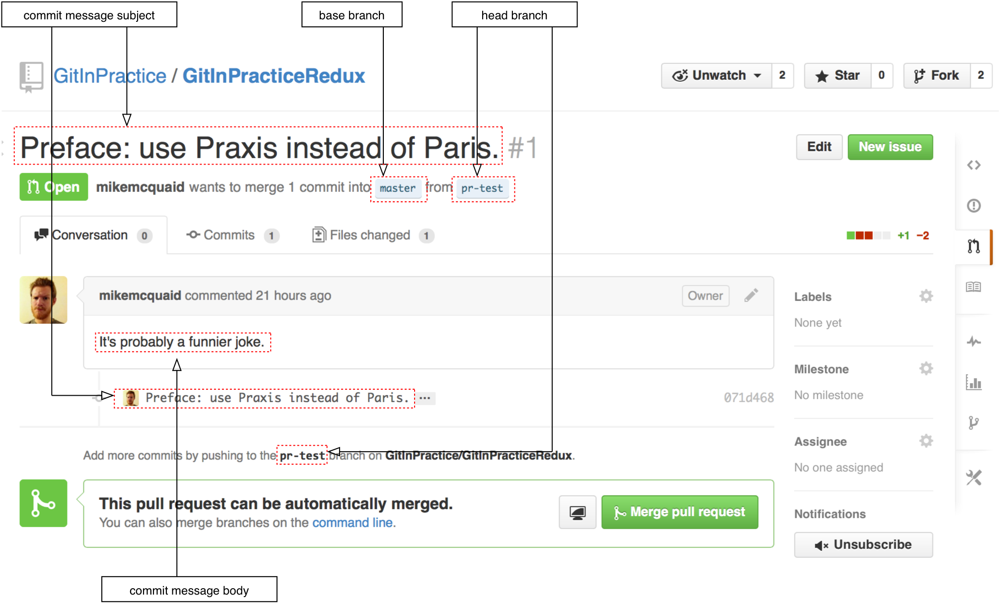
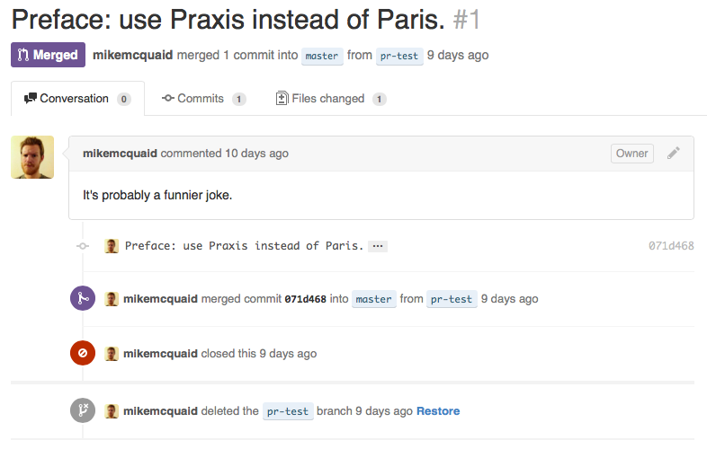

## GitHub Pull Requests
ifdef::env-github[:outfilesuffix: .adoc]

GitHub provides more than just Git hosting that you can `git push` to and `git fetch` from; it also provides features that allow teams of individuals to collaborate on software projects in ways beyond those provided by Git itself.

Two of these features are _pull requests_ and _forks_. In this chapter you will learn about GitHub's pull requests by learning about the following topics:

* How to make pull requests from branches on the same repository
* How to make pull requests from branches a forked repository
* How to interact with forks and pull requests from the command-line
* How to merge a pull request from a forked repository

### What are pull requests and forks?
One of the core components of most software project collaboration is some sort of issue (or bug) tracker e.g. Jira, FogBugz, Pivotal Tracker and Trac. GitHub provides an issue tracker for every repository known as "Issues". In GitHub's Issues there is a subject and body field, open or closed state, labels and comments.

There is a special type of issue known as a _pull request_ (or _PR_). This is an issue on a project with an attached branch of code changes. Pull requests are used to request that someone with commit access to the repository merge the code changes from the pull request branch into their the main repository. Once a PR has been received you can view the changes that have been requested and anyone who can view the PR can make comments either inline on the commit or generally on the PR. If there are comments that require changes to be made then they can be committed and pushed to the pull request branch and the pull request will be updated with these changes. Once the PR's changes have reached an acceptable standard to be included in the repository then they can be merged with the "Merge" button from the GitHub website which will merge the requested branch into the repository.

.How would use use pull requests as part of a code review process?
NOTE: You may have a web application project using Git where the `master` branch will be regularly and automatically deployed to the web server. You may wish to ensure that any branches merged into the `master` branch are checked by another developer before they are merged too ensure no-one accidentally deploys bad code to the server. In this situation you could request that all merges to the `master` branch require a pull request to be created and another developer review the changes in the branch, make any comments and the branch creator developer fix them. Only when both the branch creator and the branch reviewer are both happy with the contents should the pull request be merged. Adopting this approach will result in higher-quality code being merged to `master` and less silly mistakes.

Recall from <<02-RemoteGit#cloning-a-remote-github-repository-onto-your-local-machine-git-clone>> that we use `git clone` to initially download an entire repository. A _fork_ is similar to a clone but rather than downloading the repository to your local machine it creates a clone of a repository on GitHub's servers. This allows you to make any changes you wish to your _fork_ even if you do not have commit access to the original repository. Anyone with read access to a repository can fork it.

PRs and forks can be combined so you can find a repository you wish to make changes to, fork it and make changes in your local fork. You can then create a PR to request the changes on the branch in your fork be merged into the original repository.

.How would you use forks to contribute to a repository?
NOTE: You may have an open-source project that you use and have found a bug in. However, you don't have commit access yet and they don't want to give you commit access to make the change. In this case you could fork the open-source repository, make the changes, commit and test them and then creating a pull request from your forked repository to the original repository. This would allow the maintainers of the open-source repository to review your proposed changes, make any comments and merge them when they are ready.

.Where can I read more about using forks and pull requests?
NOTE: You can read more about using pull requests and forking repositories in GitHub's official help pages at https://help.github.com/articles/using-pull-requests and https://help.github.com/articles/fork-a-repo. I've not reproduced or rewritten them here as they and their images are kept up-to-date with any changes made to GitHub.

### Interacting with GitHub from the command-line: gh
We've been working mostly from the command-line in this book and PRs are sometimes a core part of Git workflows so it would be useful if we could also create PRs from the command-line. Thankfully there is a tool called `gh` which allows interacting with GitHub from the command-line (through the GitHub API). It is available to download and provides installation instructions https://github.com/jingweno/gh.

The `gh` command-line tool allows various interactions with GitHub by providing a wrapper on top of Git's interface and adding new commands and improving the interaction of some Git commands with GitHub.

For example, instead of running `git clone https://github.com/GitInPractice/GitInPracticeRedux` you could instead just run `gh clone GitInPractice/GitInPracticeRedux` to perform the same action of cloning a GitHub repository to your local machine.

The `gh` tool can also be used to create PRs from the command-line. Although this accomplishes the same end result as the web interface and is slightly less flexible I generally prefer it as it fits in more nicely into the command-line-driven workflow of using the Git to interact with a project's repository.

### Making a pull request in the same repository: gh pull-request
In my experience most teams that work on private repositories tend to make use of a single repository rather than many different forks. Pull requests can still be used on a private repository; even although everyone with read access will also have commit access PRs are still useful for performing code review before changes are merged into a repository.

To create a PR we need to create a local branch of the changes we want to be merged into another branch (`master`, by default), push our local branch to a remote branch and use `gh` to create a pull-request.

#### Problem
You wish to create a GitHub pull request from the command-line.

#### Solution
1.  Change to the directory containing your repository e.g. `cd /Users/mike/GitInPracticeRedux/`.
2.  Create a new branch from the `master branch` by running e.g. `git checkout -b pr-test master`.
3.  Make some changes to a file e.g. `00-Preface.asciidoc` and commit them by running e.g. `git commit 00-Preface.asciidoc`. Ensure that there are multiple lines in the commit message i.e. a commit subject and commit body.
4.  Push the local branch to a remote branch by running e.g. `git push --set-upstream origin pr-test`.
5.  Create a pull request by running `gh pull-request` and accept the default pull request message (which should match the commit message).

The output for these commands should resemble:

.Create pull request with `gh` output
```
# git checkout -b pr-test master

Switched to a new branch 'pr-test' <1>

# git commit 00-Preface.asciidoc

[pr-test 071d468] Preface: use Praxis instead of Paris.
 1 file changed, 1 insertion(+), 2 deletions(-) <2>

# git push --set-upstream origin pr-test

Counting objects: 10, done.
Delta compression using up to 8 threads.
Compressing objects: 100% (3/3), done.
Writing objects: 100% (3/3), 348 bytes | 0 bytes/s, done.
Total 3 (delta 2), reused 0 (delta 0)
To https://github.com/GitInPractice/GitInPracticeRedux
 * [new branch]      pr-test -> pr-test
Branch pr-test set up to track remote branch pr-test from origin. <3>

# gh pull-request

https://github.com/GitInPractice/GitInPracticeRedux/pull/1 <4>
```
<1> local branch
<2> new commit
<3> remote branch
<4> pull request

From the pull request creation output:

* "local branch (1)" shows the creation of the new local branch. This will be used to commit the changes for the new pull request.
* "new commit (2)" shows the new commit on the `pr-test` branch. It was created with a commit message subject and body.
* "remote branch (3)" shows the new remote branch that was created to be used for the new pull request.
* "pull request (4)" shows the URL for the new pull request created by the `gh` tool using the GitHub API. It is requesting the merge of the `pr-test` branch into the remote repository's `master` branch.

You have created a new pull request from the command-line using the `gh` tool.

#### Discussion
.How do you use branches with pull requests?
NOTE: Each pull request you create should use a new, non-`master` branch. As each pull request tracks the status (and any new commits) for a particular remote branch you need to ensure each branch is used for a separate pull request to avoid e.g. adding a new commit to one pull request and having it show up in another. You should also avoid creating pull requests from the `master` branch as this is generally the branch you will wish to merge to. Additionally, GitHub will sometimes not update the `master` branch if you push new commits to it after creating the pull request so you would need to create a new pull request for every change than needs to be made. This is less than ideal as you lose all the existing context and comments.

Now that a pull request has been created you can view it in the GitHub web interface:

.New pull request
[[new-pull-request]]


<<new-pull-request>> shows the new pull request that has been created on GitHub. `gh` defaulted the pull request message to that of the single commit in this pull request. You can see the commit message subject was used for the title of the pull request and the commit message body was used as the initial comment on this pull request. Additionally the `master` branch was used as the "base branch" which is the branch which the PR requests the changes be merged into. The changes that should be merged in are those from the `pr-test` branch which is known as the "head branch".

Essentially the pull request has just created a remote branch named `pr-test` which we have requested someone merge into the `master` branch and discuss any changes that need to be made.

The `gh` tool also accepts the `-b` and `-h` parameters which can be followed with a branch name to change the base and head branches respectively. These can either be passed a branch name e.g. `pr-test`, a branch name and GitHub user/organization name e.g. `GitInPractice:pr-test` or a GitHub user/organization name, repository name and branch name e.g. `GitInPractice/GitInPracticeRedux:pr-test`.

### Making a pull request from a forked repository: gh fork
If you are wishing to commit to an open-source software project that you do not have commit access to you will want to create a pull request so others can review your changes before they are merged (because open-source does not mean letting anyone commit to any repository at any time). To do this you will want to create your own repository that you can make commits and push branches to and request pull requests from. If you recall from <<what-are-pull-requests-and-forks>> you can fork any repository you have read access to (which includes all public, open-source repositories).

#### Problem
You wish to fork a repository and create a pull request from that fork from the command-line.

#### Solution
1.  Change to the directory containing your repository e.g. `cd /Users/mike/GitInPracticeRedux/`.
2.  Create a new fork by running `gh fork`.
3.  Create a new branch from the `master branch` by running e.g. `git checkout -b credits master`.
4.  Make some changes to a file e.g. `01-IntroducingGitInPractice.asciidoc` and commit them by running e.g. `git commit 01-IntroducingGitInPractice.asciidoc`. Ensure that there are multiple lines in the commit message i.e. a commit subject and commit body.
5.  Push the local branch to a remote branch by running e.g. `git push --set-upstream origin pr-test`.
6.  Create a pull request by running `gh pull-request` and accept the default pull request message (which should match the commit message).

The output for these commands should resemble:

.Create fork and pull request with `gh` output
```
# gh fork

remote: Counting objects: 3, done.
remote: Compressing objects: 100% (3/3), done.
remote: Total 3 (delta 0), reused 0 (delta 0)
Unpacking objects: 100% (3/3), done.
From https://github.com/mikemcquaid/GitInPracticeRedux
 * [new branch]      inspiration -> mikemcquaid/inspiration
 * [new branch]      master     -> mikemcquaid/master
 * [new branch]      pr-test    -> mikemcquaid/pr-test
 * [new branch]      v0.1-release -> mikemcquaid/v0.1-release
new remote: mikemcquaid <1>

# git checkout -b credits

Switched to a new branch 'credits' <2>

# git commit 01-IntroducingGitInPractice.asciidoc

[credits e9d27c7] Chapter 1: attribute quote.
 1 file changed, 2 insertions(+), 2 deletions(-) <3>

# git push --set-upstream origin credits

Counting objects: 10, done.
Delta compression using up to 8 threads.
Compressing objects: 100% (3/3), done.
Writing objects: 100% (3/3), 348 bytes | 0 bytes/s, done.
Total 3 (delta 2), reused 0 (delta 0)
To https://github.com/mikemcquaid/GitInPracticeRedux
 * [new branch]      credits -> credits
Branch credits set up to track remote branch credits from origin. <4>

# gh pull-request

https://github.com/GitInPractice/GitInPracticeRedux/pull/2 <5>
```
<1> repository fork
<2> local branch
<3> new commit
<4> remote branch
<5> pull request

From the fork and pull request creation output:

* "repository fork (1)" shows that the repository was forked on GitHub and a new remote repository was added with the username of the fork (`mikemcquaid` in this case) and fetched.
* "local branch (2)" shows the creation of the new local branch.
* "new commit (3)" shows the new commit on the `credits` branch.
* "remote branch (4)" shows the new remote branch that was created.
* "pull request (5)" shows the URL for the new pull request. It is requesting the merge of the `credits` branch from the  https://github.com/mikemcquaid/GitInPracticeRedux forked repository into the `master` branch of the https://github.com/GitInPractice/GitInPracticeRedux main repository.

You have created a fork and pull request from it from the command-line.

### Merging a pull request from the same repository
Merging a pull request from a non-forked repository is easy. You can either click the "Merge pull request" button (as seen in <<new-pull-request>>) or just merge the branch as you would any other. Note that the "Merge pull request" button always performs a non-fast-forward merge (i.e. it always produces a merge commit) so let's do that here too.

#### Problem
You wish to merge a pull request from the command-line.

#### Solution
1.  Change to the directory containing your repository e.g. `cd /Users/mike/GitInPracticeRedux/`.
2.  Checkout the `master` branch by running `git checkout master`.
3.  Ensure all the remote branches are up to date by running `git fetch`.
4.  Merge the remote `pr-test` branch into the `master` branch by running `git merge --no-ff origin/pr-test`.
5.  Push the updated `master` branch with `git push`.
6.  Delete the now-merged `pr-test` branch by running `git push --delete origin pr-test`.

The output for these commands should resemble:

.Merging a pull request
```
# git checkout master

Switched to branch 'master'
Your branch is up-to-date with 'origin/master'. <1>

# git fetch

# git merge --no-ff origin/pr-test

Merge made by the 'recursive' strategy.
 00-Preface.asciidoc | 3 +--
 1 file changed, 1 insertion(+), 2 deletions(-) <2>

# git push

Counting objects: 1, done.
Writing objects: 100% (1/1), 241 bytes | 0 bytes/s, done.
Total 1 (delta 0), reused 0 (delta 0)
To https://github.com/GitInPractice/GitInPracticeRedux.git
   cc206b5..7a19d89  master -> master <3>

# git push --delete origin pr-test
To https://github.com/GitInPractice/GitInPracticeRedux.git
 - [deleted]         pr-test <4>
```
<1> branch checkout
<2> merge commit
<3> branch push
<4> branch delete

From the merging a pull request output:

* "branch checkout (1)" shows the checkout of the `master` branch. This is required as to merge into the `master` branch you first need to have the `master` branch checked out.
* "merge commit (2)" shows the new merge commit created by the non-fast-forward commit. Remember this was run withe `--no-ff` to guarantee creating a merge commit (which matches the behavior of the "Merge pull request" button).
* "branch push (3)" shows the new merged commits being pushed to the remote `master` branch.
* "branch delete (4)" shows the deletion of the now merged (and therefore unneeded) `pr-test` branch.

You have successfully merged a pull request from the command-line.

#### Discussion
Let's look at the pull request on GitHub:

.Merged pull request
[[merged-pull-request]]


<<merged-pull-request>> shows the state of the merged pull request after these changes. You will notice that after the push the pull-request has been automatically closed as it has detected that you have merged the contents of the branch remotely.

.How can you close a pull request without a merge?
NOTE: If you prefer to perhaps cherry-pick or rewrite some of the commits then the SHA-1 may change. This case will may not be detected automatically by GitHub as a merge and therefore the issue may not be closed automatically. If you wish to ensure that any modified commit will automatically close the pull request you could use `git rebase --interactive` or `git commit --amend` to change the commit message for one of the commits to include text such as `Closes #1`. The first pull request that was created above was numbered #1. This magic string in a commit message is detected by GitHub and indicates that when this commit is merged to the `master` branch on the main repository it should close the pull request (or issue) numbered #1. You can read more about this in GitHub's help at https://help.github.com/articles/closing-issues-via-commit-messages.

### Merging a pull request from a forked repository: gh merge
To merge a pull request from a forked repository is a little more involved. You can click the "Merge pull request" button but what if you want to merge the branch from the command-line? You could manually add the forked repository as a remote repository and merge it like before. Instead, though, let's use the handy `gh` tool again to make things a bit easier.

To simulate the typical open-source maintainer approach where you wouldn't have new forks already added as remote repositories let's start by removing the fork's remote from the local Git repository by running `git remote rm mikemcquaid` (which won't produce any output). This leave the remote intact on GitHub but just means that it no longer will be on the local repository.

#### Problem
You wish to merge a pull request from a forked repository from the command-line.

#### Solution
1.  Change to the directory containing your repository e.g. `cd /Users/mike/GitInPracticeRedux/`.
2.  Checkout the `master` branch by running `git checkout master`.
3.  Merge the remote pull request into the `master` branch by running `gh merge https://github.com/GitInPractice/GitInPracticeRedux/pull/2`.
4.  Push the updated `master` branch with `git push`.

The output for these commands should resemble:

.Merging a pull request from a forked repository
```
# git checkout master

Switched to branch 'master'
Your branch is up-to-date with 'origin/master'. <1>

# gh merge https://github.com/GitInPractice/GitInPracticeRedux/pull/2

From https://github.com/mikemcquaid/GitInPracticeRedux
 * [new branch]      credits    -> mikemcquaid/credits
Merge made by the 'recursive' strategy.
 01-IntroducingGitInPractice.asciidoc | 4 ++--
 1 file changed, 2 insertions(+), 2 deletions(-) <2>

# git push

Counting objects: 12, done.
Delta compression using up to 8 threads.
Compressing objects: 100% (5/5), done.
Writing objects: 100% (5/5), 620 bytes | 0 bytes/s, done.
Total 5 (delta 3), reused 0 (delta 0)
To https://github.com/GitInPractice/GitInPracticeRedux.git
   7a19d89..77f848d  master -> master <3>
```
<1> branch checkout
<2> PR merge
<3> branch push

From the merging a forked pull request output:

* "branch checkout (1)" shows the checkout of the `master` branch.
* "PR commit (2)" shows the new merge commit created by the pull request merge.
* "branch push (3)" shows the new PR commits being pushed to the remote `master` branch.

You have successfully merged a pull request from a forked repository from the command-line.

### Summary
In this chapter you hopefully learned:

* How pull requests are used to request the merge and review of branches
* How forks are used to request pull requests on repositories without commit access
* How to create a new pull request using `gh pull-request`
* How to merge a a pull request using `git merge` or `gh merge`

Now let's learn how to vendor other projects in your Git repositories using submodules.
