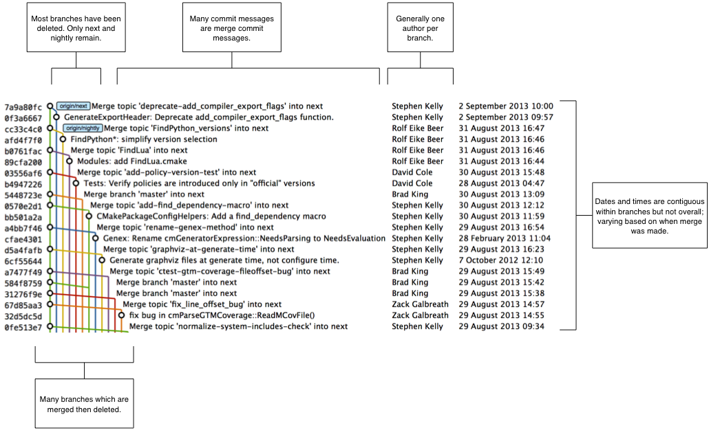
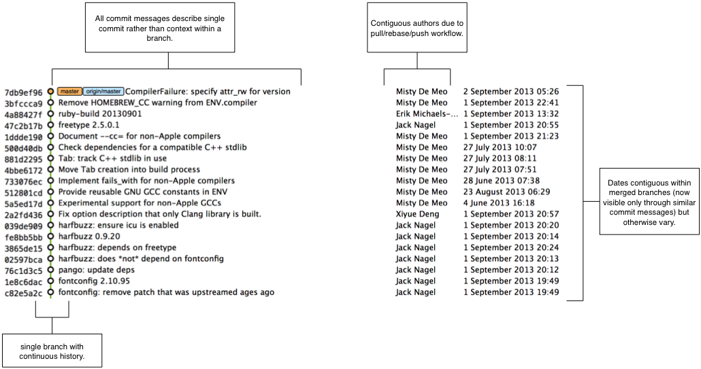

== Merging vs Rebasing
In this chapter you will learn about the pros and cons of merging vs rebasing
by learning the following topics:

* How CMake uses a branching and merging strategy to manage contributions
* How Homebrew uses a rebasing strategy to manage contributions
* How to decide what strategy to use for your project

As seen in Chapters 3 and 7 merging and rebasing are two strategies for
updating the contents of a branch based on the contents of another. Merging
joins the history of two branches together with a merge commit (a commit with
two parent commits) and rebasing creates new, reparented commits on top of the
existing commits.

Why are there two strategies for accomplishing essentially the same task? Let's
find out by comparing the Git history of two popular open-source projects and
their branching strategies.

=== CMake
CMake is a cross-platform build-system created by Kitware. It has many
contributors both inside and outside Kitware but relatively few contributions
from those without direct push access to the Kitware Git repository.

.CMake's branch-and-merge strategy

CMake makes heavy use of branching and merges. Several of the branches visible
in the Figure 10.1 are:

* `next`: used for integration of branches in development. New features'
  topic branches are merged here. `master` is merged here regularly.
* `nightly`: follows the `next` branch and is updated automatically at 01:00
  UTC every day.
* `master`: used for preparing a new release. New topic branches should
  be based off of `master`.
* topic branches: used for development of all bug fixes and new
  features. Merged into `next` and deleted after merge.

The regular merging of `master` into `next` ensures that any merge conflicts
between `master` and `next` are resolved quickly in the `next` rather than
`master` branch. The regular merging of topic branches into `next` allows
integration testing before a new release is prepared and provides context for
individual commits; the branch name used in the merge commit helps indicate
what feature or bug the commit was in relation to.

The upside of CMake's approach is that it is easier to keep track of what
branches have been merged, to where and by whom. Additionally, individual
features can each be kept separately in branches and only integrated when and
where it makes sense to do so. When developing desktop software like CMake
which ships binary releases this can be important; releases are quite formal
and updates cannot be trivially pushed after release. As a result it's
important to ensure that branches are tested individually and after integration
before a release is made.

The downside of CMake's approach is shown by Figure 10.1 being fairly hard to
follow; there are so many branches and merge commits that following an
individual branch and how it relates to another branch e.g. `next` is quite
difficult. Additionally, many commit messages relate only to merge commits
rather than functionality or bug-fixes so it is hard to see what has actually
been changed.

=== Homebrew
Homebrew is a package manager for OSX. It has thousands of contributors but a
very small number of people with push access to the main repository (less than
ten at the time of writing).

.Homebrew branch-and-rebase strategy

Homebrew makes very few merges within the repository. In Figure 10.2 you can
see the history is entirely continuous despite multiple commits in a row from
the same author and non-continuous dates. Branches are still used by individual
contributors with and without push access to the repository but branches are
rebased before being merged (or cherry-picked which accomplishes the same thing
for individual commits). When branches are rebased their merge can be
accomplished with a "fast-forward" merge. A "fast-forward" indicates that no
merge commit was needed as the commits were parented such that they could be
applied on top of the current branch with no reparenting or rebasing required.

The upside of Homebrew's approach is in a more readable history. Commits are
applied contiguously and are squashed to mean that every commit communicates
important information. In Homebrew's case readable history is seen an an
important feature; Homebrew uses Git as not just a version control system for
the developers but also as an update delivery mechanism for users. Presenting
these users with a more readable history allows them to better grasp updates to
Homebrew with basic Git commands and without understanding merges. Additionally
because of the frequent rebasing commits can be (and are) frequently squashed
whenever a branch is merged only the commits that communicate information are
added (rather than seeing lots of work-in-progress commits).

The downside of Homebrew's approach is that all branch information is lost.
It's possible to guess at branches such as the several commits related to
`harfbuzz` by Jack Nagel that were made in a short period of time.
Additionally, you can generally see when rebases were performed and made by
several commits by the same author in a row. It's impossible, however, to be
able to merge branches selectively to other branches or maintain the differing
branches for a more complex release process as CMake does. It's also not
possible to tell who merged a particular commit. Homebrew's release versioning
process is somewhat arbitrary; users receive continuous updates from the
version control repository so `master` is always kept stable and a new
verisoned tag is created whenever it is felt a certain amount of new, core
functionality has been added.

=== Picking a strategy
Organizations and open-source projects vary widely on branching approaches.
When picking between a branch-and-merge or a branch-rebase-and-merge strategy
it is worth asking the following questions:

* What is the purpose of the `master` branch? Is the HEAD of `master`
  considered a stable release, a development release or neither?
* Is it more important to have a more readable history or track more metadata
  e.g. who merged a change to a particular branch, what feature a commit
  belonged to?
* If there are multiple types of users: do pull-only or pull-and-push users
  have more advanced Git skills?
* Are feature branches worked on by more than one person (the history rewriting
  with `rebase` can be problematic with multiple users sharing a branch)?

There are many more questions that could be asked but these are a good starting
point. Whichever approach is adopted it's important to try and remain
consistent; not necessarily across every branch (e.g. it might be reasonable to
always make merge commits in `master` but always rebase branches on top of
other branches) but a consistent approach across the repository. This should
ensure that, whatever strategy is adopted, the history will communicate
something of the development process of the project.

=== Summary
In this chapter you hopefully learned:

* How CMake makes use of multiple branches to keep features developed in
  separation
* How Homebrew makes use of a single branch to release continuous updates to
  users
* How merging allows you to keep track of who added commits, when and why
* How rebasing allows you to maintain a cleaner history and eliminate commits
  that may be irrelevant

Now let's learn how to work with Subversion repositories directly from Git.
