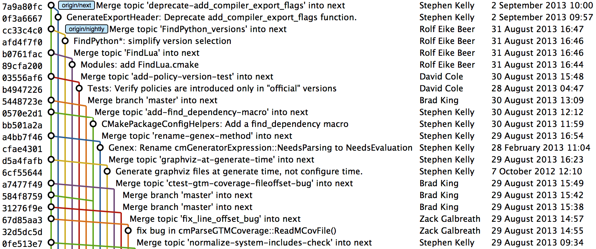
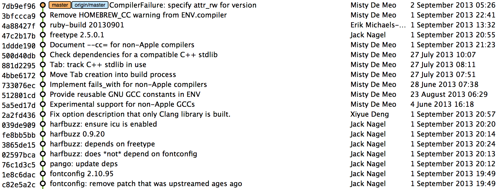

== Merging vs rebasing
As seen in previous chapters merging and rebasing are two strategies for
updating the contents of a branch based on the contents of another.
Merging joins the history of two branches together with a merge commit
(a commit with two parent SHA-1s) and rebasing tries to recreate the new
commits in order on top of the existing commits.

Why are there two strategies for accomplishing essentially the same
task? Compare the history of two popular open-source projects and their
branching strategies.

=== CMake
CMake is a cross-platform buildsystem created by Kitware. It has many
contributors both inside and outside Kitware but relatively few
contributions from those without direct push access to the Kitware Git
repository.

.CMake branching

CMake makes heavy use of branching and merges. Several of the branches
visible in the above diagram are:

* `master`: used for preparing a new release. New topic branches should
be based off of `master`.
* `next`: used for integration of branches in development. New features'
topic branches are merged here. `master` is merged here regularly.
* topic branches: used for development of all bug fixes and new
features. Merged into `next` on completion.

The regular merging of `master` into `next` ensures that any merge
conflicts between `master` and `next` are resolved quickly in the `next`
rather than `master` branch. The regular merging of topic branches into
`next` allows integration testing before a new release is prepared and
provides context for individual commits; the branch name used in the
merge commit helps indicate what feature or bug the commit was in
relation to.

CMake's approach of using branches heavily comes with a downside: the
above diagram is fairly hard to follow; there are so many branches and
merge commits that following an individual branch and how it relates to
e.g. `next` is quite difficult.

=== Homebrew
Homebrew is a package manager for OSX. It has thousands of contributors
but a very small number of people with push access to the main
repository (less than ten at the time of writing).

.Homebrew branching

Homebrew makes very few merges within the repository. In the above
diagram you can see the history is entirely continuous despite multiple
commits in a row from the same author and non-continuous dates. Branches
are still used by individual contributors with and without push access
to the repository but branches are rebased before being merged (or
cherry-picked which accomplishes the same thing for individual commits).
When branches are rebased their merge can be accomplished with a
"fast-forward". A "fast-forward" indicates that no merge commit was
needed as the commits were parented such that they could be applied on
top of the current branch with no reparenting required.

Homebrew's approach results in a readable history. In their case this is
seen as more important than tracking branch status as Homebrew uses Git
as not just a version control system for the developers but also as an
update delivery mechanism for users. Presenting these users with a more
readable history allows them to better grasp updates to Homebrew with
basic Git commands and without understanding merges.

=== Picking a strategy
Organizations and open-source projects vary widely on branching
approaches. When picking between a branch-and-merge or a
branch-rebase-and-merge strategy it is worth asking the following
questions:

* What is the purpose of the `master` branch? Is the HEAD of `master`
considered a stable release, a development release or neither?
* Is it more important to have a more readable history or track more
metadata e.g. who merged a change to a particular branch, what feature a
commit belonged to?
* If there are multiple types of users: do pull-only or push-and-push
users have more advanced Git skills?
* Are feature branches worked on by more than one person (the history
rewriting with `rebase` can be problematic with multiple users sharing a
branch)?

There are many more questions that could be asked but this is a good
starting point. Whichever approach is adopted it's important to try and
remain consistent; not necessarily across every branch (e.g. it might be
reasonable to always make merge commits in `master` but always rebase
branches on top of other branches) but a consistent approach across the
repository. This should ensure that, whatever strategy is adopted, the
history will communicate something of the development of the project.

