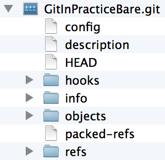

## Hosting a Repository
ifdef::env-github[:outfilesuffix: .adoc]

We saw in <<02-RemoteGit#adding-a-remote-repository-git-remote-add>> how to push to remote repositories provided by various organizations on the internet as a way of sharing your Git repositories with others. Sometimes though you may wish to host a remote Git repository on a machine you control for example to:

* temporarily share a Git repository on your machine with another computer on the same network
* keep a full backup of an external Git repository on a server you control
* provide an internal mirror of an external Git repository to allow faster transfer speeds
* to host a Git repository on a server entirely under your own control

I personally only use the commands in this chapter for basic sharing and viewing of a repository on my machine with repositories on other machines on the same network (rather than over the internet). While we'll see more advanced tools in <<advanced-git-hosting>> this chapter is focused on understanding the features provided by Git itself and how it works rather than more advanced Git hosting solutions. In essence, this chapter is a guide for software engineers to understand how Git repositories can be shared and not a guide for system administrators on how set up Git servers. Unless you are an experienced system administrator I would advise using on an external Git hosting provider (such as GitHub) rather than running your own Git servers. We'll cover Git's repository hosting commands by learning about the following topics:

* How to create a repository in a format used for hosting as a server
* How to mirror an existing repository for hosting as a server
* How to share the contents of a repository with users on the same network
* How to display the contents of a repository in a web browser
* How to provide more advanced Git hosting with other software

### Initialize a local repository in a server hosting format: git init --bare
The Git repositories we've seen throughout this book have all had a similar structure: the working directory contains a checkout of the files in the current branch and a `.git` subdirectory which contains the repository data.
For example, if we had a `GitInPracticeNonBare.git` repo its contents might resemble the following:

.Typical repository layout
[[repo-non-bare]]
image::screenshots/11-RepoNonBare.png[]

You can see from <<repo-non-bare>> that it has only the `README.md` file and the `.git` repository data subdirectory in the root.

Git stores data in a highly space-efficient format. The checked-out files in a repository's working directory may sometimes take up more space than the compressed version of all files stored in the `.git` directory!

On a server the working directory should never be used directly so it is better to not create it at all. As you will just be sending/receiving Git objects to/from various Git clients with `git push`, `git fetch` or `git pull` you do not need to have the actual files checked out on disk. A Git repository without a working directory is known as a _bare repository_. The major difference compared to the first repository we created in <<01-LocalGit#creating-a-repository-git-init>> is that this repository is not in a `.git` directory.

Let's create a bare repository and have a look at its contents.

#### Problem
You wish to create a bare Git repository.

#### Solution
1.  Change to the directory you wish to contain your new repository directory e.g. `cd /Users/mike/`.
2.  Run `git init --bare GitInPracticeBare.git`. The output should resemble:

.bare repository initialization output
```
# git init --bare GitInPracticeBare.git

Initialized empty Git repository in /Users/mike/GitInPracticeBare.git/ <1>
```
<1> bare repository

From the bare repository initialization output output:

* "bare repository (1)" shows the new directory that was created for the bare Git repository. The major difference compared to the first repository we created in <<01-LocalGit#creating-a-repository-git-init>> is that this repository is not in a `.git` directory.

You have successfully created a new bare Git repository.

#### Discussion
Bare repositories do not allow new commits to be created locally; they must be pushed from another repository.

.How should you name bare repositories?
NOTE: When creating bare repositories it is good practice to name them with the extension '.git' to make it clear that they are bare.

Let's look at the layout of a bare repository:

.Bare repository layout
[[repo-bare]]


You can see from <<repo-bare>> that the repository data which was stored in `.git` in <<repo-non-bare>> is instead in the root in <<repo-bare>>. This means the root of the repository is effectively the `.git` directory (which is why it named `GitInPracticeBare.git`). The bare repository is missing an `index` file, `logs` directory and instead has a `packed-refs` file. These differences are just internal Git files that are used for repositories; don't worry about their contents  (although we will see the `packed-refs` file in <<mirror-a-repository-git-clone-mirror>>).

To clone this Git repository into a non-bare repository on the same machine run `git clone` with the path on disk to the repository and the new, non-bare repository name as arguments e.g. `git clone /Users/mike/GitInPracticeBare.git GitInPracticeNonBare`. In this case the output will resemble:

```
Cloning into 'GitInPracticeNonBare.git'...
warning: You appear to have cloned an empty repository.
done
```

The new repository has been created but it is empty i.e. contains no commits. If you add a file, commit and push it then it will be pushed to the bare repository and both repositories will now be non-empty. Note that you would never usually be cloning a bare repository on the same machine but would instead create a bare repository on one machine and clone it on another.

I've only personally used bare repositories in the past to create mirrors of existing repositories on a server I control. I didn't care about having the files checked-out into the working directory but just wanted a copy of all the repository data. Let's learn how to use Git to create an exact mirror of another repository.

### Mirror a repository: git clone --mirror
There are times when you wish to host a new Git repository that is a mirror of another i.e. a functionally identical copy. This could be for backup, providing a local cache for increased speed or moving a repository to another location. Recall from <<02-RemoteGit#cloning-a-remote-github-repository-onto-your-local-machine-git-clone>> that `git clone` will create a clone of the repository locally with all commits, branches and tags that are in the repository you have cloned from.

If you `git clone` a repository with a branch named `testing` then your new, local clone will contain a remote branch named `origin/testing`. However, what if you wanted this to not only create the `origin/testing` remote branch but also a local branch named `testing`? In this case you would use the `--mirror` flag for `git clone` which creates local branches for all remote branches it finds (or, in Git terminology, it matches all refs locally). This is useful in cases where you want to create an exact copy of another repository (i.e. a mirror) so others could clone from it and get the same results as cloning from the original repository or to keep as a backup. Recall _forks_ on GitHub from <<10-GitHubPullRequests#what-are-pull-requests-and-forks>>; `git clone --mirror` is effectively GitHub does when you _fork_ a repository: it makes a complete copy that can be modified without changing the original repository and creates all the same branches.

Let's use `git clone --mirror` to set up a local mirror of the `GitInPracticeRedux` repository.

#### Problem
You wish mirror an existing remote repository.

#### Solution
1.  Change to the directory you wish to contain your new repository directory e.g. `cd /Users/mike/`.
2.  Run `git clone --mirror https://github.com/GitInPractice/GitInPracticeRedux.git`. The output should resemble:

.clone mirror output
```
# git clone --mirror
  https://github.com/GitInPractice/GitInPracticeRedux.git

Cloning into bare repository 'GitInPracticeRedux.git'...<1>
remote: Reusing existing pack: 79, done.
remote: Counting objects: 1, done.
remote: Total 80 (delta 0), reused 1 (delta 0)
Unpacking objects: 100% (80/80), done.
Checking connectivity... done.
```
<1> bare repository

From the clone mirror output output:

* "bare repository (1)" shows that `git clone --mirror` will create a bare repository when it creates a mirror. This is as `--mirror` will only be used when hosting a repository for other repositories to pull from.

You have mirrored the existing `GitInPracticeRedux` repository.

#### Discussion
Recall from <<02-RemoteGit#cloning-a-remote-github-repository-onto-your-local-machine-git-clone>> that `git clone` with:
* no flags will create a normal (i.e. non-bare) repository with remote branches
* the `--bare` flag will create a bare repository with remote branches
* the `--mirror` flag will create a bare repository with remote branches and local branches for every remote branch

Let's examine the contents of `GitInPracticeRedux.git/packed-refs` file:
```
# pack-refs with: peeled fully-peeled
ca74d2b7c4dd15a260e68c6ff3552c64041aacdc refs/heads/inspiration <1>
a9e150fb17301eed6c31aa984411effdab8f3fec refs/heads/master <1>
a8200e1407d49e37baad47da04c0981f43d7c7ff refs/heads/v0.1-release <1>
071d468df295c3866054763250a1344e44f8c3be refs/pull/1/head <2>
75f9dd1ddc24e1fd9e58b8443f7f0176cf7bd2e7 refs/pull/1/merge <2>
e9d27c7df49c07cb2325356ab9a76f90d9f179ae refs/pull/2/head <2>
e6e9208372f3784686499430fec547c20dad6139 refs/pull/2/merge <2>
725c33ace6cd7b281c2d3b342ca05562d3dc7335 refs/tags/v0.1 <3>
```
<1> branch
<2> pull request
<3> tag

The `packed-refs` file contains all the _packed_ (i.e. in Git's format for data internal and external transfer) refs that were fetched from the `GitInPracticeRedux` repository. It contains all the created branches (1), pull requests (2) and the tag that were created in this repository. These will now be shared with any other repositories that clone this one.

### Share repository with other users on the same network: git daemon
Now that we've seen how to create bare repositories suitable for a server to share with other Git repositories let's learn how to actually serve these to other Git clients.

We saw in <<initialize-a-local-repository-in-a-server-hosting-format-git-init-bare>> a repository being cloned from another path on the disk. While this would be one way of sharing a repository over the network with Git (give someone access to your disk with e.g. a network share) it's not very efficient as it will use multiple protocols: the SMB protocol used to share the files over the network and Git's interaction with the packed repository. Instead a Git server will allow Git to interact natively in its own format and `git://` protocol which transfers repository data in a very similar format to how it is stored locally and defaults to using port 9418.

Git provides a simple server for basic repository hosting named `git daemon`. It provides no user authentication or encryption and only supports the `git://` protocol (rather than the `https://` we've used throughout this book or `ssh://` which uses SSH access). These protocols are fairly interchangeable; which one you pick will depend mostly on whether you need to make use of HTTP proxies or web servers (for the `https://` protocol), user authentication using SSH (for the `ssh://` protocol) or no authentication (for the `git://` protocol).

As a result it may be too limited for some cases but is great for the example in the section title: sharing a repository with other users on the same network.

#### Problem
You wish to share a repository with other users on the same network.

#### Solution
1.  Change directory to the Git repository e.g. `cd /Users/mike/GitInPracticeRedux.git/`.
2.  Run `git daemon --verbose --base-path=. --export-all`. The output should resemble:

.daemon output
```
# git daemon --verbose --base-path=. --export-all <1>

[72938] Ready to rumble <2>
```
<1> daemon arguments
<2> process ready

From the daemon output:

* "daemon arguments (1)" shows the daemon command and the list of arguments required to export the Git repository. These will be elaborated on in the Discussion section.
* "process ready (2)" shows the process ID (72938), that it has started successfully and is ready to receive clients.

Now that we have `git daemon` running open another terminal windows and clone this repository from a client with `git clone git://localhost/`:
```
# git clone git://localhost/ GitInPracticeReduxDaemon <1>

Cloning into 'GitInPracticeReduxDaemon'...
remote: Counting objects: 78, done.
remote: Compressing objects: 100% (71/71), done.
remote: Total 78 (delta 26), reused 0 (delta 0)
Receiving objects: 100% (78/78), 7.80 KiB | 0 bytes/s, done.
Resolving deltas: 100% (26/26), done.
Checking connectivity... done.
```
<1> local server

The "local server (1)" displays that we're using `localhost` to access the Git daemon on the same machine that we are hosting it on. It has cloned the repository as expected into a new directory on the same machine. If you wanted to clone this from another machine you would replace `localhost` in the command with the IP address of the machine hosting the daemon on the network e.g. `git clone git://192.168.0.123/`.

If we view the daemon output again you will see some lines have been added:
```
[72984] Connection from [::1]:52891 <1>
[72984] Extended attributes (16 bytes) exist <host=localhost> <2>
[72984] Request upload-pack for '/' <3>
[72938] [72984] Disconnected <4>
```
<1> client connection
<2> attribute exposure
<3> repository upload
<4> client disconnect

These lines show that our Git client connected to the server (1), the repository exposed some attributes to the client (2), the client requested the server upload its contents to the client (3) and that the client then disconnected from the server.

You have successfully shared a repository over the network.

#### Discussion
`git daemon` can take some parameters to customize its behavior:
* the `--verbose` flag will output more verbose log details to the terminal about incoming Git client connections and access successes and failures. It's useful when hosting a server to enable this for debugging.
* the `--base-path=.` indicates what path should be used as the server root. In this case we only hosted a single repository so we set the root to the base directory of the repository. If you wanted to host a directory that contained multiple repositories (e.g. `fish.git` and `cat.git`) you could specify the directory and then they could be accessed by name (e.g. `git clone git://localhost/fish.git` or `git clone git://localhost/cat.git`). As I tend to only use `git daemon` to share a single repository I always tend to just use `--base-path=.`.
* the `--export-all` flag is used to tell Git to allow access to all Git repositories under the base path. Without this argument by default `git daemon` will only allow access to repositories that have a `git-daemon-export-ok` file in the repository root (the root for bare repositories and `.git` for non-bare repositories). I always tend to use this as I use `git daemon` so infrequently and only on repositories I explicitly, currently want to share.
* the `--enable=receive-pack` flag is needed to allow write access to the repository. By default `git daemon` will only allow read access (provided by `upload-pack`) to repositories unless this flag is provided. It's not recommended to provide write access to non-bare repositories as it would be undesirable to have remote users be able to change the contents of your local branches.
* the directory argument is needed if you wish to host a non-bare repository. In this case you would `cd` into the directory as normal but add a `./.git` argument specifying to share the `.git` directory. For example you might run `cd /Users/mike/GitInPracticeRedux && git daemon --verbose --base-path=. --export-all ./.git`. I use this when temporarily hosting non-bare repositories that I'm working with on my local machine with others.

### Display repository in a browser: git instaweb
Now that we've shared our repository on disk with other users it would be useful if we could provide a basic web interface to go along with our `git daemon`. Git provides a basic web interface named `gitweb` that can be hosted by a local web server.

.How can I install `gitweb`?
NOTE: `gitweb` is usually installed as part of the default Git installation (and is in all of the official Git installers). If it has not been you will need to install `gitweb` separately. This can be done by installing `gitweb` (or similar) with your package manager e.g. on Debian/Ubuntu run `apt-get install gitweb`.

Git provides the `git instaweb` command to host your local repository using the `gitweb` interface. To run this you will have to have a web server installed on your machine. If you are using OSX you can use `webrick` which is a simple web server provided with Ruby (which is provided with OSX). If you are on Linux you can install Ruby with your package manager e.g. on Debian/Ubuntu run `apt-get install ruby` (we'll use `webrick` on Linux just to be consistent with OSX). Windows Git installation sadly does not provide the `git instaweb` command but you can read how to set up `gitweb` using a separate web server such as Apache or IIS here: https://git.wiki.kernel.org/index.php/MSysGit:GitWeb.

Now that we have `git instaweb` setup let's use it to display the repository in a browser.

#### Problem
You wish to display the contents of a repository in a browser.

#### Solution
1.  Change to the directory containing your repository e.g. `cd /Users/mike/GitInPracticeRedux/`.
2.  Write a description for the repository's web server by running `echo "Git In Practice: Redux" > .git/description`.
3.  Run `git instaweb --httpd=webrick`. There will be no output.

Git should have opened the `gitweb` interface in your browser. It should resemble:

.gitweb projects
[[gitweb-projects]]
image::screenshots/11-GitWebProjects.png[]

You can see from <<gitweb-projects>> that is displays a single Git project along with description we just set, the owner and the last change (i.e. commit) date. Click on the "summary" button to view more information about the `GitInPracticeRedux` project.

.gitweb summary
[[gitweb-redux]]
image::screenshots/11-GitWebRedux.png[]

The summary page in <<gitweb-redux>> displays the same information as the projects page but also shows the list of recent commits, branches and tags in a format resembling GitX/`gitk`.

Detailing all the features of the `gitweb` interface is beyond the scope of this book; it's pretty self-explanatory. After you have finished exploring the `gitweb` interface you can stop the server by running `git instaweb --stop`.

You have successfully displayed the contents of the repository in a browser..

#### Discussion
`git instaweb` can take some parameters to customize its behavior:

* the `--local` flag will ensure the web server can only be accessed from the local machine and not from other machines on the same network.
* the `--port` flag can be followed with a port number to specify which port should be used to access `gitweb`. For example `--port 8080` would mean that `gitweb` is hosted on port 8080.

### Advanced Git Hosting
As well as the tools provided with Git you've seen in this chapter there is a wide third-party ecosystem of Git tools that can help you share your repositories and provide a web interface to view them. There are too many and their setup is too involved for me to detail them all here. Some of the most popular options are:

GitHub::
    GitHub (https://github.com) is the most widely used Git hosting and provides many features beyond sharing and viewing Git repositories. It provides free open-source, public hosting and paid private hosting. Alternatively you can pay for GitHub Enterprise (https://enterprise.github.com) which provides a hosted GitHub appliance that can be run inside your network.

cgit::
    cgit (https://github.com/zx2c4/cgit) provides a fast Git web interface written in C. It uses forking and a cache to speed up operations and is widely used by open-source projects.

gitolite::
    gitolite (https://github.com/sitaramc/gitolite) provides access control for hosting Git repositories such as users, groups, per-branch/per-repository permissions and hook support.

### Summary
In this chapter you hopefully learned:

* How to create a new bare repository with `git init --bare`
* How to mirror an existing repository with `git clone --mirror`
* How to share a repository across the network with `git daemon`
* How to display a web interface for a repository with `git instaweb`
* How to provide more advanced Git hosting with GitHub, cgit and/or gitolite
