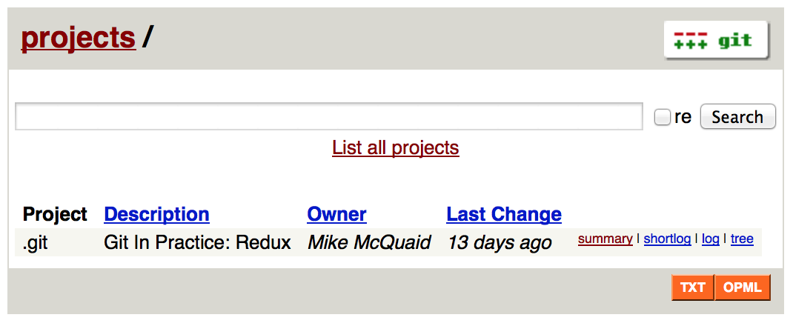
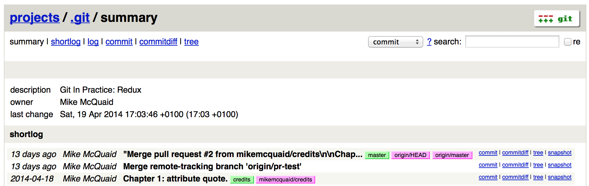

## Hosting a Repository
ifdef::env-github[:outfilesuffix: .adoc]

We saw in <<02-RemoteGit#adding-a-remote-repository-git-remote-add>> how to push to remote repositories provided by various organizations on the internet as a way of sharing your Git repositories with others. Sometimes though you may wish to host your Git repositories on a machine you control. This may range from a temporary basis where you wish to share a Git repository on your local machine with someone on your network to hosting your own Git server with access control and a web interface.

This chapter will walk through the facilities provided by Git to share your hosted repository with others without using a service like e.g. GitHub by learning about the following topics:

* How to initialize a local repository to be used only as a server
* How to mirror an existing repository for hosting as a server
* How to share the contents of a repository with users on the same network
* How to display the contents of a repository in a web browser
* How to provide more advanced Git hosting with other software

### Initialize a local repository as a server: git init --bare
The Git repositories we've seen throughout this book have all had a similar structure: the working directory contains a checkout of the files in the current branch and a `.git` subdirectory which contains the repository data.

Git stores data in a highly space-efficient format. The contents of the files on disk within a repository's working directory may sometimes take up more space than the compressed version of all files stored inside the repository! On a server the working directory should never be used directly so it is better to not create it at all. As you will just be sending/receiving Git objects to/from various Git clients with `git push`, `git fetch` or `git pull` you do not need to have the actual files checked out on disk. A Git repository without a working directory is known as a _bare repository_.

Let's create a bare repository and have a look at its contents.

#### Problem
You wish to create a bare Git repository.

#### Solution
1.  Change to the directory you wish to contain your new repository directory e.g. `cd /Users/mike/`.
2.  Run `git init GitInPracticeBare.git`. The output should resemble:

.bare repository initialization output
```
# git init --bare GitInPracticeReduxBare.git

Initialized empty Git repository in /Users/mike/GitInPracticeBare.git/ <1>
```
<1> bare repository

From the bare repository initialization output output:

* "bare repository (1)" shows the new directory that was created for the bare Git repository. The major difference compared to the first repository we created in <<01-LocalGit#creating-a-repository-git-init>> is that this repository is not in a `.git` directory.

You have successfully created a new bare Git repository.

#### Discussion
Bare repositories do not allow new commits to be created locally; they must be pushed from another repository. When creating bare repositories it is good practice to name them with the extension '.git' to make it clear that they are bare.

Let's view the contents of a bare repository by changing to the directory containing the bare Git repository and running the `find` command.

```
# cd /Users/mike/ && find GitInPracticeBare.git

GitInPracticeBare.git/config
GitInPracticeBare.git/description
GitInPracticeBare.git/HEAD
GitInPracticeBare.git/hooks/applypatch-msg.sample
GitInPracticeBare.git/hooks/commit-msg.sample
GitInPracticeBare.git/hooks/post-update.sample
GitInPracticeBare.git/hooks/pre-applypatch.sample
GitInPracticeBare.git/hooks/pre-commit.sample
GitInPracticeBare.git/hooks/pre-push.sample
GitInPracticeBare.git/hooks/pre-rebase.sample
GitInPracticeBare.git/hooks/prepare-commit-msg.sample
GitInPracticeBare.git/hooks/update.sample
GitInPracticeBare.git/info/exclude
GitInPracticeBare.git/objects/info
GitInPracticeBare.git/objects/pack
GitInPracticeBare.git/refs/heads
GitInPracticeBare.git/refs/tags
```

As you may have noticed this has created the same set of files and directories as with a non-bare repository in <<01-LocalGit#creating-a-repository-git-init>> but without the `.git` directory.

To clone this Git repository into a non-bare repository on the same machine run `git clone` with the path on disk to the repository and the new, non-bare repository name as arguments e.g. `git clone /Users/mike/GitInPracticeBare.git GitInPracticeNonBare`. In this case the output will resemble:

```
Cloning into 'GitInPracticeNonBare.git'...
warning: You appear to have cloned an empty repository.
done
```

The new repository has been created but it is empty i.e. contains no commits. If you add a file, commit and push it then it will be pushed to the bare repository and both repositories will now be non-empty.

### Mirror a repository: git clone --mirror
There are times when you wish to host a new Git repository that is a mirror of another i.e. a functionally identical copy. Recall from <<02-RemoteGit#cloning-a-remote-github-repository-onto-your-local-machine-git-clone>> that `git clone` will create a clone of the repository locally with all commits, branches and tags that are in the repository you have cloned from.

Additionally, `git clone` provides a `--mirror` flag which goes one step further and matches all refs locally. What this means is that if you cloned a repository with a branch named `testing` with `git clone` then it would contain only a remote branch named `origin/testing`. If you cloned this with `git clone --mirror` it would have a remote branch named `origin/testing` but also a local branch named `testing`. In practice this means that if anyone cloned your mirrored repository they will receive all branches if they cloned with `git clone --mirror` but not if they just used `git clone`.

Let's use `git clone --mirror` to set up a local mirror of the `GitInPracticeRedux` repository.

#### Problem
You wish mirror an existing remote repository.

#### Solution
1.  Change to the directory you wish to contain your new repository directory e.g. `cd /Users/mike/`.
2.  Run `https://github.com/GitInPractice/GitInPracticeRedux.git`. The output should resemble:

.clone mirror output
```
# git clone --mirror
  https://github.com/GitInPractice/GitInPracticeRedux.git

Cloning into bare repository 'GitInPracticeRedux.git'...<1>
remote: Reusing existing pack: 79, done.
remote: Counting objects: 1, done.
remote: Total 80 (delta 0), reused 1 (delta 0)
Unpacking objects: 100% (80/80), done.
Checking connectivity... done.
```
<1> bare repository

From the clone mirror output output:

* "bare repository (1)" shows that `git clone --mirror` will create a bare repository when it creates a mirror. This is as `--mirror` will only be used when hosting a repository for other repositories to pull from.

You have mirrored the existing `GitInPracticeRedux` repository.

#### Discussion
Recall from <<02-RemoteGit#cloning-a-remote-github-repository-onto-your-local-machine-git-clone>> that `git clone` can also take a `--bare` argument which behaves similarly to `--mirror`. Where `--mirror` will setup all remote refs as local ones e.g. turn remote branches into local ones `--bare` will just perform an ordinary clone but into a new bare repository rather than one with a working directory.

Let's examine the contents of `GitInPracticeRedux.git/packed-refs` file:
```
# pack-refs with: peeled fully-peeled
ca74d2b7c4dd15a260e68c6ff3552c64041aacdc refs/heads/inspiration <1>
a9e150fb17301eed6c31aa984411effdab8f3fec refs/heads/master <1>
a8200e1407d49e37baad47da04c0981f43d7c7ff refs/heads/v0.1-release <1>
071d468df295c3866054763250a1344e44f8c3be refs/pull/1/head <2>
75f9dd1ddc24e1fd9e58b8443f7f0176cf7bd2e7 refs/pull/1/merge <2>
e9d27c7df49c07cb2325356ab9a76f90d9f179ae refs/pull/2/head <2>
e6e9208372f3784686499430fec547c20dad6139 refs/pull/2/merge <2>
725c33ace6cd7b281c2d3b342ca05562d3dc7335 refs/tags/v0.1 <3>
```
<1> branch
<2> pull request
<3> tag

The `pack-refs` file contains all the _packed_ (i.e. in Git's format for data internal and external transfer) refs that were fetched from the `GitInPracticeRedux` repository. It contains all the created branches (1), pull requests (2) and the tag that were created in this repository. These will now be shared with any other repositories that clone this one.

### Share repository with other users on the same network: git daemon
Now that we've seen how to create bare repositories suitable for a server to share with other Git repositories let's learn how to actually serve these to other Git clients.

We saw in <<initialize-a-local-repository-as-a-server-git-init-bare>> a repository being cloned from another path on the disk. While this would be one way of sharing a repository over the network with Git (give someone access to your disk with e.g. a network share) it's not very efficient as it will use multiple protocols: the protocol used to share the files over the network and Git's interaction with the packed repository. Instead a Git server will allow Git to interact natively in its own format.

Git provides a simple server for basic repository hosting named `git daemon`. It provides no user authentication or encryption and only supports the `git://` protocol (rather than the `https://` we've used throughout this book or `ssh://` with uses SSH access). As a result it may be too limited for some cases but is great for the example in the section title: sharing a repository with other users on the same network.

#### Problem
You wish to share a repository with other users on the same network.

#### Solution
1.  Change directory to the Git repository e.g. `cd /Users/mike/GitInPracticeRedux.git/`.
2.  Run `git daemon --verbose --base-path=. --export-all`. The output should resemble:

.daemon output
```
# git daemon --verbose --base-path=. --export-all <1>

[72938] Ready to rumble <2>
```
<1> daemon arguments
<2> process ready

From the daemon output:

* "daemon arguments (1)" shows the daemon command and the list of arguments required to export the Git repository. These will be elaborated on in the Discussion section.
* "process ready (2)" shows the process ID (72938), that it has started successfully and is ready to receive clients.

Now that we have `git daemon` running open another terminal windows and clone this repository from a client with `git clone git://localhost/`:
```
# git clone git://localhost/ GitInPracticeReduxDaemon <1>

Cloning into 'GitInPracticeReduxDaemon'...
remote: Counting objects: 78, done.
remote: Compressing objects: 100% (71/71), done.
remote: Total 78 (delta 26), reused 0 (delta 0)
Receiving objects: 100% (78/78), 7.80 KiB | 0 bytes/s, done.
Resolving deltas: 100% (26/26), done.
Checking connectivity... done.
```
<1> local server

The "local server (1)" displays that we're using `localhost` to access the Git daemon on the same machine that we are hosting it on. It has cloned the repository as expected into a new directory on the same machine. If you wanted to clone this from another machine you would replace `localhost` in the command with the IP address of the machine hosting the daemon on the network e.g. `git clone git://192.168.0.123/`.

If we view the daemon output again you will see some lines have been added:
```
[72984] Connection from [::1]:52891 <1>
[72984] Extended attributes (16 bytes) exist <host=localhost> <2>
[72984] Request upload-pack for '/' <3>
[72938] [72984] Disconnected <4>
```
<1> client connection
<2> attribute exposure
<3> repository upload
<4> client disconnect

These lines show that our Git client connected to the server (1), the repository exposed some attributes to the client (2), the client requested the server upload its contents to the client (3) and that the client then disconnected from the server.

You have successfully shared a repository over the network.

#### Discussion
`git daemon` can take some parameters to customize it's behavior:

* the `--verbose` flag will output more verbose log details to the terminal about incoming Git client connections and access successes and failures. It's useful when hosting a server to enable this for debugging.
* the `--base-path=.` indicates what path should be used as the server root. In this case we only hosted a single repository so we set the root to the base directory of the repository. If you wanted to host a directory that contained multiple repositories (e.g. `fish.git` and `cat.git`) you could specify the directory and then they could be accessed by name (e.g. `git clone git://localhost/fish.git` or `git clone git://localhost/cat.git`).
* the `--export-all` flag is used to tell Git to allow access to all Git repositories under the base path. Without this argument by default `git daemon` will only allow access to repositories that have a `git-daemon-export-ok` file in the repository root (the root for bare repositories and `.git` for non-bare repositories).
* the `--enable=receive-pack` flag is needed to allow write access to the repository. By default `git daemon` will only allow read access (provided by `upload-pack`) to repositories unless this flag is provided. It's not recommended to provide write access to non-bare repositories as it would be undesirable to have remote users be able to change the contents of your local branches.
* the directory argument is needed if you wish to host a non-bare repository. In this case you would `cd` into the directory as normal but add a `./.git` argument specifying to share the `.git` directory. For example you might run `cd /Users/mike/GitInPracticeRedux && git daemon --verbose --base-path=. --export-all ./.git`.

### Display repository in a browser: git instaweb
Now that we've shared our repository on disk with other users it would be useful if we could provide a basic web interface to go along with our `git daemon`. Git provides a basic web interface named `gitweb` that can be hosted by a local web server.

.How can I install `gitweb`?
NOTE: `gitweb` is usually installed as part of the default Git installation (and is in all of the official Git installers). If it has not been you will need to install `gitweb` separately. This can be done by installing `gitweb` (or similar) with your package manager e.g. on Debian/Ubuntu run `apt-get install gitweb`.

Git provides the `git instaweb` command to host your local repository using the `gitweb` interface. To run this you will have to have a web server installed on your machine. If you are using OSX you can use `webrick` which is a simple web server provided with Ruby (which is provided with OSX). If you are on Linux you can install Ruby with your package manager e.g. on Debian/Ubuntu run `apt-get install ruby`. Windows Git installation sadly does not provide the `git instaweb` command but you can read how to set up `gitweb` using a separate web server such as Apache or IIS here: https://git.wiki.kernel.org/index.php/MSysGit:GitWeb.

Now that we have `git instaweb` setup let's use it to display the repository in a browser.

#### Problem
You wish to display the contents of a repository in a browser.

#### Solution
1.  Change to the directory containing your repository e.g. `cd /Users/mike/GitInPracticeRedux/`.
2.  Write a description for the repository's web server by running `echo "Git In Practice: Redux" > .git/description`.
3.  Run `git instaweb --httpd=webrick`. There will be no output.

Git should have opened the `gitweb` interface in your browser. It should resemble:

.gitweb projects
[[gitweb-projects]]


You can see from <<gitweb-projects>> that is displays a single Git project along with description we just set, the owner and the last change (i.e. commit) date. Click on the "summary" button to view more information about the `GitInPracticeRedux` project.

.gitweb summary
[[gitweb-redux]]


The summary page in <<gitweb-redux>> displays the same information as the projects page but also shows the list of recent commits, branches and tags in a format resembling GitX/`gitk`.

Detailing all the features of the `gitweb` interface is beyond the scope of this book; it's pretty self-explanatory. After you have finished exploring the `gitweb` interface you can stop the server by running `git instaweb --stop`.

You have successfully displayed the contents of the repository in a browser..

#### Discussion
`git instaweb` can take some parameters to customize it's behavior:

* the `--local` flag will ensure the web server can only be accessed from the local machine and not from other machines on the same network.
* the `--port` flag can be followed with a port number to specify which port should be used to access `gitweb`. For example `--port 8080` would mean that `gitweb` is hosted on port 8080.

### Advanced Git Hosting
As well as the tools provided with Git you've seen in this chapter there is a wide third-party ecosystem of Git tools that can help you share your repositories and provide a web interface to view them. There are too many and their setup is too involved for me to detail them all here. Some of the most popular options are:

GitHub::
    GitHub (https://github.com) is the most widely used Git hosting and provides many features beyond sharing and viewing Git repositories. It provides free open-source, public hosting and paid private hosting. Alternatively you can pay for GitHub Enterprise (https://enterprise.github.com) which provides a hosted GitHub appliance that can be run inside your network.

cgit::
    cgit (https://github.com/zx2c4/cgit) provides a fast Git web interface written in C. It uses forking and a cache to speed up operations and is widely used by open-source projects.

gitolite::
    gitolite (https://github.com/sitaramc/gitolite) provides access control for hosting Git repositories such as users, groups, per-branch/per-repository permissions and hook support.

### Summary
In this chapter you hopefully learned:

* How to create a new bare repository with `git init --bare`
* How to mirror an existing repository with `git clone --mirror`
* How to share a repository across the network with `git daemon`
* How to display a web interface for a repository with `git instaweb`
* How to provide more advanced Git hosting with GitHub, cgit and/or gitolite

Now let's learn how to create a clean, easy to understand Git history.
