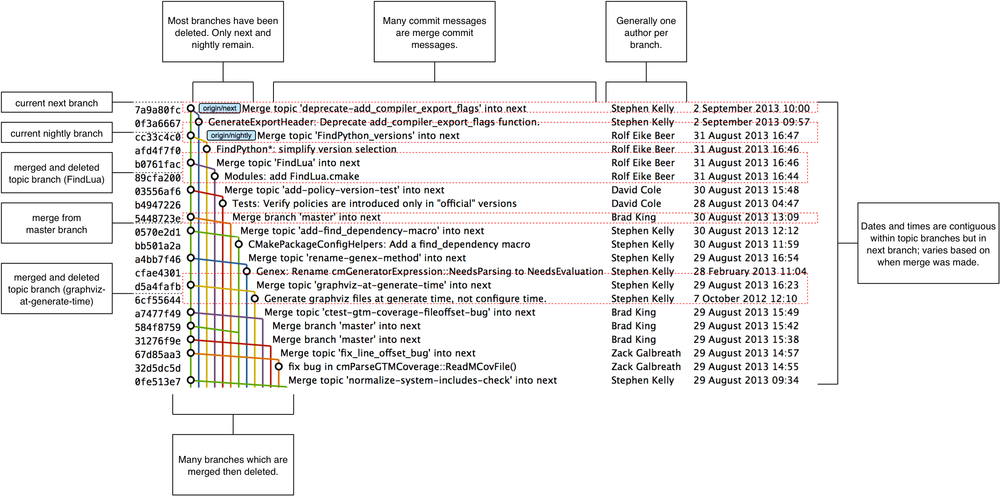
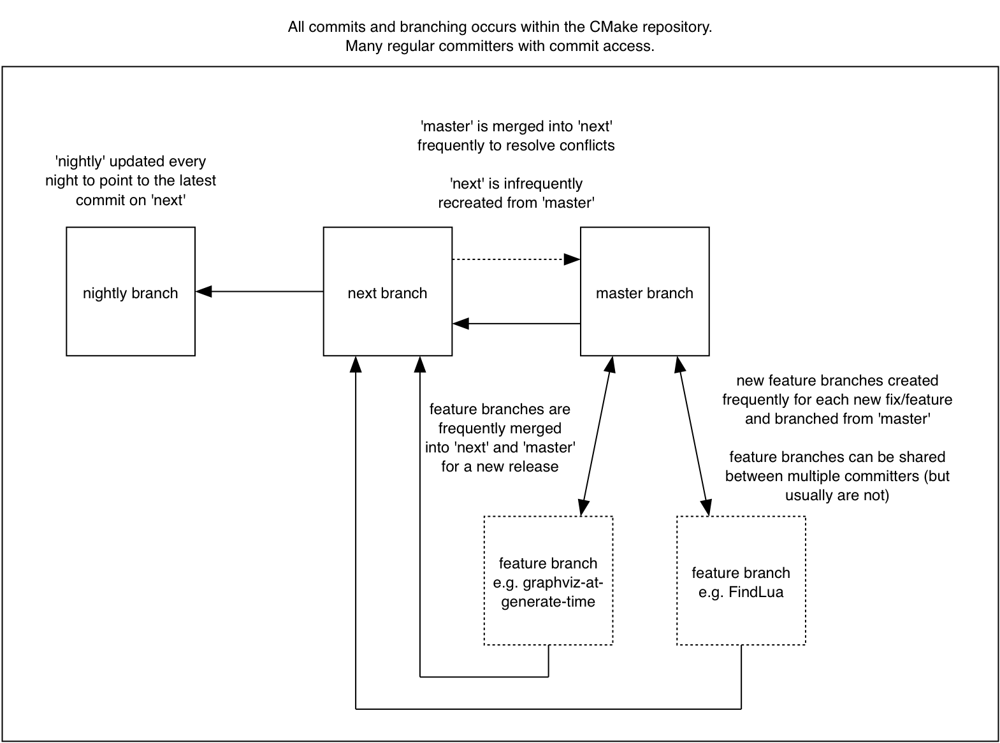
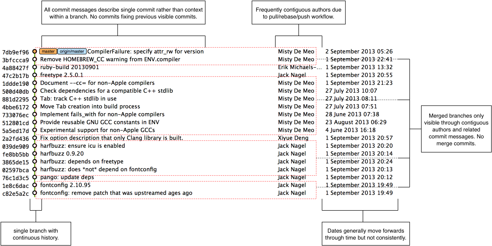
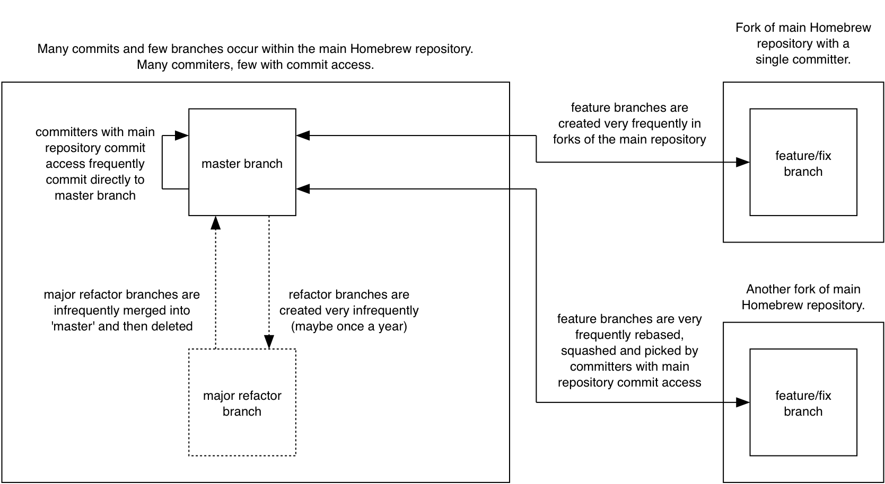

## Merging versus rebasing
ifdef::env-github[:outfilesuffix: .adoc]

// BEN: usual Manning style is just "In this chapter" and then the bullets

In this chapter you will learn about the pros and cons of merging vs rebasing by learning the following topics:

* How CMake uses a branching and merging strategy to manage contributions
* How Homebrew uses a rebasing and squashing strategy to manage contributions
* The pros and cons of each approach
* How to decide what strategy to use for your project

As seen in <<02-RemoteGit#merging-an-existing-branch-into-the-current-branch-git-merge>> and <<06-RewritingHistoryAndDisasterRecovery#rebase-commits-on-top-of-another-branch-git-rebase>>, merging and rebasing are two strategies for updating the contents of a branch based on the contents of another. Merging joins the history of two branches together with a merge commit (a commit with two parent commits), and rebasing creates new, reparented commits on top of the existing commits.

Why are there two strategies for accomplishing essentially the same task? Let's find out by comparing the Git history of two popular open-source projects and their different branching strategies.

### CMake's workflow
CMake is a cross-platform build-system created by Kitware. It has many contributors both inside and outside Kitware, with most contributions coming from those with direct push access to the Kitware Git repository.

CMake's Git repository is available to access at http://cmake.org/cmake.git. It's also mirrored on GitHub at https://github.com/Kitware/CMake if you'd rather browse or clone it from there. Please clone it and examine it while reading this chapter.

CMake makes heavy use of branching and merges. Several of the branches visible or implied in <<cmake-gitx>> are:

* `next`--Shown in the figure as `origin/next`. An _integration branch_ used for integration of _feature branches_ (also known as _topic branches_) when developing a new version of CMake. `master` is merged in here regularly to fix merge conflicts.
* `nightly`--Shown in the figure as `origin/nightly`. Follows the `next` branch and is updated to the latest commit on `next` automatically at 01:00 UTC every day. Used by automated nightly tests to get a consistent version for each day.
* `master`--Seen in figure indirectly; merged in `Merge 'branch' master into next` commit. An _integration branch_ which is always kept ready for a new release; release branches are merged into here and then deleted. New feature branches are branched off of `master`.
* _Feature branches_--Seen in figure merged `Merge topic '...' into next` commits. Used for development of all bug fixes and new features. All new commits (except merge commits) are made on feature branches. Merged into `next` for integration testing and `master` for permanent inclusion and then can be deleted.

.CMake repository history
[[cmake-gitx]]

The merging of `master` into `next` is done immediately after merging any feature branch to `master`. This ensures that any merge conflicts between `master` and `next` are resolved quickly in the `next` branch. The regular merging of feature branches into `next` allows integration testing before a new release is prepared and provides context for individual commits; the branch name used in the merge commit helps indicate what feature or bug the commit was in relation to.

.CMake branch/merge workflow
[[cmake-workflow]]

<<cmake-workflow>> focuses on the interactions between branches in the CMake workflow (rather than the interactions between commits and branches in <<cmake-gitx>>). For a new commit to end up in `master`, a new feature branch needs to be created, commits must be made on it, the feature branch must be merged to the `next` branch for integration testing, and finally the feature branch must be merged to `master` and deleted.

#### Workflow commands
The following commands are used by CMake developers to clone the repository, create new branches for review, merge them to `next` to be tested, and CMake core maintainers to finally merge them into `master.`

To set up the CMake repository on their local machine:

1.  Clone the fetch-only CMake Git repository with `git clone http://cmake.org/cmake.git`.
2.  Add the pushable staging repository with `git remote add stage git@cmake.org:stage/cmake.git`. The staging repository is used for testing and reviewing branches before they're ready to be merged. CMake developers are given push access to it but only CMake core maintainers have push access to the main repository.

To make a new branch and submit it for review:

1.  Fetch the remote branches with `git fetch origin`.
2.  Branch from `origin/master` with `git checkout -b branchname origin/master`.
3.  Make changes and commit them with `git add` and `git commit`.
4.  Push the branch to the staging repository with `git push --set-upstream stage branchname`.
5.  Post an email to the CMake mailing list (http://www.cmake.org/mailman/listinfo/cmake-developers) to ask other CMake developers for review and feedback of the changes.

To merge a branch for nightly testing:

1.  Fetch the remote branches with `git fetch stage`.
2.  Checkout the `next` branch with `git checkout next`.
3.  Merge the remote branch with `git merge stage/branchname`.
4.  Push the `next` branch with `git push`.

CMake developers actually perform these steps with the `stage` command over SSH by running `ssh git@cmake.org stage cmake merge -b next branchname`.

To make changes based on feedback from other CMake developers:

1.  Check out the branch with `git checkout branchname`.
2.  Make changes and commit them with `git add` and `git commit`.
3.  Push the new commits to the staging repository with `git push`.
4.  Post another email to the CMake mailing list (http://www.cmake.org/mailman/listinfo/cmake-developers).

For a CMake core maintainer to merge a branch into `master` after successful review:

1.  Fetch the remote branches with `git fetch stage`.
2.  Checkout the `master` branch with `git checkout master`.
3.  Merge the remote branch with `git merge stage/branchname`.
4.  Push the `master` branch with `git push`.

CMake core maintainers actually perform these steps with the `stage` command over SSH by running `ssh git@cmake.org stage cmake merge -b master branchname`.

### Homebrew's workflow
Homebrew is a package manager for OSX. It has thousands of contributors but a very small number of maintainers with commit access to the main repository (five at the time of writing).

Homebrew's main Git repository is available to access at https://github.com/Homebrew/homebrew. Please clone it and examine it while reading this chapter.

.Homebrew repository history
[[homebrew-gitx]]

Homebrew has very few merge commits within the repository (remember that _fast forward merges_ don't produce merge commits). In <<homebrew-gitx>> you can see that the history is entirely continuous despite multiple commits in a row from the same author and non-continuous dates. Branches are still used by individual contributors (with and without push access to the repository) but branches are rebased and squashed before being merged. This hides merge commits, evidence of branches, and temporary commits (for example, those that fix up previous commits on the same branch) from the `master` branch.

.Homebrew's branch/rebase/squash workflow
[[homebrew-workflow]]

<<homebrew-workflow>> focuses on the branches and repositories in the Homebrew workflow. New commits can end up on `master` either by being directly committed by those with main repository access, a feature branch being squashed and picked from a forked repository or, very rarely, through a major refactor branch being merged.

On the infrequent occasions that a major refactor branch is needed on the core-repository (say, for heavy testing of the major refactor), it will be kept as a branch in the main repository and then merged. This branch won't be used by users but may be committed to and tested by multiple maintainers.

#### Workflow commands
The following commands are used by Homebrew contributors to clone the repository, create new branches, and issue pull requests, and by Homebrew maintainers to finally merge them into `master.`

To set up the Homebrew repository on your local machine:

1.  Clone the fetch-only Homebrew Git repository with `git clone https://github.com/Homebrew/homebrew.git`.
2.  _Fork_ the Homebrew repository on GitHub. This creates a pushable, personal remote repository. This is needed as only Homebrew maintainers have push access to the main repository.
3.  Add the pushable forked repository with `git remote add username https://github.com/username/homebrew.git`.

To make a new branch and submit it for review:

1.  Check out the `master` branch with `git checkout master`.
2.  Retrieve new changes to the `master` branch with `git pull --rebase` (or Homebrew's `brew update` command, which calls `git pull`).
3.  Branch from `master` with `git checkout -b branchname origin/master`.
4.  Make changes and commit them with `git add` and `git commit`.
5.  Push the branch to the fork with `git push --set-upstream username branchname`.
6.  Create a _pull request_ on GitHub requesting review and merge of the branch..

To make changes based on feedback:

1.  Check out the branch with `git checkout branchname`.
2.  Make changes and commit them with `git add` and `git commit`.
3.  Squash the new commits with `git rebase --interactive origin/master`.
4.  Update the remote branch and the pull request with `git push --force`.

For a Homebrew maintainer to merge a branch into `master`:

1.  Checkout the `master` branch with `git checkout master`.
2.  Add the forked repository and cherry-pick the commit with `git add remote username https://github.com/username/homebrew.git`, `git fetch username`, and `git merge username/branchname`. Alternatively, some maintainers (including me) use Homebrew's `brew pull` command, which pulls the contents of a pull request onto a local branch by using patch files rather than fetching from the forked repository.
3.  Rebase, reword, and clean up the commits on `master` with `git rebase --interactive origin/master`. It's common for Homebrew maintainers to edit or squash commits and rewrite commit messages but preserve the "author" metadata so the author retains credit. Often a commit will be edited to contain a string like "Closes #123", which automatically closes the pull request numbered 123 when the commit is merged to master. This will also be covered more in chapter 11.
// BEN: this is ch 13, so if the ref to ch 11 is correct then it should say "was" -- otherwise please fix reference
4.  Push the `master` branch with `git push`.

### CMake's workflow pros and cons
CMake's approach makes it easy to keep track of what feature branches have been merged, when they were merged, and by whom. Individual features and bug fixes live in separate branches and are only integrated when and where it makes sense to do so. Individual commits and evidence of branches (but not the branches themselves) are always kept in history for future viewing. Feature branches are tested individually and then integration testing is done in the `next` branch. When a feature branch is deemed to be in a sufficiently stable state, it's merged into the `master` branch and deleted. This ensures that the `master` branch is always stable and kept ready for a release.

When developing desktop software like CMake that ships binary releases, having a very stable branch is important; releases are a formal, time-consuming process and updates can't be trivially pushed after release. As a result it's important to ensure that testing is done frequently and sufficiently before releasing.

CMake's approach produces a history that contains a lot of information but, as seen from the plethora of lines in <<cmake-gitx>>, can be hard to follow. Merge commits are frequent and commits with actual changes are harder to find as a result. This can make reverting individual commits tricky; using `git revert` on a merge commit is hard because Git doesn't know which side of the merge it should revert to. In addition, if you revert a merge commit then you can't easily re-merge it.

There are also potential trust issues with CMake's approach. Everyone who wants to create a feature branch needs commit access to the CMake repository. As Git (and Git hosting services) don't provide fine-grained access control (such as restricting access to particular branches), and as CMake's Git workflow doesn't rewrite history, anyone with commit access could for example make commits directly to the `master` branch and circumvent the process. Everyone who commits to CMake needs to be made aware of the process and trusted not to break or circumvent it. Kitware protects against process violations with rewriting and server-side checks. But this requires complex setup and server configuration and a willingness to rewrite pushed branches to fix mistakes.

### Homebrew's workflow pros and cons
A major benefit of Homebrew's approach should be evident from <<homebrew-gitx>>; the history is very simple. The `master` branch contains no direct merges, so ordering is easy to follow. Commits contain concise descriptions of exactly what they do, and there are no commits that are fixing previous ones. Every commit communicates important information.

As a result of commits being squashed, it's also easy to revert individual commits and, if necessary, reapply them at a later point. As Homebrew doesn't have a release process (the top of the `master` branch is always assumed to be stable and delivered to users) it's important that changes and fixes can be pushed quickly rather than having a stabilization or testing process.

.Why is a readable history important for Homebrew?
NOTE: Readable history is an important feature of Homebrew's workflow. Homebrew uses Git not just as a version control system for developers, but also as an update delivery mechanism for users. Presenting these users with a more readable history allows them to better grasp updates to Homebrew with basic Git commands and without understanding merges.

Homebrew's workflow uses multiple remote repositories. As only a few people have commit access to the core repository, their approach is more like that of Linus on the Git project (as discussed in <<01-LocalGit#why-do-programmers-use-git>>), often managing and including commits from others more than making their own commits. Many commits made to the repository are made by squashing and merging commits from forks into the `master` branch of the main repository. The squashing means that any fixes that needed to be made to the commit during the pull request process won't be seen in the `master` branch and each commit message can be tailored by the core team to communicate information in the best possible way.

This workflow means that only those on the core team can do anything dangerous to the main repository. Anyone else will need their commits reviewed before they're applied. This puts more responsibility on the shoulders of the core team, but means that other contributors to Homebrew only need to know how to create a pull request and not how to do stuff like squash or merge commits.

Unfortunately Homebrew's approach means that most branch information is (intentionally) lost. It's possible to guess at branches from multiple commits with related titles and/or the same author multiple commits in a row, but there's nothing explicit in the history that indicates a merge has occurred. Instead, metadata is inserted into commit messages which state that a commit was "Signed-off by" a particular core contributor, and which pull request (or issue) this commit related to.

### Picking your strategy
Organizations and open-source projects vary widely on branching approaches. When picking between a branch-and-merge or a branch-rebase-and-squash strategy, it's worth considering the following:

* If all the committers to a project are trusted sufficiently and can be educated on the workflow, then giving everyone access to work on a single main repository may be more effective. If committers' Git abilities vary dramatically and some are untrusted, then using multiple Git repositories and having a review process for merges between them may be more appropriate.
* If your software can release continuous, quick updates such as a web application or has a built-in updater (like Homebrew), then focusing development on a single (`master`) branch would be sensible. If your software has a more time-consuming release process such as desktop or mobile software that needs to be compiled (and perhaps even submitted to an app store for review), then working across many branches may be more suitable. This applies even more so if you have to actively support many released versions of the software simultaneously.
* If it's important to be able to trivially revert merged changes on a branch (and perhaps remerge them later), then a squashing process may be more effective than a merging process.
* If it's important for the history to be easily readable in tools such as GitX or `gitk`, then a squashing process may be more effective. Alternatively, a merging process can still be done but with less frequent merges so each merge contains at least two or more commits. This will ensure that the history is not overwhelmed with merge commits.

There are various other considerations you could take into account, but these are a good starting point. You could also consider creating your own, blended approach which may use merging and squashing in different situations.

Whatever workflow you decide is best for your project, it's important to try and remain consistent; not necessarily across every branch (for example, it might be reasonable to always make merge commits in `master` but always rebase branches on top of other branches), but a consistent approach across the repository. This should ensure that, whatever strategy is adopted, the history will communicate something of the development process of the project and that new committers can look at the history for an example of what their workflow should be like.

.What is the author's preferred approach?
NOTE: Although I've committed to both projects, most of my open-source time is spent working on Homebrew. It will probably come as no surprise to hear therefore that I prefer Homebrew's approach. Maintaining a simple and readable history has frequently paid off in terms of quickly being able to `git bisect` or `git revert` problematic commits. Also, I prefer software release processes that favor lots of small updates rather than fewer, large updates. I think these processes are easier to test, as they encourage incremental improvements rather than huge, sweeping changes.

### Summary
In this chapter you hopefully learned:

* How CMake uses multiple branches to keep features developed in separation
* How Homebrew uses a single branch to release continuous updates to users
* How merging allows you to keep track of who added commits, when, and why
* How rebasing and squashing allows you to maintain a cleaner history and
  eliminate commits that may be irrelevant
