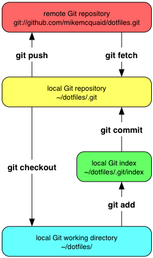

# Hosting your own Git repository
How to host your own Git repository for either temporary access or as an alternative to services like GitHub.

## Initialize a local repository as a server

### Commands
`git init --bare $REPOSITORY_DIRECTORY`

#### Output
`Initialized empty Git repository in /Users/mike/git-testing/.git/`

### Walkthrough
When creating a Git repository for use on a server rather than a local machine the contents of the .git subdirectory becomes the only data that is used or important. In this case a bare repository can be created which, instead of having a .git subdirectory, makes the main directory store all Git's files. Bare repositories do not allow new commits to be created locally; they must be pushed from another repository. When creating bare repositories it is good practice to name them with the extension '.git' to make their purpose clear.

To create a new local bare Git repository in a new subdirectory named "git-testing.git":

1. Run `git init --bare git-testing.git`
2. A bare Git repository has been created in a new subdirectory named "git-testing.git".

### Explanation

Git stores data in a highly space-efficient format. Each commit after the first (known as the initial commit) follows on from a previous commit (or two previous commits in the case of a merge). The contents of the files on disk within a repository's working tree (not under the .git directory; the place where files are edited) may sometimes take up more space than the compressed version stored inside the repository. As a result if the working tree is never used directly (such as on a server) it may be better to not create it at all and never checkout the data from the repository into the working tree. This is the case with bare repositories; typically the only interaction with them is through `git push`, `git fetch` or `git pull` from another machine.

## Clone a repository on the same machine

## Mirror a repository

### Display repository in a browser

### Share repository with other users on the same network
