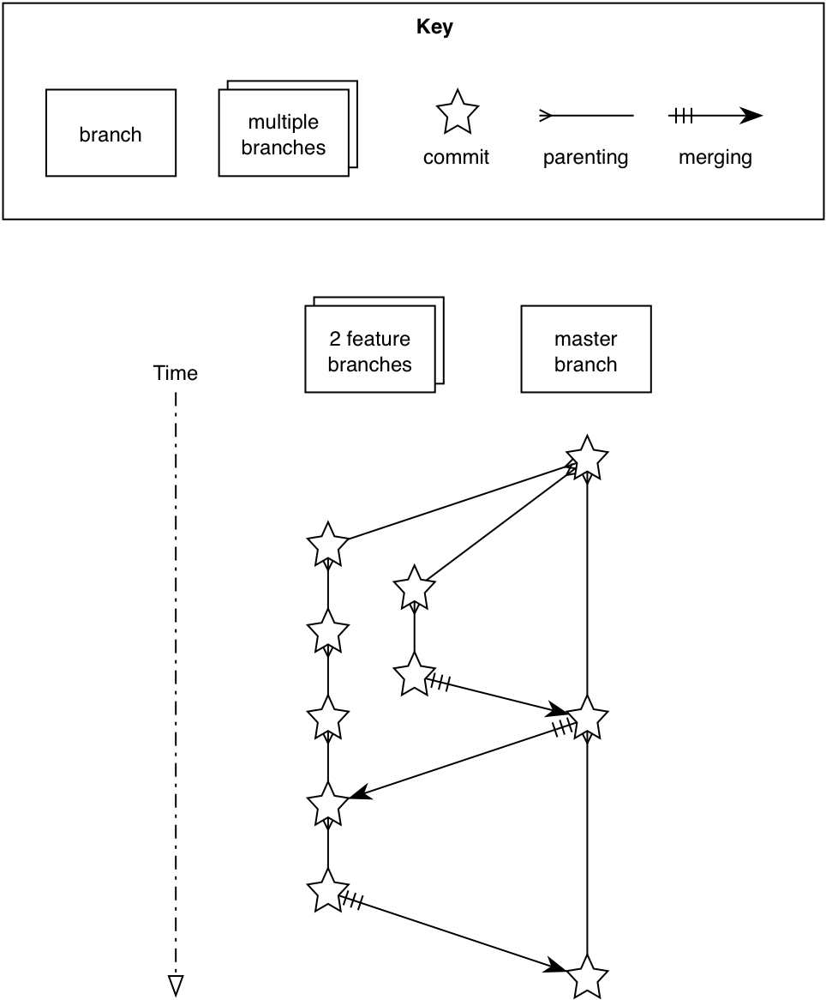
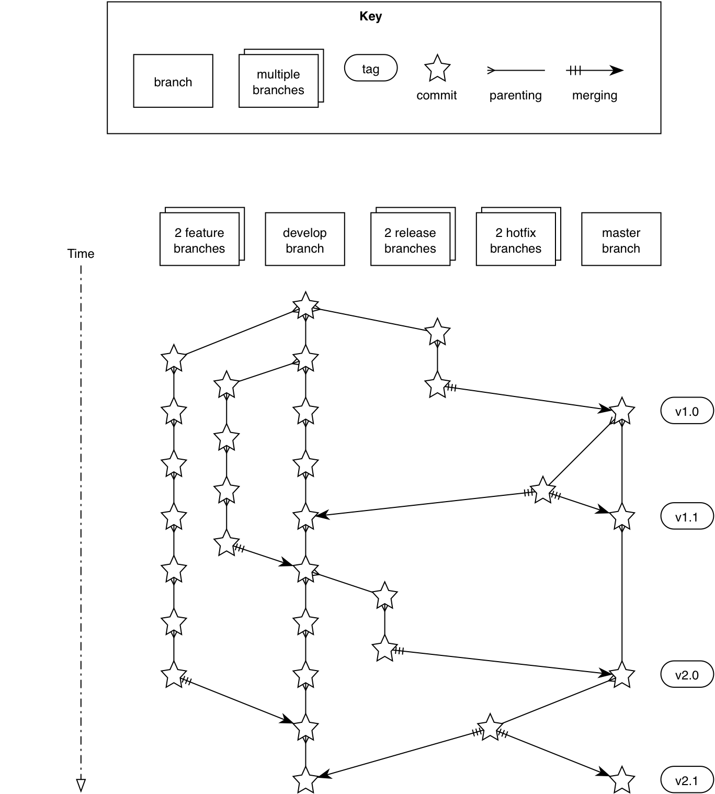
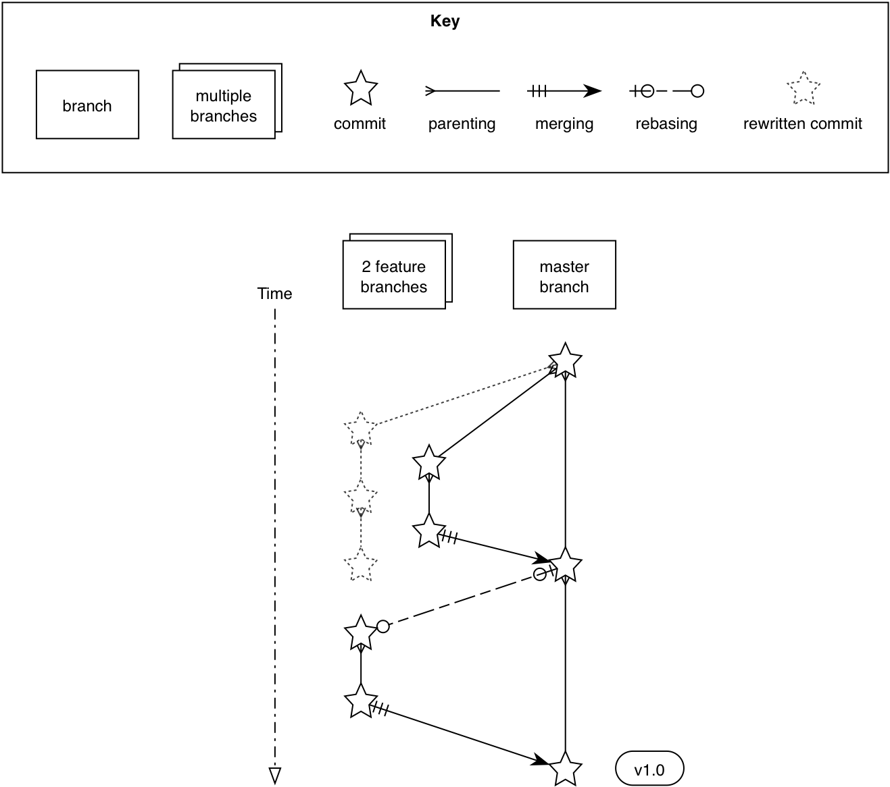
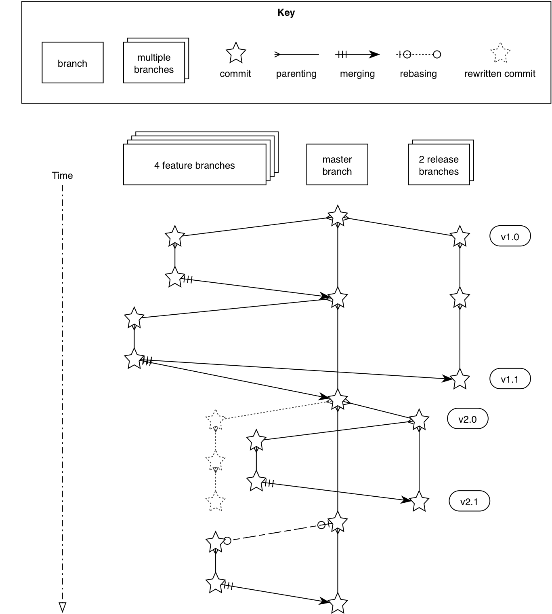

## Recommended team workflows
ifdef::env-github[:outfilesuffix: .adoc]

We saw in <<13-MergingVsRebasing#homebrew-s-workflow>> and <<13-MergingVsRebasing#cmake-s-workflow>> that you can have two teams who both use Git as a version control system for managing a software project but handle branches, merging, and rebasing very differently. The different strategies for deciding how and when to branch, merge, or rebase as part of a team are _team workflows_. The different workflows allow different ways of handling (or not handling) stable releases, tags, and bugfixing of previous releases.

In this chapter you will learn the two most popular Git workflows and two of my personal workflows:
 
* How to use GitHub Flow to manage an untagged project
* How to use Git Flow to manage a tagged project
* How to use Mike Flow Single to manage a single release project
* How to use Mike Flow Multiple to manage a multiple release project

### GitHub Flow
GitHub Flow is so named because it's the Git workflow that came out of the GitHub organization. It was first formally described in a blog post by Scott Chacon in 2011 at http://scottchacon.com/2011/08/31/github-flow.html.

GitHub Flow is made simple because it essentially only involves two types of branches: the default `master` branch and _feature branches_. A feature branch is one that is used only for the development of a single feature (or sometimes bug fix) and then deleted after being merged into another branch.

In GitHub Flow:

* All commits are made on feature branches
* Feature branches are merged to the `master` branch after review in a pull request
* All commits to `master` are considered stable

At GitHub they automatically deploys all commits to the `master` branch to their production web servers. You can read more about GitHub Flow on GitHub's guide at https://guides.github.com/introduction/flow/index.html.

Let's say you're working on a new web application called LintHub where people could get together to share those annoying bits of fluff that accumulate in pockets. You want to add a feature for users to message each other, so you create a feature branch named `user-chat` from the `master` branch. You then commit your changes to this branch over the course of a few weeks and push them to the remote repository. When you've tested your changes and think they're stable enough to be used on the main web server, you'd create a pull request on GitHub. Your coworkers think your changes are OK so you merge your changes to `master`, delete the `user-chat` branch, and deploy them to the main web server where it can be used by users. If you needed to fix a bug with users being unable to message Scottish people, you'd create another feature branch called `fix-scottish-users-chats` and follow the same process as with the new feature.

.GitHub Flow
[[github-flow-diagram]]

Let's look at <<github-flow-diagram>> from top (the oldest commit) to the bottom (the newest commit):

1.  The initial commit to a repository is on the `master` branch and made with `git add` and `git commit`.
2.  A new feature is being developed so it's branched off the `master` branch with `git checkout -b`.
3.  Another feature is developed in parallel, so it too is branched off the `master` branch with `git checkout -b`.
4.  Commits are made to both feature branches with `git commit`. They're pushed periodically with `git push`. Commits may be rewritten locally with `git rebase --interactive` or `git commit --amend` before being pushed, but are never rewritten after being pushed, so `git push --force` is never required.
5.  A feature branch is submitted for review in a pull request either through the GitHub web interface or with `gh pull-request` (introduced in <<10-GitHubPullRequests#making-a-pull-request-in-the-same-repository-gh-pull-request>>). If any changes are needed due to comments in the pull request, they're committed. The pull request is automatically updated after new commits have been pushed to the remote branch. When the branch is ready, it's merged to `master` with `git merge --no-ff`, and deleted locally with `git branch --delete` and remotely with `git push --delete`.
6.  The remaining feature branch needs to use the changes in `master` so merges them with `git merge --no-ff`. This may be simply to use them in the branch or to resolve conflicts in the feature branch before they're merged into `master`.
7.  The remaining feature branch is submitted for review, merged, and deleted.

#### Pros and cons
The pros of GitHub flow are:

* It's beautiful in its simplicity and, as a result, it's easy to use with Git, GitHub's web interface, and any Git graphical tools that support branching and merging.
* As everything ends up in the `master` branch, there's little concern about commits getting lost.
* A branch is created, committed to, reviewed in a pull request, committed to again if necessary, merged, and deleted. If a branch exists, it's because it either hasn't been merged to `master` or because someone forgot to delete it.

The cons of GitHub Flow are:

* As a large web application, GitHub doesn't have versioned releases that are released to customers. Every commit to the `master` branch is deployed to the production servers as soon as it's made. This approach is known as _continuous deployment_. This approach works well for web applications but doesn't work so well for things like desktop application software that needs to be released to users and requires them to restart their application to update it. In this case, because hot-fixes can't be pushed to `master` without branching and review, it's important that feature branches be sufficiently tested before merging to `master`.
* Some pieces of software need to support multiple versions at once--for example, new stable versions of v1.0 and v2.0. GitHub Flow doesn't account for this case at all.

In my experience, GitHub Flow is a pleasantly simple workflow that's well suited for web projects that use continuous deployment. It's not well suited for desktop software, particularly when multiple releases need to be supported at once (release new v1.x and v2.x versions). These more advanced cases call for a more advanced workflow, such as Git Flow.

### Git Flow
Git Flow was probably the first formal Git branching and merging workflow to take off. In 2010, Vincent Driessen wrote a blog post describing a Git workflow he'd been using for his software projects at http://nvie.com/posts/a-successful-git-branching-model/. The goals of Git Flow were to make heavy use of branching in Git and strict rules to provide a shared team understanding of the software release process while ensuring quality.

Git Flow involves five different types of branches:

* The `master` branch is used only for stable releases. Every commit to the `master` branch is tagged immediately. Commits are never made directly, but are merged in from hotfix or release branches.
* The `develop` branch is a long-lived branch (it's never deleted). It' used for the bulk of daily development either through bugfix commits directly to it, feature, release, or hotfix branch merges to it.
* Feature branches are branched off `develop` and are used for new feature development. When they're ready, they're merged back into `develop`. They can be named anything.
* Release branches are used to stabilize a release. They're branched off `develop` and have bugfixes made to them and hotfixes merged into them. Bugfixes and hotfixes are merged back into the `develop` branch. They're named prefixed with `release-`.
* Hotfix branches are used for small fixes that need an immediate new release. They're merged into `master` (where they're immediately tagged) and into the current release branch if it exists, or `develop` if it doesn't. They're named prefixed with `hotfix-`.

Let's say you're working on a new mobile application called GetPub where people can get directions to their nearest pub. You want to add a feature for saving particular pubs, so you create a feature branch named `save-pubs` from the `develop` branch. You then commit your changes to this branch over the course of a few weeks and push them to the remote repository. When you've tested your changes and think they're stable enough to be included in the main development branch, you'd merge them into `develop` and delete your branch. When the new `2.x` release branch was created from `develop`, your save pub feature was included. After the release branch has been sufficiently tested, it will be merged into `master`, tagged, and released to the users of the mobile application. If you needed to fix a bug with saving Scottish pubs, you'd create a hotfix branch named `hotfix-save-scottish-pubs` from the `2.x` release branch, commit to it, test it, and then merge it into `master`, tag it, and release it to your users.

Let's look at a diagram to help us understand Git Flow:

.Git Flow
[[git-flow-diagram]]

Let's look at <<git-flow-diagram>> from top (the oldest commit) to the bottom (the newest commit):

1.  The initial commit to a repository is on the `develop` branch and made with `git add` and `git commit`.
2.  A release branch for the v1.x release series is branched off the `develop` branch with `git checkout -b`.
3.  A new feature is being developed so it's branched off the `develop` branch with `git checkout -b`.
4.  Commits are made to the `develop` branch for changes that aren't significant enough to be feature branches and not needed on the release branches. For example, small tweaks to behavior of the application that aren't fixes may be committed directly to the `develop` branch.
5.  Another feature is developed in parallel so it too is branched off the `develop` branch with `git checkout -b`.
6.  Commits are made to both feature branches with `git commit`. They may pushed periodically with `git push` but typically to the developer's own remote repository rather than the main repository. Commits may be rewritten locally with `git rebase --interactive` or `git commit --amend` before being pushed, but are never rewritten after being pushed, so `git push --force` is never required.
7.  Commits are made to the release branches with `git commit` for changes or fixes specific to a release but not applicable to other application development. For example, this may be changing a version number displayed in the application.
8.  A release branch is ready and merged to `master` with `git merge --no-ff`. It's not deleted but kept around indefinitely in case any more stable releases are needed from it. It's immediately tagged `v1.0` with `git tag` and pushed with `git push` and `git push --tags`.
9.  A new hotfix is needed for both the `develop` branch and a release branch, so a hotfix branch is branched off the `master` branch with `git checkout -b`.
10.  A hotfix branch is ready and merged to both `develop` and `master` with `git merge --no-ff`, and deleted locally with `git branch --delete` and remotely with `git push --delete`. The new `master` branch is immediately tagged `v1.1` with `git tag` and pushed with `git push` and `git push --tags`.
11.  A feature branch is ready and merged to `develop` with `git merge --no-ff`, and deleted locally with `git branch --delete` and remotely with `git push --delete`.
12.  A new release branch for the v2.x release series is branched off the `develop` branch with `git checkout -b`.
13.  A release branch is ready and merged to `master` with `git merge --no-ff`. It isn't deleted but is kept around indefinitely in case any more stable releases are needed from it. It's immediately tagged `v2.0` with `git tag` and pushed with `git push` and `git push --tags`.
14.  Another hotfix is needed for both the `develop` branch and a release branch, so another hotfix branch is branched off the `master` branch with `git checkout -b`.
15.  A hotfix branch is ready and merged to both `develop` and `master` with `git merge --no-ff`, and deleted locally with `git branch --delete` and remotely with `git push --delete`. The new `master` branch is immediately tagged `v2.1` with `git tag` and pushed with `git push` and `git push --tags`.

Git Flow also has a set of Git extensions that allow working through this workflow with some commands. For example, to create a new feature branch, you can run `git flow feature start new-feature-name`. You can download these extensions and read more about them at https://github.com/nvie/gitflow.

#### Pros and cons
The pros of Git Flow are:

* It allows a way of keeping track of released versions, features in development, and urgent and non-urgent bug fixes through branch naming.
* Having a formal flow through which branches are merged means that a review process can ensure that things are reviewed multiple times before going into a release.

The cons of Git Flow are:

* It's complicated to come to grips with. This can work well for organizations where people can be trained and on-boarded, but less well for short projects or open-source projects which seek to attract many new contributors.
* If you're using continuous deployment, the number of merges required from feature branch to `master` branch can be excessive.

In my experience Git Flow is more complicated than it needs to be. Although it uses the flexibility of Git's branching, it has so many rules and restrictions that it becomes difficult to use. The previously mentioned extensions seem like a negative rather than positive for me; people clearly found Git Flow sufficiently difficult to work with that they had to add a separate layer of top of Git to work with it effectively! It's definitely more complex to both use and understand than GitHub Flow, and harder to keep track of what changes are outstanding as a result. But as I mentioned earlier, GitHub Flow doesn't suit desktop application development as well as Git Flow. It's for these reasons that I've created my own Git workflow known as _Mike Flow_.

### Mike Flow
I've used many different Git workflows over the years from Git Flow, to GitHub Flow, to the Homebrew and CMake workflows mentioned in <<13-MergingVsRebasing#homebrew-s-workflow>> and <<13-MergingVsRebasing#cmake-s-workflow>>. They all have their pros and cons, but my preferred workflow is something I've named for this book _Mike Flow_.

As we've seen with GitHub Flow and Git Flow, different release processes are optimized for continuously deployed web applications versus more slowly received desktop applications. For this reason _Mike Flow_ has two slightly different workflows: Mike Flow Single and Mike Flow Multiple.

The "Single" and "Multiple" in these cases refer to how many different versions of the software you need to support at once. Say you've made a `v1.5` release and a `v2.0` release. Will you make a `v1.6` release after `v2.0`? If not, you want Mike Flow Single, and if so, you want Mike Flow Multiple. If you're doing continuous deployment that's OK too; Mike Flow Single can be used in this fashion too.

#### Mike Flow Single
Mike Flow Single is essentially GitHub Flow with two extra elements:

1.  Branches can (and should be) rebased, rewritten, and squashed where appropriate (to make history cleaner, but not if the branch is being used by multiple people).
2.  Stable releases can be tagged on the `master` branch.

Let's say you're working on a new desktop application called GutRub that provides a tutorial for soothing digestion by rubbing your stomach. You want to add a feature for an anti-clockwise rub tutorial so you create a feature branch named `anti-clockwise-rub` from the `master` branch. You then commit your changes to this branch over the course of a few weeks and push them to the remote repository. When you've tested your changes and think they're stable enough to be included in the next version, you'd merge them into `master` and delete your branch. When the version `2.0` is tagged and released from the `master` branch, it will include your anti-clockwise rub feature. If you needed to fix a bug with your anti-clockwise rub tutorial playing backwards, you'd create a feature branch named `reverse-anti-clockwise-rub` and follow the same process as with the new feature.

.Mike Flow Single
[[mike-flow-single-diagram]]

Let's look at <<mike-flow-single-diagram>> from top (the oldest commit) to the bottom (the newest commit):

1.  The initial commit to a repository is on the `master` branch and made with `git add` and `git commit`.
2.  A new feature is being developed, so it's branched off the `master` branch with `git checkout -b`.
3.  Another feature is developed in parallel, so it too is branched off the `master` branch with `git checkout -b`.
4.  Commits are made to both feature branches with `git commit`. They're pushed periodically with `git push`.
5.  A feature branch is submitted for review in a pull request, either through the GitHub web interface or with `gh pull-request` (introduced in <<10-GitHubPullRequests#making-a-pull-request-in-the-same-repository-gh-pull-request>>). If any changes to files are needed due to comments in the pull request, the changes are committed. The pull request is automatically updated with all changes after new commits have been pushed to the remote branch. When the branch is ready, it's merged to `master` with `git merge`, and deleted locally with `git branch --delete` and remotely with `git push --delete`.
6.  The remaining feature branch needs to use the changes in `master` and to rewrite commits, so it's rebased and squashed on top of `master` with `git rebase --interactive`. This may be simply to use work from `master` in the branch, to resolve conflicts in the feature branch before they're merged into `master`, or to clean up commits by rewriting them.
7.  The remaining feature branch is submitted for review, merged, and deleted.

#### Mike Flow Multiple
Mike Flow Multiple is essentially Mike Flow Single with release branches:

* Release branches are branched off of `master` and can be committed to directly, cherry-picked, or merged to from feature branches.
* Unlike feature branches, release branches are never rewritten.
* Tags are created on feature branches rather than `master`.

Let's say you're working on a new desktop application called CutDub, which provides the ability to trim dubstep music albums to your chosen length. You want to add a feature for automatic silence trimming, so you create a feature branch named `auto-silence-trim` from the `master` branch. You then commit your changes to this branch over the course of a few weeks and push them to the remote repository. When you've tested your changes and think they're stable enough to be included in next stable version, you'd merge them into `master` and delete your branch. When the `2.x` release branch is created from the `master` branch, it will include your automatic silence trimming feature. When `2.0` is tagged and released, it will include your automatic silence trimming feature. If you needed to fix a bug in the `2.0` release with some trims causing corruption, you'd create a feature branch named `fix-trim-corruption` and merge it into `master` and `2.x` and produce a new release after testing.

Let's look at a diagram to help us understand Mike Flow Multiple:

.Mike Flow Multiple
[[mike-flow-multiple-diagram]]

Let's look at <<mike-flow-multiple-diagram>> from top (the oldest commit) to the bottom (the newest commit):

1.  The initial commit to a repository is on the `master` branch and made with `git add` and `git commit`.
2.  A new feature is being developed, so it's branched off the `master` branch with `git checkout -b`.
3.  A release branch for the v1.x release series is branched off the `master` branch with `git checkout -b`.
4.  A commit is made to the feature branch with `git commit`. It's pushed with `git push`.
5.  A feature branch is submitted for review in a pull request, either through the GitHub web interface or with `gh pull-request` (introduced in <<10-GitHubPullRequests#making-a-pull-request-in-the-same-repository-gh-pull-request>>). If any changes are needed due to comments in the pull request, they're committed. The pull request is automatically updated after new commits have been pushed to the remote branch. When the branch is ready, it's merged to `master` with `git merge` and deleted locally with `git branch --delete` and remotely with `git push --delete`.
6.  Commits are made to the release branches with `git commit` for changes or fixes specific to a release but not applicable to other application development. For example, this may be changing a version number displayed in the application.
7.  Another feature or fix is developed so a new feature branch is branched off the `master` branch with `git checkout -b`.
8.  A feature branch is ready and merged to both `master` and the release branch for the v1.x release series with `git merge`, and deleted locally with `git branch --delete` and remotely with `git push --delete`. The release branch for the v1.x release series is tagged `v1.1` with `git tag` and pushed with `git push` and `git push --tags`. The release branch is not deleted but kept around indefinitely in case any more stable releases are needed from it.
9.  Another feature is developed, so a new feature branch is branched off the `master` branch with `git checkout -b`.
10.  A new release branch for the v2.x release series is branched off the `master` branch with `git checkout -b`.
11.  A fix is needed for the v2.x release series, so a new feature branch is branched off the v2.x release branch with `git checkout -b`.
12.  The feature branch fix is ready and merged to the v2.x release series branch with `git merge`, and deleted locally with `git branch --delete` and remotely with `git push --delete`. The new `master` branch is tagged `v2.1` with `git tag` and pushed with `git push` and `git push --tags`.
13.  The remaining feature branch needs to use changes in `master` and to rewrite commits, so it's rebased and squashed on top of `master` with `git rebase --interactive`. This may be simply to use work from `master` in the branch, to resolve conflicts in the feature branch before they're merged into `master`, or to clean up commits by rewriting them.
14.  The remaining feature branch is submitted for review, merged, and deleted.

#### Pros and cons
The pros of the two variants of Mike Flow are:

* Any developers not interacting with a release can behave as if they were using GitHub Flow.
* Any developers who are more experienced with Git are empowered by being able to use more advanced history rewriting on remote branches. This allows them to keep their work shared and backed up but still make changes before it's merged.
* Tags and multiple release branches are optionally added because they're necessary with some forms of software development, such as desktop applications where multiple versions need to be supported.

The cons of the two variants of Mike Flow are:

* It's not a known workflow outside of this book and people who have worked with me! That said, I've known many other projects to adopt a very similar process.
* Its flexibility in history rewriting and branching may make mistakes easier to happen.

Obviously I'm biased, but I think Mike Flow provides the best of both Git Flow and GitHub Flow; a stable release and review structure but without the complexity as strictly a mandated process.

### Which workflow is for you?
It's worth reading through and trying to understand all the workflows in this chapter and in <<13-MergingVsRebasing#homebrew-s-workflow>> and <<13-MergingVsRebasing#cmake-s-workflow> before deciding on a workflow for your own team.

Some questions to ask yourself when picking the best workflow:

* Is your team all experienced with Git or new to it? If new to it, you probably want to try to pick as simple a workflow as possible (not Git Flow).
* Does your team respond better to rigid, documented process with strict rules, or a more relaxed approach? If they like a rigid process then Git Flow may be a good solution.
* Do you want to do multiple reviews before releasing code to customers? If so, Git Flow may be a good fit.
* Do you need to release new versions for multiple release series; for example, after releasing v2.0 will you later release a v1.5? If so, Mike Flow Multiple or Git Flow will be a good bet. GitHub Flow doesn't handle this situation at all so be extremely wary if you're considering using it in this case.
* If you want to use workflows that are well-known outside this book, it's best to stick to GitHub Flow or Git Flow.
* If you want to have code deployed to production as quickly as possible, it's perhaps worth sticking with GitHub Flow or Mike Flow Single, as Git Flow or Mike Flow Multiple add more intermediate steps.
* If you're working alone but still want to use a structured branching workflow then GitHub Flow, Mike Flow Single, or Multiple are sufficient, and Git Flow is overkill.

Ultimately any of the workflows discussed in this book will be better than no workflow at all (but do try to be consistent). Remember that Git is a powerful tool and it should help you and your team be more productive and write better software. Good luck with it!

### Summary
In this chapter you hopefully learned:

* How to use GitHub Flow to use feature branches and `master` for continuous deployment
* How to use Git Flow to create a strict release, bug fix, and feature development process
* How to use Mike Flow to have a simple workflow for non-release operations with the power of history rewriting
