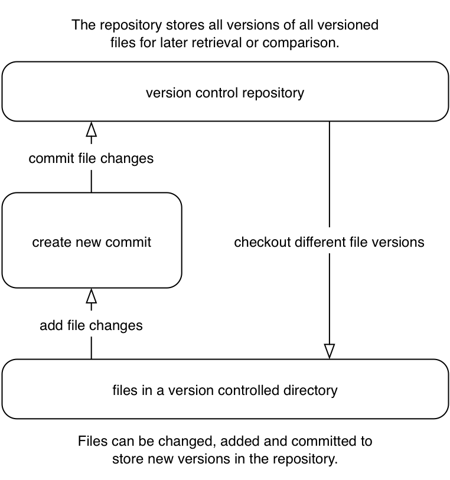

[appendix]
## Git installation
ifdef::env-github[:outfilesuffix: .adoc]

Let's see if Git is already installed on your local machine and install it if needed. Git doesn't come pre-installed on many operating systems, as it's a tool typically used by programmers rather than non-technical computer users. The method required to install Git varies depending on your operating system of choice.

.Why are there different versions of Git in this section?
NOTE: The different installation methods and operating systems install different versions of Git. Don't worry about this; the main differences between newer Git versions and older ones are the helpfulness of the output messages. Version 2.0.0 was the released version at the time of writing, but version 1.8 or above should be sufficient for the needs of this book.

### How to install and run Git on Apple macOS
To verify if Git is already installed, open a Terminal (either the default macOS `/Applications/Utilities/Terminal.app` or an alternative such as `iTerm.app`) and run `git --version`. If Git is already installed, the output should resemble <<osx-git-version>>:

.`git --version` in Terminal.app on OS X Mavericks
[[osx-git-version]]
image::screenshots/A-OSX-GitVersion.png[]

#### Installing Git on Apple OS X Mavericks or newer
If you're running OS X Mavericks (10.9) or newer and Git wasn't already installed when you ran `git --version`, it will prompt to download and install Git similarly to <<mavericks-git-install>>:

.OS X Mavericks Git installation
[[mavericks-git-install]]
image::screenshots/A-OSX-Mavericks-Git-Install.png[]

#### Installing Git on Apple OS X Mountain Lion or older
If you're running OS X Mountain Lion (10.8) or older and you have a package manager installed, you can install Git using one of the following options:

* Homebrew/Tigerbrew (recommended): `brew install git`
* MacPorts: `sudo port install git-core +svn`
* Fink: `fink install git`

If you don't wish to install or use a package manager, you can install Git using a graphical installer from the official Git site at http://git-scm.com/download/mac.

### How to install and run Git on Linux or Unix
To verify whether Git is already installed, open a Terminal application or console and run `git --version`. If Git is already installed, the output should resemble <<linux-git-version>>:

.`git --version` in XFCE Terminal on Debian 7.2 (Wheezy)
[[linux-git-version]]
image::screenshots/A-Linux-GitVersion.png[]

On Linux or Unix, you can install Git directly from your package manager. How to do this varies from system to system, but here are some of the popular options:

* _Debian/Ubuntu_--`apt-get install git`
* _Fedora_--`yum install git`
* _Gentoo_--`emerge --ask --verbose dev-vcs/git`
* _Arch Linux_--`pacman -S git`
* _FreeBSD_--`cd /usr/ports/devel/git && make install`
* _Solaris 11 Express_--`pkg install developer/versioning/git`
* _OpenBSD_--`pkg_add git`

### How to install and run Git on Microsoft Windows
To verify whether Git is already installed, look for "Git Bash" links in your Start Menu or on your Desktop.

Git for Windows can be downloaded from the official Git site at http://git-scm.com/download/win. Download and click through the installer. When it has completed, it will provide Start Menu links to run Git Bash.

As Git is a Unix program, running Git on Windows will run a Unix shell which allows access to Git commands. This may be slightly scary but don't worry; this book will show any commands you'll need to use.

To run Git commands open the 'Git Bash' shortcut from the Start Menu. This will open a Unix shell in a Windows Command Prompt.

.`git --version` in Git Bash on Windows 8.1
[[windows-gitversion]]
image::screenshots/A-Windows-GitVersion.png[]

With the Git shell open, you can type in Git commands. To see what Git version you have installed, type `git --version`. The output should resemble <<windows-gitversion>>.

### Verifying Git has installed correctly.
To run Git commands, you'll need to open a Terminal application, console, or command prompt (depending on your platform). To verify that Git has installed correctly, run `git --version`, which should output `git version 1.8.5.2` (or another version).

[appendix]
## Creating a GitHub account and repository
ifdef::env-github[:outfilesuffix: .adoc]

GitHub is a website that provides Git repository hosting as well as issue trackers, Git-backed wikis, and a workflow to request a merge of the commits in a branch (which is known as a _pull request_ and is shown in <<10-GitHubPullRequests#what-are-pull-requests-and-forks>>). You can create free accounts for public remote repositories, which are where everyone can see your code and commits. Typically these are used by open-source projects, but they will also prove useful for your learning and experimentation. For private projects, GitHub offers paid accounts.

As mentioned in <<02-RemoteGit#adding-a-remote-repository-git-remote-add>>, there are free and paid alternatives to GitHub. I've picked GitHub to walk through because, at the time of writing, it's the most popular hosted version control system for open-source projects and is probably the most popular Git hosting provider. Learning to use GitHub will bring immediate benefits in terms of facilitating open-source access and contributions. Though the GitHub UI may differ from the examples here or from other Git repository hosts, the Git commands used will remain the same.

### Signing up for a GitHub account
Let's sign up for a new GitHub account. Please browse to https://github.com/join where you should see something like <<join-github>>:

.Join GitHub form
[[join-github]]
image::diagrams/B-JoinGitHub.png[]

This form allows you to create a new GitHub account, which will allow you to access the service and create new repositories. The username you pick will determine the URL of your GitHub account page, and will be part of the URL for every repository you create, so choose it carefully. It can be renamed in the future, but this may cause problems when updating existing local repositories without manually changing the URL.

Enter your username, email, and password, and click the Create button to advance to the next screen.

.Choose GitHub plan
[[github-plan]]
image::diagrams/B-GitHubPlan.png[]

The form in <<github-plan>> allows you to select your GitHub payment plan. The only differences between plans are the number of private repositories you can create. _Private repositories_ mean that none of your commits or files committed to the repository can accessed by others without your explicit approval. _Public repositories_ mean that all your commits are viewable by anyone but nobody else can commit to your repository without your explicit approval. In this book, you will never have to commit anything private to a repository, so you don't need to choose a paid plan. After you've selected a plan, click the Finish button to advance to the next screen.

You have created a GitHub account, and the next step is to create a new repository.

### Creating a new repository on GitHub
.Dashboard buttons to create a new GitHub repository
[[creating-github-repository-button]]
image::diagrams/B-CreateNewGitHubRepositoryButton.png[]

After signing up for your new GitHub account, you should see your dashboard, which should resemble <<creating-github-repository-button>>. From the dashboard, there are two buttons you can click to create a new GitHub repository. Click either of them to advance to the next screen.

.Create a new GitHub repository
[[creating-github-repository]]
image::diagrams/B-CreateNewGitHubRepository.png[]

Creating a new repository requires you to pick a name and optionally a description, as in <<creating-github-repository>>. This name will be combined with the username you chose earlier to make the URL for your repository, so choose it carefully. It can be renamed in the future, but this may cause problems when updating existing local repositories without manually changing the URL. You may also choose for the repository to be private, which requires purchasing a paid GitHub plan. After entering the repository details, click the Create button to advance to the next screen.

.A new GitHub repository
[[new-github-repository]]
image::diagrams/B-NewGitHubRepository.png[]

You have created a GitHub repository and should see something similar to <<new-github-repository>>.

[appendix]
## Commented Git configuration
In chapter 7 you learned about configuring Git for maximum productivity. I've been using Git as my main version control system for a pretty long time at this point, so I have my Git configuration well optimized.

This appendix includes my Git configuration files at the time of writing. These are heavily commented to explain what they're doing and why.

The latest versions are always available in my dotfiles repository on GitHub: https://github.com/MikeMcQuaid/dotfiles

.`~/.gitconfig`
[[mike-gitconfig]]
```
[include]
	path = ~/.gitconfig-user
[color]
	# Colour terminal command output when possible.
	ui = auto
[gist]
	# Open GitHub Gist in browser after submission.
	browse = true
[push]
	# Push to the set upstream branch being tracked by default.
	default = simple
[fetch]
	# Always prune when fetching (and pulling).
	prune = 1
[rerere]
	# Store and re-use manual conflict resolution changes.
	enabled = 1
[core]
	# Exclude everything this file. Used for general exclusions.
	excludesfile = ~/.gitignore
	# Set attributes on files. Used for general diff improvements.
	attributesfile = ~/.gitattributes
[help]
	# Open Git help pages in the browser as HTML.
	format = web
	autocorrect = 1
[alias]
	## 'New' Commands
	# Stage the changes in a given file.
	stage = !git add -u
	# Unstage the changes in a given file.
	unstage = reset HEAD --
	# View the current changes in the staging area.
	staged = diff --cached
	# Print the name of the current branch.
	current-branch = symbolic-ref --short HEAD
	# Print the name of the current upstream tracking branch.
	upstream = !git config --get branch.$(git current-branch).remote \
	           || echo origin
	# Cherry-pick a commit with your signature.
	sign = cherry-pick --signoff
	# List all current SVN externals for this repository.
	svn-externals = !git svn show-externals | grep -x \\"[^#].*\\"
	# Create a git:// server of the current repository.
	# WARNING: this gives all users read/write access
	# without authentication (so only use on trusted networks).
	serve = !git daemon --reuseaddr --export-all --base-path=. \
	                    --verbose ./.git
	# Merge a branch and commit a merge commit (even if one
	# isn't needed)
	noff = merge --no-ff
	# Merge a branch with a merge commit and resolve any conflicts
	# always using that branch's version rather than the current branch.
	theirs = !git noff -Xtheirs
	# Fetch all branches and rebase the current branch against
	# upstream/master.
	rebase-against-master = !git fetch --all \
	                      && git rebase $(git upstream)/master
	# Push the current branch upstream to origin using the same branch
	# name for the remote branch.
	upstream-current-branch = !git push --set-upstream origin \
	                         $(git current-branch)
	# Create a pull request on GitHub using the `gh` command.
	pull-request = !git upstream-current-branch && gh pull-request
	# Upstream the current branch to origin and create a pull request
	# on GitHub.
	upstream-and-pull-request = !git upstream-current-branch \
	                          && git pull-request
	# Get the current diff but show differences between characters
	# instead of just the differences between lines.
	word-diff = diff --word-diff
	# Push the current branch and set it as the default upstream branch.
	push-and-set-upstream = push --set-upstream
	# Create a new branch by checking out another branch.
	checkout-as-new-branch = checkout -b
	# Rebase against origin/master and prompt for what operations
	# should be performed.
	interactively-rebase-against-origin-master = \
	  !git rebase --interactive origin/master
	# Show the commit log with a prettier, clearer history.
	pretty-one-line-log = log --graph --oneline --decorate
	# Commit any changes to files, squash them into the last commit
	# and update its date.
	fix-up-previous-commit = !git commit --all --amend \
	                         --reuse-message=HEAD --date=\"$(date)\" #"
	# Checkout the staging branch and update it.
	pull-staging = !git checkout staging && git pull
	# Checkout the master branch and update it.
	pull-master = !git checkout master && git pull
	# Update the staging, master and current branches.
	pull-master-staging-and-current-branch = \
	  !BRANCH=$(git current-branch) && git fetch --all \
	  && git pull-staging && git pull-master && \
	  git checkout $BRANCH && git pull
	# Commit a work-in-progress commit (to use with
	# fix-up-previous-commit)
	work-in-progress = commit -a -m 'WIP'
	# Merge a branch with a merge commit and use the more time-consuming
	# patience diff algorithm
	patience = !git noff -Xpatience
	# Hard reset branch to the upstream version.
	hard-reset = !git reset --hard $(git upstream)/$(git current-branch)
	# Assume the specified file is unchanged to stop changes
	# being seen by Git
	assume = update-index --assume-unchanged
	# No longer assume a specified file remains unchanged
	unassume = update-index --no-assume-unchanged
	# List all files that are assumed to be unchanged
	assumed = !git ls-files -v | grep '^[hsmrck?]' | cut -c 3-

	## Shortened 'New' Commands
	fahr = !git fetch --all && git hard-reset
	rem = !git rebase-against-master
	wip = !git work-in-progress
	pr = !git upstream-and-pull-request
	up = !git upstream-current-branch
	pm = !git pull-master-staging-and-current-branch
	fa = !git fetch --all
	w = !git word-diff
	u = !git push-and-set-upstream
	b = !git checkout-as-new-branch
	i = !git interactively-rebase-against-origin-master
	# `true` needed as the return status is wrong otherwise.
	l = !git pretty-one-line-log || true
	f = !git fix-up-previous-commit

	## Shortened Existing Commands
	p = pull
	s = status --short --branch
[instaweb]
	# Use the Ruby WEBRick library when creating a `git instaweb`
	# HTTP server.
	httpd = webrick
[diff]
	# Use the macOS graphical three-way merge tool for graphical diffs.
	tool = opendiff
	# Use the slower but better patience diff algorithm
	algorithm = patience
[diff "xml"]
	textconv = xmllint --format --recover
[difftool "opendiff"]
	# Set the macOS opendiff command name.
	path = opendiff
[merge]
	# Use the macOS graphical three-way merge tool for graphical merges.
	tool = opendiff
[mergetool]
	# Don't prompt before opening the merge tool.
	prompt = false
	# Don't keep backups of the merge tool inputs.
	keepBackup = false
	# Don't keep the merge tool temporary input/output files.
	keepTemporaries = false
[mergetool "opendiff"]
	# Use a script to setup opendiff correctly for Git merges.
	path = git-mergetool-opendiff
[apply]
	# Cleanup whitespace by default when apply patches.
	whitespace = fix
[url "git@github.com:"]
	# Always use GitHub SSH protocol to push.
	# Allows use of git:// for public repositories with push access
	pushInsteadOf = git://github.com/
[url "https://github.com/"]
	# Use HTTP for GitHub instead of git:// or git@
	# Enable this in networks where git:// or git@ are blocked.
	#insteadOf = git://github.com/
	#insteadOf = git@github.com:
[url "git@github.com:"]
	# Use SSH for GitHub instead of https://
	# Enable this in networks where https:// has issues.
	#insteadOf = https://github.com/
[url "git@gitorious.org:"]
	# Always use Gitorious SSH protocol to push.
	# Allows use of git:// for public repositories with push access
	# (which is often faster).
	pushInsteadOf = git://gitorious.org/
[credential]
	# Use macOS Keychain to store HTTP passwords.
	helper = osxkeychain
[filter "media"]
	clean = git-media-clean %f
	smudge = git-media-smudge %f
[gh]
	protocol = https
```

.`~/.gitconfig-user`
[[mike-gitconfig-user]]
```
[user]
	# Name used in commit messages.
	name = Mike McQuaid
	# Email used in commit messages.
	email = mike@mikemcquaid.com
[shell]
	# Default SSH username.
	username = mike
[sourceforge]
	# SourceForge username.
	username = mikemcquaid
[github]
	# GitHub username for command-line tools.
	user = mikemcquaid
[alias]
	# Push the current branch upstream to mikemcquaid using the same
	# branch name for the remote branch.
	um = !git push --set-upstream mikemcquaid $(git current-branch)
```

.`~/.gitignore`
[[mike-gitignore]]
```
# Ignore files generated by Qt.
moc_*.cpp
qrc_*.cpp
ui_*.h

# Ignore compiler output files.
*.o
*.pyc

# Ignore text editor local configuration..
*.pro.user
.tm_properties
*.xcodeproj/project.xcworkspace/
*.xcodeproj/xcuserdata/

# Ignore temporary generated files.
*.rej
*.swp
*~

# Ignore thumbnails metadata generated by macOS.
.DS_Store

# Ignore wrapper scripts generated by Bundler.
.bundle/bin/

# Ignore files generated by CMake.
CMakeFiles/
CMakeCache.txt
cmake_install.cmake
install_manifest.txt

# Ignore build directories.
b/
```

.`~/.gitattributes`
[[mike-gitattributes]]
```
# Diff .t2d files as if they were XML (they are).
*.t2d diff=xml
```

[appendix]
## Why use version control?
ifdef::env-github[:outfilesuffix: .adoc]

You may sometimes find yourself speaking to people who aren't familiar with version control concepts or why version control systems are useful for managing changes to text. This appendix provides a simple but effective argument for convincing others why version control is useful and important.

### Handling changes
A common problem when dealing with information stored on a computer is handling _changes_. For example, after adding, modifying, or deleting text, you may want to undo that action (and perhaps redo it later). At the simplest level, this might be done by clicking _Undo_ in a text editor (which reverts a previous action); after new words are added, it may be necessary to undo these changes by pressing Undo repeatedly until you return to the desired previous state.

.Versioning with multiple files
[[multiple-files]]
image::diagrams/D-MultipleFiles.png[]

A naïve method for handling multiple file versions is often simply creating duplicate files with differing filenames and contents (`Important Document V4 FINAL FINAL.doc` may sound sadly familiar). An example of this approach can be seen in <<multiple-files>>.

At a more advanced level, you may be sharing a document with other people and, rather than just undoing and redoing changes, wish to know who made a change, why they made it, when they made it, what the change was, and perhaps even store multiple versions of the document in parallel. A _version control system_ (such as Git) allows all these operations and more.

.Versioning with a version control system
[[versioned-file]]
image::diagrams/D-VersionedFile.png[]

In a version control system, instead of just saving a document after your changes have been made, you'd _commit_ it. This involves a save-like operation commanding the version control system to store this particular version and specifying a message stating the reason for the change or what it accomplishes. When another commit is made, the previous version would remain in _history_ where its changes can be examined at a later time. Version control systems can therefore solve the problem of reviewing and retrieving previous changes, and allow single files to be used rather than duplicated. This workflow can be seen in <<versioned-file>>.

When editing a file in a version control system, you'll always edit/save/commit the same file on disk. It won't move location either manually or automatically (unless you wish to rename it, of course). When you wish to access previous versions of the file, you can either view them through the version control system or restore the file on disk to a previous version. This allows you to see exactly what may have changed between versions. When using multiple files, you'd have to manually compare each of the files to see differences and keep track of multiple files on your disk.

### Version control workflow
Version control systems work by maintaining a list of changes to files over time. Each time a file is modified and committed, the new version of the file is stored in the _repository_--a centralized location where the version control system stores files for a particular project. Each commit corresponds to a particular version and stores references to the previously made commit, a _commit message_ describing the changes made in this commit, the time it was made, who made it, and the contents of the files at this point. The files' state from a commit can be compared to a previous version and the difference between the versions' files (known as _diffs_) can be queried.

.Git add/commit/checkout workflow
[[appendix-commit-workflow]]


<<appendix-commit-workflow>> shows the workflow you'll use when using a version control system. After adding new changes to versioned files, you'll create new commits containing these changes and commit the changes to the repository. At a later point, you can check out different versions of files. This allows you to have confidence that, no matter what you may add, modify, or delete, all committed versions of your files will remain in the version control system if you need to check their contents later.

### Version control for programmer collaboration
Programmers spend most of their jobs editing text. This text is typically source code that will be interpreted by a computer to perform some task, but could also be software configuration files, documentation, or emails. As they typically work on independent units of work while in larger teams, and can be distributed by time or geography, it's important that they communicate explicitly to other programmers why a particular change was made. Additionally, programmers inevitably write software that contains bugs. When trying to work out why a bug occurred, it's useful to see what changes were made, by whom, and for what reason. Often programmers will need to fix bugs in sections of code they didn't create, so being able to record and recall the intent of the code's author at a later point can help understand what may have caused a bug. These reasons are multiplied by the fact that programmers typically work with huge numbers of source files. Given these reasons, it should be clear why most programming projects use version control systems to manage their source code.

When creating computer software, it's also common to release new versions of the software. New versions are generally released when bugs are fixed and/or when new features have been implemented. Sometimes a team may be developing a new feature but need to provide a new version with a bug fixed before the new feature is ready. Two _branches_ could be used to work on the bug fix independently of the new feature. This would allow work on the bug fix and the new feature to occur in parallel. These branches could be later _merged_, which would include all the changes made in one to be included into the other.

.Committing on multiple branches
[[simple-branches]]
image::diagrams/D-SimpleBranches.png[]

In <<simple-branches>> you can see a simple example of using multiple branches when writing a book.

_Changes_, _commits_, _history_, a _repository_, _diffs_, and _branches_ are all typically provided by version control systems (such as Git). These features enable workflows where changes are logged for future reference, work can be done in parallel, and previous versions of files are kept. Hopefully this provides you with a basic understanding of why version control systems are useful.
