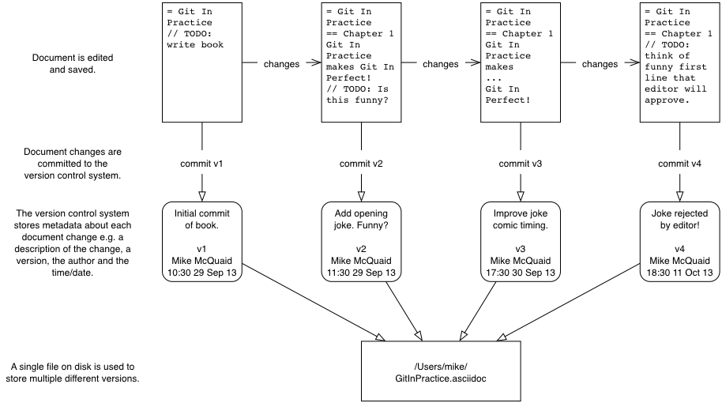
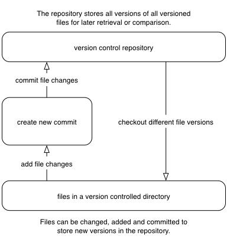
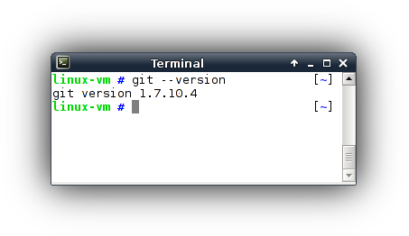
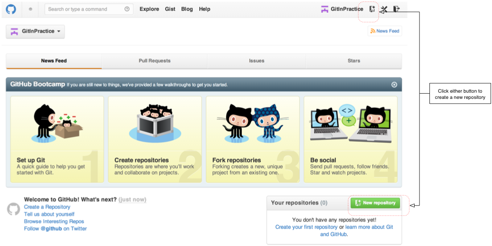

[appendix]
== Why use version control?
You may not be familiar with version control concepts or why version control
systems are useful for managing changes to text. Let's start off by asking why
you should use version control.

A common problem when dealing with information stored on a computer is handling
_changes_. For example, after adding, modifying or deleting text you may want
to undo that action (and perhaps redo it later). At the simplest level this
might be done by clicking _undo_ in a text editor (which reverts a previous
action); after new words are added it may be necessary to undo these changes by
pressing undo repeatedly until you return to the desired previous state.

.Versioning with multiple files
image::diagrams/15-MultipleFiles.png[]
A naive method for handling multiple file versions is often simply creating
duplicate files with differing filenames and contents (`Important Document V4
FINAL FINAL.doc` may sound sadly familiar). An example of this approach can be
seen in Figure 1.1.

At a more advanced level you may be sharing a document with other people and,
rather than just undoing and redoing changes, wish to know who made a change,
why they made it, when they made it, what the change was and perhaps even store
multiple versions of the document in parallel. A _version control system_ (such
as Git) allows all these operations and more.

.Versioning with a version control system

In a version control system instead of just saving a document after your
changes have been made you would _commit_ it. This involves a save-like
operation commanding the version control system to store this particular
version and specifying a message stating the reason for their change or what it
accomplishes. When another commit is made then the previous version would
remain in _history_ where its changes can be examined at a later time. Version
control systems can therefore solve the problem of reviewing and retrieving
previous changes and allow single files to be used rather than duplicated. This workflow can be seen in Figure 1.2.

When editing a file in a version control system you will always
edit/save/commit the same file on disk. It will not move location either
manually or automatically (unless you wish to rename it, of course). When you
wish to access previous versions of the file you can either view them through
the version control system or restore the file on disk to a previous version.
This allows you to see exactly what may have changed between versions. When
using multiple files you would have to manually compare each of the files to
see differences and keep track of multiple files on your disk.

=== Version control workflow
Version control systems work by maintaining a list of changes to files over
time. Each time a file is modified and committed the new version of the file is
stored in the _repository_; a centralized location where the version control
system stores files for a particular project. Each commit corresponds to a
particular version and stores references to the previously made commit, a
_commit message_ describing the changes made in this commit, the time it was
made, who made it and the contents of the files at this point. The files' state
from a commit can be compared to a previous version and the difference between
the versions' files (known as _diffs_) can be queried.

.Git add/commit/checkout workflow

Figure 1.3 shows the workflow you will use when using a version control system.
After adding new changes to versioned files you will create new commits
containing these changes and commit the changes to the repository. At a later
point you can checkout different versions of files. This allows you to have
confidence that, no matter what you may add, modify or delete, all committed
versions of your files will remain in the version control system if you need to
check their contents later.

=== Version control for programmer collaboration
Programmers spend most of their jobs editing text. This text is typically
source code which will be interpreted by a computer to perform some task but
could also be software configuration files, documentation or emails. As they
typically work on independent units of work while in larger teams and can be
distributed by time or geography it's important that they communicate
explicitly to other programmers why a particular change was made. Additionally
programmers inevitably write software which contains bugs. When trying to work
out why a bug occurred it's useful to see what changes were made, by whom and
for what reason. Often programmers will need to fix bugs in sections of code
they did not create so being able to record and recall the intent of the code's
author at a later point can help understand what may have caused a bug. These
reasons are multiplied by the fact that programmers typically work with huge
numbers of source files. Given these reasons it should be clear why most
programming projects use version control systems to manage their source code.

When creating computer software it's also common to release new versions of the
software. New versions are generally released when bugs are fixed and/or when
new features have been implemented. Sometimes a team may be developing a new
feature but need to provide a new version with a bug fixed before the new
feature is ready. Two _branches_ could be used to work on the bug fix
independently of the new feature. This would allow work on the bug fix and the
new feature to occur in parallel. These branches could be later _merged_ which
would include all the changes made in one to be included into the other.

.Committing on multiple branches
image::diagrams/15-SimpleBranches.png[]

In Figure 1.4 you can see a simple example of using multiple branches when
writing a book. We'll cover this in more detail in Section 1.4.1 but you should
already be able to see how they allow multiple tracks of development in a
project.

Now you've learnt why programmers use version control let's see why they use
Git specifically.

[appendix]
== Installation
Let's see if Git is already installed on your local machine and install it if
needed. Git does not come pre-installed on many operating systems as it is a
tool typically used by programmers rather than non-technical computer users.
The method required to install Git varies depending on your operating system of
choice.

.Why are there different versions of Git in this section?
NOTE: The different installation methods and operating systems install
different versions of Git. Do not worry about this; the main differences
between newer Git versions and older ones are the helpfulness of the output
messages. Version 1.8 or above should be fine for the needs of this book.

=== How to install and run Git on Apple OS X
To verify if Git is already installed open a Terminal (either the default OS X
`/Applications/Utilities/Terminal.app` or an alternative such as `iTerm.app`)
and run `git --version`. If Git is already installed the output should resemble
Figure 2.1:

.`git --version` in Terminal.app on OS X Mavericks
image::screenshots/15-OSX-GitVersion.png[]

==== Installing Git on Apple OS X Mavericks or newer
If you are running OS X Mavericks (10.9) or newer and Git was not already
installed when you ran `git --version` it will prompt to download and install
Git similarly to to Figure 2.2:

.OS X Mavericks Git installation
image::screenshots/15-OSX-Mavericks-Git-Install.png[]

==== Installing Git on Apple OS X Mountain Lion or older
If you are running OS X Mountain Lion (10.8) or older and you have a package
manager installed you can install Git using one of the options below:

* Homebrew/Tigerbrew (recommended): `brew install git`
* MacPorts: `sudo port install git-core +svn`
* Fink: `fink install git`

If you do not wish to install or use a package manager you can install Git
using a graphical installer from the official Git site at
http://git-scm.com/download/mac.

=== How to install and run Git on Linux or Unix
To verify if Git is already installed open a Terminal application or console
and run `git --version`. If Git is already installed the output should resemble
Figure 2.3:

.`git --version` in XFCE Terminal on Debian 7.2 (Wheezy)

On Linux or Unix you can install Git directly from your package manager. How to
do this varies from system to system but some of the popular options are below:

* Debian/Ubuntu: `apt-get install git`
* Fedora: `yum install git`
* Gentoo: `emerge --ask --verbose dev-vcs/git`
* Arch Linux: `pacman -S git`
* FreeBSD: `cd /usr/ports/devel/git && make install`
* Solaris 11 Express: `pkg install developer/versioning/git`
* OpenBSD: `pkg_add git`

=== How to install and run Git on Microsoft Windows
To verify if Git is already installed look for "Git Bash" links in your Start
Menu or on your Desktop.

Git for Windows can be downloaded from the official Git site at
http://git-scm.com/download/win. Download and click through the installer. When
it has completed it will provide Start Menu links to run Git Bash.

As Git is a Unix program running Git on Windows will run a Unix shell which
allows access to Git commands. This may be slightly scary but don't worry; this
book will show any commands you'll need to use.

To run Git commands open the 'Git Bash' shortcut from the Start Menu. This will
open a Unix shell in a Windows Command Prompt.

.`git --version` in Git Bash on Windows 8.1
image::screenshots/15-Windows-GitVersion.png[]

With the Git shell open you can type in Git commands. To see what Git
version you have installed type `git --version`. The output should
resemble Figure 2.4.

// Is Powershell a sensible option to recommend/mention?
// Speak to Phil Haack at GitHub

=== Verifying Git has installed correctly.
To run Git commands you will need to open a Terminal application, console or
command-prompt (depending on your platform). To verify that Git has installed
correctly run `git --version` which should output `git version 1.8.4.3` (or
another version).

[appendix]
== Creating a GitHub repository
GitHub is a website that provides Git repository hosting as well as issue
trackers, Git-backed wikis and a workflow to request a merge of the commits in
a branch (which is known as a _pull request_ and will be shown in Chapter 12).
You can create free accounts for public remote repositories which are where
everyone can see your code and commits. Typically these are used by open-source
projects but it will also prove useful for your learning and experimentation.
For private projects GitHub offers paid accounts.

As mentioned in Chapter 2 there are free and paid alternatives to GitHub. I've
picked GitHub to walkthrough because, at the time of writing, it is the most
popular hosted version control system for open-source projects and is probably
the most popular Git hosting provider. Learning to use GitHub will bring
immediate benefits in terms of facilitating open-source access and
contributions. While the GitHub UI may differ from the examples here or from
other Git repository hosts the Git commands used will remain the same.

=== Signing up for a GitHub account
Let's sign up for a new GitHub account. Please browse to
https://github.com/join where you should see something like Figure 3.1:

.Join GitHub form
image::diagrams/15-JoinGitHub.png[]

This form allows you to create a new GitHub account which will allow you to
access the service and create new repositories. The username you pick will
determine the URL of your GitHub account page and will be part of the URL for
every repository you create so choose it carefully. It can be renamed in future
but this may cause problems when updating existing local repositories without
manually changing the URL.

Enter your username, email and password and click the create button to advance
to the next screen.

.Choose GitHub plan
image::diagrams/15-GitHubPlan.png[]

The form in Figure 3.2 allows you to select your GitHub payment plan. The only
differences between plans are the number of private repositories you can
create. Private repositories mean that none of your commits or files committed
to the repository can accessed by others without your explicit approval. In
this book you will never have to commit anything private to a repository so you
do not need to choose a paid plan. After you have selected a plan click the
finish button to advance to the next screen.

You have created a GitHub account and the next step is to create a new
repository.

=== Creating a new repository on GitHub
.Dashboard buttons to create a new GitHub repository

After signing up for your new GitHub account you should see your dashboard
which should resemble Figure 3.3. From the dashboard there are two buttons you
can click to create a new GitHub repository. Click either of them to advance to
the next screen.

.Create a new GitHub repository
image::diagrams/15-CreateNewGitHubRepository.png[]

// Add annotation to not add README or gitignore
// Reference numbers in text (and for previous diagrams?)

Creating a new repository requires you to pick a name and optionally a
description as in Figure 3.4. This name will be combined with the username you
chose earlier to make the URL for your repository so choose it carefully. It
can be renamed in future but this may cause problems when updating existing
local repositories without manually changing the URL. You may also choose for
the repository to be private which requires purchasing a paid GitHub plan.
After entering the repository details click the create button to advance to the
next screen.

.A new GitHub repository
image::diagrams/15-NewGitHubRepository.png[]

You have created a GitHub repository and should see something similar to Figure
3.5. Now let's push the repository you created in Chapter 2 onto your local
machine.
