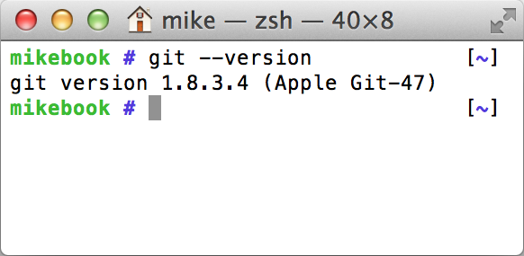
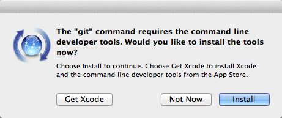
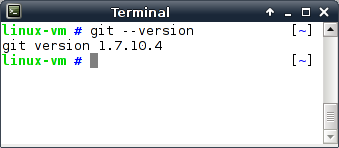
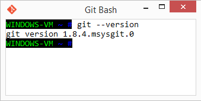

[appendix]
## Git installation
ifdef::env-github[:outfilesuffix: .adoc]

Let's see if Git is already installed on your local machine and install it if needed. Git doesn't come pre-installed on many operating systems, as it's a tool typically used by programmers rather than non-technical computer users. The method required to install Git varies depending on your operating system of choice.

.Why are there different versions of Git in this section?
NOTE: The different installation methods and operating systems install different versions of Git. Don't worry about this; the main differences between newer Git versions and older ones are the helpfulness of the output messages. Version 2.0.0 was the released version at the time of writing, but version 1.8 or above should be sufficient for the needs of this book.

### How to install and run Git on Apple OS X
To verify if Git is already installed, open a Terminal (either the default OS X `/Applications/Utilities/Terminal.app` or an alternative such as `iTerm.app`) and run `git --version`. If Git is already installed, the output should resemble <<osx-git-version>>:

.`git --version` in Terminal.app on OS X Mavericks
[[osx-git-version]]

#### Installing Git on Apple OS X Mavericks or newer
If you're running OS X Mavericks (10.9) or newer and Git wasn't already installed when you ran `git --version`, it will prompt to download and install Git similarly to <<mavericks-git-install>>:

.OS X Mavericks Git installation
[[mavericks-git-install]]

#### Installing Git on Apple OS X Mountain Lion or older
If you're running OS X Mountain Lion (10.8) or older and you have a package manager installed, you can install Git using one of the following options:

* Homebrew/Tigerbrew (recommended): `brew install git`
* MacPorts: `sudo port install git-core +svn`
* Fink: `fink install git`

If you don't wish to install or use a package manager, you can install Git using a graphical installer from the official Git site at http://git-scm.com/download/mac.

### How to install and run Git on Linux or Unix
To verify whether Git is already installed, open a Terminal application or console and run `git --version`. If Git is already installed, the output should resemble <<linux-git-version>>:

.`git --version` in XFCE Terminal on Debian 7.2 (Wheezy)
[[linux-git-version]]

On Linux or Unix, you can install Git directly from your package manager. How to do this varies from system to system, but here are some of the popular options:

* _Debian/Ubuntu_--`apt-get install git`
* _Fedora_--`yum install git`
* _Gentoo_--`emerge --ask --verbose dev-vcs/git`
* _Arch Linux_--`pacman -S git`
* _FreeBSD_--`cd /usr/ports/devel/git && make install`
* _Solaris 11 Express_--`pkg install developer/versioning/git`
* _OpenBSD_--`pkg_add git`

### How to install and run Git on Microsoft Windows
To verify whether Git is already installed, look for "Git Bash" links in your Start Menu or on your Desktop.

Git for Windows can be downloaded from the official Git site at http://git-scm.com/download/win. Download and click through the installer. When it has completed, it will provide Start Menu links to run Git Bash.

As Git is a Unix program, running Git on Windows will run a Unix shell which allows access to Git commands. This may be slightly scary but don't worry; this book will show any commands you'll need to use.

To run Git commands open the 'Git Bash' shortcut from the Start Menu. This will open a Unix shell in a Windows Command Prompt.

.`git --version` in Git Bash on Windows 8.1
[[windows-gitversion]]

With the Git shell open, you can type in Git commands. To see what Git version you have installed, type `git --version`. The output should resemble <<windows-gitversion>>.

### Verifying Git has installed correctly.
To run Git commands, you'll need to open a Terminal application, console, or command prompt (depending on your platform). To verify that Git has installed correctly, run `git --version`, which should output `git version 1.8.5.2` (or another version).
