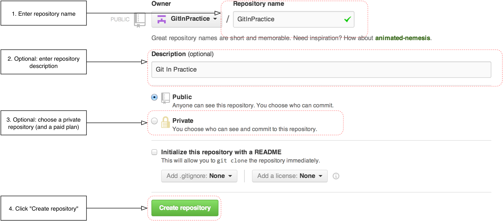

[appendix]
## Creating a GitHub Account and Repository
ifdef::env-github[:outfilesuffix: .adoc]

GitHub is a website that provides Git repository hosting as well as issue trackers, Git-backed wikis and a workflow to request a merge of the commits in a branch (which is known as a _pull request_ and is shown in <<10-GitHubPullRequests#what-are-pull-requests-and-forks>>). You can create free accounts for public remote repositories which are where everyone can see your code and commits. Typically these are used by open-source projects but it will also prove useful for your learning and experimentation. For private projects GitHub offers paid accounts.

As mentioned in <<02-RemoteGit#adding-a-remote-repository-git-remote-add>> there are free and paid alternatives to GitHub. I've picked GitHub to walkthrough because, at the time of writing, it is the most popular hosted version control system for open-source projects and is probably the most popular Git hosting provider. Learning to use GitHub will bring immediate benefits in terms of facilitating open-source access and contributions. While the GitHub UI may differ from the examples here or from other Git repository hosts the Git commands used will remain the same.

### Signing up for a GitHub account
Let's sign up for a new GitHub account. Please browse to https://github.com/join where you should see something like <<join-github>>:

.Join GitHub form
[[join-github]]
image::diagrams/B-JoinGitHub.png[]

This form allows you to create a new GitHub account which will allow you to access the service and create new repositories. The username you pick will determine the URL of your GitHub account page and will be part of the URL for every repository you create so choose it carefully. It can be renamed in future but this may cause problems when updating existing local repositories without manually changing the URL.

Enter your username, email and password and click the create button to advance to the next screen.

.Choose GitHub plan
[[github-plan]]
image::diagrams/B-GitHubPlan.png[]

The form in <<github-plan>> allows you to select your GitHub payment plan. The only differences between plans are the number of private repositories you can create. Private repositories mean that none of your commits or files committed to the repository can accessed by others without your explicit approval. In this book you will never have to commit anything private to a repository so you do not need to choose a paid plan. After you have selected a plan click the finish button to advance to the next screen.

You have created a GitHub account and the next step is to create a new repository.

### Creating a new repository on GitHub
.Dashboard buttons to create a new GitHub repository
[[creating-github-repository-button]]
image::diagrams/B-CreateNewGitHubRepositoryButton.png[]

After signing up for your new GitHub account you should see your dashboard which should resemble <<creating-github-repository-button>>. From the dashboard there are two buttons you can click to create a new GitHub repository. Click either of them to advance to the next screen.

.Create a new GitHub repository
[[creating-github-repository]]

Creating a new repository requires you to pick a name and optionally a description as in <<creating-github-repository>>. This name will be combined with the username you chose earlier to make the URL for your repository so choose it carefully. It can be renamed in future but this may cause problems when updating existing local repositories without manually changing the URL. You may also choose for the repository to be private which requires purchasing a paid GitHub plan. After entering the repository details click the create button to advance to the next screen.

.A new GitHub repository
[[new-github-repository]]
image::diagrams/B-NewGitHubRepository.png[]

You have created a GitHub repository and should see something similar to <<new-github-repository>>.
